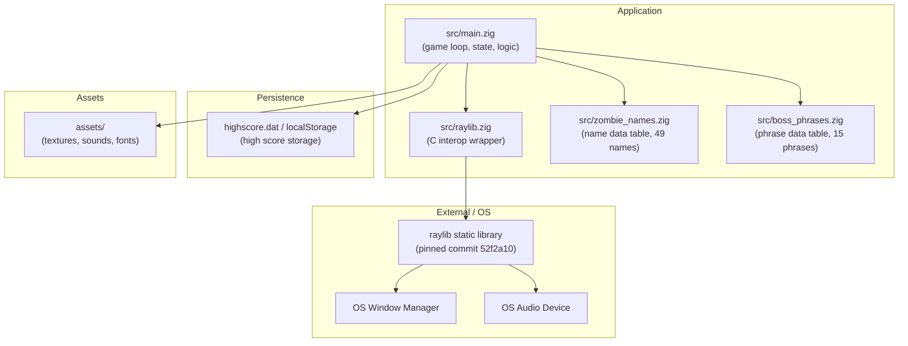
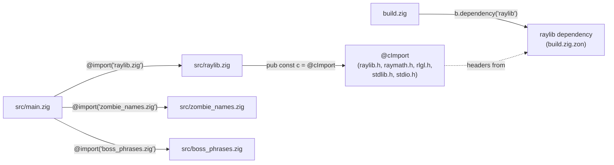

# Architecture

## Table of Contents

- [1. Architecture Style](#1-architecture-style)
- [2. Component Diagram](#2-component-diagram)
- [3. Data Flow](#3-data-flow)
- [4. Layer Breakdown](#4-layer-breakdown)
- [5. External Dependencies](#5-external-dependencies)
- [6. Cross-Cutting Concerns](#6-cross-cutting-concerns)
- [7. Dependency Graph](#7-dependency-graph)
- [8. Architectural Decisions](#8-architectural-decisions)

---

## 1. Architecture Style

**death-note** follows a **single-module game-loop monolith** with three supporting patterns:

### Init → Update → Draw → Teardown game loop

All game logic lives in `src/main.zig`. The `main()` function structures runtime execution in four phases:

1. **Init** — `raylib.InitWindow`, `raylib.InitAudioDevice`, `raylib.LoadSound`, `raylib.LoadTexture`, each immediately followed by a `defer` teardown. High score is loaded from persistent storage.
2. **Update** — the update phase is multi-state, gated by two flags:
   - **WaveActive** (`!is_game_over && !is_wave_transitioning`): input polling, spawn timer advancement with wave-scaled delay (`waveSpawnDelay(current_wave)`), `updateZombies()`, wave completion detection, and boss spawning when the kill target is met on boss waves.
   - **WaveTransitioning** (`!is_game_over && is_wave_transitioning`): `wave_transition_timer` advancement; when the timer exceeds `WAVE_TRANSITION_TOTAL_DURATION` the next wave begins and all zombies are freed.
   - **GameOver** (`is_game_over`): update phase is skipped entirely; the draw phase handles stats display, high score save, and restart on `KEY_ENTER`.
3. **Draw** — always-on inside `raylib.BeginDrawing()` / `defer raylib.EndDrawing()`. The draw phase branches: game-over stats overlay, wave transition recap/countdown (`drawWaveTransition()`), or active gameplay (`drawZombies()` + `drawHud()`).
4. **Teardown** — the matching `defer` statements registered during Init unwind in reverse order when `main()` returns.

The `frame()` function encapsulates the full update+draw cycle. Its branching structure: `if (!is_game_over) { if (is_wave_transitioning) {...} else {...} }` then the draw phase.

Boss zombies live in the same `zombies[MAX_ZOMBIES]` pool. `spawnBoss()` allocates a `Zombie` with `is_boss = true`, a phrase from `BossPhrases`, and a slower fall speed (`waveFallSpeed(current_wave) * BOSS_FALL_SPEED_FACTOR`).

### Walled C interop

All `@cImport` usage is isolated to `src/raylib.zig`. Game code in `src/main.zig` only ever calls through the `raylib` module namespace (`const raylib = @import("raylib.zig").c`). No other file calls `@cImport`. The interop module aggregates `raylib.h`, `raymath.h`, `rlgl.h`, `stdlib.h`, `stdio.h`, and conditionally `emscripten/emscripten.h`.

### Fixed-size object pool

Zombies are stored in a module-level array `var zombies: [MAX_ZOMBIES]?*Zombie = undefined`, with `MAX_ZOMBIES = 100`. `spawnZombie` scans for a `null` slot and writes into it; `spawnBoss` does the same for boss zombies. `resetZombies` frees and nulls every slot. There is no dynamic list or growable container.

---

## 2. Component Diagram



---

## 3. Data Flow

```mermaid
sequenceDiagram
    participant User
    participant Raylib as raylib (C lib)
    participant NameBuf as name[] buffer
    participant Update as updateZombies()
    participant Scoring as score / combo / stats
    participant Audio as AudioDevice
    participant Draw as drawZombies() / drawHud()

    User->>Raylib: keyboard input (key press)
    Raylib->>NameBuf: GetCharPressed() → append to name[letter_count]
    Note over NameBuf: null-terminate after each char; total_keystrokes increments
    NameBuf->>Update: typed_name = name[0..letter_count]
    Update->>Update: isValidPrefix() check against active zombies
    alt valid prefix
        Update->>Scoring: correct_keystrokes += 1
    else invalid prefix
        Update->>Scoring: combo = 0
    end
    Update->>Update: std.mem.eql(typed_name, zomb_name_slice)
    alt name matches
        Update->>NameBuf: letter_count = 0, name[0] = '\x00'
        Update->>Scoring: combo += 1, score += kill_score * comboMultiplier
        Update->>Scoring: wave_kill_count += 1, total_kills += 1
        Update->>Scoring: wpm_kill_times records timestamp
        Update->>Audio: raylib.PlaySound(zombie_kill_sound)
        Update->>Update: zomb.is_active = false (boss_alive = false if boss)
    else zombie reaches screen_height
        Update->>Update: is_game_over = true
    end
    Note over Update: wave completion check: kill target met → wave bonus + transition
    Note over Update: boss wave check: spawn boss when kill target met on wave % 5 == 0
    Draw->>Raylib: DrawTexturePro (spritesheet frame, boss tinted red at 0.35 scale)
    Draw->>Raylib: DrawText (zombie name / boss phrase + progress bar)
    Draw->>Raylib: drawHud() — wave, score, combo, WPM, accuracy, timer
    Raylib->>User: rendered frame presented
```

---

## 4. Layer Breakdown

This codebase does not use a traditional layered architecture. All concerns collapse into a single source file (`src/main.zig`) with two thin auxiliary modules. The layers below are logical separations within that file, not separate packages or directories.

| Layer | Files | Responsibilities |
|---|---|---|
| **Presentation / Rendering** | `src/main.zig` (functions `drawZombies`, `drawHud`, `drawWaveTransition`, `drawTextFmt`; inline draw calls in `frame()`) | Clears background, draws text input box, blinking cursor, zombie sprites (spritesheet slice via `DrawTexturePro`; bosses tinted red at larger scale with progress bar), zombie names/phrases, HUD (wave, score, combo, WPM, accuracy, timer), wave transition recap/countdown screen, game-over stats overlay with high score |
| **Input** | `src/main.zig` (input section in `frame()`) | Mouse hit-test against text box rectangle; `GetCharPressed` loop to fill `name[]`; backspace handling; `KEY_ENTER` restart; keystroke tracking for accuracy |
| **Gameplay State** | `src/main.zig` (functions `updateZombies`, `spawnZombie`, `spawnBoss`, `resetZombies`, `resetGameState`; module-level globals) | Zombie y-position advance, game-over detection, name-match comparison, spawn timer with wave-scaled delay, pool management, wave lifecycle (wave transitions, boss spawning, difficulty scaling via pure functions), scoring (combo, multiplier, wave bonus), player stats (WPM via ring buffer, accuracy), high score persistence (load/save) |
| **Resources** | `src/main.zig` (init section in `main()`); `assets/` directory | Load/unload `zombie-hit.wav` and `z_spritesheet.png` once at startup; assets referenced by relative path |
| **C Interop** | `src/raylib.zig` | Single `@cImport` aggregating `raylib.h`, `raymath.h`, `rlgl.h`, `stdlib.h`, `stdio.h`, and conditionally `emscripten/emscripten.h`; all C symbols re-exported via `pub const c` |
| **Data Tables** | `src/zombie_names.zig`, `src/boss_phrases.zig` | Compile-time arrays of zero-terminated C string literals (49 zombie names, 15 boss phrases); no logic, no imports |

> **Note on collapse**: Because Zig does not enforce package boundaries within a binary in the way that multi-crate or multi-module systems do, every layer above is reachable from every other layer within `src/main.zig`. The walling of C interop into `src/raylib.zig` and data tables into `src/zombie_names.zig` / `src/boss_phrases.zig` are the only enforced boundaries.

---

## 5. External Dependencies

| Dependency | Source | Role |
|---|---|---|
| **raylib** (commit `52f2a10db610d0e9f619fd7c521db08a876547d0`) | `build.zig.zon`; fetched from `https://github.com/raysan5/raylib/archive/52f2a10db610d0e9f619fd7c521db08a876547d0.tar.gz` | Window creation, input polling, 2D rendering, texture/sound loading and playback; linked as a static library via `exe.linkLibrary(raylib_dep.artifact("raylib"))` |
| **C stdlib — `stdio.h`** | Imported via `src/raylib.zig` | `fopen`, `fread`, `fwrite`, `fclose` used by high score persistence (`loadHighScore`, `saveHighScore`) on native builds |
| **C stdlib — `stdlib.h`** | Imported via `src/raylib.zig` | `atexit()` used by the Emscripten cleanup hook (`cleanup_on_exit`) |
| **Zig standard library — `std.heap.page_allocator`** | Built-in; used in `main()` | Allocates and frees individual `Zombie` structs in `spawnZombie`, `spawnBoss`, `resetZombies`, `resetGameState`. On the Emscripten target, `std.heap.c_allocator` is used instead (page_allocator has no WASM backend) |
| **Zig standard library — `std.mem`** | Built-in; used in `updateZombies`, `loadHighScore`, `saveHighScore` | `std.mem.eql` for name comparison, `std.mem.startsWith` for prefix matching and boss phrase progress, `std.mem.readInt` / `std.mem.toBytes` / `std.mem.nativeTo` for high score serialization |
| **Zig standard library — `std.math.pow`** | Built-in; used in `waveSpawnDelay`, `waveFallSpeed` | Exponential difficulty scaling per wave |
| **Zig standard library — `std.fmt.bufPrintZ`** | Built-in; used in `drawTextFmt`, `saveHighScore` | Formats numbers/text into stack buffers for raylib draw calls and Emscripten JS snippets |
| **OS window manager** | Platform (X11, Wayland, Win32, Cocoa) | Provides the native window surface that raylib's `InitWindow` targets |
| **OS audio device** | Platform ALSA/PulseAudio/CoreAudio/XAudio | Provides the audio output that `raylib.InitAudioDevice` / `PlaySound` targets |
| **Emscripten SDK** (`3.1.64`) | Build-time only; not linked into the native binary | Required for `zig build web`. Provides the `emcc` linker, `emscripten/emscripten.h` (for `emscripten_set_main_loop_arg`, `emscripten_run_script`, `emscripten_run_script_int`), Emscripten's JS runtime glue, and WebGL/OpenAL backends for browser deployment. Not present on `PATH` in a standard native dev environment. |

---

## 6. Cross-Cutting Concerns

### Authentication / Authorization

None. The game has no network layer, no user accounts, and no access control of any kind.

### Error Handling

- Functions that allocate return `!void` or `!T` and are called with `try` or `catch` (`spawnZombie` returns `!bool`; `spawnBoss` returns `!bool`; allocation failures are caught and suppressed at the call site).
- An `errdefer allocator.destroy(new_zombie)` in both `spawnZombie` and `spawnBoss` prevents a memory leak if zombie initialisation were to fail after allocation.
- Raylib init/load failures are not checked in Zig code; raylib itself logs and asserts internally on fatal errors.
- High score I/O errors are silently ignored — `loadHighScore` returns 0, `saveHighScore` returns early.
- Game-level failure is represented by the boolean flag `var is_game_over: bool = false`. Setting it to `true` gates the entire update phase and triggers the stats/restart overlay.

### Logging

None. There are no calls to `std.log`, `std.debug.print`, or any other logging facility in any source file.

### Configuration

All tunables are compile-time constants declared at the top of `src/main.zig`. There are approximately 25 constants spanning pool limits, animation, wave system, scoring, difficulty scaling, stats, and persistence:

```
// Pool and input
const MAX_ZOMBIES = 100;
const MAX_INPUT_CHARS = 40;
const ZOMBIE_FRAME_COUNT = 17;

// Wave system
const WAVE_TRANSITION_RECAP_DURATION: f32 = 5.0;
const WAVE_TRANSITION_COUNTDOWN_DURATION: f32 = 3.0;
const BOSS_WAVE_INTERVAL: u32 = 5;
const BOSS_FALL_SPEED_FACTOR: f32 = 0.5;

// Scoring
const BASE_KILL_SCORE: u64 = 100;
const BOSS_KILL_SCORE: u64 = 500;
const WAVE_COMPLETION_BONUS_PER_WAVE: u64 = 200;

// Difficulty scaling
const BASE_SPAWN_DELAY: f32 = 3.0;
const MIN_SPAWN_DELAY: f32 = 0.5;
const BASE_FALL_SPEED: f32 = 0.5;
const MAX_FALL_SPEED: f32 = 2.0;
const BASE_MAX_ACTIVE: u32 = 5;
const BASE_KILL_TARGET: u32 = 5;
const BASE_WAVE_DURATION: f32 = 30.0;

// Display
const screen_width = 800;
const screen_height = 450;
```

Difficulty is computed per-wave by pure functions (`waveSpawnDelay`, `waveFallSpeed`, `waveMaxActive`, `waveKillTarget`, `waveDuration`) that take `wave: u32` and return computed values. There is no runtime configuration file, no environment variable reading, and no command-line argument parsing.

### Memory Management

A single allocator instance is created in `main()` — `std.heap.page_allocator` on native, `std.heap.c_allocator` on Emscripten — and passed by pointer into `spawnZombie`, `spawnBoss`, `resetZombies`, and `resetGameState`. Every allocation has a corresponding `allocator.destroy` in `resetZombies`. Zombies are freed on wave transition (via `resetZombies`) and on game restart (via `resetGameState`, which calls `resetZombies` then zeroes all scoring/wave/stats globals). The game never uses an arena or general-purpose allocator.

### Persistence

High score is stored as an 8-byte little-endian `u64` in `highscore.dat` on native builds, and in `localStorage` (key `death-note-highscore`) on the web build. `loadHighScore()` runs at startup; `saveHighScore()` runs on game over when the current score exceeds the previous best. All I/O errors are silently ignored — a missing or corrupt file results in a default score of 0.

### Animation State

Animation is per-zombie mutable state (`frame: f32`, `animation_timer: f32` fields in the `Zombie` struct) mutated directly inside `drawZombies`. Mixing mutation with rendering is a deliberate simplification; there is no separate animation system.

---

## 7. Dependency Graph



---

## 8. Architectural Decisions

### (a) Single source file for all game logic

All gameplay logic — the loop, input, update, draw, spawn, reset, scoring, wave management, difficulty scaling, stats, persistence — lives in `src/main.zig`. There is no subdivision into feature modules. This is appropriate for a small game of this scope and avoids cross-file visibility friction in Zig's module system.

**Evidence**: `build.zig` names only `src/main.zig` as `root_source_file`; all functions (`updateZombies`, `drawZombies`, `drawHud`, `drawWaveTransition`, `spawnZombie`, `spawnBoss`, `resetZombies`, `resetGameState`, `loadHighScore`, `saveHighScore`, `waveSpawnDelay`, `waveFallSpeed`, `waveMaxActive`, `waveKillTarget`, `waveDuration`, `comboMultiplier`, `calculateWpm`, `accuracyPercent`, `isValidPrefix`) are defined in the same file.

### (b) C interop walled in `src/raylib.zig`

`@cImport` is called exactly once, in `src/raylib.zig`. Game code never calls `@cImport` directly. This means C-header changes affect only one file, and the rest of the codebase sees a clean Zig namespace. The module exports via `pub const c = @cImport({...})` and aggregates `raylib.h`, `raymath.h`, `rlgl.h`, `stdlib.h`, `stdio.h`, and conditionally `emscripten/emscripten.h`.

**Evidence**: `src/raylib.zig`; `src/main.zig` imports it as `const raylib = @import("raylib.zig").c`.

### (c) Fixed-size pool over dynamic list

`var zombies: [MAX_ZOMBIES]?*Zombie` is a fixed-capacity array of optional pointers rather than an `ArrayList` or other growable structure. Pool scanning is O(n) on `MAX_ZOMBIES` but avoids resizing and the associated allocation overhead. Both regular zombies and boss zombies share this pool.

**Evidence**: `src/main.zig` — `zombies` declaration, `spawnZombie` / `spawnBoss` (scan for null slot), `resetZombies` (full pool reset).

### (d) Global mutable state instead of struct-passing

All game state (`name`, `letter_count`, `zombies`, `spawn_timer`, `is_game_over`, `current_wave`, `score`, `combo`, `boss_alive`, player stats, etc.) is declared at module scope. Functions like `updateZombies`, `drawZombies`, `drawHud`, and `drawWaveTransition` take no parameters and read/write these globals directly.

**Evidence**: `src/main.zig` — module-level `var` declarations; function signatures for `updateZombies`, `drawZombies`, `drawHud`, `drawWaveTransition`.

### (e) `page_allocator` / `c_allocator` instead of `GeneralPurposeAllocator`

`std.heap.page_allocator` is used on native builds rather than the safer `std.heap.GeneralPurposeAllocator`. `page_allocator` is simpler and has no overhead for leak detection, which is acceptable in a game context where `resetZombies` unconditionally destroys all live allocations. On Emscripten, `std.heap.c_allocator` is used because `page_allocator` has no WASM backend.

**Evidence**: `src/main.zig` — allocator selection in `main()` via `if (is_emscripten) std.heap.c_allocator else std.heap.page_allocator`.

### (f) `is_game_over` flag gates the entire update phase

Rather than breaking out of the game loop or using a state machine, a single boolean (`is_game_over`) wraps the entire update block (`if (!is_game_over)`). The draw phase always runs, enabling the game-over overlay to render without additional branching in the loop structure.

**Evidence**: `src/main.zig` — `is_game_over` declaration; `frame()` update gating.

### (g) Animation timer baked into the `Zombie` struct

Each zombie carries its own `frame: f32` and `animation_timer: f32`. Animation is advanced inside `drawZombies` rather than in a dedicated system or `updateZombies`. This co-locates animation state with the entity it belongs to at the cost of mixing mutation and rendering.

**Evidence**: `src/main.zig` — `Zombie` struct fields; `drawZombies` animation block.

### (i) `comptime` branch for web vs. native main loop

`main()` contains a `comptime` check on `@import("builtin").target.os.tag == .emscripten` that selects between two loop strategies. On native targets the existing `while (!raylib.WindowShouldClose())` loop calls `frame(&ctx)` each iteration. On the Emscripten target, `raylib.emscripten_set_main_loop_arg(frame_c_callback, &ctx, 0, 1)` replaces the loop — the browser's requestAnimationFrame drives execution instead.

The loop body is extracted into a `frame(ctx: *FrameContext) void` helper. `FrameContext` is a struct that carries the allocator and RNG by pointer so the Emscripten callback (which has a C calling convention and receives a `?*anyopaque` argument) can reconstruct context without accessing globals directly. Resource `Init…`/`defer Close…` pairs stay in `main()` and are not affected by the loop refactor; the Emscripten loop does not return, so those defers do not fire on the web target — this is intentional and documented inline.

**Evidence**: `src/main.zig` — `FrameContext` struct, `frame()` helper, `frame_c_callback` trampoline, `cleanup_on_exit` (registered via `atexit()`), `comptime` target check in `main()`.

### (h) Names stored as `[*:0]const u8` for direct raylib interop

Zombie names and boss phrases are `[*:0]const u8` pointers into the compile-time `ZombieNames` and `BossPhrases` arrays. This avoids any copying: the pointer assigned at spawn is passed directly to `raylib.DrawText`, which expects a null-terminated C string. The trade-off is that name length must be computed by scanning for `'\x00'` at comparison time (via `cstrLen`).

**Evidence**: `src/zombie_names.zig`; `src/boss_phrases.zig`; `src/main.zig` — `Zombie.name` field, `spawnZombie`, `spawnBoss`, `drawZombies`.

### (j) Wave-based game state via global flags

The wave system uses module-level booleans and counters (`is_wave_transitioning`, `boss_alive`, `boss_spawned_this_wave`, `current_wave`, `wave_kill_count`, `wave_timer`, `wave_transition_timer`) rather than an explicit state-machine enum. The `frame()` function branches on these flags directly. This is simple and avoids extra abstractions but relies on correct flag combinations — `resetGameState` zeroes all flags atomically to prevent stale state.

**Evidence**: `src/main.zig` — wave state globals; `frame()` branching; `resetGameState`.

### (k) C stdio for high score persistence

High score persistence uses `fopen`/`fread`/`fwrite`/`fclose` imported via `@cImport` in `src/raylib.zig` rather than Zig's `std.fs`. This avoids compatibility issues with WASM builds and keeps the persistence path minimal. On the web target, `emscripten_run_script` / `emscripten_run_script_int` provide `localStorage` access via inline JavaScript. All I/O errors are silently ignored.

**Evidence**: `src/main.zig` — `loadHighScore`, `saveHighScore`; `src/raylib.zig` — `@cInclude("stdio.h")`.

### (l) Pure functions for difficulty scaling

`waveSpawnDelay`, `waveFallSpeed`, `waveMaxActive`, `waveKillTarget`, and `waveDuration` are pure functions (no side effects, no raylib calls). Each takes `wave: u32` and returns a computed value using exponential or linear formulas with clamping. This enables unit testing without any raylib or graphics context.

**Evidence**: `src/main.zig` — function definitions and corresponding `test` blocks.
