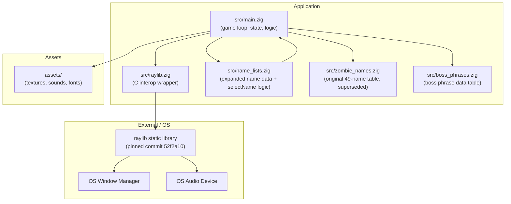
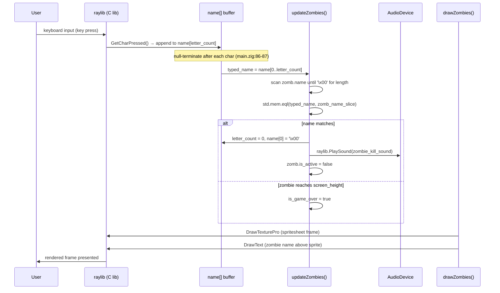
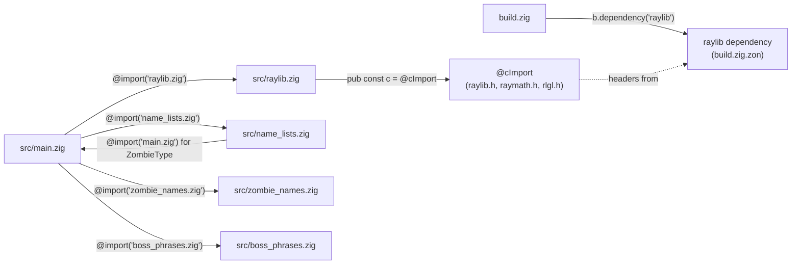

# Architecture

## Table of Contents

- [1. Architecture Style](#1-architecture-style)
- [2. Component Diagram](#2-component-diagram)
- [3. Data Flow](#3-data-flow)
- [4. Layer Breakdown](#4-layer-breakdown)
- [5. External Dependencies](#5-external-dependencies)
- [6. Cross-Cutting Concerns](#6-cross-cutting-concerns)
- [7. Dependency Graph](#7-dependency-graph)
- [8. Architectural Decisions](#8-architectural-decisions)

---

## 1. Architecture Style

**death-note** follows a **single-module game-loop monolith** with three supporting patterns:

### Init → Update → Draw → Teardown game loop

All game logic lives in `src/main.zig`. The `main()` function (line 46) structures runtime execution in four phases:

1. **Init** — `raylib.InitWindow`, `raylib.InitAudioDevice`, `raylib.LoadSound`, `raylib.LoadTexture` (lines 49–61), each immediately followed by a `defer` teardown.
2. **Update** — gated by `if (!is_game_over)` (line 73): input polling, spawn timer advancement (`spawn_timer += raylib.GetFrameTime()`, line 109), and `updateZombies()` (line 118).
3. **Draw** — always-on inside `raylib.BeginDrawing()` / `defer raylib.EndDrawing()` (lines 121–122): `drawZombies()` or game-over overlay.
4. **Teardown** — the matching `defer` statements registered during Init unwind in reverse order when `main()` returns.

### Walled C interop

All `@cImport` usage is isolated to `src/raylib.zig` (lines 1–5). Game code in `src/main.zig` only ever calls through the `raylib` module namespace (`const raylib = @import("raylib.zig")`, line 2). No other file calls `@cImport`.

### Fixed-size object pool

Zombies are stored in a module-level array `var zombies: [MAX_ZOMBIES]?*Zombie = undefined` (line 38), with `MAX_ZOMBIES = 100` (line 7). `spawnZombie` scans for a `null` slot (line 261) and writes into it; `resetZombies` frees and nulls every slot (lines 285–292). There is no dynamic list or growable container.

---

## 2. Component Diagram



---

## 3. Data Flow



---

## 4. Layer Breakdown

This codebase does not use a traditional layered architecture. All concerns collapse into a single source file (`src/main.zig`) with two thin auxiliary modules. The layers below are logical separations within that file, not separate packages or directories.

| Layer | Files | Responsibilities |
|---|---|---|
| **Presentation / Rendering** | `src/main.zig` (`drawZombies`, `drawBoss`, inline draw calls) | Clears background, draws text input box, blinking cursor, zombie sprites, boss sprite (2× scale, red tint), boss phrase text, boss health bar, zombie names, game-over overlay |
| **Input** | `src/main.zig` | Mouse hit-test against text box; `GetCharPressed` loop (limit via `getCurrentMaxInput()`); backspace handling; `KEY_ENTER` restart |
| **Gameplay State** | `src/main.zig` (`updateZombies`, `updateBoss`, `spawnZombie`, `spawnBoss`, `resetZombies`, `resetBoss`; module-level globals) | Zombie and boss y-position advance, game-over detection, name/phrase-match comparison, spawn timer, pool management, boss priority, wave completion gate |
| **Resources** | `src/main.zig`; `assets/` directory | Load/unload `zombie-hit.wav` and `z_spritesheet.png` once at startup; boss reuses both assets — no new resource loads |
| **C Interop** | `src/raylib.zig` (lines 1–5) | Single `pub const c = @cImport(…)` aggregating `raylib.h`, `raymath.h`, `rlgl.h`; all raylib symbols are re-exported from this module |
| **Name Data** | `src/name_lists.zig` | Compile-time arrays `PrimaryNames` (349+), `CompoundNames` (31), `TrapGroups` (15); `selectName` function with wave-weighted category selection, type-based length filtering, and anti-doublon retry; test blocks for data validity |
| **Boss Phrase Data** | `src/boss_phrases.zig` (line 1) | Compile-time array of 10 zero-terminated C string literals (multi-word phrases ≤ 35 chars); no logic, no imports |
| **Legacy Name Data** | `src/zombie_names.zig` (line 1) | Original 49-name compile-time array; still imported but superseded by `name_lists.zig` for all regular zombie spawning |

> **Note on collapse**: Because Zig does not enforce package boundaries within a binary in the way that multi-crate or multi-module systems do, every layer above is reachable from every other layer within `src/main.zig`. The walling of C interop into `src/raylib.zig` is the sole enforced boundary.

---

## 5. External Dependencies

| Dependency | Source | Role |
|---|---|---|
| **raylib** (commit `52f2a10db610d0e9f619fd7c521db08a876547d0`) | `build.zig.zon` lines 6–8; fetched from `https://github.com/raysan5/raylib/archive/52f2a10db610d0e9f619fd7c521db08a876547d0.tar.gz` | Window creation, input polling, 2D rendering, texture/sound loading and playback; linked as a static library via `exe.linkLibrary(raylib_dep.artifact("raylib"))` (`build.zig` line 42) |
| **Zig standard library — `std.heap.page_allocator`** | Built-in; used at `src/main.zig` line 69 | Allocates and frees individual `Zombie` structs in `spawnZombie` / `resetZombies` |
| **Zig standard library — `std.Random.DefaultPrng`** | Built-in; used at `src/main.zig` | Seeded from `std.c.clock_gettime(.REALTIME, …)` at startup (`std.time.milliTimestamp` was removed in Zig 0.16); used for zombie type selection (`selectZombieType`) and name selection (`name_lists.selectName`) |
| **Zig standard library — `std.mem.eql`** | Built-in; used at `src/main.zig` | Byte-for-byte comparison of typed input buffer slice against zombie name slice |
| **Zig standard library — `std.c`** | Built-in; used at `src/main.zig` | `std.c.clock_gettime` for PRNG seeding; `std.c.fopen`/`fread`/`fwrite` for native high score persistence (`std.fs` was removed in Zig 0.16) |
| **OS window manager** | Platform (X11, Wayland, Win32, Cocoa) | Provides the native window surface that raylib's `InitWindow` targets |
| **OS audio device** | Platform ALSA/PulseAudio/CoreAudio/XAudio | Provides the audio output that `raylib.InitAudioDevice` / `PlaySound` targets |
| **Emscripten SDK** (`3.1.64`) | Build-time only; not linked into the native binary | Required for `zig build web`. Provides the `emcc` linker, `emscripten/emscripten.h` (for `emscripten_set_main_loop_arg`), Emscripten's JS runtime glue, and WebGL/OpenAL backends for browser deployment. Not present on `PATH` in a standard native dev environment. |

---

## 6. Cross-Cutting Concerns

### Authentication / Authorization

None. The game has no network layer, no user accounts, and no access control of any kind.

### Error Handling

- Functions that allocate return `!void` or `!T` and are called with `try` (`src/main.zig` line 113: `try spawnZombie(...)`; line 264: `const new_zombie = try allocator.create(Zombie)`).
- An `errdefer` on line 265 (`errdefer allocator.destroy(new_zombie)`) prevents a memory leak if the zombie initialisation were to fail after allocation.
- Raylib init/load failures are not checked in Zig code; raylib itself logs and asserts internally on fatal errors.
- Game-level failure is represented by the boolean flag `var is_game_over: bool = false` (line 24). Setting it to `true` gates the entire update phase (`if (!is_game_over)`, line 73) and triggers the restart overlay.

### Logging

None. There are no calls to `std.log`, `std.debug.print`, or any other logging facility in any source file.

### Configuration

All tunables are compile-time constants declared at the top of `src/main.zig`:

```
const MAX_ZOMBIES = 100;          // line 7
const MAX_INPUT_CHARS = 9;        // line 8
const ZOMBIE_FRAME_COUNT = 17;    // line 10
const spawn_delay: f32 = 3.0;    // line 21
const screen_width = 800;         // line 43
const screen_height = 450;        // line 44
```

There is no runtime configuration file, no environment variable reading, and no command-line argument parsing.

### Memory Management

A single `std.heap.page_allocator` instance is created in `main()` (line 69) and passed by pointer into `spawnZombie` and `resetZombies`. Every allocation has a corresponding `allocator.destroy` in `resetZombies` (line 288). The game never uses an arena or general-purpose allocator.

### Animation State

Animation is per-zombie mutable state (`frame: f32`, `animationTimer: f32` fields in the `Zombie` struct, lines 33–34) mutated directly inside `drawZombies` (lines 217–225). Mixing mutation with rendering is a deliberate simplification; there is no separate animation system.

---

## 7. Dependency Graph



---

## 8. Architectural Decisions

### (a) Single source file for all game logic

All gameplay logic — the loop, input, update, draw, spawn, reset — lives in `src/main.zig`. There is no subdivision into feature modules. This is appropriate for a small game of this scope and avoids cross-file visibility friction in Zig's module system.

**Evidence**: `build.zig` line 20 names only `src/main.zig` as `root_source_file`; all functions (`updateZombies`, `drawZombies`, `spawnZombie`, `resetZombies`) are defined in the same file.

### (b) C interop walled in `src/raylib.zig`

`@cImport` is called exactly once, in `src/raylib.zig` (lines 1–5). Game code never calls `@cImport` directly. This means C-header changes affect only one file, and the rest of the codebase sees a clean Zig namespace.

**Evidence**: `src/raylib.zig` is 5 lines; `src/main.zig` line 2 imports it as `const raylib = @import("raylib.zig")`.

### (c) Fixed-size pool over dynamic list

`var zombies: [MAX_ZOMBIES]?*Zombie` (line 38) is a fixed-capacity array of optional pointers rather than an `ArrayList` or other growable structure. Pool scanning is O(n) on `MAX_ZOMBIES` but avoids resizing and the associated allocation overhead.

**Evidence**: `src/main.zig` lines 38, 261 (scan for null slot), 285–292 (full pool reset).

### (d) Global mutable state instead of struct-passing

All game state (`name`, `letter_count`, `zombies`, `spawn_timer`, `is_game_over`, `zombie_texture`, `zombie_kill_sound`) is declared at module scope (lines 14–41). Functions like `updateZombies` and `drawZombies` take no parameters and read/write these globals directly.

**Evidence**: `src/main.zig` lines 14–41 (globals); function signatures at lines 166, 205, 285.

### (e) `page_allocator` instead of `GeneralPurposeAllocator`

`std.heap.page_allocator` is used (line 69) rather than the safer `std.heap.GeneralPurposeAllocator`. `page_allocator` is simpler and has no overhead for leak detection, which is acceptable in a game context where `resetZombies` unconditionally destroys all live allocations on restart.

**Evidence**: `src/main.zig` line 69.

### (f) `is_game_over` flag gates the entire update phase

Rather than breaking out of the game loop or using a state machine, a single boolean (`is_game_over`, line 24) wraps the entire update block (`if (!is_game_over)`, line 73). The draw phase always runs, enabling the game-over overlay to render without additional branching in the loop structure.

**Evidence**: `src/main.zig` lines 24, 73, 135–149.

### (g) Animation timer baked into the `Zombie` struct

Each zombie carries its own `frame: f32` and `animationTimer: f32` (lines 33–34). Animation is advanced inside `drawZombies` (lines 217–225) rather than in a dedicated system or `updateZombies`. This co-locates animation state with the entity it belongs to at the cost of mixing mutation and rendering.

**Evidence**: `src/main.zig` struct definition lines 27–35; `drawZombies` lines 217–225.

### (i) `comptime` branch for web vs. native main loop

`main()` contains a `comptime` check on `@import("builtin").target.os.tag == .emscripten` that selects between two loop strategies. On native targets the existing `while (!raylib.WindowShouldClose())` loop calls `frame(&ctx)` each iteration. On the Emscripten target, `raylib.emscripten_set_main_loop_arg(frame_c_callback, &ctx, 0, 1)` replaces the loop — the browser's requestAnimationFrame drives execution instead.

The loop body is extracted into a `frame(ctx: *FrameContext) void` helper. `FrameContext` is a struct that carries the allocator and RNG by pointer so the Emscripten callback (which has a C calling convention and receives a `?*anyopaque` argument) can reconstruct context without accessing globals directly. Resource `Init…`/`defer Close…` pairs stay in `main()` and are not affected by the loop refactor; the Emscripten loop does not return, so those defers do not fire on the web target — this is intentional and documented inline.

**Evidence**: `src/main.zig` — `FrameContext` struct, `frame()` helper, `frame_c_callback` trampoline, `comptime` target check in `main()`.

### (h) Names stored as `[*:0]const u8` for direct raylib interop

Zombie names are `[*:0]const u8` pointers into the compile-time `ZombieNames` array (`src/zombie_names.zig` line 1; `Zombie.name` field line 31). This avoids any copying: the pointer assigned at spawn (line 274) is passed directly to `raylib.DrawText` (line 254), which expects a null-terminated C string. The trade-off is that name length must be computed by scanning for `'\x00'` at comparison time (lines 184–187 in `updateZombies`).

**Evidence**: `src/zombie_names.zig` line 1; `src/main.zig` lines 31, 184–190, 254.
