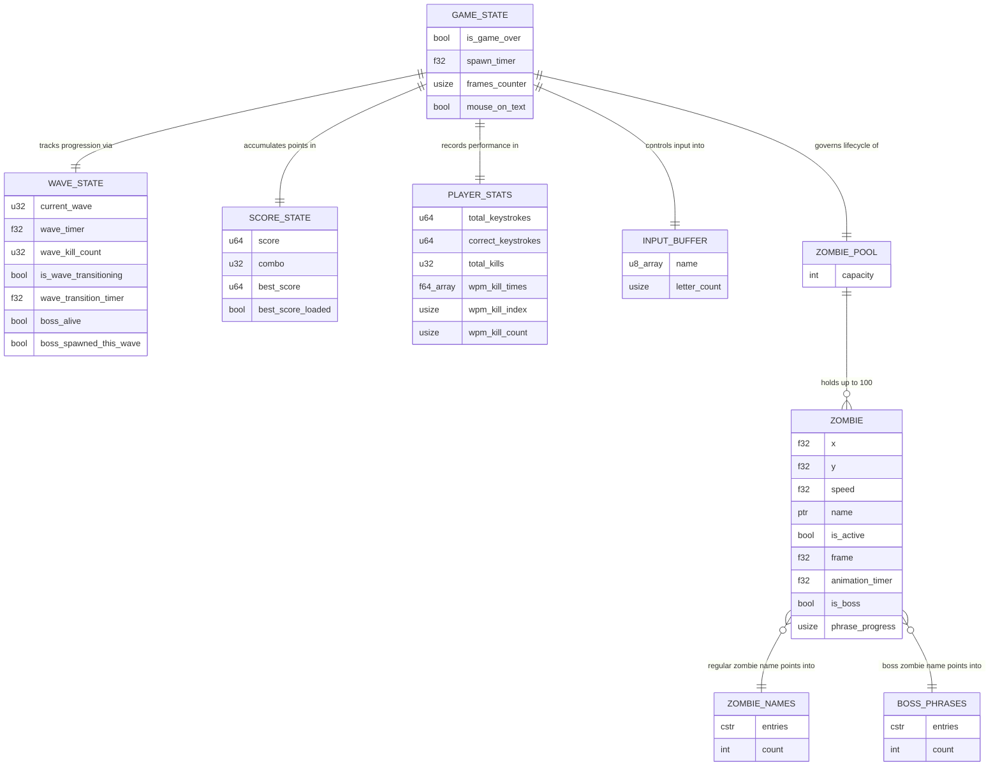
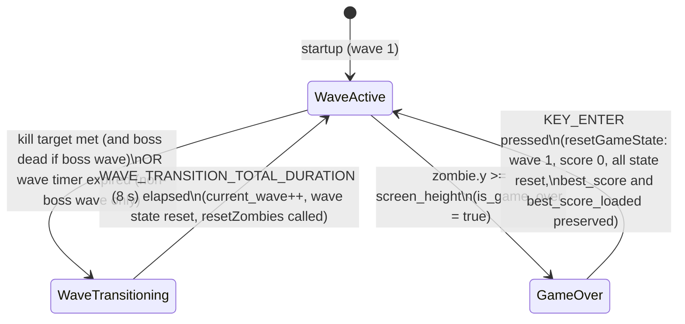
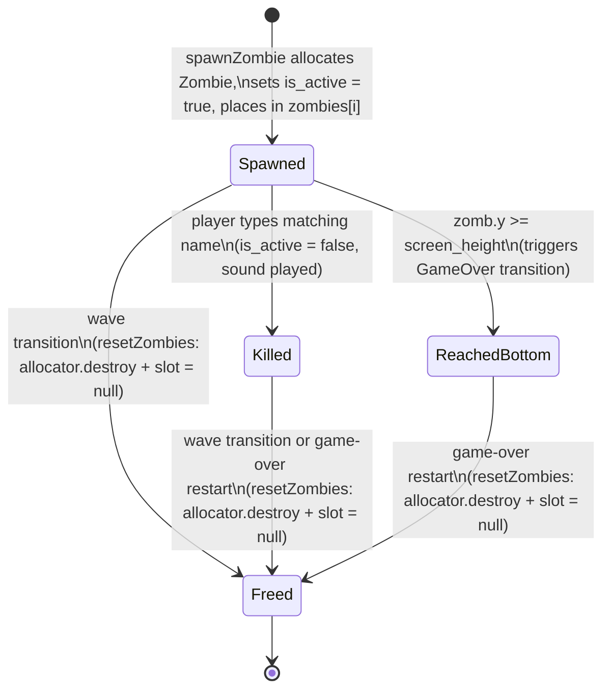

# Data Model

## Table of Contents

- [1. Data Layer Overview](#1-data-layer-overview)
- [2. Entity-Relationship Diagram](#2-entity-relationship-diagram)
- [3. Entity Catalog](#3-entity-catalog)
  - [3.1 Zombie](#31-zombie)
  - [3.2 ZombieNames](#32-zombienames)
  - [3.3 BossPhrases](#33-bossphrases)
  - [3.4 InputBuffer](#34-inputbuffer)
  - [3.5 GameState](#35-gamestate)
- [4. Enums and Constants](#4-enums-and-constants)
- [5. State Machines](#5-state-machines)
  - [5.1 Game State Machine](#51-game-state-machine)
  - [5.2 Zombie Lifecycle State Machine](#52-zombie-lifecycle-state-machine)
- [6. Migration History](#6-migration-history)
- [7. Data Integrity Rules](#7-data-integrity-rules)

---

## 1. Data Layer Overview

All game state lives in module-level global variables declared at the top of `src/main.zig`. The only persistent data is the player's highest score, stored in a platform-specific manner:

| Platform | Storage | Format |
|---|---|---|
| Native (desktop) | `highscore.dat` file in the working directory | 8-byte little-endian `u64` |
| Web (WASM/Emscripten) | `localStorage` key `death-note-highscore` | Integer string via `emscripten_run_script_int` / `emscripten_run_script` |

Read/write errors are silently ignored — the game functions normally if persistence is unavailable.

All other state is ephemeral and does not survive process exit. A new session starts at wave 1 with a score of 0; only `best_score` may be restored from storage.

The data containers in the project are:

| Container | Location | Nature |
|---|---|---|
| `zombies[MAX_ZOMBIES]` pool | `src/main.zig` (runtime) | Fixed array of heap-allocated `?*Zombie` pointers; mutable at runtime |
| `ZombieNames` | `src/zombie_names.zig` (compile-time) | Read-only, compile-time array of 49 null-terminated C string pointers |
| `BossPhrases` | `src/boss_phrases.zig` (compile-time) | Read-only, compile-time array of 15 null-terminated C string pointers (multi-word phrases for boss zombies) |

Asset files (`assets/zombie-hit.wav`, `assets/z_spritesheet.png`) are loaded at startup by raylib and held in GPU/audio memory as opaque handles — they are not parsed into application data structures.

---

## 2. Entity-Relationship Diagram



---

## 3. Entity Catalog

### 3.1 Zombie

**Source:** `src/main.zig`

**Definition:**

```zig
const Zombie = struct {
    x: f32,
    y: f32,
    speed: f32,
    name: [*:0]const u8,
    is_active: bool,
    frame: f32,
    animation_timer: f32,
    is_boss: bool,
    phrase_progress: usize,
};
```

**Pool location:** `var zombies: [MAX_ZOMBIES]?*Zombie = undefined` — a fixed 100-slot array of optional pointers declared at module scope. Each occupied slot holds a pointer to a heap-allocated `Zombie` created via `std.heap.page_allocator.create(Zombie)`.

**There is no persistent ID field.** A zombie's identity is its slot index within `zombies[]`; this index is not stored inside the struct.

| Field | Type | Meaning | Constraints |
|---|---|---|---|
| `x` | `f32` | Horizontal screen position (pixels from left edge) | Set at spawn: `intRangeLessThan(c_int, ZOMBIE_SPAWN_X_MIN, ZOMBIE_SPAWN_X_MAX)` cast to `f32`; never mutated after spawn |
| `y` | `f32` | Vertical screen position (pixels from top edge) | Initialised to `0.0`; incremented by `speed` every frame in `updateZombies` |
| `speed` | `f32` | Pixels per frame the zombie descends | Computed per-wave from difficulty scaling constants; boss zombies apply `BOSS_FALL_SPEED_FACTOR` (0.5) multiplier |
| `name` | `[*:0]const u8` | Pointer to a null-terminated C string from `ZombieNames` (regular) or `BossPhrases` (boss) | Never copied; points directly into the compile-time array; never null |
| `is_active` | `bool` | Whether the zombie is alive and should be updated/drawn | `true` at spawn; set to `false` when the player types the matching name |
| `frame` | `f32` | Current animation frame index (0-16) | Incremented in `drawZombies` every `ZOMBIE_ANIMATION_FRAME_DURATION` (0.1 s); wraps to `0` when it reaches `ZOMBIE_FRAME_COUNT` (17) |
| `animation_timer` | `f32` | Accumulated time since last frame advance (seconds) | Starts at `0`; reset to `0` each time a frame advance occurs |
| `is_boss` | `bool` | Whether this zombie is a boss | `true` for the single boss spawned on every wave divisible by `BOSS_WAVE_INTERVAL` (5); `false` for all regular zombies |
| `phrase_progress` | `usize` | Number of characters the player has matched so far against this zombie's name | Allows partial/incremental matching for boss phrases; `0` at spawn; incremented as the player types matching characters |

**Relationships:**
- `name` references one entry in the compile-time `ZombieNames` array (regular zombies) or `BossPhrases` array (boss zombies) — pointer, not a copy.
- The `Zombie` instance lives in heap memory obtained from `std.heap.page_allocator`; the pointer is stored in `zombies[i]`.

---

### 3.2 ZombieNames

**Source:** `src/zombie_names.zig`, line 1

**Definition:**

```zig
pub const ZombieNames = [_][*:0]const u8{ ... };
```

This is a compile-time constant array of 49 null-terminated C string pointers. It is the source of name strings for regular (non-boss) zombies. The strings are stored in the binary's read-only data segment; no allocation occurs at runtime.

| Attribute | Value |
|---|---|
| Element type | `[*:0]const u8` — null-terminated, read-only C string pointer |
| Element count | 49 |
| Mutability | Immutable (compile-time constant) |
| Access pattern | Random index via `rng.random().intRangeLessThan(usize, 0, ZombieNames.len)` at spawn time |

**Sample entries (first ten):** `"Aaron"`, `"Abby"`, `"Adrian"`, `"Aisha"`, `"Akira"`, `"Alex"`, `"Ali"`, `"Amara"`, `"Amir"`, `"Ana"`

**Full list:** Aaron, Abby, Adrian, Aisha, Akira, Alex, Ali, Amara, Amir, Ana, Anil, Arjun, Ava, Bao, Bella, Carlos, Carmen, Chin, Dalia, Daniel, Eli, Emma, Eric, Fatima, Felix, Gabriel, Hana, Igor, Ivan, Jack, Jane, Juan, Kai, Lara, Liam, Lina, Maria, Mila, Nina, Omar, Oscar, Pablo, Ravi, Sara, Seth, Tina, Vera, Yara, Zane

**Relationships:**
- `Zombie.name` (for regular zombies where `is_boss == false`) holds a pointer into this array. Multiple live zombies can reference the same entry concurrently (no uniqueness enforcement).

---

### 3.3 BossPhrases

**Source:** `src/boss_phrases.zig`, line 1

**Definition:**

```zig
pub const BossPhrases = [_][*:0]const u8{ ... };
```

This is a compile-time constant array of 15 null-terminated C string pointers containing multi-word phrases assigned to boss zombies. The strings are stored in the binary's read-only data segment; no allocation occurs at runtime.

| Attribute | Value |
|---|---|
| Element type | `[*:0]const u8` — null-terminated, read-only C string pointer |
| Element count | 15 |
| Mutability | Immutable (compile-time constant) |
| Access pattern | Random index via `rng.random().intRangeLessThan(usize, 0, BossPhrases.len)` at boss spawn time |

**Full list:** "undead apocalypse", "brains for dinner", "rise from the grave", "night of the dead", "zombie horde attacks", "flesh eating fiend", "walking nightmare", "escape the cemetery", "dawn of darkness", "cursed reanimation", "unholy resurrection", "graveyard shift now", "rotting with rage", "shambling menace", "tomb of terror"

**Relationships:**
- `Zombie.name` (for boss zombies where `is_boss == true`) holds a pointer into this array. Only one boss zombie is active at a time on boss waves.

---

### 3.4 InputBuffer

**Source:** `src/main.zig`

**Definition:**

```zig
var name = [_]u8{0} ** (MAX_INPUT_CHARS + 1);  // 41 bytes, zero-initialised
var letter_count: usize = 0;
```

| Component | Type | Size | Meaning |
|---|---|---|---|
| `name` | `[41]u8` | 41 bytes | Null-terminated character buffer; bytes `0..letter_count-1` hold the typed characters; `name[letter_count]` is always `'\x00'` |
| `letter_count` | `usize` | -- | Count of valid characters currently in `name`; doubles as the null-terminator index |

**Invariants:**
- `name[letter_count]` is always `'\x00'` — enforced after every write and after backspace.
- `letter_count` never exceeds `MAX_INPUT_CHARS` (40); the character-append branch checks `letter_count < MAX_INPUT_CHARS` before writing.
- Only characters in the range `[32, 125]` (printable ASCII) are accepted.
- On zombie kill: `letter_count = 0`, `name[0] = '\x00'`.
- On game restart: `letter_count = 0`, `name[0] = '\x00'`.

---

### 3.5 GameState

**Source:** `src/main.zig`, module-level globals

These variables collectively represent the running state of the game session. They are all module-level `var` declarations — there is no encapsulating struct.

#### Core State

| Variable | Type | Initial value | Meaning |
|---|---|---|---|
| `is_game_over` | `bool` | `false` | When `true`, the update phase is skipped and the game-over stats screen is rendered. Set to `true` when any zombie's `y >= screen_height`. Reset to `false` on `KEY_ENTER` press. |
| `spawn_timer` | `f32` | `0.0` | Accumulated seconds since the last zombie spawn. Incremented each frame by `raylib.GetFrameTime()`. Reset to `0.0` when `spawnZombie` claims a slot. Also reset on game restart and wave transition. |
| `frames_counter` | `usize` | `0` (in `FrameContext`) | Counts frames while the mouse is over the text input box. Drives the blink via `(frames_counter / 20) % 2 == 0`; reset to `0` when the mouse leaves the text box. |
| `mouse_on_text` | `bool` | `false` (in `FrameContext`) | `true` when `raylib.CheckCollisionPointRec` detects the mouse cursor over `text_box`. Controls the cursor icon (`IBEAM` vs `DEFAULT`) and the blinking-underscore overlay. Lives on the per-frame `FrameContext` passed into `frame()`. |

**Note on `frames_counter` and `mouse_on_text`:** These are fields on the `FrameContext` struct instantiated in `main()`, not at module scope. They are documented here because they constitute observable game state, even though their scoping differs from the other globals.

#### Wave State

| Variable | Type | Initial value | Meaning |
|---|---|---|---|
| `current_wave` | `u32` | `1` | The wave the player is currently on. Incremented after each wave transition completes. |
| `wave_timer` | `f32` | `0.0` | Accumulated seconds elapsed within the current wave. Compared against the per-wave duration limit to determine wave completion. |
| `wave_kill_count` | `u32` | `0` | Number of zombies killed in the current wave. Compared against the per-wave kill target for wave completion. |
| `is_wave_transitioning` | `bool` | `false` | When `true`, the wave-transition screen is displayed (recap + countdown) and no zombies spawn or update. |
| `wave_transition_timer` | `f32` | `0.0` | Accumulated seconds within the wave transition. The first `WAVE_TRANSITION_RECAP_DURATION` (5 s) shows wave recap; the remaining `WAVE_TRANSITION_COUNTDOWN_DURATION` (3 s) shows the countdown. |
| `boss_alive` | `bool` | `false` | `true` while a boss zombie exists and has not been killed. Prevents wave completion on boss waves until the boss is defeated. |
| `boss_spawned_this_wave` | `bool` | `false` | `true` once the boss has been spawned for the current wave. Prevents spawning multiple bosses per wave. |

#### Score State

| Variable | Type | Initial value | Meaning |
|---|---|---|---|
| `score` | `u64` | `0` | Running score for the current game session. Incremented by `BASE_KILL_SCORE` per regular kill, `BOSS_KILL_SCORE` per boss kill, with combo multiplier applied. Wave completion adds `WAVE_COMPLETION_BONUS_PER_WAVE * current_wave`. |
| `combo` | `u32` | `0` | Consecutive kills without missing. Resets to `0` when a zombie reaches the bottom or on mistyped input (if applicable). |
| `best_score` | `u64` | `0` | Highest score across sessions. Loaded from persistent storage on first access; updated at game over if `score > best_score`. |
| `best_score_loaded` | `bool` | `false` | Guards one-time loading from persistent storage. Once `true`, the high score file/localStorage is not re-read. |

#### Player Stats

| Variable | Type | Initial value | Meaning |
|---|---|---|---|
| `total_keystrokes` | `u64` | `0` | Total key presses recorded during gameplay. Used to compute accuracy. |
| `correct_keystrokes` | `u64` | `0` | Key presses that matched the next expected character in a zombie's name. Accuracy = `correct_keystrokes / total_keystrokes`. |
| `total_kills` | `u32` | `0` | Total zombies killed in the current session. |
| `wpm_kill_times` | `[WPM_BUFFER_SIZE]f64` | All `0.0` | Circular buffer of timestamps (seconds) recording when each recent kill occurred. Used to compute a rolling WPM over the last `WPM_WINDOW_SECONDS` (30 s). |
| `wpm_kill_index` | `usize` | `0` | Write index into the `wpm_kill_times` circular buffer. |
| `wpm_kill_count` | `usize` | `0` | Total entries written into the circular buffer (may exceed `WPM_BUFFER_SIZE`; the buffer wraps). |

**Additional module-level resource handles** (not game logic state, but part of the global module):

| Variable | Type | Meaning |
|---|---|---|
| `zombie_texture` | `raylib.Texture2D` | GPU texture handle for the zombie spritesheet, loaded once from `assets/z_spritesheet.png` |
| `zombie_kill_sound` | `raylib.Sound` | Audio handle loaded once from `assets/zombie-hit.wav`; played via `raylib.PlaySound` on zombie kill |

---

## 4. Enums and Constants

There are no enums in this project. All constants are compile-time `const` values declared at module scope in `src/main.zig`.

### Core Constants

| Constant | Value | Type | Purpose |
|---|---|---|---|
| `MAX_ZOMBIES` | `100` | `comptime_int` | Size of the `zombies` fixed pool array; the maximum number of simultaneously live zombies |
| `MAX_INPUT_CHARS` | `40` | `comptime_int` | Maximum number of characters the player can type; the `name` buffer is `MAX_INPUT_CHARS + 1` (41) bytes to accommodate the null terminator |
| `ZOMBIE_FRAME_COUNT` | `17` | `comptime_int` | Number of horizontal animation frames in `z_spritesheet.png`; used to compute `frame_width` and to wrap the animation counter |
| `ZOMBIE_ANIMATION_FRAME_DURATION` | `0.1` | `f32` | Seconds between animation frame advances for zombie sprites |
| `screen_width` | `800` | `comptime_int` | Window width in pixels; passed to `raylib.InitWindow` and used for centering UI |
| `screen_height` | `450` | `comptime_int` | Window height in pixels; a zombie reaching `y >= screen_height` triggers game over |

### Spawn Bounds

| Constant | Value | Type | Purpose |
|---|---|---|---|
| `ZOMBIE_SPAWN_X_MIN` | `10` | `c_int` | Minimum horizontal spawn position (pixels from left edge) |
| `ZOMBIE_SPAWN_X_MAX` | `749` | `c_int` | Maximum horizontal spawn position (`screen_width - 51`); keeps the rendered sprite on-screen |

### Wave System Constants

| Constant | Value | Type | Purpose |
|---|---|---|---|
| `WAVE_TRANSITION_RECAP_DURATION` | `5.0` | `f32` | Seconds the wave recap screen is shown during transition |
| `WAVE_TRANSITION_COUNTDOWN_DURATION` | `3.0` | `f32` | Seconds the countdown is shown before the next wave starts |
| `WAVE_TRANSITION_TOTAL_DURATION` | `8.0` | `f32` | Sum of recap + countdown durations |
| `BOSS_WAVE_INTERVAL` | `5` | `u32` | A boss zombie spawns every Nth wave (waves 5, 10, 15, ...) |
| `BOSS_FALL_SPEED_FACTOR` | `0.5` | `f32` | Multiplier applied to a boss zombie's fall speed (bosses fall at half speed) |

### Scoring Constants

| Constant | Value | Type | Purpose |
|---|---|---|---|
| `BASE_KILL_SCORE` | `100` | `u64` | Points awarded per regular zombie kill (before combo multiplier) |
| `BOSS_KILL_SCORE` | `500` | `u64` | Points awarded per boss zombie kill (before combo multiplier) |
| `WAVE_COMPLETION_BONUS_PER_WAVE` | `200` | `u64` | Bonus points per wave number awarded on wave completion (wave 3 = 600 bonus) |

### Difficulty Scaling Constants

| Constant | Value | Type | Purpose |
|---|---|---|---|
| `BASE_SPAWN_DELAY` | `3.0` | `f32` | Spawn interval in seconds at wave 1 |
| `SPAWN_DELAY_DECAY` | `0.85` | `f32` | Multiplicative decay applied to spawn delay each wave |
| `MIN_SPAWN_DELAY` | `0.5` | `f32` | Floor for spawn delay; delay never drops below this |
| `BASE_FALL_SPEED` | `0.5` | `f32` | Zombie fall speed (pixels/frame) at wave 1 |
| `FALL_SPEED_GROWTH` | `1.10` | `f32` | Multiplicative growth applied to fall speed each wave |
| `MAX_FALL_SPEED` | `2.0` | `f32` | Ceiling for fall speed; speed never exceeds this |
| `BASE_MAX_ACTIVE` | `5` | `u32` | Maximum simultaneously active zombies at wave 1 |
| `MAX_ACTIVE_INCREMENT` | `2` | `u32` | Additional active zombies allowed per wave |
| `CAP_MAX_ACTIVE` | `30` | `u32` | Ceiling for maximum active zombies |
| `BASE_KILL_TARGET` | `5` | `u32` | Kills required to complete wave 1 |
| `KILL_TARGET_INCREMENT` | `2` | `u32` | Additional kills required per subsequent wave |
| `CAP_KILL_TARGET` | `40` | `u32` | Ceiling for per-wave kill target |
| `BASE_WAVE_DURATION` | `30.0` | `f32` | Wave duration in seconds at wave 1 |
| `WAVE_DURATION_INCREMENT` | `5.0` | `f32` | Additional seconds added to wave duration per wave |
| `CAP_WAVE_DURATION` | `120.0` | `f32` | Ceiling for wave duration |

### Stats Constants

| Constant | Value | Type | Purpose |
|---|---|---|---|
| `WPM_WINDOW_SECONDS` | `30.0` | `f64` | Rolling window (seconds) over which WPM is computed |
| `WPM_BUFFER_SIZE` | `200` | `usize` | Capacity of the circular buffer storing kill timestamps for WPM calculation |

### High Score Persistence

| Constant | Value | Type | Purpose |
|---|---|---|---|
| `HIGHSCORE_FILE` | `"highscore.dat"` | string literal | Filename for native high score persistence (8-byte LE u64) |

### Raylib Constants in Use

These are C constants imported from `raylib.h` via `src/raylib.zig` and referenced directly in `src/main.zig`:

| Constant | Category | Usage |
|---|---|---|
| `KEY_BACKSPACE` | Input / keyboard | Detects backspace to remove the last typed character |
| `KEY_ENTER` | Input / keyboard | Detects Enter on the game-over screen to restart |
| `MOUSE_CURSOR_IBEAM` | Input / cursor | Set when the mouse hovers over the text input box |
| `MOUSE_CURSOR_DEFAULT` | Input / cursor | Restored when the mouse leaves the text input box |
| `RAYWHITE` | Color | Background clear color (`ClearBackground`) |
| `LIGHTGRAY` | Color | Fill color for the text input box rectangle |
| `RED` | Color | Outline of the text box when active; "GAME OVER" text |
| `DARKGRAY` | Color | Outline of the text box when inactive |
| `MAROON` | Color | Typed text drawn inside the input box and the blinking cursor |
| `GRAY` | Color | "Press ENTER to Restart" and overflow hint text |
| `DARKGREEN` | Color | Zombie name labels drawn above each zombie sprite |
| `WHITE` | Color | Tint passed to `DrawTexturePro` when rendering zombie sprites |

---

## 5. State Machines

### 5.1 Game State Machine



**Notes:**
- While in the `WaveActive` state the update phase runs every frame: input is captured, `spawn_timer` accumulates, `spawnZombie` may fire, and `updateZombies` runs. Difficulty parameters (spawn delay, fall speed, max active zombies, kill target, wave duration) are computed from the current wave number and the scaling constants.
- While in the `WaveTransitioning` state, all zombies are freed (`resetZombies`), no spawning or movement occurs, and the wave recap/countdown overlay is displayed. The first 5 seconds show the wave recap; the final 3 seconds show a countdown.
- While in the `GameOver` state the update phase is entirely skipped; the draw phase renders the game-over stats screen showing score, best score, accuracy, WPM, and total kills. If the current score exceeds `best_score`, the high score is persisted.
- `resetGameState` resets all wave, score, and player stats variables to their initial values, calls `resetZombies`, but preserves `best_score` and `best_score_loaded`.

---

### 5.2 Zombie Lifecycle State Machine



**Notes:**
- The transition from `Spawned` to `Killed` leaves the `Zombie` struct in heap memory with `is_active = false`; the slot in `zombies[]` remains non-null. The allocation is only reclaimed by `resetZombies`.
- `drawZombies` and `updateZombies` both skip zombies where `!zomb.is_active`, so a `Killed` zombie is invisible and not processed, but its memory is live.
- `spawnZombie` scans for the first `null` slot. A `Killed` zombie (slot still non-null) does not free up a spawn slot until `resetZombies` runs.
- `resetZombies` is called both on wave transition and on game-over restart, so zombie memory is reclaimed at both points.

---

## 6. Migration History

**None.**

This project has no database and no schema versioning tool. The in-memory data layout is defined entirely in source code. The sole persistent artifact is the high score file (`highscore.dat` / `localStorage` key), which stores a single 8-byte value with no schema version — any change to its format is a direct source-code edit with no migration path.

---

## 7. Data Integrity Rules

The following invariants are enforced in code. They are not checked by a schema validator or database constraint — they rely entirely on the logic in `src/main.zig`.

### Input Buffer

- **Null-termination always maintained.** Every character append sets `name[letter_count + 1] = '\x00'` immediately after writing `name[letter_count]`. Every backspace sets `name[letter_count] = '\x00'` after decrementing `letter_count`. Game restart sets `name[0] = '\x00'`.
- **Maximum length enforced at the append site.** Characters are only written when `letter_count < MAX_INPUT_CHARS` (40). Once full, `DrawText("Press BACKSPACE to delete chars...", ...)` is shown.
- **Accepted character range `[32, 125]`** (printable ASCII, inclusive). Characters outside this range returned by `GetCharPressed` are silently discarded.
- **`letter_count` never goes below zero.** The backspace branch checks `letter_count > 0` before decrementing.

### Zombie Name Matching

- Comparison is performed as a byte-exact slice equality via `std.mem.eql(u8, typed_name, zomb_name_slice)`.
- `typed_name` is `name[0..letter_count]` — excludes the null terminator.
- `zomb_name_slice` length is computed by scanning `zomb.name` byte-by-byte until `'\x00'` is reached; the resulting slice also excludes the terminator.
- Match is case-sensitive; no normalization is applied.
- Boss zombies use `phrase_progress` for incremental matching — the player types the phrase character by character, and `phrase_progress` tracks how many characters have been matched so far.

### Zombie Pool

- `spawnZombie` scans `zombies[]` from index 0 for the first `null` slot. If no null slot is found (pool full with 100 active or deactivated-but-not-freed zombies), the function returns without spawning and without reporting an error.
- Slot reuse is blocked by killed (deactivated) zombies until `resetZombies` is called — this is a known characteristic of the current implementation.
- `errdefer allocator.destroy(new_zombie)` is in place in `spawnZombie` to prevent a leak if `Zombie` initialization were to fail after allocation.

### Memory Lifecycle

- **Leak on kill (known behavior).** When a zombie is killed (`is_active = false`), its `*Zombie` heap allocation is intentionally left live until wave transition or game-over restart. The slot in `zombies[]` remains non-null, preventing that slot from being reused for a new spawn.
- **Full reclaim on wave transition and restart.** `resetZombies` iterates every slot, calls `allocator.destroy(z)` for every non-null pointer, and sets the slot to `null`. After `resetZombies` returns, all 100 slots are `null` and no `Zombie` heap memory is outstanding. This runs at both wave transitions and game-over restart.

### High Score Persistence

- The high score is loaded once per process lifetime (guarded by `best_score_loaded`).
- On game over, if `score > best_score`, the value is written to persistent storage.
- Read/write errors are silently ignored — the game continues with `best_score = 0` if loading fails and does not crash if saving fails.
- `resetGameState` preserves `best_score` and `best_score_loaded` so the high score survives across game sessions within the same process.

### Asset Paths

- Asset paths are string literals embedded in the binary: `"assets/zombie-hit.wav"` and `"assets/z_spritesheet.png"`. There is no runtime path construction and no user-supplied path input. The game must be run from the repository root for these relative paths to resolve correctly.
