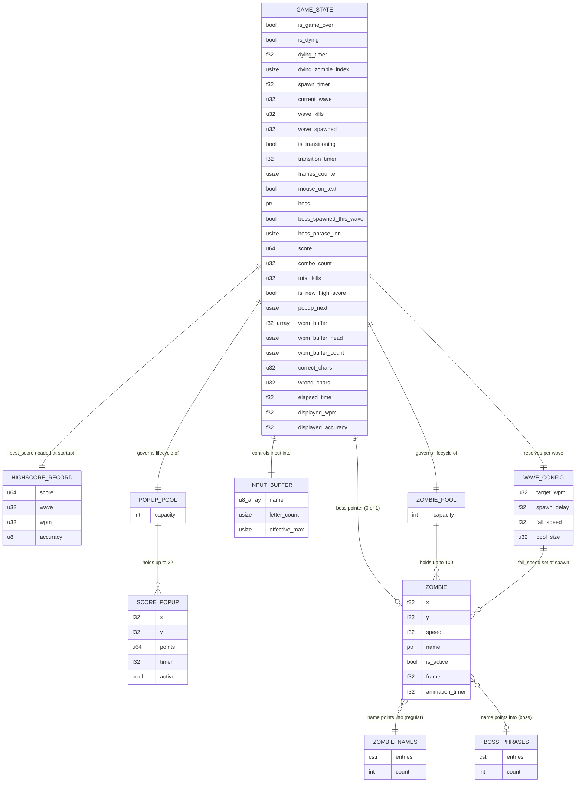
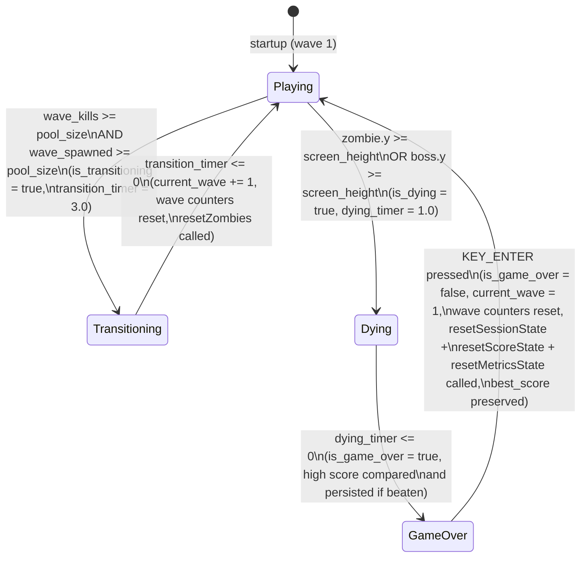
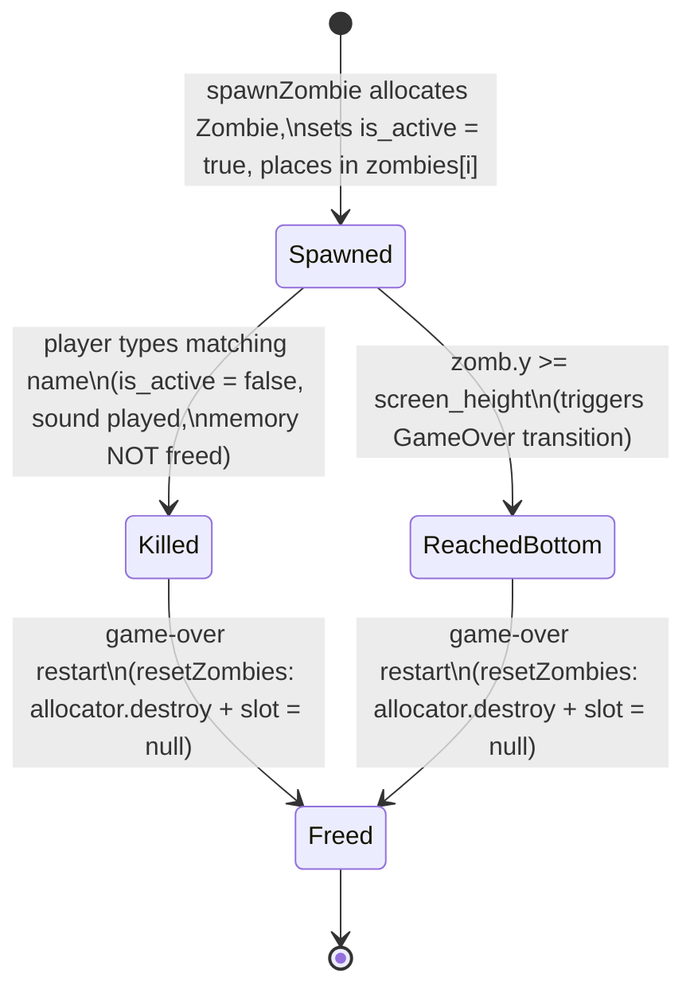

# Data Model

## Table of Contents

- [1. Data Layer Overview](#1-data-layer-overview)
- [2. Entity-Relationship Diagram](#2-entity-relationship-diagram)
- [3. Entity Catalog](#3-entity-catalog)
  - [3.1 Zombie](#31-zombie)
  - [3.2 ZombieNames](#32-zombienames)
  - [3.3 InputBuffer](#33-inputbuffer)
  - [3.4 GameState](#34-gamestate)
  - [3.5 WaveConfig](#35-waveconfig)
  - [3.6 BossPhrases](#36-bossphrases)
  - [3.7 ScorePopup](#37-scorepopup)
  - [3.8 HighScoreRecord](#38-highscorerecord)
- [4. Enums and Constants](#4-enums-and-constants)
- [5. State Machines](#5-state-machines)
  - [5.1 Game State Machine](#51-game-state-machine)
  - [5.2 Zombie Lifecycle State Machine](#52-zombie-lifecycle-state-machine)
- [6. Migration History](#6-migration-history)
- [7. Data Integrity Rules](#7-data-integrity-rules)

---

## 1. Data Layer Overview

**There is no database or ORM.** Most game state lives in module-level global variables in `src/main.zig` and does not survive process exit. One exception: the best score is persisted across sessions.

The data containers in the project are:

| Container | Location | Nature |
|---|---|---|
| `zombies[MAX_ZOMBIES]` pool | `src/main.zig` (runtime) | Fixed array of heap-allocated `?*Zombie` pointers; mutable at runtime |
| `boss` pointer | `src/main.zig` (runtime) | Single `?*Zombie` pointer for the active boss zombie; null when no boss is present |
| `popups[MAX_POPUPS]` pool | `src/main.zig` (runtime) | Fixed stack-allocated array of 32 `ScorePopup` value-type entries; mutable at runtime |
| `best_score` | `src/main.zig` (runtime) | `HighScoreRecord` struct loaded at startup; persisted when beaten |
| `ZombieNames` | `src/zombie_names.zig` (compile-time) | Read-only, compile-time array of 49 null-terminated C string pointers |
| `BossPhrases` | `src/boss_phrases.zig` (compile-time) | Read-only, compile-time array of 10 null-terminated multi-word phrase pointers |

**Persistence layer.** The high score is the sole persisted state. On native builds it is stored in `highscore.dat` (17-byte binary, little-endian) in the working directory, written via `std.c.fopen`/`fwrite`. On web (Emscripten) builds it is stored in `localStorage` under the key `death-note.highscore` as a JSON object, read/written via `emscripten_run_script_int` / `emscripten_run_script`. All other asset files (`assets/zombie-hit.wav`, `assets/z_spritesheet.png`) are loaded at startup by raylib and held in GPU/audio memory as opaque handles — they are not parsed into application data structures.

---

## 2. Entity-Relationship Diagram



---

## 3. Entity Catalog

### 3.1 Zombie

**Source:** `src/main.zig`, lines 27–35

**Definition:**

```zig
const Zombie = struct {
    x: f32,
    y: f32,
    speed: f32,
    name: [*:0]const u8,
    is_active: bool,
    frame: f32,
    animation_timer: f32,
};
```

**Pool location:** `var zombies: [MAX_ZOMBIES]?*Zombie = undefined` — a fixed 100-slot array of optional pointers declared at module scope. Each occupied slot holds a pointer to a heap-allocated `Zombie` created via `std.heap.page_allocator.create(Zombie)`.

**There is no persistent ID field.** A zombie's identity is its slot index within `zombies[]`; this index is not stored inside the struct.

| Field | Type | Meaning | Constraints |
|---|---|---|---|
| `x` | `f32` | Horizontal screen position (pixels from left edge) | Set at spawn via `raylib.GetRandomValue(ZOMBIE_SPAWN_X_MIN, ZOMBIE_SPAWN_X_MAX)` → [10, 749]; never mutated after spawn |
| `y` | `f32` | Vertical screen position (pixels from top edge) | Initialised to `0.0`; incremented by `speed` every frame in `updateZombies` |
| `speed` | `f32` | Pixels per frame the zombie descends | Set once at spawn from `getWaveConfig(current_wave).fall_speed`; ranges from 0.5 (wave 1) to 2.0 (wave 16+); never mutated after spawn |
| `name` | `[*:0]const u8` | Pointer to a null-terminated C string from `ZombieNames` | Never copied; points directly into the compile-time `ZombieNames` array; never null |
| `is_active` | `bool` | Whether the zombie is alive and should be updated/drawn | `true` at spawn; set to `false` when the player types the matching name; **memory is not freed on deactivation** |
| `frame` | `f32` | Current animation frame index (0–16) | Incremented in `drawZombies` every 0.1 s; wraps to `0` when it reaches `ZOMBIE_FRAME_COUNT` (17) |
| `animation_timer` | `f32` | Accumulated time since last frame advance (seconds) | Starts at `0`; reset to `0` each time a frame advance occurs |

**Relationships:**
- `name` references one entry in the compile-time `ZombieNames` array (pointer, not a copy).
- The `Zombie` instance lives in heap memory obtained from `std.heap.page_allocator`; the pointer is stored in `zombies[i]`.

---

### 3.2 ZombieNames

**Source:** `src/zombie_names.zig`, line 1

**Definition:**

```zig
pub const ZombieNames = [_][*:0]const u8{ ... };
```

This is a compile-time constant array of 49 null-terminated C string pointers. It is the sole source of zombie name strings in the game. The strings are stored in the binary's read-only data segment; no allocation occurs at runtime.

| Attribute | Value |
|---|---|
| Element type | `[*:0]const u8` — null-terminated, read-only C string pointer |
| Element count | 49 |
| Mutability | Immutable (compile-time constant) |
| Access pattern | Random index via `rng.random().intRangeLessThan(usize, 0, ZombieNames.len)` at spawn time |

**Sample entries (first ten):** `"Aaron"`, `"Abby"`, `"Adrian"`, `"Aisha"`, `"Akira"`, `"Alex"`, `"Ali"`, `"Amara"`, `"Amir"`, `"Ana"`

**Full list:** Aaron, Abby, Adrian, Aisha, Akira, Alex, Ali, Amara, Amir, Ana, Anil, Arjun, Ava, Bao, Bella, Carlos, Carmen, Chin, Dalia, Daniel, Eli, Emma, Eric, Fatima, Felix, Gabriel, Hana, Igor, Ivan, Jack, Jane, Juan, Kai, Lara, Liam, Lina, Maria, Mila, Nina, Omar, Oscar, Pablo, Ravi, Sara, Seth, Tina, Vera, Yara, Zane

**Relationships:**
- `Zombie.name` holds a pointer into this array. Multiple live zombies can reference the same entry concurrently (no uniqueness enforcement).

---

### 3.3 InputBuffer

**Source:** `src/main.zig`, lines 33–34

**Definition:**

```zig
var name = [_]u8{0} ** (MAX_BOSS_INPUT_CHARS + 1);  // 36 bytes, zero-initialised
var letter_count: usize = 0;
```

The active input buffer is exclusively `name` + `letter_count`. The buffer is sized to the maximum boss-phrase length to support both modes without reallocation.

| Component | Type | Size | Meaning |
|---|---|---|---|
| `name` | `[36]u8` | 36 bytes | Null-terminated character buffer; bytes `0..letter_count-1` hold the typed characters; `name[letter_count]` is always `'\x00'` |
| `letter_count` | `usize` | — | Count of valid characters currently in `name`; doubles as the null-terminator index |

**Invariants:**
- `name[letter_count]` is always `'\x00'` — enforced after every write and after backspace.
- `letter_count` never exceeds `getCurrentMaxInput()`: 9 normally, 35 while `boss != null`. The character-append branch checks `letter_count < getCurrentMaxInput()` before writing.
- Only characters in the range `[32, 125]` (printable ASCII) are accepted.
- On regular zombie kill: `letter_count = 0`, `name[0] = '\x00'`.
- On boss kill: `letter_count = 0`, `name[0] = '\x00'` (cleared by `updateBoss`).
- On game restart: `letter_count = 0`, `name[0] = '\x00'`.

---

### 3.4 GameState

**Source:** `src/main.zig`, module-level globals and `FrameContext`

These variables collectively represent the running state of the game session.

| Variable | Type | Initial value | Reset on restart | Meaning |
|---|---|---|---|---|
| `is_game_over` | `bool` | `false` | `false` | When `true`, the update phase is skipped and the stats overlay is rendered. Set to `true` after the `is_dying` countdown expires. Reset on `KEY_ENTER` press. |
| `is_dying` | `bool` | `false` | `false` | When `true`, all updates (movement, input, spawning) are paused for `DYING_DURATION` (1 s). Set by `updateZombies` / `updateBoss` when a zombie/boss crosses `screen_height`. Cleared when `dying_timer <= 0`. Reset by `resetSessionState` on restart. |
| `dying_timer` | `f32` | `0.0` | `0.0` | Counts down from `DYING_DURATION` (1.0 s) while `is_dying` is true. When it reaches ≤ 0, `is_game_over` is set and the high score comparison runs. Reset by `resetSessionState` on restart. |
| `dying_zombie_index` | `?usize` | `null` | `null` | Slot index in `zombies[]` of the regular zombie that triggered the dying state, used to draw a red tint during the pause. `null` when the boss triggered the dying state. Reset by `resetSessionState` on restart. |
| `spawn_timer` | `f32` | `0.0` | `0.0` | Accumulated seconds since the last zombie spawn. Incremented each frame by `raylib.GetFrameTime()`. Reset when `spawnZombie` claims a slot, on wave advance, and on game restart. |
| `current_wave` | `u32` | `1` | `1` | The currently active wave number. Incremented at the end of each wave transition. Reset to `1` on game restart. |
| `wave_kills` | `u32` | `0` | `0` | Count of zombies killed by the player in the current wave. Incremented in `updateZombies` on each name match. Reset to `0` at wave advance and restart. |
| `wave_spawned` | `u32` | `0` | `0` | Count of zombies spawned in the current wave. Incremented in `frame()` on each successful spawn. Reset to `0` at wave advance and restart. |
| `is_transitioning` | `bool` | `false` | `false` | `true` during the 3-second inter-wave countdown. Blocks spawning, zombie movement, and input. |
| `transition_timer` | `f32` | `0.0` | `0.0` | Seconds remaining in the current wave transition. Decremented each frame while `is_transitioning`. |
| `boss` | `?*Zombie` | `null` | `null` | Pointer to the active boss `Zombie` struct, or `null` when no boss is alive. Freed by `resetBoss`. |
| `boss_spawned_this_wave` | `bool` | `false` | `false` | `true` once `spawnBoss` has been called for the current wave. Used in the wave-completion gate to distinguish "boss not yet spawned" from "boss already killed". |
| `boss_phrase_len` | `usize` | `0` | `0` | Length of the active boss phrase (number of characters before the null terminator), precomputed at spawn. Used by `updateBoss` and `drawBoss` to compute health bar fill and detect full-phrase match. |
| `score` | `u64` | `0` | `0` | Accumulated points earned across all kills in the current game session. Incremented by `calculateScore` result on each kill. Reset to 0 by `resetScoreState` on game restart. |
| `combo_count` | `u32` | `0` | `0` | Consecutive kill count without a mismatch. Determines the active combo multiplier tier (x1–x5 via `getComboMultiplier`). Reset to 0 on mismatch or wave transition; also reset by `resetScoreState` on restart. |
| `total_kills` | `u32` | `0` | `0` | Session-wide count of all enemies destroyed (regular zombies and boss). Incremented in `updateZombies` and `updateBoss` on each successful kill. Displayed on the stats screen as "Kills". Reset to 0 by `resetSessionState` on restart. |
| `best_score` | `HighScoreRecord` | zeroed | preserved | Best session record loaded at startup. Updated in memory (and persisted to `highscore.dat` / localStorage) at the `is_dying → is_game_over` transition if the current session score exceeds `best_score.score`. Not reset on restart — survives across sessions in memory for the lifetime of the process. |
| `is_new_high_score` | `bool` | `false` | `false` | Set to `true` at the `is_dying → is_game_over` transition when `score > best_score.score`. Controls whether the stats screen shows "NEW HIGH SCORE!" (gold) or "Best: N" (dark gray). Reset to `false` by `resetSessionState` on restart. |
| `popup_next` | `usize` | `0` | `0` | Circular write index for the `popups` pool. Advances by 1 modulo `MAX_POPUPS` on each `spawnPopup` call. Reset to 0 by `resetScoreState` on restart. |
| `wpm_buffer` | `[512]f32` | `[_]f32{0} ** 512` | all-zero | Circular buffer of `elapsed_time` timestamps recording when each correct character was typed. Managed by `wpm_buffer_head` and `wpm_buffer_count`. Reset to all-zero by `resetMetricsState`. |
| `wpm_buffer_head` | `usize` | `0` | `0` | Write cursor into `wpm_buffer`; advances modulo `WPM_BUFFER_SIZE` on each `recordCorrectTimestamp` call. Reset to 0 by `resetMetricsState`. |
| `wpm_buffer_count` | `usize` | `0` | `0` | Number of valid entries in `wpm_buffer`; capped at `WPM_BUFFER_SIZE` (512). Reset to 0 by `resetMetricsState`. |
| `correct_chars` | `u32` | `0` | `0` | Session-wide count of keypresses classified as correct (matches next expected character of at least one active enemy). Incremented per keypress in the input loop. Reset by `resetMetricsState`. |
| `wrong_chars` | `u32` | `0` | `0` | Session-wide count of keypresses classified as incorrect (matches no active enemy prefix). Incremented per keypress in the input loop; also resets `combo_count` to 0. Reset by `resetMetricsState`. |
| `elapsed_time` | `f32` | `0.0` | `0.0` | Accumulated game time in seconds, advanced by `raylib.GetFrameTime()` inside `updateMetrics()` each frame (gated by `!is_game_over`). Used as the timestamp for correct-character events and as the reference point for the sliding WPM window. Reset by `resetMetricsState`. |
| `displayed_wpm` | `f32` | `0.0` | `0.0` | Smoothed WPM value shown in the HUD. Interpolates toward `calculateTargetWpm()` at rate `SMOOTHING_FACTOR = 0.2` per frame. Frozen on game-over. Reset to 0.0 by `resetMetricsState`. |
| `displayed_accuracy` | `f32` | `100.0` | `100.0` | Smoothed accuracy percentage shown in the HUD. Interpolates toward `calculateTargetAccuracy()` at rate `SMOOTHING_FACTOR = 0.2` per frame. Frozen on game-over. Reset to 100.0 by `resetMetricsState`. |
| `frames_counter` | `usize` | `0` (in `FrameContext`) | — | Counts frames while the mouse is over the text input box. Drives the blink via `(frames_counter / 20) % 2 == 0`; reset to `0` when the mouse leaves. |
| `mouse_on_text` | `bool` | `false` (in `FrameContext`) | — | `true` when the mouse cursor is over `text_box`. Controls cursor icon and the blinking-underscore overlay. |

**Note on `frames_counter` and `mouse_on_text`:** These live on the `FrameContext` struct allocated in `main()`, not at module scope. They constitute observable game state, but their scoping differs from the other globals.

**Additional module-level resource handles** (not game logic state, but part of the global module):

| Variable | Type | Meaning |
|---|---|---|
| `zombie_texture` | `raylib.Texture2D` | GPU texture handle for the zombie spritesheet, loaded once from `assets/z_spritesheet.png` |
| `zombie_kill_sound` | `raylib.Sound` | Audio handle loaded once from `assets/zombie-hit.wav`; played via `raylib.PlaySound` on zombie kill |

---

### 3.5 WaveConfig

**Source:** `src/main.zig`, lines 56–61 (struct), lines 14–30 (compile-time table), lines 419–429 (lookup function)

**Definition:**

```zig
const WaveConfig = struct {
    target_wpm: u32,
    spawn_delay: f32,
    fall_speed: f32,
    pool_size: u32,
};
```

`WaveConfig` is a value type — it is never heap-allocated. Instances are returned by value from `getWaveConfig(wave: u32)`.

| Field | Type | Meaning | Range |
|---|---|---|---|
| `target_wpm` | `u32` | Target typing speed for the wave in words per minute | 15 (wave 1) – 110 (wave 16+) |
| `spawn_delay` | `f32` | Seconds between zombie spawns | 0.66 (wave 16+) – 4.80 (wave 1) |
| `fall_speed` | `f32` | Pixels per frame each zombie descends | 0.5 (wave 1) – 2.0 (wave 16+) |
| `pool_size` | `u32` | Total zombies to spawn in the wave | 5 (wave 1) – 33+2*(wave-15) (wave 16+) |

**Lookup:** `fn getWaveConfig(wave: u32) WaveConfig` returns `WAVE_TABLE[wave - 1]` for waves 1–15 and computes the scaling formula for waves 16+.

**Storage:** `WAVE_TABLE` is a `[15]WaveConfig` compile-time constant array. No runtime allocation occurs.

---

### 3.6 BossPhrases

**Source:** `src/boss_phrases.zig`, line 1

**Definition:**

```zig
pub const BossPhrases = [_][*:0]const u8{ ... };
```

This is a compile-time constant array of 10 null-terminated C string pointers. It is the sole source of boss phrase strings. The strings live in the binary's read-only data segment; no allocation occurs at runtime.

| Attribute | Value |
|---|---|
| Element type | `[*:0]const u8` — null-terminated, read-only C string pointer |
| Element count | 10 |
| Mutability | Immutable (compile-time constant) |
| Character set | Lowercase ASCII letters (97–122) and spaces (32) only |
| Maximum length | 35 characters (fits within `MAX_BOSS_INPUT_CHARS`) |
| Access pattern | Random index via `raylib.GetRandomValue(0, BossPhrases.len - 1)` at boss spawn time |

**Phrases:** "the dead walk again", "bones remember every step", "silence feeds the horde", "no grave holds them long", "they rise when sun falls", "cold hands reach for you", "the earth spits them out", "shadows crawl at midnight", "a whisper wakes the dead", "run before they find you"

**Relationships:**
- `boss.name` (when a boss is alive) holds a pointer into this array. The pointer is assigned at `spawnBoss` time and is never copied.

---

### 3.7 ScorePopup

**Source:** `src/main.zig`, lines 93–98

**Definition:**

```zig
const ScorePopup = struct {
    x: f32,
    y: f32,
    points: u64,
    timer: f32,
    active: bool,
};
```

**Pool location:** `var popups: [MAX_POPUPS]ScorePopup` — a fixed 32-slot stack-allocated value array at module scope. No heap allocation is used; the pool is initialised at compile time to all-inactive entries. The write head `var popup_next: usize = 0` advances circularly on each `spawnPopup` call.

| Field | Type | Meaning | Constraints |
|---|---|---|---|
| `x` | `f32` | Horizontal screen position inherited from the killed enemy at the moment of death | Set by `spawnPopup`; never mutated after spawn |
| `y` | `f32` | Vertical starting position inherited from the killed enemy | Set by `spawnPopup`; the draw position shifts upward each frame: `draw_y = y - POPUP_RISE_PX × (1 - timer / POPUP_DURATION)` |
| `points` | `u64` | Score value shown in the popup text (formatted as `"+{d}"`) | Result of `calculateScore` at the kill moment |
| `timer` | `f32` | Remaining lifetime in seconds; initialised to `POPUP_DURATION` (0.5 s) and decremented each frame by `GetFrameTime()` | When `timer <= 0`, `active` is set to `false` |
| `active` | `bool` | Whether this slot is currently animating | `true` at spawn; `false` when the timer expires or the slot is overwritten by a new kill |

**Circular recycling:** `popup_next = (popup_next + 1) % MAX_POPUPS` after each write. When all 32 slots are active and a new kill occurs, the oldest slot is silently overwritten. `popup_next` and all `active` flags are reset in `resetScoreState` on game restart.

**Relationships:**
- `spawnPopup` is called from the kill sites in `updateZombies` and `updateBoss` immediately after the score is computed.
- `drawPopups` reads the pool each frame and renders every active entry with fading gold color.

---

### 3.8 HighScoreRecord

**Source:** `src/main.zig`

**Definition:**

```zig
const HighScoreRecord = struct {
    score: u64 = 0,
    wave: u32 = 0,
    wpm: u32 = 0,
    accuracy: u8 = 0,
};
```

**Runtime instance:** `var best_score: HighScoreRecord = .{}` — a single value-type struct at module scope. Loaded once at startup; updated in memory and conditionally written to the persistence store at the `is_dying → is_game_over` transition.

| Field | Type | Meaning | Constraints |
|---|---|---|---|
| `score` | `u64` | Best session score ever achieved | 0 if no record exists |
| `wave` | `u32` | Wave reached when the best score was set | 0 if no record exists |
| `wpm` | `u32` | Average WPM of the session that set the best score | 0 if no record exists |
| `accuracy` | `u8` | Accuracy percentage (0–100) of the session that set the best score | 0 if no record exists |

**Native persistence (`highscore.dat`):**

| Offset | Size | Field |
|---|---|---|
| 0 | 8 bytes | `score` (u64, little-endian) |
| 8 | 4 bytes | `wave` (u32, little-endian) |
| 12 | 4 bytes | `wpm` (u32, little-endian) |
| 16 | 1 byte | `accuracy` (u8) |

Total: `HIGHSCORE_DISK_SIZE` = 17 bytes. The on-disk format is independent of the in-memory struct layout: load/save serialize each field via `std.mem.readInt`/`writeInt` through a fixed 17-byte buffer (the in-memory `HighScoreRecord` is a normal Zig struct, so its `@sizeOf` may differ from the on-disk size due to alignment padding). On load, the read length is compared to `HIGHSCORE_DISK_SIZE`; a mismatch treats the file as corrupt and defaults all fields to 0. Written via `std.c.fopen`/`std.c.fwrite`; read via `std.c.fopen`/`std.c.fread`.

**Web persistence (`localStorage`):**

Key: `"death-note.highscore"`. Value: a JSON object `{"score":N,"wave":N,"wpm":N,"accuracy":N}`. Per-field reads use `emscripten_run_script_int` with inline JavaScript. Writes use `emscripten_run_script` with `localStorage.setItem`. On parse failure or missing key, all fields default to 0.

**Relationships:**
- Read by `loadHighScore()` (native) or `loadHighScoreWeb()` (web) into `best_score` at startup.
- Written by `saveHighScore(best_score)` (native) or `saveHighScoreWeb(best_score)` (web) when `score > best_score.score`.
- `is_new_high_score` flag controls stats screen display and is set at the same transition.

---

## 4. Enums and Constants

There are no enums in this project. All constants are compile-time `const` values declared at module scope in `src/main.zig`.

### Gameplay Constants

| Constant | Value | Type | Purpose |
|---|---|---|---|
| `MAX_ZOMBIES` | `100` | `comptime_int` | Size of the `zombies` fixed pool array; also the maximum number of simultaneously live zombies |
| `MAX_INPUT_CHARS` | `9` | `comptime_int` | Default maximum characters the player can type during normal play |
| `MAX_BOSS_INPUT_CHARS` | `35` | `comptime_int` | Maximum characters accepted while a boss is active; accommodates the longest boss phrase; the `name` buffer is `MAX_BOSS_INPUT_CHARS + 1` bytes |
| `BOSS_SCALE` | `0.4` | `f32` | Render scale for the boss sprite (double the normal zombie scale of 0.2) |
| `BOSS_SPEED_MULTIPLIER` | `0.5` | `f32` | Boss fall speed as a fraction of the wave's normal `fall_speed` |
| `BOSS_HEALTH_BAR_WIDTH` | `200` | `c_int` | Pixel width of the boss health bar drawn below the boss phrase |
| `BOSS_HEALTH_BAR_HEIGHT` | `8` | `c_int` | Pixel height of the boss health bar |
| `ZOMBIE_FRAME_COUNT` | `17` | `comptime_int` | Number of horizontal animation frames in `z_spritesheet.png`; used to compute `frame_width` and to wrap the animation counter |
| `ZOMBIE_ANIMATION_FRAME_DURATION` | `0.1` | `f32` | Seconds between animation frame advances in `drawZombies` |
| `WAVE_TRANSITION_DURATION` | `3.0` | `f32` | Seconds the inter-wave countdown lasts before the next wave begins |
| `WAVE_TABLE` | `[15]WaveConfig` | compile-time array | Explicit difficulty parameters for waves 1–15 |
| `ZOMBIE_SPAWN_X_MIN` | `10` | `c_int` | Left boundary for random zombie spawn x position (pixels from left edge) |
| `ZOMBIE_SPAWN_X_MAX` | `749` | `c_int` | Right boundary for random zombie spawn x position (screen_width - 51) |
| `screen_width` | `800` | `comptime_int` | Window width in pixels; passed to `raylib.InitWindow` and used for centering UI |
| `screen_height` | `450` | `comptime_int` | Window height in pixels; a zombie or boss reaching `y >= screen_height` triggers game over |
| `MAX_POPUPS` | `32` | `comptime_int` | Size of the `popups` fixed stack-allocated pool; also the maximum number of simultaneously animated score popups |
| `POPUP_DURATION` | `0.5` | `f32` | Lifetime in seconds of each score popup; popup fades from full to zero opacity over this interval |
| `POPUP_RISE_PX` | `30.0` | `f32` | Total upward travel in pixels a popup makes from spawn position to end of animation |
| `POPUP_FONT_SIZE` | `20` | `c_int` | Font size for the floating `"+{score}"` popup text |
| `BOSS_TYPE_MULTIPLIER` | `3.0` | `f32` | Score formula type multiplier applied to boss kills |
| `STANDARD_TYPE_MULTIPLIER` | `1.0` | `f32` | Score formula type multiplier applied to standard zombie kills |
| `SCORE_HUD_X` | `10` | `c_int` | X pixel position of the score HUD line |
| `SCORE_HUD_Y` | `5` | `c_int` | Y pixel position of the score HUD line |
| `SCORE_HUD_SIZE` | `24` | `c_int` | Font size for the score HUD line |
| `COMBO_HUD_X` | `10` | `c_int` | X pixel position of the combo HUD line |
| `COMBO_HUD_Y` | `35` | `c_int` | Y pixel position of the combo HUD line |
| `COMBO_HUD_SIZE` | `18` | `c_int` | Font size for the combo HUD line |
| `WPM_BUFFER_SIZE` | `512` | `usize` | Capacity of the circular correct-character timestamp buffer; far exceeds any achievable typing rate within a 10-second window |
| `WPM_WINDOW_SECONDS` | `10.0` | `f32` | Duration of the sliding WPM window in seconds; timestamps older than this are excluded from the count |
| `WPM_HUD_X` | `screen_width − 100` | `c_int` | X pixel position of the WPM HUD label (top-right area) |
| `WPM_HUD_Y` | `5` | `c_int` | Y pixel position of the WPM HUD label |
| `ACC_HUD_X` | `screen_width − 100` | `c_int` | X pixel position of the accuracy HUD label (same column as WPM) |
| `ACC_HUD_Y` | `30` | `c_int` | Y pixel position of the accuracy HUD label (below WPM) |
| `METRICS_HUD_SIZE` | `18` | `c_int` | Font size for both WPM and accuracy HUD labels |
| `SMOOTHING_FACTOR` | `0.2` | `f32` | Per-frame interpolation rate applied to both `displayed_wpm` and `displayed_accuracy`; at 60 FPS, display converges to within 1% of target in ~21 frames |
| `DYING_DURATION` | `1.0` | `f32` | Seconds the dying state lasts before transitioning to game-over; during this time the responsible regular zombie is drawn with a red tint |
| `STATS_TITLE_Y` | `30` | `c_int` | Y pixel position of the "GAME OVER" title on the stats overlay |
| `STATS_LINE_START_Y` | `80` | `c_int` | Y pixel position of the first stat line on the stats overlay |
| `STATS_LINE_SPACING` | `35` | `c_int` | Vertical pixel spacing between stat lines on the stats overlay |
| `STATS_FONT_SIZE` | `24` | `c_int` | Font size for the six stat lines (wave, score, best/high score, WPM, accuracy, kills) |
| `HIGHSCORE_FILENAME` | `"highscore.dat"` | string literal | Filename for native high score persistence; written to and read from the working directory |

### Raylib Constants in Use

These are C constants imported from `raylib.h` via `src/raylib.zig` and referenced directly in `src/main.zig`:

| Constant | Category | Usage |
|---|---|---|
| `KEY_BACKSPACE` | Input / keyboard | Detects backspace to remove the last typed character |
| `KEY_ENTER` | Input / keyboard | Detects Enter on the game-over screen to restart |
| `MOUSE_CURSOR_IBEAM` | Input / cursor | Set when the mouse hovers over the text input box |
| `MOUSE_CURSOR_DEFAULT` | Input / cursor | Restored when the mouse leaves the text input box |
| `RAYWHITE` | Color | Background clear color (`ClearBackground`) |
| `LIGHTGRAY` | Color | Fill color for the text input box rectangle |
| `RED` | Color | Outline of the text box when active; "GAME OVER" text |
| `DARKGRAY` | Color | Outline of the text box when inactive |
| `MAROON` | Color | Typed text drawn inside the input box and the blinking cursor |
| `GRAY` | Color | "Press ENTER to Restart" and overflow hint text |
| `DARKGREEN` | Color | Zombie name labels above each zombie sprite; also used for the score HUD line |
| `WHITE` | Color | Tint passed to `DrawTexturePro` when rendering zombie sprites |
| `ORANGE` | Color | Combo HUD line color when combo count is 5–14 |

---

## 5. State Machines

### 5.1 Game State Machine



**Notes:**
- While in the `Playing` state the update phase runs every frame: input is captured, `spawn_timer` accumulates, `spawnZombie` fires up to `pool_size` times, and `updateZombies` runs.
- While in the `Dying` state all updates are paused (gated by `!is_dying`); only `dying_timer` decrements and the responsible regular zombie (if any) is tinted red.
- While in the `Transitioning` state the update phase is skipped (gated by `!is_transitioning`); only the transition countdown draw and the timer decrement run.
- While in the `GameOver` state the update phase is entirely skipped (gated by `!is_game_over`); only the draw phase runs, showing the 8-line stats overlay.
- `resetZombies` frees all heap-allocated `Zombie` instances and sets every pool slot to `null` before re-entering `Playing`.

---

### 5.2 Zombie Lifecycle State Machine



**Notes:**
- The transition from `Spawned` to `Killed` leaves the `Zombie` struct in heap memory with `is_active = false`; the slot in `zombies[]` remains non-null. The allocation is only reclaimed by `resetZombies`.
- `drawZombies` and `updateZombies` both skip zombies where `!zomb.is_active`, so a `Killed` zombie is invisible and not processed, but its memory is live.
- `spawnZombie` scans for the first `null` slot. A `Killed` zombie (slot still non-null) does not free up a spawn slot until `resetZombies` runs.

---

## 6. Migration History

**None.**

This project has no database, no schema versioning tool (no Flyway, Liquibase, Alembic, or equivalent), and no migration files of any kind. The in-memory data layout is defined entirely in source code. Any change to the `Zombie` struct or `ZombieNames` array is a direct source-code edit; there is no migration concept applicable.

---

## 7. Data Integrity Rules

The following invariants are enforced in code. They are not checked by a schema validator or database constraint — they rely entirely on the logic in `src/main.zig`.

### Input Buffer

- **Null-termination always maintained.** Every character append sets `name[letter_count + 1] = '\x00'` immediately after writing `name[letter_count]`. Every backspace sets `name[letter_count] = '\x00'` after decrementing `letter_count`. Both zombie kill and boss kill set `name[0] = '\x00'` and `letter_count = 0`. Game restart also clears the buffer.
- **Dynamic maximum length enforced at the append site.** Characters are only written when `letter_count < getCurrentMaxInput()`, which returns 35 while a boss is active and 9 otherwise. Once full, `DrawText("Press BACKSPACE to delete chars...", ...)` is shown.
- **Accepted character range `[32, 125]`** (printable ASCII, inclusive). Characters outside this range returned by `GetCharPressed` are silently discarded.
- **`letter_count` never goes below zero.** The backspace branch checks `letter_count > 0` before decrementing.

### Zombie Name Matching

- Comparison is performed as a byte-exact slice equality via `std.mem.eql(u8, typed_name, zomb_name_slice)`.
- `typed_name` is `name[0..letter_count]` — excludes the null terminator.
- `zomb_name_slice` length is computed by scanning `zomb.name` byte-by-byte until `'\x00'` is reached; the resulting slice also excludes the terminator.
- Match is case-sensitive; no normalization is applied.

### Zombie Pool

- `spawnZombie` scans `zombies[]` from index 0 for the first `null` slot. If no null slot is found (pool full with 100 active or deactivated-but-not-freed zombies), the function returns without spawning and without reporting an error.
- Slot reuse is blocked by killed (deactivated) zombies until `resetZombies` is called — this is a known characteristic of the current implementation, not a defect being proposed for fixing here.
- `errdefer allocator.destroy(new_zombie)` is in place in `spawnZombie` to prevent a leak if `Zombie` initialization were to fail after allocation.

### Memory Lifecycle

- **Leak on kill (known behavior).** When a zombie is killed (`is_active = false`), its `*Zombie` heap allocation is intentionally left live until game-over restart. The slot in `zombies[]` remains non-null, preventing that slot from being reused for a new spawn.
- **Full reclaim on restart.** `resetZombies` iterates every slot, calls `allocator.destroy(z)` for every non-null pointer, and sets the slot to `null`. After `resetZombies` returns, all 100 slots are `null` and no `Zombie` heap memory is outstanding.

### Boss Memory Lifecycle

- **Single allocation per boss encounter.** `spawnBoss` allocates exactly one `Zombie` struct via `allocator.create(Zombie)`. `errdefer allocator.destroy(new_boss)` prevents a leak if initialization fails after allocation.
- **Freed on boss kill.** `updateBoss` calls `allocator.destroy(b)` and sets `boss = null` when the full phrase is typed.
- **Freed on wave transition and restart.** `resetBoss` is called alongside `resetZombies` in both the wave-transition block and the game-restart block. It calls `allocator.destroy(b)` if `boss` is non-null, then resets `boss`, `boss_spawned_this_wave`, and `boss_phrase_len` to defaults. After `resetBoss` returns, no boss heap memory is outstanding.

### Asset Paths

- Asset paths are string literals embedded in the binary: `"assets/zombie-hit.wav"` and `"assets/z_spritesheet.png"`. There is no runtime path construction and no user-supplied path input. The game must be run from the repository root for these relative paths to resolve correctly.
