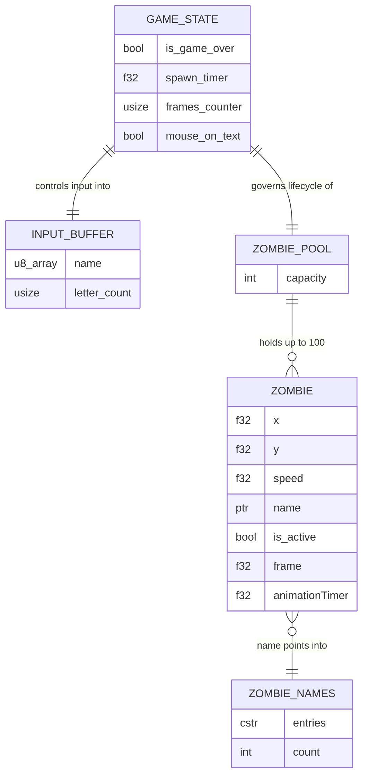
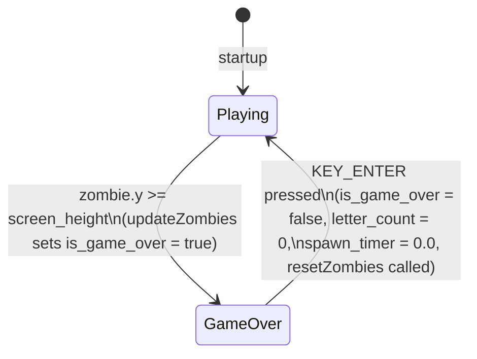
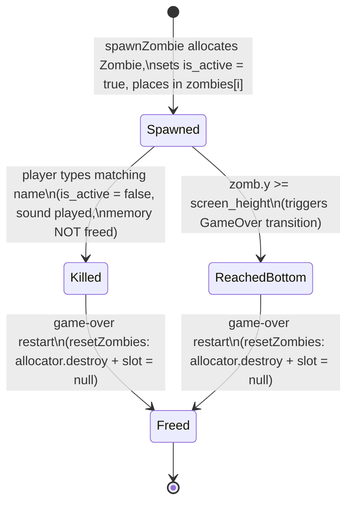

# Data Model

## Table of Contents

- [1. Data Layer Overview](#1-data-layer-overview)
- [2. Entity-Relationship Diagram](#2-entity-relationship-diagram)
- [3. Entity Catalog](#3-entity-catalog)
  - [3.1 Zombie](#31-zombie)
  - [3.2 ZombieNames](#32-zombienames)
  - [3.3 InputBuffer](#33-inputbuffer)
  - [3.4 GameState](#34-gamestate)
- [4. Enums and Constants](#4-enums-and-constants)
- [5. State Machines](#5-state-machines)
  - [5.1 Game State Machine](#51-game-state-machine)
  - [5.2 Zombie Lifecycle State Machine](#52-zombie-lifecycle-state-machine)
- [6. Migration History](#6-migration-history)
- [7. Data Integrity Rules](#7-data-integrity-rules)

---

## 1. Data Layer Overview

**There is no database, no ORM, no schema file, and no persistence layer of any kind.**

All game state lives in module-level global variables declared at the top of `src/main.zig`. None of this state survives process exit; every session starts fresh.

The two "data containers" in the project are:

| Container | Location | Nature |
|---|---|---|
| `zombies[MAX_ZOMBIES]` pool | `src/main.zig` (runtime) | Fixed array of heap-allocated `?*Zombie` pointers; mutable at runtime |
| `ZombieNames` | `src/zombie_names.zig` (compile-time) | Read-only, compile-time array of 49 null-terminated C string pointers |

There are no files read or written during gameplay. Asset files (`assets/zombie-hit.wav`, `assets/z_spritesheet.png`) are loaded at startup by raylib and held in GPU/audio memory as opaque handles — they are not parsed into application data structures.

---

## 2. Entity-Relationship Diagram



---

## 3. Entity Catalog

### 3.1 Zombie

**Source:** `src/main.zig`, lines 27–35

**Definition:**

```zig
const Zombie = struct {
    x: f32,
    y: f32,
    speed: f32,
    name: [*:0]const u8,
    is_active: bool,
    frame: f32,
    animationTimer: f32,
};
```

**Pool location:** `var zombies: [MAX_ZOMBIES]?*Zombie = undefined` — a fixed 100-slot array of optional pointers declared at module scope. Each occupied slot holds a pointer to a heap-allocated `Zombie` created via `std.heap.page_allocator.create(Zombie)`.

**There is no persistent ID field.** A zombie's identity is its slot index within `zombies[]`; this index is not stored inside the struct.

| Field | Type | Meaning | Constraints |
|---|---|---|---|
| `x` | `f32` | Horizontal screen position (pixels from left edge) | Set at spawn: `intRangeLessThan(u32, 10, 750)` cast to `f32`; never mutated after spawn |
| `y` | `f32` | Vertical screen position (pixels from top edge) | Initialised to `0.0`; incremented by `speed` every frame in `updateZombies` |
| `speed` | `f32` | Pixels per frame the zombie descends | Fixed at `0.5` for every zombie; set once at spawn |
| `name` | `[*:0]const u8` | Pointer to a null-terminated C string from `ZombieNames` | Never copied; points directly into the compile-time `ZombieNames` array; never null |
| `is_active` | `bool` | Whether the zombie is alive and should be updated/drawn | `true` at spawn; set to `false` when the player types the matching name; **memory is not freed on deactivation** |
| `frame` | `f32` | Current animation frame index (0–16) | Incremented in `drawZombies` every 0.1 s; wraps to `0` when it reaches `ZOMBIE_FRAME_COUNT` (17) |
| `animationTimer` | `f32` | Accumulated time since last frame advance (seconds) | Starts at `0`; reset to `0` each time a frame advance occurs |

**Relationships:**
- `name` references one entry in the compile-time `ZombieNames` array (pointer, not a copy).
- The `Zombie` instance lives in heap memory obtained from `std.heap.page_allocator`; the pointer is stored in `zombies[i]`.

---

### 3.2 ZombieNames

**Source:** `src/zombie_names.zig`, line 1

**Definition:**

```zig
pub const ZombieNames = [_][*:0]const u8{ ... };
```

This is a compile-time constant array of 49 null-terminated C string pointers. It is the sole source of zombie name strings in the game. The strings are stored in the binary's read-only data segment; no allocation occurs at runtime.

| Attribute | Value |
|---|---|
| Element type | `[*:0]const u8` — null-terminated, read-only C string pointer |
| Element count | 49 |
| Mutability | Immutable (compile-time constant) |
| Access pattern | Random index via `rng.random().intRangeLessThan(usize, 0, ZombieNames.len)` at spawn time |

**Sample entries (first ten):** `"Aaron"`, `"Abby"`, `"Adrian"`, `"Aisha"`, `"Akira"`, `"Alex"`, `"Ali"`, `"Amara"`, `"Amir"`, `"Ana"`

**Full list:** Aaron, Abby, Adrian, Aisha, Akira, Alex, Ali, Amara, Amir, Ana, Anil, Arjun, Ava, Bao, Bella, Carlos, Carmen, Chin, Dalia, Daniel, Eli, Emma, Eric, Fatima, Felix, Gabriel, Hana, Igor, Ivan, Jack, Jane, Juan, Kai, Lara, Liam, Lina, Maria, Mila, Nina, Omar, Oscar, Pablo, Ravi, Sara, Seth, Tina, Vera, Yara, Zane

**Relationships:**
- `Zombie.name` holds a pointer into this array. Multiple live zombies can reference the same entry concurrently (no uniqueness enforcement).

---

### 3.3 InputBuffer

**Source:** `src/main.zig`, lines 14–15

**Definition:**

```zig
var name = [_]u8{0} ** (MAX_INPUT_CHARS + 1);  // 10 bytes, zero-initialised
var letter_count: usize = 0;
```

There is also a declared-but-unused pair:

```zig
var input_text: [MAX_INPUT_CHARS]u8 = undefined;  // unused
var input_length: usize = 0;                       // unused
```

`input_text` and `input_length` are declared but never written or read anywhere in the codebase. The active input buffer is exclusively `name` + `letter_count`.

| Component | Type | Size | Meaning |
|---|---|---|---|
| `name` | `[10]u8` | 10 bytes | Null-terminated character buffer; bytes `0..letter_count-1` hold the typed characters; `name[letter_count]` is always `'\x00'` |
| `letter_count` | `usize` | — | Count of valid characters currently in `name`; doubles as the null-terminator index |

**Invariants:**
- `name[letter_count]` is always `'\x00'` — enforced after every write and after backspace.
- `letter_count` never exceeds `MAX_INPUT_CHARS` (9); the character-append branch checks `letter_count < MAX_INPUT_CHARS` before writing.
- Only characters in the range `[32, 125]` (printable ASCII) are accepted.
- On zombie kill: `letter_count = 0`, `name[0] = '\x00'`.
- On game restart: `letter_count = 0`, `name[0] = '\x00'`.

---

### 3.4 GameState

**Source:** `src/main.zig`, module-level globals

These variables collectively represent the running state of the game session. They are all module-level `var` declarations — there is no encapsulating struct.

| Variable | Type | Initial value | Meaning |
|---|---|---|---|
| `is_game_over` | `bool` | `false` | When `true`, the update phase is skipped and the game-over overlay is rendered. Set to `true` when any zombie's `y >= screen_height`. Reset to `false` on `KEY_ENTER` press. |
| `spawn_timer` | `f32` | `0.0` | Accumulated seconds since the last zombie spawn. Incremented each frame by `raylib.GetFrameTime()`. Reset to `0.0` when a spawn fires and on game restart. |
| `frames_counter` | `usize` | `0` (local to `main`) | Counts frames while the mouse is over the text input box. Used to drive the blinking underscore cursor: blinks when `(frames_counter / 20) % 2 == 0`. Reset to `0` when mouse leaves the text box. Declared as a local variable inside `main()`, not a module-level global. |
| `mouse_on_text` | `bool` | `false` (local to `main`) | `true` when `raylib.CheckCollisionPointRec` detects the mouse cursor over `text_box`. Controls whether keyboard input is captured and which cursor icon is shown. Declared as a local variable inside `main()`, not a module-level global. |

**Note on `frames_counter` and `mouse_on_text`:** These are declared as `var` locals within `main()` (`var mouse_on_text = false; var frames_counter: usize = 0;`), not at module scope. They are documented here because they constitute observable game state, even though their scoping differs from the other globals.

**Additional module-level resource handles** (not game logic state, but part of the global module):

| Variable | Type | Meaning |
|---|---|---|
| `zombie_texture` | `raylib.Texture2D` | GPU texture handle for the zombie spritesheet, loaded once from `assets/z_spritesheet.png` |
| `zombie_kill_sound` | `raylib.Sound` | Audio handle loaded once from `assets/zombie-hit.wav`; played via `raylib.PlaySound` on zombie kill |

---

## 4. Enums and Constants

There are no enums in this project. All constants are compile-time `const` values declared at module scope in `src/main.zig`.

### Gameplay Constants

| Constant | Value | Type | Purpose |
|---|---|---|---|
| `MAX_ZOMBIES` | `100` | `comptime_int` | Size of the `zombies` fixed pool array; also the maximum number of simultaneously live zombies |
| `MAX_INPUT_CHARS` | `9` | `comptime_int` | Maximum number of characters the player can type; the `name` buffer is `MAX_INPUT_CHARS + 1` bytes to accommodate the null terminator |
| `ZOMBIE_FRAME_COUNT` | `17` | `comptime_int` | Number of horizontal animation frames in `z_spritesheet.png`; used to compute `frame_width` and to wrap the animation counter |
| `BUFFER_SIZE` | `16` | `comptime_int` | Declared but not actively used in any logic in the current codebase |
| `spawn_delay` | `3.0` | `f32` | Seconds between zombie spawns; `spawnZombie` is called when `spawn_timer >= spawn_delay` |
| `screen_width` | `800` | `comptime_int` | Window width in pixels; passed to `raylib.InitWindow` and used for centering UI |
| `screen_height` | `450` | `comptime_int` | Window height in pixels; a zombie reaching `y >= screen_height` triggers game over |

### Raylib Constants in Use

These are C constants imported from `raylib.h` via `src/raylib.zig` and referenced directly in `src/main.zig`:

| Constant | Category | Usage |
|---|---|---|
| `KEY_BACKSPACE` | Input / keyboard | Detects backspace to remove the last typed character |
| `KEY_ENTER` | Input / keyboard | Detects Enter on the game-over screen to restart |
| `MOUSE_CURSOR_IBEAM` | Input / cursor | Set when the mouse hovers over the text input box |
| `MOUSE_CURSOR_DEFAULT` | Input / cursor | Restored when the mouse leaves the text input box |
| `RAYWHITE` | Color | Background clear color (`ClearBackground`) |
| `LIGHTGRAY` | Color | Fill color for the text input box rectangle |
| `RED` | Color | Outline of the text box when active; "GAME OVER" text |
| `DARKGRAY` | Color | Outline of the text box when inactive |
| `MAROON` | Color | Typed text drawn inside the input box and the blinking cursor |
| `GRAY` | Color | "Press ENTER to Restart" and overflow hint text |
| `DARKGREEN` | Color | Zombie name labels drawn above each zombie sprite |
| `WHITE` | Color | Tint passed to `DrawTexturePro` when rendering zombie sprites |

---

## 5. State Machines

### 5.1 Game State Machine



**Notes:**
- While in the `Playing` state the update phase runs every frame: input is captured, `spawn_timer` accumulates, `spawnZombie` may fire, and `updateZombies` runs.
- While in the `GameOver` state the update phase is entirely skipped (gated by `if (!is_game_over)`); only the draw phase runs, showing the overlay.
- `resetZombies` frees all heap-allocated `Zombie` instances and sets every pool slot to `null` before re-entering `Playing`.

---

### 5.2 Zombie Lifecycle State Machine



**Notes:**
- The transition from `Spawned` to `Killed` leaves the `Zombie` struct in heap memory with `is_active = false`; the slot in `zombies[]` remains non-null. The allocation is only reclaimed by `resetZombies`.
- `drawZombies` and `updateZombies` both skip zombies where `!zomb.is_active`, so a `Killed` zombie is invisible and not processed, but its memory is live.
- `spawnZombie` scans for the first `null` slot. A `Killed` zombie (slot still non-null) does not free up a spawn slot until `resetZombies` runs.

---

## 6. Migration History

**None.**

This project has no database, no schema versioning tool (no Flyway, Liquibase, Alembic, or equivalent), and no migration files of any kind. The in-memory data layout is defined entirely in source code. Any change to the `Zombie` struct or `ZombieNames` array is a direct source-code edit; there is no migration concept applicable.

---

## 7. Data Integrity Rules

The following invariants are enforced in code. They are not checked by a schema validator or database constraint — they rely entirely on the logic in `src/main.zig`.

### Input Buffer

- **Null-termination always maintained.** Every character append sets `name[letter_count + 1] = '\x00'` immediately after writing `name[letter_count]`. Every backspace sets `name[letter_count] = '\x00'` after decrementing `letter_count`. Game restart sets `name[0] = '\x00'`.
- **Maximum length enforced at the append site.** Characters are only written when `letter_count < MAX_INPUT_CHARS` (9). Once full, `DrawText("Press BACKSPACE to delete chars...", ...)` is shown.
- **Accepted character range `[32, 125]`** (printable ASCII, inclusive). Characters outside this range returned by `GetCharPressed` are silently discarded.
- **`letter_count` never goes below zero.** The backspace branch checks `letter_count > 0` before decrementing.

### Zombie Name Matching

- Comparison is performed as a byte-exact slice equality via `std.mem.eql(u8, typed_name, zomb_name_slice)`.
- `typed_name` is `name[0..letter_count]` — excludes the null terminator.
- `zomb_name_slice` length is computed by scanning `zomb.name` byte-by-byte until `'\x00'` is reached; the resulting slice also excludes the terminator.
- Match is case-sensitive; no normalization is applied.

### Zombie Pool

- `spawnZombie` scans `zombies[]` from index 0 for the first `null` slot. If no null slot is found (pool full with 100 active or deactivated-but-not-freed zombies), the function returns without spawning and without reporting an error.
- Slot reuse is blocked by killed (deactivated) zombies until `resetZombies` is called — this is a known characteristic of the current implementation, not a defect being proposed for fixing here.
- `errdefer allocator.destroy(new_zombie)` is in place in `spawnZombie` to prevent a leak if `Zombie` initialization were to fail after allocation.

### Memory Lifecycle

- **Leak on kill (known behavior).** When a zombie is killed (`is_active = false`), its `*Zombie` heap allocation is intentionally left live until game-over restart. The slot in `zombies[]` remains non-null, preventing that slot from being reused for a new spawn.
- **Full reclaim on restart.** `resetZombies` iterates every slot, calls `allocator.destroy(z)` for every non-null pointer, and sets the slot to `null`. After `resetZombies` returns, all 100 slots are `null` and no `Zombie` heap memory is outstanding.

### Asset Paths

- Asset paths are string literals embedded in the binary: `"assets/zombie-hit.wav"` and `"assets/z_spritesheet.png"`. There is no runtime path construction and no user-supplied path input. The game must be run from the repository root for these relative paths to resolve correctly.
