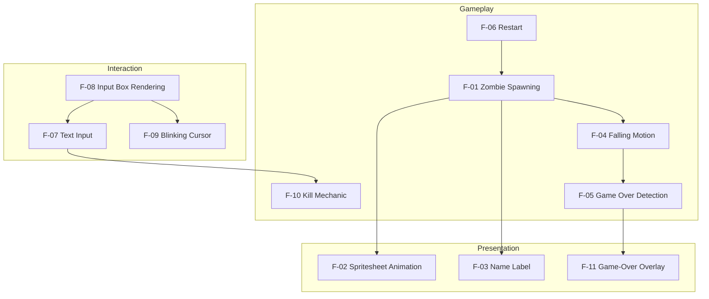
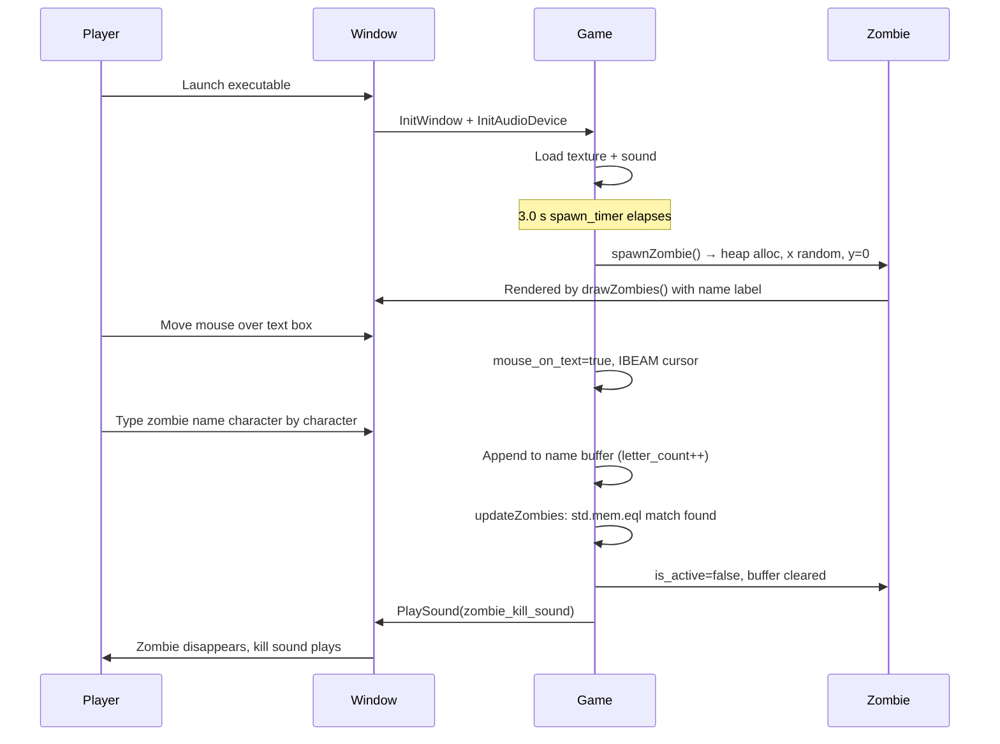
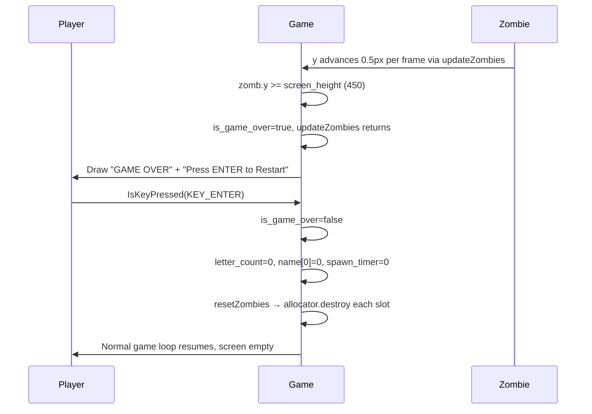
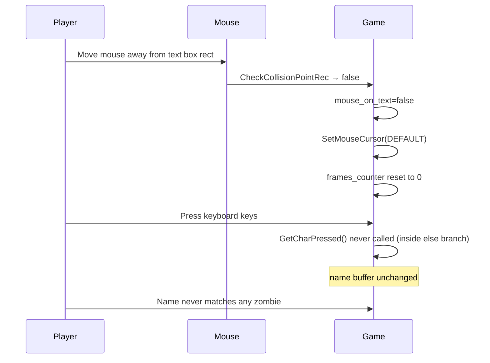
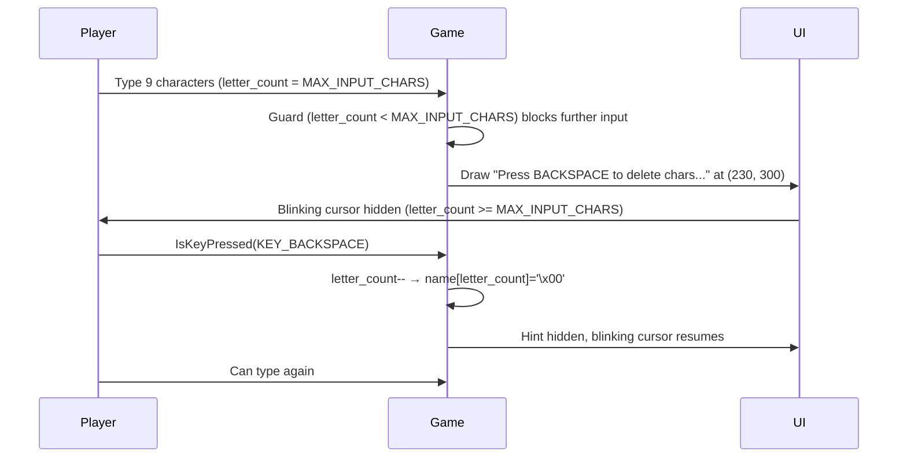
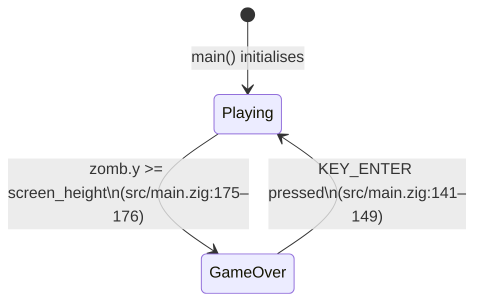
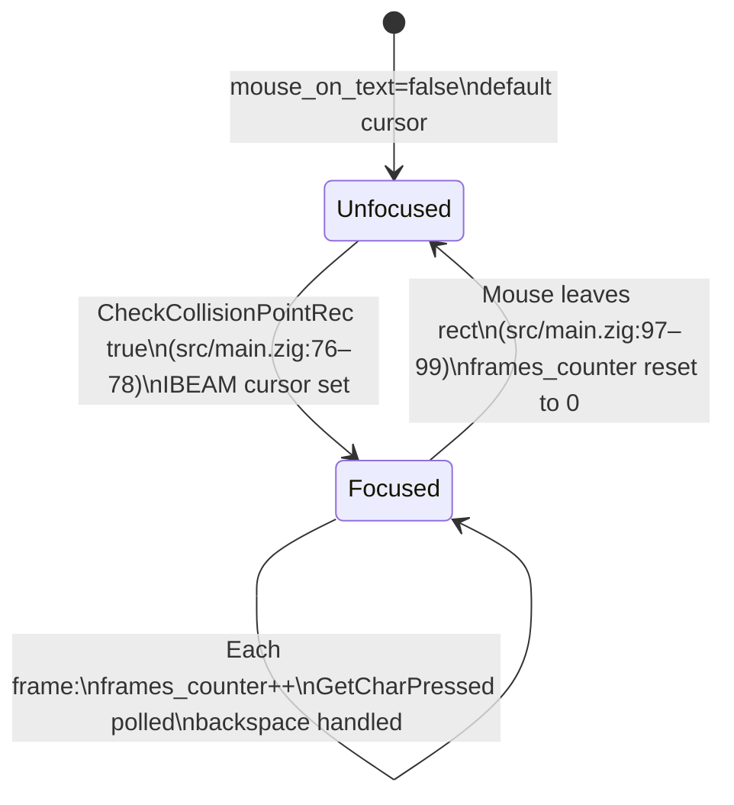

# Features

## Table of Contents

- [Feature Map](#feature-map)
- [Feature Catalog](#feature-catalog)
  - [F-01 Zombie Spawning](#f-01-zombie-spawning)
  - [F-02 Spritesheet Animation](#f-02-spritesheet-animation)
  - [F-03 Name Label Rendering](#f-03-name-label-rendering)
  - [F-04 Falling Motion](#f-04-falling-motion)
  - [F-05 Game Over Detection](#f-05-game-over-detection)
  - [F-06 Restart](#f-06-restart)
  - [F-07 Text Input](#f-07-text-input)
  - [F-08 Input Box Rendering](#f-08-input-box-rendering)
  - [F-09 Blinking Cursor](#f-09-blinking-cursor)
  - [F-10 Kill Mechanic](#f-10-kill-mechanic)
  - [F-11 Game-Over Overlay](#f-11-game-over-overlay)
- [User Journeys](#user-journeys)
  - [Journey 1: Successful Kill](#journey-1-successful-kill)
  - [Journey 2: Missed Zombie and Restart](#journey-2-missed-zombie-and-restart)
  - [Journey 3: Input Ignored Outside Text Box](#journey-3-input-ignored-outside-text-box)
  - [Journey 4: Buffer Full and Backspace](#journey-4-buffer-full-and-backspace)
- [State Machines](#state-machines)
  - [Game State](#game-state)
  - [Zombie Lifecycle State](#zombie-lifecycle-state)
  - [Input Focus State](#input-focus-state)
- [Business Rules](#business-rules)

---

## Feature Map

---

## Feature Catalog

### F-01 Zombie Spawning

**Description.** Every 3.0 seconds the game allocates a new `Zombie` struct on the heap and stores its pointer in the first available `null` slot of the fixed-size `zombies` pool. The zombie is initialised at a random horizontal position, at the top of the screen, with a fixed downward speed and a randomly-chosen display name drawn from the 49-entry `ZombieNames` array. If no free slot exists the spawn attempt is silently discarded.

**User-facing behavior.** New zombies appear at the top of the window approximately every 3 seconds at unpredictable horizontal positions, each labelled with a different first name.

**System behavior.**
- `spawn_timer` is incremented each frame with `raylib.GetFrameTime()` (`src/main.zig:109`).
- When `spawn_timer >= spawn_delay` (3.0 s), `spawnZombie` is called with `try` (`src/main.zig:113`).
- `spawnZombie` iterates `zombies[0..MAX_ZOMBIES]`; the first `null` slot is filled (`src/main.zig:261–282`).
- `allocator.create(Zombie)` allocates heap memory; `errdefer allocator.destroy` prevents leaks on failure (`src/main.zig:264–265`).
- Horizontal position is `intRangeLessThan(u32, 10, 750)` cast to `f32` (`src/main.zig:267`).
- Name index is `intRangeLessThan(usize, 0, ZombieNames.len)` (`src/main.zig:268`).
- `spawn_timer` is reset to `0.0` only when a slot was actually claimed; when the pool is full, the timer stays hot so spawns retry next frame as soon as a slot frees.

**Key source references.**
- `src/main.zig:7` — `MAX_ZOMBIES = 100`
- `src/main.zig:21–22` — `spawn_delay`, `spawn_timer`
- `src/main.zig:109–115` — timer increment and spawn trigger
- `src/main.zig:260–283` — `spawnZombie` function
- `src/zombie_names.zig:1` — `ZombieNames` array (49 entries)

**Dependencies.** Relies on the `ZombieNames` pool (F-03 for rendering), `std.heap.page_allocator` being available, and the `!is_game_over` guard at `src/main.zig:73`.

---

### F-02 Spritesheet Animation

**Description.** Each active zombie is rendered by slicing a single horizontal spritesheet (`assets/z_spritesheet.png`) into 17 equal-width frames. An internal per-zombie timer advances the frame index by one every 0.1 simulated seconds, looping back to frame 0 after frame 16. The sprite is scaled down to 20 % of its source size.

**User-facing behavior.** Each zombie on screen displays a continuously looping walk animation drawn from the shared spritesheet image.

**System behavior.**
- `drawZombies()` is called each frame when `!is_game_over` (`src/main.zig:152`).
- `deltaTime` is hardcoded to `1.0 / 60.0` — not obtained from `raylib.GetFrameTime()` (`src/main.zig:206`).
- `zomb.animationTimer += deltaTime` each call; when `>= 0.1` the frame advances (`src/main.zig:217–225`).
- Frame width is `zombie_texture.width / ZOMBIE_FRAME_COUNT` (integer divide, then `f32` cast) (`src/main.zig:228`).
- Source rect: `x = zomb.frame * frame_width`, `y = 0`, full texture height (`src/main.zig:230–235`).
- Destination rect: `width = frame_width * 0.2`, `height = texture_height * 0.2` (`src/main.zig:237–246`).
- `raylib.DrawTexturePro` renders with zero rotation and `WHITE` tint (`src/main.zig:238–250`).

**Key source references.**
- `src/main.zig:10` — `ZOMBIE_FRAME_COUNT = 17`
- `src/main.zig:60–61` — texture load/unload with `defer`
- `src/main.zig:205–257` — `drawZombies` function

**Dependencies.** Requires `zombie_texture` loaded at startup (F-01 for active zombies to exist).

---

### F-03 Name Label Rendering

**Description.** Each active zombie has its `name` field — a `[*:0]const u8` pointer directly into `ZombieNames` — drawn as text 20 pixels above the sprite's origin position, in `DARKGREEN` at font size 20.

**User-facing behavior.** The player sees a short first name floating above each zombie, which they must type to destroy it.

**System behavior.**
- Executed inside `drawZombies()` for every active zombie (`src/main.zig:205–257`).
- `text_pos.y = pos.y - 20.0` (`src/main.zig:253`).
- `raylib.DrawText(zomb.name, …, 20, raylib.DARKGREEN)` (`src/main.zig:254`).
- The name pointer is passed directly; no copy is made because `[*:0]const u8` is compatible with raylib's C string parameter.

**Key source references.**
- `src/main.zig:31` — `name: [*:0]const u8` field in `Zombie` struct
- `src/main.zig:253–254` — label draw call in `drawZombies`
- `src/zombie_names.zig:1` — source strings

**Dependencies.** F-01 (spawn sets the name pointer), F-02 (same draw loop).

---

### F-04 Falling Motion

**Description.** Every frame during the update phase, each active zombie's `y` coordinate is incremented by its `speed` value (fixed at 0.5 pixels per frame for all zombies). This moves zombies steadily downward from `y = 0` toward `y = screen_height`.

**User-facing behavior.** Zombies descend at a constant speed from the top of the window toward the bottom.

**System behavior.**
- `updateZombies()` is called each frame when `!is_game_over` (`src/main.zig:118`).
- Per-zombie: `zomb.y += zomb.speed` (`src/main.zig:172`).
- `speed` is always `0.5`; it is set at spawn time and never mutated (`src/main.zig:272`).
- If a zombie is `!is_active` the loop continues without updating it (`src/main.zig:171`).

**Key source references.**
- `src/main.zig:165–203` — `updateZombies` function
- `src/main.zig:172` — position increment
- `src/main.zig:272` — speed initialised at 0.5

**Dependencies.** F-01 (zombies must be spawned and active), F-05 (falling eventually triggers game over).

---

### F-05 Game Over Detection

**Description.** During each frame's update pass, if any active zombie's `y` position meets or exceeds `screen_height` (450), `is_game_over` is set to `true` and `updateZombies` returns immediately. This halts the entire update phase for the remainder of that frame and all subsequent frames until the player restarts.

**User-facing behavior.** When a zombie reaches the bottom of the screen the game freezes all zombie movement and displays the game-over screen.

**System behavior.**
- Inside `updateZombies`, after `zomb.y += zomb.speed`: `if (zomb.y >= screen_height)` → `is_game_over = true; return;` (`src/main.zig:175–177`).
- The `return` means zombies later in the pool array are not updated this frame.
- The main loop's `if (!is_game_over)` guard (`src/main.zig:73`) prevents any further update logic.
- Draw phase still runs; `drawZombies` is skipped in favour of the overlay (`src/main.zig:150–153`).

**Key source references.**
- `src/main.zig:24` — `is_game_over` declaration
- `src/main.zig:44` — `screen_height = 450`
- `src/main.zig:175–177` — detection and early return

**Dependencies.** F-04 (falling populates `y`), F-11 (overlay rendered when true), F-06 (cleared on restart).

---

### F-06 Restart

**Description.** While the game-over screen is displayed, pressing `KEY_ENTER` resets all mutable game state: the input buffer is cleared, `spawn_timer` is zeroed, `is_game_over` is set to `false`, and `resetZombies` frees and nulls every heap-allocated zombie in the pool.

**User-facing behavior.** The player presses Enter on the game-over screen and the game immediately resumes from a clean state with no zombies on screen.

**System behavior.**
- `raylib.IsKeyPressed(raylib.KEY_ENTER)` checked only when `is_game_over` is `true` (`src/main.zig:141`).
- `letter_count = 0; name[0] = '\x00'` clears the input buffer (`src/main.zig:143–144`).
- `spawn_timer = 0.0` resets the spawn countdown (`src/main.zig:145`).
- `resetZombies(&allocator)` iterates all slots: `allocator.destroy(z); zombie.* = null` for every non-null entry (`src/main.zig:285–292`).
- `is_game_over = false` re-enables the update phase (`src/main.zig:142`).

**Key source references.**
- `src/main.zig:141–149` — restart branch in main loop
- `src/main.zig:285–292` — `resetZombies` function

**Dependencies.** F-05 (restart is only reachable when game is over), F-11 (overlay must be visible for Enter to be processed here).

---

### F-07 Text Input

**Description.** Each frame the game reads characters from raylib's key-press queue and appends printable ASCII characters (codepoints 32–125) to the `name` buffer, up to a maximum of 9 characters. Backspace removes the last character. Input is accepted regardless of mouse position; the mouse-over state only controls the cursor icon and the blinking-underscore overlay (F-09).

**User-facing behavior.** The player types and characters appear in the text box. Backspace deletes the last character. Moving the mouse over the text box switches the cursor to an I-beam and shows the blinking underscore, but is not required to type.

**System behavior.**
- Mouse position checked each frame with `raylib.CheckCollisionPointRec` (`src/main.zig:76`).
- `mouse_on_text = true` and `MOUSE_CURSOR_IBEAM` set on hover (`src/main.zig:77–78`).
- `raylib.GetCharPressed()` polled in a `while (key > 0)` loop to drain the frame's key queue (`src/main.zig:80–90`).
- Guard: `(key >= 32) and (key <= 125) and (letter_count < MAX_INPUT_CHARS)` (`src/main.zig:84`).
- `name[letter_count] = @intCast(key)` appends the byte; `name[letter_count + 1] = '\x00'` maintains null termination (`src/main.zig:85–86`).
- Backspace: `IsKeyPressed(KEY_BACKSPACE) and letter_count > 0` → decrement and re-null-terminate (`src/main.zig:93–96`).
- Outside text box: `mouse_on_text = false`, `MOUSE_CURSOR_DEFAULT` (`src/main.zig:98–99`), `frames_counter` reset to 0 (`src/main.zig:105`).

**Key source references.**
- `src/main.zig:8` — `MAX_INPUT_CHARS = 9`
- `src/main.zig:14–15` — `name` buffer and `letter_count`
- `src/main.zig:76–100` — full input handling block

**Dependencies.** F-08 (text box rect defined there), F-09 (cursor blink uses `frames_counter` incremented here), F-10 (buffer content drives kill check).

---

### F-08 Input Box Rendering

**Description.** A fixed-size rectangle at screen position (300, 400) with dimensions 225 × 50 is filled with `LIGHTGRAY` and outlined in `RED` when the mouse is over it (focused) or `DARKGRAY` when not. The currently typed text is drawn inside the box at font size 40 in `MAROON`.

**User-facing behavior.** The player sees a rectangular input area near the bottom of the screen. The border turns red to indicate focus and the typed characters are displayed inside.

**System behavior.**
- `text_box` declared as `raylib.Rectangle{ .x = screen_width / 2.0 - 100.0, .y = 400.0, .width = 225.0, .height = 50.0 }` — evaluates to `x = 300` (`src/main.zig:63`).
- `raylib.DrawRectangleRec(text_box, raylib.LIGHTGRAY)` fills the box (`src/main.zig:126`).
- Conditional border: `RED` when `mouse_on_text`, `DARKGRAY` otherwise (`src/main.zig:127–131`).
- `raylib.DrawText(&name, text_box.x + 5, text_box.y + 8, 40, raylib.MAROON)` renders typed text (`src/main.zig:133`).

**Key source references.**
- `src/main.zig:63` — `text_box` rectangle declaration
- `src/main.zig:126–133` — box and text draw calls

**Dependencies.** F-07 (focus state and buffer content), F-09 (blinking cursor overlaid on this box).

---

### F-09 Blinking Cursor

**Description.** When the mouse is over the text box and the buffer has not yet reached its 9-character limit, a `"_"` character is drawn immediately after the typed text. Its visibility toggles on and off every 20 frames by evaluating `(frames_counter / 20) % 2 == 0`. When the buffer is full, the blinking cursor is suppressed and a `"Press BACKSPACE to delete chars..."` hint is shown instead.

**User-facing behavior.** An underscore blinks at the insertion point while the player is focused on the text box. At maximum capacity the blink stops and a backspace reminder appears.

**System behavior.**
- `frames_counter` incremented by 1 each frame while `mouse_on_text` is true; reset to 0 when focus is lost (`src/main.zig:102–106`).
- Cursor drawn when `mouse_on_text and letter_count < MAX_INPUT_CHARS and ((frames_counter / 20) % 2) == 0` (`src/main.zig:155`).
- X position: `text_box.x + 8 + raylib.MeasureText(&name, 40)` — appended after the last typed character (`src/main.zig:156`).
- Full-buffer hint drawn when `mouse_on_text and letter_count >= MAX_INPUT_CHARS` at fixed position (230, 300) (`src/main.zig:159–161`).

**Key source references.**
- `src/main.zig:65` — `frames_counter` declaration
- `src/main.zig:102–106` — counter increment/reset
- `src/main.zig:155–161` — cursor and hint draw conditions

**Dependencies.** F-07 (hover state and `letter_count`), F-08 (box position used for cursor placement).

---

### F-10 Kill Mechanic

**Description.** During the update phase, after each active zombie's position is advanced, the typed buffer is compared byte-for-byte against that zombie's name. A match causes the zombie to be marked inactive, the input buffer to be cleared, and the kill sound to be played. The zombie's heap allocation is not freed until restart; only `is_active` is set to `false`.

**User-facing behavior.** When the player correctly types an on-screen zombie name in full, the zombie disappears, a sound effect plays, and the text box is cleared.

**System behavior.**
- `typed_name = name[0..letter_count]` creates a slice of the buffer (`src/main.zig:181`).
- Zombie name length computed by scanning for `'\x00'` sentinel (`src/main.zig:184–187`).
- `std.mem.eql(u8, typed_name, zomb_name_slice)` performs the exact byte comparison (`src/main.zig:193`).
- On match: `zomb.is_active = false` (`src/main.zig:194`), `letter_count = 0; name[0] = '\x00'` (`src/main.zig:195–196`), `raylib.PlaySound(zombie_kill_sound)` (`src/main.zig:199`).
- Heap memory for the killed zombie is intentionally not freed here; only `resetZombies` frees all slots on restart.

**Key source references.**
- `src/main.zig:57–58` — sound load/unload with `defer`
- `src/main.zig:181–199` — match and kill block in `updateZombies`

**Dependencies.** F-07 (input buffer provides `typed_name`), F-01 (zombies must exist), F-06 (memory freed only on restart).

---

### F-11 Game-Over Overlay

**Description.** When `is_game_over` is `true`, the normal zombie draw pass is replaced by two centred text strings: `"GAME OVER"` in `RED` at font size 40, and `"Press ENTER to Restart"` in `GRAY` at font size 20, stacked vertically in the middle of the screen.

**User-facing behavior.** After losing, the player sees a large red game-over message and a grey instruction to press Enter.

**System behavior.**
- `drawZombies()` is guarded by `else` of the `if (is_game_over)` branch (`src/main.zig:150–153`); it is not called when game is over.
- `"GAME OVER"` drawn at `(screen_width / 2 - 100, screen_height / 2 - 20)` (`src/main.zig:137`).
- `"Press ENTER to Restart"` drawn at `(screen_width / 2 - 130, screen_height / 2 + 20)` (`src/main.zig:138`).
- Input box and blinking cursor are still rendered (those draw calls are outside the conditional block).

**Key source references.**
- `src/main.zig:135–153` — game-over conditional block

**Dependencies.** F-05 (sets `is_game_over = true`), F-06 (KEY_ENTER check lives inside this same block).

---

## User Journeys

### Journey 1: Successful Kill

### Journey 2: Missed Zombie and Restart

### Journey 3: Input Ignored Outside Text Box

### Journey 4: Buffer Full and Backspace

---

## State Machines

### Game State

### Zombie Lifecycle State

```mermaid
stateDiagram-v2
    [*] --> PoolSlotEmpty : zombies[] initialised undefined;\nnull slots = available
    PoolSlotEmpty --> Spawned : spawnZombie() allocates\nand sets is_active=true\n(src/main.zig:264–279)
    Spawned --> Killed : std.mem.eql match\nis_active=false\n(src/main.zig:193–194)
    Spawned --> ReachedBottom : zomb.y >= screen_height\n(src/main.zig:175)
    ReachedBottom --> GameOverState : is_game_over=true
    Killed --> Freed : resetZombies on restart\n(src/main.zig:285–292)
    Freed --> PoolSlotEmpty : zombie.*=null
    GameOverState --> Freed : KEY_ENTER → resetZombies
```

### Input Focus State

---

## Business Rules

The following rules reflect non-obvious constraints directly evidenced in `src/main.zig`.

**BR-01 — Input accepted regardless of mouse position.**
`GetCharPressed` and `IsKeyPressed(KEY_BACKSPACE)` are called every frame while `!is_game_over`, independent of the mouse-over hit test. The mouse-over state only controls the cursor icon (F-07) and the blinking-underscore overlay (F-09).

**BR-02 — Only printable ASCII accepted.**
The guard `(key >= 32) and (key <= 125)` filters out control characters, extended Unicode codepoints, and all non-printable values (`src/main.zig:84`).

**BR-03 — Hard cap of 9 characters.**
`MAX_INPUT_CHARS = 9` (`src/main.zig:8`). The same guard on line 84 enforces the cap: once `letter_count == 9` no further characters are appended.

**BR-04 — Match is byte-exact.**
`std.mem.eql(u8, typed_name, zomb_name_slice)` performs a case-sensitive, length-sensitive comparison with no normalisation (`src/main.zig:193`). One wrong character or extra space prevents a kill.

**BR-05 — Zombie name length computed at match time.**
There is no pre-computed length field; `updateZombies` scans for `'\x00'` on every frame for every active zombie (`src/main.zig:184–187`).

**BR-06 — Killed zombies are not freed until restart (intentional memory hold).**
`zomb.is_active = false` is the only mutation on kill (`src/main.zig:194`). `allocator.destroy` is never called for a killed zombie during normal play. Memory is only reclaimed by `resetZombies` on restart (`src/main.zig:285–292`). All 100 pool slots can therefore be occupied by killed-but-not-freed zombies over a long session.

**BR-07 — Pool full keeps spawn timer hot.**
`spawnZombie` iterates the pool looking for a `null` slot and returns `true` on claim, `false` when the pool is full. The caller only resets `spawn_timer` on a successful spawn, so a full pool retries every frame until a slot frees instead of silently stalling spawns.

**BR-08 — Spawn x is bounded to [10, 750), not [0, 800).**
`rng.random().intRangeLessThan(u32, 10, 750)` is used rather than the full screen width, leaving a 10-pixel margin at the left edge and a 50-pixel margin at the right (`src/main.zig:267`).

**BR-09 — Animation uses hardcoded deltaTime, not actual frame time.**
`drawZombies` sets `const deltaTime = 1.0 / 60.0` (`src/main.zig:206`) rather than calling `raylib.GetFrameTime()`. At frame rates other than 60 FPS the animation speed will be incorrect (too fast above 60 FPS, too slow below).

**BR-10 — Game-over short-circuits remaining zombie updates.**
`updateZombies` calls `return` immediately after setting `is_game_over = true` (`src/main.zig:177`). Zombies later in the pool array are not advanced or kill-checked on the triggering frame.

**BR-11 — `input_text` and `input_length` are declared but unused (dead state).**
`var input_text: [MAX_INPUT_CHARS]u8 = undefined` and `var input_length: usize = 0` are declared at module level (`src/main.zig:17–18`) but never read or written after declaration. They are inert globals with no effect on gameplay.
