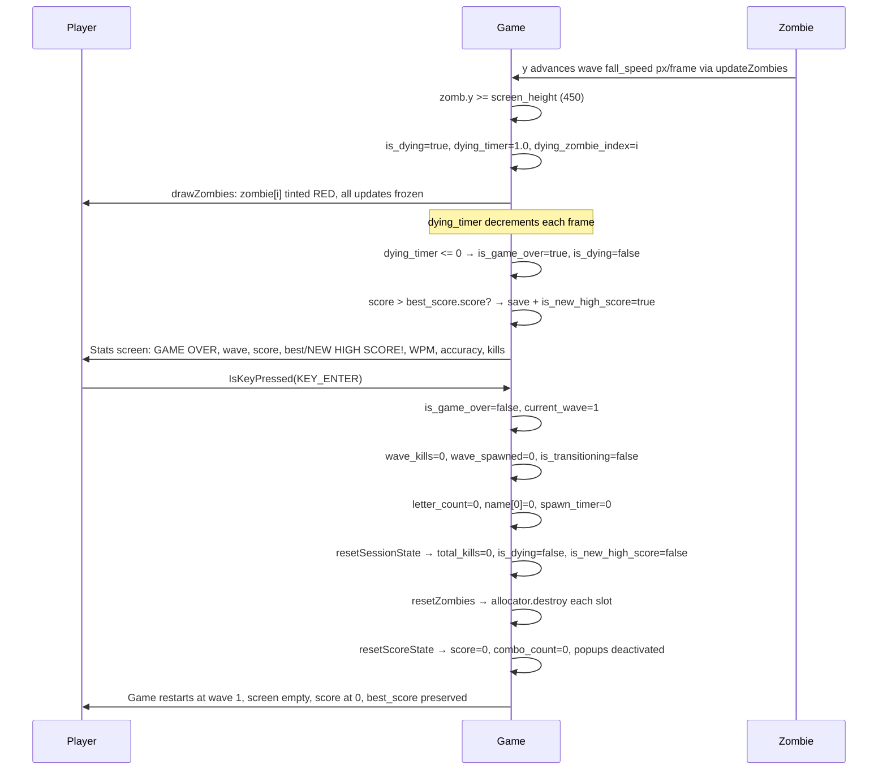
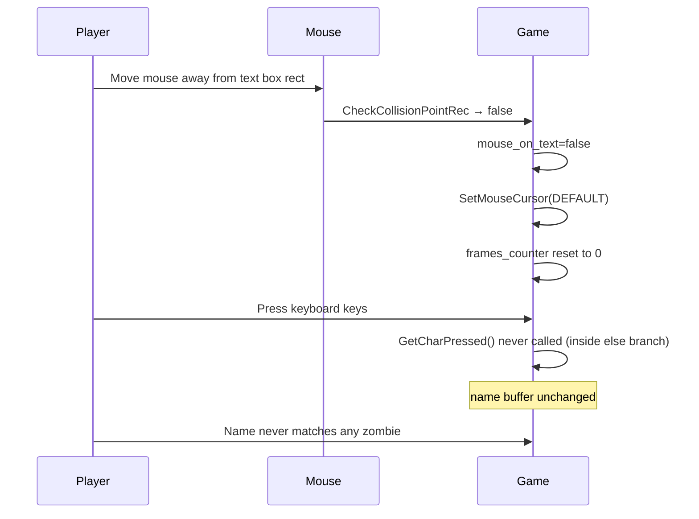
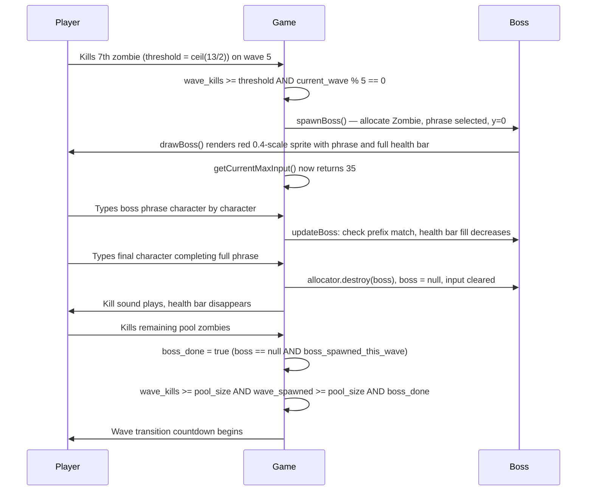
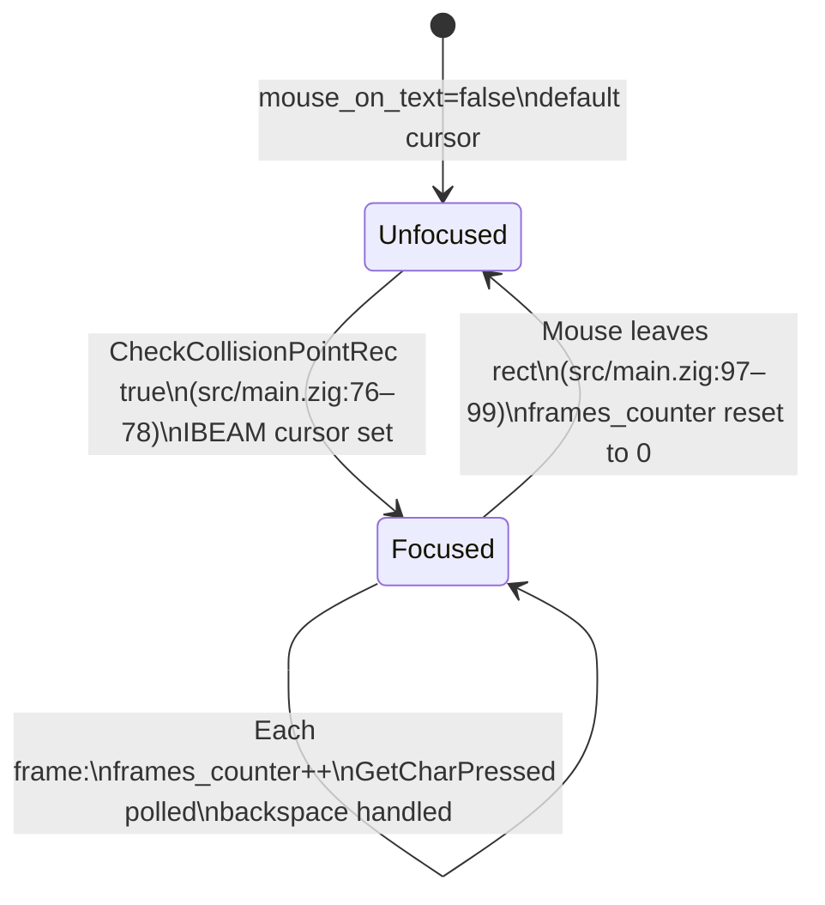

# Features

## Table of Contents

- [Feature Map](#feature-map)
- [Feature Catalog](#feature-catalog)
  - [F-01 Zombie Spawning](#f-01-zombie-spawning)
  - [F-02 Spritesheet Animation](#f-02-spritesheet-animation)
  - [F-03 Name Label Rendering](#f-03-name-label-rendering)
  - [F-04 Falling Motion](#f-04-falling-motion)
  - [F-05 Game Over Detection](#f-05-game-over-detection)
  - [F-06 Restart](#f-06-restart)
  - [F-07 Text Input](#f-07-text-input)
  - [F-08 Input Box Rendering](#f-08-input-box-rendering)
  - [F-09 Blinking Cursor](#f-09-blinking-cursor)
  - [F-10 Kill Mechanic](#f-10-kill-mechanic)
  - [F-11 Game-Over Overlay](#f-11-game-over-overlay)
  - [F-12 Wave HUD](#f-12-wave-hud)
  - [F-13 Wave Transition](#f-13-wave-transition)
  - [F-14 Endless Wave Scaling](#f-14-endless-wave-scaling)
  - [F-15 Boss Zombie Spawn](#f-15-boss-zombie-spawn)
  - [F-16 Boss Typing Mechanic](#f-16-boss-typing-mechanic)
  - [F-17 Boss Priority Over Regular Zombies](#f-17-boss-priority-over-regular-zombies)
  - [F-18 Boss Wave Completion Gate](#f-18-boss-wave-completion-gate)
  - [F-19 Per-Kill Scoring](#f-19-per-kill-scoring)
  - [F-20 Combo Counter](#f-20-combo-counter)
  - [F-21 Score and Combo HUD](#f-21-score-and-combo-hud)
  - [F-22 Floating Score Popup](#f-22-floating-score-popup)
  - [F-23 Score on Game-Over Screen](#f-23-score-on-game-over-screen)
  - [F-24 Live WPM HUD](#f-24-live-wpm-hud)
  - [F-25 Live Accuracy HUD](#f-25-live-accuracy-hud)
  - [F-26 Dying Transition](#f-26-dying-transition)
  - [F-27 High Score Persistence](#f-27-high-score-persistence)
  - [F-28 Zombie Type Differentiation](#f-28-zombie-type-differentiation)
- [User Journeys](#user-journeys)
  - [Journey 1: Successful Kill](#journey-1-successful-kill)
  - [Journey 2: Missed Zombie and Restart](#journey-2-missed-zombie-and-restart)
  - [Journey 3: Input Ignored Outside Text Box](#journey-3-input-ignored-outside-text-box)
  - [Journey 4: Buffer Full and Backspace](#journey-4-buffer-full-and-backspace)
  - [Journey 5: Wave Completion and Transition](#journey-5-wave-completion-and-transition)
  - [Journey 6: Boss Wave Encounter and Defeat](#journey-6-boss-wave-encounter-and-defeat)
- [State Machines](#state-machines)
  - [Game State](#game-state)
  - [Zombie Lifecycle State](#zombie-lifecycle-state)
  - [Input Focus State](#input-focus-state)
- [Business Rules](#business-rules)

---

## Feature Map

```mermaid
graph TB
    subgraph Gameplay
        Spawning["F-01 Zombie Spawning"]
        Falling["F-04 Falling Motion"]
        Killing["F-10 Kill Mechanic"]
        GameOver["F-05 Game Over Detection"]
        DyingTransition["F-26 Dying Transition"]
        Restart["F-06 Restart"]
        WaveSystem["F-14 Wave Progression"]
        WaveTransition["F-13 Wave Transition"]
        BossSpawn["F-15 Boss Zombie Spawn"]
        BossTyping["F-16 Boss Typing Mechanic"]
        BossPriority["F-17 Boss Priority"]
        BossGate["F-18 Boss Wave Completion Gate"]
    end

    subgraph Presentation
        Animation["F-02 Spritesheet Animation"]
        NameLabel["F-03 Name Label"]
        GameOverOverlay["F-11 Game-Over Stats Screen"]
        HUD["F-12 Wave HUD"]
        ScoreHUD["F-21 Score and Combo HUD"]
        ScorePopup["F-22 Score Popup"]
        GameOverScore["F-23 Score on Game-Over Screen"]
    end

    subgraph Scoring
        Scoring["F-19 Per-Kill Scoring"]
        Combo["F-20 Combo Counter"]
        WpmHUD["F-24 Live WPM HUD"]
        AccHUD["F-25 Live Accuracy HUD"]
        HighScore["F-27 High Score Persistence"]
    end

    subgraph Interaction
        TextBox["F-08 Input Box Rendering"]
        Keyboard["F-07 Text Input"]
        BlinkingCursor["F-09 Blinking Cursor"]
    end

    Spawning --> Falling
    Falling --> DyingTransition
    BossTyping --> DyingTransition
    DyingTransition --> GameOver
    Keyboard --> Killing
    GameOver --> GameOverOverlay
    Restart --> Spawning
    Restart --> WaveSystem
    Spawning --> Animation
    Spawning --> NameLabel
    TextBox --> Keyboard
    TextBox --> BlinkingCursor
    WaveSystem --> Spawning
    WaveSystem --> HUD
    Killing --> WaveTransition
    WaveTransition --> WaveSystem
    WaveTransition --> Keyboard
    WaveSystem --> BossSpawn
    BossSpawn --> BossTyping
    BossTyping --> Keyboard
    BossTyping --> BossPriority
    BossTyping --> BossGate
    BossGate --> WaveTransition
    Killing --> Scoring
    BossTyping --> Scoring
    Scoring --> Combo
    Scoring --> ScorePopup
    Scoring --> ScoreHUD
    Combo --> ScoreHUD
    WaveTransition --> Combo
    Restart --> Scoring
    GameOverOverlay --> GameOverScore
    GameOver --> HighScore
    Keyboard --> WpmHUD
    Keyboard --> AccHUD
    Combo --> AccHUD
    Restart --> WpmHUD
    Restart --> AccHUD
```

---

## Feature Catalog

### F-01 Zombie Spawning

**Description.** The game allocates a new `Zombie` struct on the heap and stores its pointer in the first available `null` slot of the fixed-size `zombies` pool. The zombie is initialised at a random horizontal position, at the top of the screen, with a type-adjusted fall speed, and a name selected from the expanded name lists in `name_lists.zig`. Spawning fires on a per-wave timer (inherited from `WaveConfig.spawn_delay`) and is capped at the current wave's `pool_size`. Killed zombie slots are freed immediately, so slots recycle within the same wave. If no free slot exists or name selection fails (all retries exhausted by anti-doublon), the spawn attempt is silently deferred to the next timer tick.

**User-facing behavior.** New zombies appear at the top of the window at intervals and speeds that increase with each wave. Each wave has a finite number of zombies to spawn. Zombie type variety increases across waves: only standard zombies appear in waves 1–3; runners and tanks are introduced gradually from wave 4 onward.

**System behavior.**
- `spawn_timer` is incremented each frame with `raylib.GetFrameTime()`.
- When `spawn_timer >= wave_cfg.spawn_delay` AND `wave_spawned < wave_cfg.pool_size`, `spawnZombie(allocator, prng.random())` is called.
- On a successful spawn, `spawn_timer = 0.0` and `wave_spawned += 1`.
- `spawnZombie` iterates `zombies[0..MAX_ZOMBIES]`; the first `null` slot is used.
- `selectZombieType(getSpawnWeights(current_wave), rng)` picks a `ZombieType` from `SPAWN_WEIGHT_TABLE` (waves 1–3: 100% standard; waves 4–6: 70/20/10; waves 7–10: 50/30/20; waves 11+: 40/30/30).
- Builds `active_names[]` from all currently active zombies' name pointers (for anti-doublon).
- `name_lists.selectName(wave, zombie_type, active_names, forced_group, rng)` applies `NAME_WEIGHT_TABLE` (wave-weighted category) and type-based length filtering (runners ≤5 chars, tanks ≥8 chars), then retries up to `MAX_SPAWN_RETRIES` (10) on collision; returns `null` on failure.
- If selection category is `.trap` and no cluster is active, sets `trap_cluster_group` and `trap_cluster_remaining` (1–2 extras); decrements remaining on subsequent spawns.
- `allocator.create(Zombie)` allocates heap memory; `errdefer allocator.destroy` prevents leaks on failure.
- Horizontal position: `raylib.GetRandomValue(ZOMBIE_SPAWN_X_MIN, ZOMBIE_SPAWN_X_MAX)` → [10, 749].
- Spawn speed: `getWaveConfig(current_wave).fall_speed × getSpeedMultiplier(zombie_type)` (1.0×/1.8×/0.5× for standard/runner/tank).

**Key source references.**
- `src/main.zig` — `MAX_ZOMBIES`, `MAX_SPAWN_RETRIES`, `SPAWN_WEIGHT_TABLE`, `NAME_WEIGHT_TABLE`, `ZOMBIE_SPAWN_X_MIN`, `ZOMBIE_SPAWN_X_MAX`, `trap_cluster_group`, `trap_cluster_remaining`
- `src/main.zig` — `spawnZombie`, `selectZombieType`, `getSpawnWeights`, `getNameWeights`, `getSpeedMultiplier`
- `src/name_lists.zig` — `PrimaryNames`, `CompoundNames`, `TrapGroups`, `selectName`

**Dependencies.** Relies on `name_lists.zig` for name selection (F-03 for rendering), `std.heap.page_allocator`, and the `!is_game_over and !is_transitioning and !is_dying` guard. Zombie type determines visual tint (F-28) and fall speed (F-04).

---

### F-02 Spritesheet Animation

**Description.** Each active zombie is rendered by slicing a single horizontal spritesheet (`assets/z_spritesheet.png`) into 17 equal-width frames. An internal per-zombie timer advances the frame index by one every 0.1 simulated seconds, looping back to frame 0 after frame 16. The sprite is scaled down to 20 % of its source size.

**User-facing behavior.** Each zombie on screen displays a continuously looping walk animation drawn from the shared spritesheet image.

**System behavior.**
- `drawZombies()` is called each frame when `!is_game_over` (`src/main.zig:152`).
- `deltaTime` is hardcoded to `1.0 / 60.0` — not obtained from `raylib.GetFrameTime()` (`src/main.zig:206`).
- `zomb.animationTimer += deltaTime` each call; when `>= 0.1` the frame advances (`src/main.zig:217–225`).
- Frame width is `zombie_texture.width / ZOMBIE_FRAME_COUNT` (integer divide, then `f32` cast) (`src/main.zig:228`).
- Source rect: `x = zomb.frame * frame_width`, `y = 0`, full texture height (`src/main.zig:230–235`).
- Destination rect: `width = frame_width * 0.2`, `height = texture_height * 0.2` (`src/main.zig:237–246`).
- `raylib.DrawTexturePro` renders with zero rotation and `WHITE` tint (`src/main.zig:238–250`).

**Key source references.**
- `src/main.zig:10` — `ZOMBIE_FRAME_COUNT = 17`
- `src/main.zig:60–61` — texture load/unload with `defer`
- `src/main.zig:205–257` — `drawZombies` function

**Dependencies.** Requires `zombie_texture` loaded at startup (F-01 for active zombies to exist).

---

### F-03 Name Label Rendering

**Description.** Each active zombie has its `name` field — a `[*:0]const u8` pointer into `name_lists.zig` arrays — drawn as text 20 pixels above the sprite's origin position, in `DARKGREEN` at font size 20. Names may be simple first names (e.g. `"Kai"`), compound hyphenated names (e.g. `"Jean-Pierre"`), or trap-group names that closely resemble others on screen.

**User-facing behavior.** The player sees a name floating above each zombie — first names in early waves, with compound hyphenated names appearing from wave 4 onward. Trap-group names in later waves look visually similar to each other, requiring careful reading.

**System behavior.**
- Executed inside `drawZombies()` for every active zombie.
- `text_pos.y = pos.y - 20.0`.
- `raylib.DrawText(zomb.name, …, 20, raylib.DARKGREEN)`.
- The name pointer is passed directly; no copy is made because `[*:0]const u8` is compatible with raylib's C string parameter.
- The hyphen character in compound names is rendered natively by raylib's `DrawText`.

**Key source references.**
- `src/main.zig` — `name: [*:0]const u8` field in `Zombie` struct
- `src/main.zig` — label draw call in `drawZombies`
- `src/name_lists.zig` — `PrimaryNames`, `CompoundNames`, `TrapGroups` source arrays

**Dependencies.** F-01 (spawn sets the name pointer), F-02 (same draw loop).

---

### F-04 Falling Motion

**Description.** Every frame during the update phase, each active zombie's `y` coordinate is incremented by its `speed` value. Speed is set at spawn time as `getWaveConfig(current_wave).fall_speed × getSpeedMultiplier(zombie_type)` and is never mutated after spawn. Standard zombies use the wave's base `fall_speed` (0.5–2.0 px/frame); runners move at 1.8× the base speed; tanks move at 0.5× the base speed.

**User-facing behavior.** Zombies descend at a constant per-wave speed, falling faster in higher waves.

**System behavior.**
- `updateZombies()` is called each frame when `!is_game_over and !is_transitioning` (`src/main.zig:138`).
- Per-zombie: `zomb.y += zomb.speed` (`src/main.zig:302`).
- `speed` is set once at spawn from `getWaveConfig(current_wave).fall_speed` (`src/main.zig:402`) and never mutated.
- If a zombie is `!is_active` the loop skips it (`src/main.zig:301`).

**Key source references.**
- `src/main.zig:298–332` — `updateZombies` function
- `src/main.zig:302` — position increment
- `src/main.zig:402` — speed set from wave config at spawn

**Dependencies.** F-01 (zombies must be spawned and active), F-05 (falling eventually triggers game over), F-14 (wave config determines fall_speed).

---

### F-05 Game Over Detection

**Description.** During each frame's update pass, if any active zombie's `y` position meets or exceeds `screen_height` (450), the game enters the dying state (`is_dying = true`, `dying_timer = DYING_DURATION`, `dying_zombie_index = slot_index`) and `updateZombies` returns immediately. The same check runs for the boss zombie in `updateBoss`, which sets `dying_zombie_index = null`. After the 1-second dying pause expires, `is_game_over` is set to `true` — at that point the high score comparison runs and the stats overlay is rendered.

**User-facing behavior.** When any zombie — including the boss — reaches the bottom of the screen the game pauses all movement for 1 second (the responsible regular zombie glows red), then the stats overlay appears.

**System behavior.**
- Inside `updateZombies`, after `zomb.y += zomb.speed`: `if (zomb.y >= screen_height)` → `is_dying = true; dying_timer = DYING_DURATION; dying_zombie_index = i; return;`.
- Inside `updateBoss`, after `b.y += b.speed`: `if (b.y >= screen_height)` → `is_dying = true; dying_timer = DYING_DURATION; dying_zombie_index = null; return;`.
- `is_dying` and `is_game_over` guards in the update phase prevent further movement, spawning, and input during both states.
- Draw phase still runs during `is_dying`; regular zombie draw applies a red tint to the zombie at `dying_zombie_index`.

**Key source references.**
- `src/main.zig` — `is_dying`, `dying_timer`, `dying_zombie_index` declarations
- `src/main.zig` — `DYING_DURATION = 1.0` constant
- `src/main.zig` — detection in `updateZombies` and `updateBoss`

**Dependencies.** F-04 (falling populates `y`), F-26 (dying transition state), F-11 (overlay rendered when `is_game_over` true), F-06 (cleared on restart).

---

### F-06 Restart

**Description.** While the game-over screen is displayed, pressing `KEY_ENTER` resets all mutable game state: the input buffer is cleared, `spawn_timer` is zeroed, wave state is returned to wave 1, `is_game_over` is set to `false`, `resetZombies` frees and nulls every heap-allocated zombie in the pool, and `resetBoss` frees any live boss allocation and resets boss state.

**User-facing behavior.** The player presses Enter on the game-over screen and the game immediately restarts from wave 1 with a clean state, no zombies on screen, and no active boss.

**System behavior.**
- `raylib.IsKeyPressed(raylib.KEY_ENTER)` checked only when `is_game_over` is `true`.
- `is_game_over = false` re-enables the update phase.
- `letter_count = 0; name[letter_count] = '\x00'` clears the input buffer.
- `spawn_timer = 0.0` resets the spawn countdown.
- Wave state reset: `current_wave = 1`, `wave_kills = 0`, `wave_spawned = 0`, `is_transitioning = false`, `transition_timer = 0.0`.
- `resetSessionState()` clears `total_kills = 0`, `is_dying = false`, `dying_timer = 0.0`, `dying_zombie_index = null`, `is_new_high_score = false`.
- `resetScoreState()` clears `score`, `combo_count`, `popup_next`, and deactivates all popup entries.
- `resetMetricsState()` zeroes WPM/accuracy tracking state.
- `resetZombies(ctx.allocator)` iterates all slots: `allocator.destroy(z); zombie.* = null` for every non-null entry.
- `resetBoss(ctx.allocator)` frees the boss allocation if non-null, sets `boss = null`, `boss_spawned_this_wave = false`, `boss_phrase_len = 0`.
- `best_score` is **not** reset — the persisted best score is carried across sessions for the lifetime of the process.

**Key source references.**
- `src/main.zig` — restart branch inside game-over block
- `src/main.zig` — `resetSessionState`, `resetZombies`, `resetBoss` functions

**Dependencies.** F-05 (restart is only reachable when game is over), F-11 (stats overlay must be visible for Enter to be processed here), F-27 (best_score preserved).

---

### F-07 Text Input

**Description.** Each frame the game reads characters from raylib's key-press queue and appends printable ASCII characters (codepoints 32–125) to the `name` buffer. The maximum buffer length is dynamic: 20 characters during normal play (up from 9; accommodates compound names up to 20 chars) and 35 characters while a boss is active (F-16). The hyphen character (codepoint 45) falls within the accepted range and is required for compound zombie names. Backspace removes the last character. Input is accepted regardless of mouse position; the mouse-over state only controls the cursor icon and the blinking-underscore overlay (F-09). Input is entirely disabled during wave transitions and the dying pause.

**User-facing behavior.** The player types and characters appear in the text box, including hyphens for compound names. Backspace deletes the last character. During the 3-second wave-transition countdown or the 1-second dying pause, typing is ignored. While a boss is active the buffer accepts up to 35 characters to accommodate boss phrases.

**System behavior.**
- Mouse position checked each frame with `raylib.CheckCollisionPointRec`.
- `mouse_on_text = true` and `MOUSE_CURSOR_IBEAM` set on hover; otherwise `false` and `MOUSE_CURSOR_DEFAULT`.
- Input processing gated by `if (!is_game_over and !is_transitioning and !is_dying)`.
- `raylib.GetCharPressed()` polled in a `while (key > 0)` loop to drain the frame's key queue.
- Guard: `(key >= 32) and (key <= 125) and (letter_count < getCurrentMaxInput())`.
- `getCurrentMaxInput()` returns `MAX_BOSS_INPUT_CHARS` (35) when `boss != null`, else `MAX_INPUT_CHARS` (20).
- `name[letter_count] = @intCast(key)` appends the byte; `name[letter_count + 1] = '\x00'` maintains null termination.
- Backspace: `IsKeyPressed(KEY_BACKSPACE) and letter_count > 0` → decrement and re-null-terminate.

**Key source references.**
- `src/main.zig` — `MAX_INPUT_CHARS = 20`
- `src/main.zig` — `name` buffer and `letter_count`
- `src/main.zig` — full input handling block (gated by `!is_game_over and !is_transitioning and !is_dying`)

**Dependencies.** F-08 (text box rect defined there), F-09 (cursor blink uses `frames_counter` incremented here), F-10 (buffer content drives kill check), F-13 (transition disables input).

---

### F-08 Input Box Rendering

**Description.** A rectangle centered near the bottom of the screen (width 500, x = `screen_width/2 - 250`, y = 400, height 50) is filled with `LIGHTGRAY` and outlined in `RED` when focused or `DARKGRAY` when not. The currently typed text is drawn inside the box at font size 40 in `MAROON`. While a boss is active the box widens to 700 pixels and recenters to accommodate the 35-character boss phrase limit.

**User-facing behavior.** The player sees a rectangular input area centered near the bottom of the screen. The border turns red to indicate focus and the typed characters are displayed inside, with enough width for compound names up to 20 characters. During boss encounters the box expands further.

**System behavior.**
- Default: `text_box.width = 500.0`, `text_box.x = screen_width / 2.0 - 250.0` (i.e. `x = 150`).
- Boss mode: `text_box.width = 700.0`, `text_box.x = (screen_width - 700.0) / 2.0` (i.e. `x = 50`). Switched each frame based on `boss != null`.
- `raylib.DrawRectangleRec(text_box, raylib.LIGHTGRAY)` fills the box.
- Conditional border: `RED` when `mouse_on_text`, `DARKGRAY` otherwise.
- `raylib.DrawText(&name, text_box.x + 5, text_box.y + 8, 40, raylib.MAROON)` renders typed text.

**Key source references.**
- `src/main.zig` — `text_box` rectangle, boss-mode width switching in `frame()`
- `src/main.zig` — box and text draw calls

**Dependencies.** F-07 (focus state and buffer content), F-09 (blinking cursor overlaid on this box).

---

### F-09 Blinking Cursor

**Description.** When the mouse is over the text box and the buffer has not yet reached its current character limit, a `"_"` character is drawn immediately after the typed text. Its visibility toggles on and off every 20 frames by evaluating `(frames_counter / 20) % 2 == 0`. When the buffer is full (at 20 normally or 35 during a boss encounter), the blinking cursor is suppressed and a `"Press BACKSPACE to delete chars..."` hint is shown instead.

**User-facing behavior.** An underscore blinks at the insertion point while the player is focused on the text box. At the current maximum capacity the blink stops and a backspace reminder appears.

**System behavior.**
- `frames_counter` incremented by 1 each frame while `mouse_on_text` is true; reset to 0 when focus is lost.
- Cursor drawn when `mouse_on_text and letter_count < getCurrentMaxInput() and ((frames_counter / 20) % 2) == 0`.
- X position: `text_box.x + 8 + raylib.MeasureText(&name, 40)` — appended after the last typed character.
- Full-buffer hint drawn when `mouse_on_text and letter_count >= getCurrentMaxInput()` at fixed position (230, 300).

**Key source references.**
- `src/main.zig:65` — `frames_counter` declaration
- `src/main.zig:102–106` — counter increment/reset
- `src/main.zig:155–161` — cursor and hint draw conditions

**Dependencies.** F-07 (hover state and `letter_count`), F-08 (box position used for cursor placement).

---

### F-10 Kill Mechanic

**Description.** During the update phase, after each active zombie's position is advanced, the typed buffer is compared byte-for-byte against that zombie's name. A match causes the zombie's heap memory to be freed immediately, the slot set to `null`, the input buffer to be cleared, and the kill sound to be played. The freed slot is immediately available for a new spawn in the same wave.

**User-facing behavior.** When the player correctly types an on-screen zombie name in full, the zombie disappears, a sound effect plays, and the text box is cleared. Compound hyphenated names (e.g. `"Jean-Pierre"`) require the hyphen to be typed as part of the name.

**System behavior.**
- `typed_name = name[0..letter_count]` creates a slice of the buffer.
- Zombie name length computed by scanning for `'\x00'` sentinel.
- `std.mem.eql(u8, typed_name, zomb_name_slice)` performs the exact byte comparison.
- On match: `allocator.destroy(zomb)`, `slot.* = null` (slot immediately freed for reuse), `letter_count = 0; name[0] = '\x00'`, `wave_kills += 1`, `total_kills += 1`, `raylib.PlaySound(zombie_kill_sound)`.
- Score and combo are updated, and a floating popup is spawned at the kill position (F-19, F-22).

**Key source references.**
- `src/main.zig:57–58` — sound load/unload with `defer`
- `src/main.zig:181–199` — match and kill block in `updateZombies`

**Dependencies.** F-07 (input buffer provides `typed_name`), F-01 (zombies must exist), F-06 (memory freed only on restart).

---

### F-11 Game-Over Stats Screen

**Description.** When `is_game_over` is `true`, the normal zombie draw pass is replaced by a full-screen stats overlay showing eight lines of text. The overlay is displayed after the 1-second dying transition (F-26) completes. It gives the player a detailed summary of their session performance and shows whether they set a new high score.

**User-facing behavior.** After the dying pause, the player sees a red "GAME OVER" title followed by six stat lines (wave, score, best/new high score, average WPM, accuracy, kills) and a gray restart prompt at the bottom.

**System behavior.**
- `drawZombies()` is not called when `is_game_over` is `true`; the stats overlay replaces the normal draw pass.
- `"GAME OVER"` drawn centered at `y = STATS_TITLE_Y` (30), font size 48, color `RED`.
- Starting at `y = STATS_LINE_START_Y` (80) with `STATS_LINE_SPACING` (35) px vertical spacing, six stat lines in font size `STATS_FONT_SIZE` (24), color `DARKGRAY`, via the `drawCenteredStat` helper:
  - `"Wave reached: N"` — current wave number.
  - `"Score: N"` — final accumulated session score.
  - `"NEW HIGH SCORE!"` in `GOLD` (if `is_new_high_score`) **or** `"Best: N"` (`DARKGRAY`) showing `best_score.score`.
  - `"Average WPM: N"` — result of `calculateAverageWpm()`: `(correct_chars / 5) / (elapsed_time / 60)`, returns 0 when `elapsed_time < 1 s`.
  - `"Accuracy: N%"` — result of `calculateStatsAccuracy()`: `(correct_chars * 100) / (correct_chars + wrong_chars)`, returns 0 when total is 0.
  - `"Kills: N"` — total session kill count (`total_kills`, counting both regular zombies and boss).
- `"Press ENTER to restart"` drawn centered at fixed `y = 405`, font size 18, color `GRAY`.

**Key source references.**
- `src/main.zig` — game-over draw block
- `src/main.zig` — `drawCenteredStat` helper (wraps `drawCenteredText` + `y` advance)
- `src/main.zig` — `calculateAverageWpm`, `calculateStatsAccuracy` functions
- `src/main.zig` — `STATS_TITLE_Y`, `STATS_LINE_START_Y`, `STATS_LINE_SPACING`, `STATS_FONT_SIZE` constants

**Dependencies.** F-05 (sets `is_game_over = true` after dying timer), F-06 (KEY_ENTER check inside this block), F-26 (dying transition feeds into this state), F-27 (best score loaded and shown here).

---

### F-12 Wave HUD

**Description.** A single line of text is rendered centered at the top of the screen every frame while the game is not in the game-over state. It shows the current wave number, the wave's target WPM, and the player's kill count against the wave's pool size.

**User-facing behavior.** The player always sees a status line such as `"WAVE 5 — 30 WPM — 7 / 13"` near the top of the screen, updating in real time as they kill zombies.

**System behavior.**
- Rendered inside the draw phase when `!is_game_over` (`src/main.zig:167`).
- `getWaveConfig(current_wave)` is called to retrieve `target_wpm` and `pool_size` (`src/main.zig:168`).
- Text is formatted via `std.fmt.bufPrintZ` into a 64-byte stack buffer (`src/main.zig:170`): `"WAVE {d} — {d} WPM — {d} / {d}"`.
- Rendered centered at `y = 10`, font size 20, color `DARKGRAY` via `drawCenteredText` (`src/main.zig:171`).
- `wave_kills` is the live kill counter, incremented in `updateZombies` on each kill (`src/main.zig:327`).

**Key source references.**
- `src/main.zig:167–172` — HUD draw block
- `src/main.zig:414–417` — `drawCenteredText` helper

**Dependencies.** F-10 (kill increments `wave_kills`), F-14 (wave config provides WPM and pool size).

---

### F-13 Wave Transition

**Description.** When a wave is complete, the game enters a 3-second transition state. Completion requires all zombies spawned and killed; on boss waves (multiples of 5) it additionally requires the boss to be defeated. During this state no zombies spawn, existing zombies do not move, input is ignored, and a centered countdown message is displayed. When the timer expires the next wave begins automatically.

**User-facing behavior.** After clearing all zombies — and the boss on boss waves — the player sees a message like `"WAVE 2 — 18 WPM challenge — 3..."` that counts down from 3 to 1, then the next wave begins.

**System behavior.**
- Wave completion detected when:
  ```
  const boss_done = if (current_wave % 5 == 0) boss == null and boss_spawned_this_wave else true;
  wave_kills >= wave_cfg.pool_size and wave_spawned >= wave_cfg.pool_size and boss_done
  ```
- On completion: `is_transitioning = true`, `transition_timer = WAVE_TRANSITION_DURATION` (3.0 s).
- Each frame while `is_transitioning`: `transition_timer -= raylib.GetFrameTime()`.
- When `transition_timer <= 0`: `current_wave += 1`, `wave_kills = 0`, `wave_spawned = 0`, `spawn_timer = 0.0`, `is_transitioning = false`, `resetZombies` called, `resetBoss` called.
- Transition screen text: `"WAVE {next} — {wpm} WPM challenge — {ceil(timer)}..."` drawn centered at `y = screen_height / 2 - 15`, font size 30, `DARKGRAY`.
- Input guard `!is_transitioning` prevents keystroke processing during the countdown.

**Key source references.**
- `src/main.zig:141–144` — wave completion detection and transition start
- `src/main.zig:148–158` — transition countdown and wave advance
- `src/main.zig:212–219` — transition screen draw

**Dependencies.** F-01 (spawn halted during transition), F-07 (input gated by `!is_transitioning`), F-12 (HUD hidden during game-over but shown during transition), F-14 (wave config for next wave WPM).

---

### F-14 Endless Wave Scaling

**Description.** Waves 1–15 use explicit difficulty parameters from the `WAVE_TABLE` compile-time array. Waves 16 and beyond use a formula: `target_wpm = 110`, `spawn_delay = 0.66 s`, `fall_speed = 2.0`, and `pool_size = 33 + 2 * (wave - 15)`. This means the game has no hard end — it continues indefinitely with growing zombie pools at maximum speed.

**User-facing behavior.** After wave 15, difficulty stops increasing in speed and spawn rate but the number of zombies per wave grows by two every wave, creating an endurance test.

**System behavior.**
- `getWaveConfig(wave: u32) WaveConfig` returns `WAVE_TABLE[wave - 1]` for waves 1–15 (`src/main.zig:420`).
- For `wave > 15` (i.e., `wave > WAVE_TABLE.len`): returns `WaveConfig{ .target_wpm = 110, .spawn_delay = 0.66, .fall_speed = 2.0, .pool_size = 33 + 2 * (wave - 15) }` (`src/main.zig:423–428`).
- `WAVE_TABLE` is a compile-time `[15]WaveConfig` constant (`src/main.zig:14–30`).

**Key source references.**
- `src/main.zig:14–30` — `WAVE_TABLE` compile-time array (waves 1–15)
- `src/main.zig:419–429` — `getWaveConfig` function with scaling formula

**Dependencies.** F-01 (spawn uses `wave_cfg.spawn_delay` and `pool_size`), F-04 (fall speed from `wave_cfg.fall_speed`), F-12 (HUD reads `target_wpm`), F-13 (transition shows next wave WPM).

---

### F-15 Boss Zombie Spawn

**Description.** On every wave that is a multiple of 5 (waves 5, 10, 15, 20, …), a single boss zombie is spawned when the number of pool kills reaches `ceil(pool_size / 2)` — implemented as `(pool_size + 1) / 2`. The boss occupies a dedicated `?*Zombie` pointer (`boss`) outside the regular zombie pool. Only one boss can be active at a time per wave.

**User-facing behavior.** After killing roughly half the zombies on a 5th-multiple wave, a visually distinct boss appears at the top-center of the screen and begins falling. It displays a multi-word phrase the player must type.

**System behavior.**
- Each frame, after `updateZombies` and before the wave-completion check, if `current_wave % 5 == 0 and !boss_spawned_this_wave and boss == null`:
  - Compute `threshold = (wave_cfg.pool_size + 1) / 2`.
  - If `wave_kills >= threshold`, call `spawnBoss(ctx.allocator) catch {}`.
- `spawnBoss` allocates a `Zombie` via `allocator.create(Zombie)` with `errdefer allocator.destroy`, sets `x = screen_width / 2.0 - 30.0`, `y = 0.0`, `speed = getWaveConfig(current_wave).fall_speed * BOSS_SPEED_MULTIPLIER` (0.5×), and selects a random phrase from `BossPhrases`.
- `boss_spawned_this_wave = true`; `boss_phrase_len` is precomputed by scanning to null terminator.
- `resetBoss(allocator)` frees the boss pointer if non-null and resets `boss_spawned_this_wave` and `boss_phrase_len` — called on wave transition and game restart.

**Key source references.**
- `src/main.zig` — `BOSS_SPEED_MULTIPLIER = 0.5`, `boss`, `boss_spawned_this_wave`, `boss_phrase_len` globals
- `src/main.zig` — `spawnBoss`, `resetBoss` functions
- `src/boss_phrases.zig:1` — `BossPhrases` array (10 entries)

**Dependencies.** F-14 (wave number and pool_size from `getWaveConfig`), F-16 (boss must exist to be killed), F-18 (wave gate depends on boss state).

---

### F-16 Boss Typing Mechanic

**Description.** While a boss is active, the input buffer's effective character limit extends from 20 to 35 to accommodate multi-word boss phrases. The player types the boss phrase character by character; a health bar above the boss reflects typing progress. Typing the complete phrase destroys the boss, clears the input, and reverts the limit to 20.

**User-facing behavior.** The boss displays a multi-word phrase in dark red above its sprite. A health bar below the phrase shrinks as the player types correctly. Completing the phrase destroys the boss with the kill sound. Backspace undoes the last character and expands the health bar.

**System behavior.**
- `getCurrentMaxInput()` returns `MAX_BOSS_INPUT_CHARS` (35) when `boss != null`, else `MAX_INPUT_CHARS` (20). The character-append guard and cursor/hint thresholds use this helper.
- `updateBoss` (called each frame when `!is_game_over and !is_transitioning`): advances `b.y += b.speed`; if `b.y >= screen_height` sets `is_game_over = true` (F-05). Checks if `name[0..letter_count]` is a valid prefix of the boss phrase; if `letter_count == boss_phrase_len` and the phrase matches: calls `allocator.destroy(b)`, sets `boss = null`, clears input, plays `zombie_kill_sound`. Does not increment `wave_kills`.
- `drawBoss`: renders the boss sprite at `BOSS_SCALE` (0.4) with `RED` tint; draws phrase text at font size 20 in dark red (`r=139, g=0, b=0`); draws a 200 × 8 px health bar (light-gray background, red fill proportional to remaining untyped characters, dark-gray border).

**Key source references.**
- `src/main.zig` — `MAX_BOSS_INPUT_CHARS = 35`, `BOSS_SCALE = 0.4`, `BOSS_HEALTH_BAR_WIDTH = 200`, `BOSS_HEALTH_BAR_HEIGHT = 8`
- `src/main.zig` — `getCurrentMaxInput()`, `updateBoss`, `drawBoss`
- `src/boss_phrases.zig:1` — 10 boss phrases (all lowercase with spaces, ≤ 35 characters)

**Dependencies.** F-15 (boss must be spawned), F-07 (input guard uses `getCurrentMaxInput`), F-09 (cursor/hint guard uses `getCurrentMaxInput`), F-18 (boss kill enables wave completion).

---

### F-17 Boss Priority Over Regular Zombies

**Description.** While a boss is active and the player's typed input is a valid prefix of the boss phrase, the regular zombie kill check is skipped for all regular zombies that frame. This prevents accidentally killing a regular zombie whose name matches the start of the boss phrase.

**User-facing behavior.** While typing a boss phrase, regular zombies with names matching the typed text are not destroyed. The player must complete or backspace past the boss phrase prefix before killing those zombies.

**System behavior.**
- In `updateZombies`, before the `std.mem.eql` kill check for each regular zombie, if `boss != null`: compute `boss_slice = b.name[0..boss_phrase_len]`; if `letter_count <= boss_phrase_len and std.mem.eql(u8, typed_name, boss_slice[0..letter_count])`, skip (`continue`) this zombie.
- When no boss is active the guard is skipped and regular matching proceeds normally.

**Key source references.**
- `src/main.zig` — boss priority guard in `updateZombies`

**Dependencies.** F-10 (regular zombie kill mechanic), F-15 (boss must exist), F-16 (boss phrase reference needed for prefix check).

---

### F-18 Boss Wave Completion Gate

**Description.** On boss waves (multiples of 5), the wave transition does not start until both the full zombie pool is cleared and the boss is defeated. On non-boss waves the completion condition is unchanged.

**User-facing behavior.** After killing all pool zombies on wave 5, 10, 15, etc., the wave does not end until the player also defeats the boss. The wave countdown only begins once both conditions are met.

**System behavior.**
- The wave completion check adds: `const boss_done = if (current_wave % 5 == 0) boss == null and boss_spawned_this_wave else true;` The existing `wave_kills >= pool_size and wave_spawned >= pool_size` condition is ANDed with `boss_done`.
- Before the boss spawns (`!boss_spawned_this_wave`): `boss_done = false`, so premature completion is blocked.
- After boss spawn but before boss kill: `boss != null`, so `boss_done = false`.
- After boss kill: `boss == null and boss_spawned_this_wave = true`, so `boss_done = true`.
- `resetBoss` resets `boss_spawned_this_wave = false` on each wave transition and restart.

**Key source references.**
- `src/main.zig` — `boss_done` computation and wave completion check in `frame()`
- `src/main.zig` — `resetBoss` called in wave transition and restart blocks

**Dependencies.** F-13 (wave transition triggered by this check), F-15 (boss spawn), F-16 (boss kill clears `boss`).

---

### F-19 Per-Kill Scoring

**Description.** Each time the player destroys an enemy — whether a standard zombie or a boss — the system calculates a score for that kill and adds it to a running 64-bit total. The formula is: `round((name_length × 10 + round(100 × y_position / screen_height)) × type_multiplier) × combo_multiplier`. Standard zombies use `type_multiplier = 1.0`; the boss uses `type_multiplier = 3.0`. The combo multiplier is supplied by the current combo tier (F-20). The score is stored as `var score: u64` at module scope and resets to 0 on game restart.

**User-facing behavior.** Each kill increases the player's displayed score. Kills at the bottom of the screen are worth more than kills at the top. Boss kills are worth three times the base score. Higher combo multipliers amplify all of these effects.

**System behavior.**
- At each zombie kill site in `updateZombies` (`src/main.zig:417–420`): name length scanned, `calculateScore(name_len, zomb.y, false, combo_count)` called, result added to `score`, `combo_count` incremented, `spawnPopup` called.
- At the boss kill site in `updateBoss` (`src/main.zig:539–542`): `calculateScore(boss_phrase_len, b.y, true, combo_count)` called with the same pattern.
- `calculateScore(name_len, y_pos, is_boss, combo)` (`src/main.zig:692–697`): computes `type_mult` (3.0 for boss, 1.0 otherwise), `height_score = round(100 × y_pos / screen_height)`, `base = name_len × 10 + height_score`, returns `round(base × type_mult) × getComboMultiplier(combo)`.
- `score` reset to 0 in the `resetScoreState` helper called by the restart handler.

**Key source references.**
- `src/main.zig:32–33` — `BOSS_TYPE_MULTIPLIER = 3.0`, `STANDARD_TYPE_MULTIPLIER = 1.0`
- `src/main.zig:77` — `var score: u64 = 0`
- `src/main.zig:692–697` — `calculateScore` function
- `src/main.zig:686–689` — `resetScoreState` function

**Dependencies.** F-10 (zombie kill triggers score), F-16 (boss kill triggers score), F-20 (combo multiplier input), F-22 (popup spawn), F-23 (final score displayed on game over).

---

### F-20 Combo Counter

**Description.** The combo counter tracks consecutive successful kills. It increments by 1 on every kill (standard or boss). It resets to 0 when the player types a character that does not match the beginning of any active enemy's name or phrase. It also resets to 0 at the start of each wave transition. Pressing Backspace does not reset the combo.

**User-facing behavior.** Players who chain kills without typing mismatched characters accumulate a multiplier (x1–x5) that amplifies their score. Typing a wrong character instantly breaks the chain. Starting a new wave also breaks the chain.

**System behavior.**
- `var combo_count: u32 = 0` (`src/main.zig:78`).
- Incremented by 1 at each kill site (zombie: `src/main.zig:419`; boss: `src/main.zig:541`).
- Mismatch detection runs inside the `while (key > 0)` input loop — once per printable keypress. While the buffer has room, `typedMatchesAnyEnemy()` is called: if it returns `false`, `combo_count = 0` is set immediately and `wrong_chars` is incremented (F-25). If the buffer is already full (`letter_count >= getCurrentMaxInput()`), the additional keypress is also classified as wrong (`combo_count = 0`, `wrong_chars += 1`) per FR-001. `typedMatchesAnyEnemy()` returns `true` if `letter_count == 0` or the typed text is a prefix of any active zombie name or the boss phrase.
- Wave-transition reset: `combo_count = 0` is set when `is_transitioning` becomes `true`.
- Backspace does not trigger the mismatch check; the combo is preserved on backspace.
- `getComboMultiplier(combo)` (`src/main.zig:671–677`): 0–4→x1, 5–9→x2, 10–14→x3, 15–19→x4, 20+→x5.
- Reset to 0 in `resetScoreState` on game restart.

**Key source references.**
- `src/main.zig:78` — `var combo_count: u32 = 0`
- `src/main.zig:171–173` — mismatch detection and reset
- `src/main.zig:210` — wave-transition reset
- `src/main.zig:671–677` — `getComboMultiplier` function
- `src/main.zig:704–720` — `typedMatchesAnyEnemy` function

**Dependencies.** F-10 (kill increments combo), F-13 (wave transition resets combo), F-19 (combo feeds score formula), F-21 (combo displayed in HUD).

---

### F-21 Score and Combo HUD

**Description.** Two persistent text lines appear at the top-left of the screen throughout active gameplay. The first shows the running score; the second shows the combo count and active multiplier. The combo line's color changes based on the current combo tier.

**User-facing behavior.** The player always sees their current score and combo tier at a glance. The combo line changes from dark gray to orange at combo 5, and from orange to red at combo 15.

**System behavior.**
- Score line rendered at `(SCORE_HUD_X=10, SCORE_HUD_Y=5)`, font size `SCORE_HUD_SIZE=24`, color `DARKGREEN`, formatted as `"Score: {d}"` via `std.fmt.bufPrintZ` (`src/main.zig:248–250`).
- Combo line rendered at `(COMBO_HUD_X=10, COMBO_HUD_Y=35)`, font size `COMBO_HUD_SIZE=18`, formatted as `"Combo: {d} x{d}"` (`src/main.zig:252–254`).
- `getComboColor(combo)` (`src/main.zig:679–684`): combo ≥ 15 → `RED`, combo ≥ 5 → `ORANGE`, otherwise `DARKGRAY`.
- Both lines rendered inside the `!is_game_over` draw block, after the wave HUD.

**Key source references.**
- `src/main.zig:25–30` — HUD position and size constants
- `src/main.zig:248–254` — score and combo draw calls
- `src/main.zig:679–684` — `getComboColor` function

**Dependencies.** F-19 (score value), F-20 (combo count and multiplier), F-12 (HUD ordering in draw block).

---

### F-22 Floating Score Popup

**Description.** When any enemy is destroyed, a gold "+{score}" text popup appears at the enemy's screen position. The popup rises upward by 30 pixels and fades from full opacity to invisible over 0.5 seconds with linear interpolation. Popups are managed in a fixed pool of 32 entries; when the pool is full the oldest entry is recycled (circular overwrite).

**User-facing behavior.** Each kill produces a brief floating number at the kill location, giving immediate contextual feedback on the points earned. Multiple popups can be visible at once and each fades independently.

**System behavior.**
- `var popups: [MAX_POPUPS]ScorePopup` (`src/main.zig:79`), all initialised inactive. `var popup_next: usize = 0` (`src/main.zig:80`) is the circular write index.
- `spawnPopup(x, y, points)` (`src/main.zig:699–701`): writes to `popups[popup_next]` with `active=true, timer=POPUP_DURATION`, advances `popup_next = (popup_next + 1) % MAX_POPUPS`.
- Popup timer update in the update phase of `frame()`, outside the `!is_game_over` gate so popups continue fading on the game-over screen: each active popup has `timer -= GetFrameTime()`; when `timer <= 0`, `active = false`.
- `drawPopups()` (`src/main.zig:721–736`): for each active popup, computes `progress = 1 - (timer / POPUP_DURATION)`, `draw_y = y - POPUP_RISE_PX × progress`, `alpha = (timer / POPUP_DURATION) × 255`, formats `"+{d}"` text, draws with `raylib.DrawText` in gold color (`r=255, g=203, b=0, a=alpha`).

**Key source references.**
- `src/main.zig:22–24` — `MAX_POPUPS=32`, `POPUP_DURATION=0.5`, `POPUP_RISE_PX=30.0`
- `src/main.zig:79–80` — popup pool and write-index declarations
- `src/main.zig:93–98` — `ScorePopup` struct definition
- `src/main.zig:699–701` — `spawnPopup` function
- `src/main.zig:721–736` — `drawPopups` function

**Dependencies.** F-19 (points value from `calculateScore`), F-10 / F-16 (kill events spawn popups).

---

### F-23 Score on Game-Over Screen

**Description.** The accumulated session score is one of the six stat lines displayed on the game-over stats screen (F-11). It appears as the second line, formatted as `"Score: N"`. The score resets to 0 when the player presses Enter to restart.

**User-facing behavior.** After losing, the player sees their final score prominently on the stats screen. Starting a new game always begins at score 0.

**System behavior.**
- Rendered by the `drawCenteredStat("Score: {d}", .{score}, &line_y)` call inside the `is_game_over` draw block.
- Score reset is handled by `resetScoreState` called from the restart handler; sets `score = 0`, `combo_count = 0`, `popup_next = 0`, and deactivates all popup pool entries.

**Key source references.**
- `src/main.zig` — `"Score: {d}"` line in the game-over stats draw block
- `src/main.zig` — `resetScoreState` function (called by restart handler)

**Dependencies.** F-19 (score value), F-11 (score is part of the 8-line stats overlay), F-06 (restart clears score).

---

### F-24 Live WPM HUD

**Description.** The game displays the player's current typing speed in words per minute (WPM) in the top-right corner of the screen. WPM is computed from a 10-second sliding window of correct-character timestamps stored in a fixed 512-entry circular buffer. For the first 10 seconds of a session the calculation uses accumulated elapsed time instead of a fixed window. Both the raw computed WPM and the displayed value are tracked separately; the displayed value interpolates toward the target at 20% of the gap per frame, preventing frame-to-frame jitter.

**User-facing behavior.** During active gameplay the top-right corner shows a `"WPM N"` label that updates smoothly in real time. The number climbs as the player types correctly and declines toward 0 if they stop typing for 10 or more seconds.

**System behavior.**
- Constants: `WPM_BUFFER_SIZE = 512`, `WPM_WINDOW_SECONDS = 10.0`, `SMOOTHING_FACTOR = 0.2`.
- HUD position: `WPM_HUD_X = screen_width − 100`, `WPM_HUD_Y = 5`, font size `METRICS_HUD_SIZE = 18`, color `DARKGRAY`.
- `wpm_buffer: [512]f32` holds timestamps; `wpm_buffer_head` and `wpm_buffer_count` manage the circular write cursor.
- `recordCorrectTimestamp(elapsed_time)` is called for each correct keypress: pushes `elapsed_time` into `wpm_buffer[wpm_buffer_head]`, advances head with `% WPM_BUFFER_SIZE`, caps `wpm_buffer_count` at `WPM_BUFFER_SIZE`.
- `countCharsInWindow(current_time)` scans `wpm_buffer[0..wpm_buffer_count]` and counts entries where `timestamp >= current_time − 10.0`.
- `calculateTargetWpm()`: returns `0.0` when `elapsed_time == 0`; for the first 10 s uses `(correct_chars / 5) / (elapsed_time / 60)` (simplified to `correct_chars × 12 / elapsed_time`); after 10 s uses `countCharsInWindow(elapsed_time) × 1.2`.
- `updateMetrics()` is called once per frame (gated by `!is_game_over`): advances `elapsed_time += raylib.GetFrameTime()`, computes `target_wpm = calculateTargetWpm()`, applies `displayed_wpm += 0.2 × (target_wpm − displayed_wpm)`.
- HUD draw: `bufPrintZ("WPM {d}", @round(displayed_wpm))` → `DrawText` at `(WPM_HUD_X, WPM_HUD_Y)`.
- On game-over: `updateMetrics` is not called; `displayed_wpm` freezes at its last value.
- On restart: `resetMetricsState()` sets `wpm_buffer` to all-zero, `wpm_buffer_head = 0`, `wpm_buffer_count = 0`, `elapsed_time = 0.0`, `displayed_wpm = 0.0`.

**Key source references.**
- `src/main.zig:35–42` — WPM/accuracy constants block
- `src/main.zig:94–101` — metrics state variables
- `src/main.zig:766–814` — `recordCorrectTimestamp`, `countCharsInWindow`, `resetMetricsState`, `calculateTargetWpm`, `updateMetrics`
- `src/main.zig:284–287` — WPM HUD draw call

**Dependencies.** F-07 (correct keypresses trigger `recordCorrectTimestamp`), F-06 (restart calls `resetMetricsState`), F-25 (shares `updateMetrics` and smoothing infrastructure).

---

### F-25 Live Accuracy HUD

**Description.** The game displays the player's session-wide accuracy percentage immediately below the WPM label in the top-right corner. Accuracy is the ratio of correct keypresses to total keypresses (correct + incorrect), expressed as a percentage rounded to the nearest integer. Backspace keypresses are ignored for accuracy purposes. When no characters have been typed the display shows 100%. The displayed value is smoothed per-frame with the same 20%-per-frame interpolation used by WPM.

**User-facing behavior.** The top-right corner shows an `"Acc N%"` label below the WPM line. The percentage starts at 100% and decreases whenever the player types a character that does not prefix-match any active enemy. Accuracy is session-wide: it persists across wave transitions and is only reset when the player restarts after game-over.

**System behavior.**
- HUD position: `ACC_HUD_X = screen_width − 100`, `ACC_HUD_Y = 30`, font size `METRICS_HUD_SIZE = 18`, color `DARKGRAY`.
- `correct_chars: u32` and `wrong_chars: u32` are session-wide counters incremented inside the input key loop (per keypress, not per frame).
- Each printable keypress with buffer room calls `typedMatchesAnyEnemy()`: if `true`, `correct_chars += 1` and `recordCorrectTimestamp` is called; if `false`, `wrong_chars += 1` and `combo_count = 0`. A printable keypress with the buffer already full is treated as incorrect (`wrong_chars += 1`, `combo_count = 0`) per FR-001.
- Backspace is not processed through the classification path; neither counter changes on backspace.
- `calculateTargetAccuracy()`: returns `100.0` when `correct_chars + wrong_chars == 0`; otherwise `(@as(f32, correct_chars) / @as(f32, correct_chars + wrong_chars)) × 100.0`.
- `updateMetrics()` computes `target_accuracy = calculateTargetAccuracy()`, applies `displayed_accuracy += 0.2 × (target_accuracy − displayed_accuracy)`.
- HUD draw: `bufPrintZ("Acc {d}%", @round(displayed_accuracy))` → `DrawText` at `(ACC_HUD_X, ACC_HUD_Y)`.
- On restart: `resetMetricsState()` sets `correct_chars = 0`, `wrong_chars = 0`, `displayed_accuracy = 100.0`.
- Accuracy does not reset at wave transitions.

**Key source references.**
- `src/main.zig:97–101` — `correct_chars`, `wrong_chars`, `displayed_accuracy` state variables
- `src/main.zig:181–190` — per-keypress classification inside the input loop (correct/incorrect branch)
- `src/main.zig:803–814` — `calculateTargetAccuracy`, `updateMetrics`
- `src/main.zig:289–292` — accuracy HUD draw call

**Dependencies.** F-07 (keypresses drive counter updates), F-20 (incorrect keypress resets combo), F-06 (restart calls `resetMetricsState`), F-24 (shares `updateMetrics` and reset infrastructure).

---

### F-26 Dying Transition

**Description.** When any active zombie or the boss crosses `screen_height`, instead of immediately setting `is_game_over`, the game enters a 1-second dying state. During this state all updates (movement, spawning, input) are blocked, and the regular zombie that triggered the event (if any) is rendered with a `RED` tint instead of `WHITE`. When the countdown expires, `is_game_over` is set, the high score comparison runs, and the stats overlay is displayed.

**User-facing behavior.** On game-over, the player sees the responsible zombie glow red and gameplay freeze for 1 second before the stats screen appears. If the boss caused the game over, no specific entity is highlighted.

**System behavior.**
- On trigger in `updateZombies`: `is_dying = true; dying_timer = DYING_DURATION; dying_zombie_index = i; return;`.
- On trigger in `updateBoss`: `is_dying = true; dying_timer = DYING_DURATION; dying_zombie_index = null; return;`.
- Each frame while `is_dying`: `dying_timer -= raylib.GetFrameTime()`.
- `is_dying` is checked alongside `is_game_over` and `is_transitioning` in all update gates; movement, input, and metrics updates are all blocked.
- `drawZombies()` still runs during `is_dying`; for each zombie, the render tint is `RED` if `dying_zombie_index` matches the zombie's slot index, otherwise `WHITE`.
- When `dying_timer <= 0`: `is_game_over = true`, `is_dying = false`; high score comparison and optional save execute immediately before the next draw frame.
- `resetSessionState()` sets `is_dying = false`, `dying_timer = 0.0`, `dying_zombie_index = null` on restart.

**Key source references.**
- `src/main.zig` — `is_dying`, `dying_timer`, `dying_zombie_index` declarations
- `src/main.zig` — `DYING_DURATION = 1.0` constant
- `src/main.zig` — dying trigger in `updateZombies` and `updateBoss`
- `src/main.zig` — dying timer countdown and `is_game_over` transition in `frame()`
- `src/main.zig` — tint logic in `drawZombies`

**Dependencies.** F-05 (detects boundary crossing and triggers dying), F-11 (stats screen shown after dying expires), F-27 (high score saved at dying→game-over transition).

---

### F-27 High Score Persistence

**Description.** The best session score is loaded once at game startup and saved conditionally when a game ends with a higher score than the previous best. On native builds the record is stored as a 17-byte binary file (`highscore.dat`) in the working directory using `std.c.fopen`/`fread`/`fwrite`. On web (Emscripten) builds the record is stored in `localStorage` under the key `death-note.highscore` as a JSON object, accessed via `emscripten_run_script_int` and `emscripten_run_script`.

**User-facing behavior.** After losing, the stats screen shows "NEW HIGH SCORE!" in gold if the session score beats the previous best; otherwise it shows "Best: N". When the game is relaunched (or the web page refreshed), the best score is remembered and shown on the next stats screen.

**System behavior.**
- **Startup load (native):** `loadHighScore()` opens `highscore.dat` with `std.c.fopen("rb")`, reads exactly `@sizeOf(HighScoreRecord)` bytes. If the file is absent, the wrong size, or unreadable, `HighScoreRecord{}` (all-zero defaults) is returned. The result is stored in `best_score`.
- **Startup load (web):** `loadHighScoreWeb()` calls `readHighScoreField` per field; each field executes `emscripten_run_script_int` with inline JS that parses the localStorage JSON. Missing key, parse error, or negative value → 0.
- **Conditional save:** at the `is_dying → is_game_over` transition, if `score > best_score.score`: `is_new_high_score = true`, `best_score` is updated in memory, and either `saveHighScore` (native) or `saveHighScoreWeb` (web) is called.
- **Native save:** `saveHighScore` opens `highscore.dat` with `std.c.fopen("wb")` and writes the raw bytes via `std.c.fwrite`. On failure the error is silently swallowed (`catch {}`).
- **Web save:** `saveHighScoreWeb` executes `localStorage.setItem('death-note.highscore', JSON.stringify({score:…, wave:…, wpm:…, accuracy:…}))` via `emscripten_run_script`.
- Target build selected at compile time via `comptime is_web` (`builtin.target.os.tag == .emscripten`).

**Key source references.**
- `src/main.zig` — `HighScoreRecord` struct, `best_score`, `is_new_high_score` declarations
- `src/main.zig` — `HIGHSCORE_FILENAME = "highscore.dat"` constant
- `src/main.zig` — `loadHighScore`, `saveHighScore`, `loadHighScoreWeb`, `saveHighScoreWeb`, `readHighScoreField` functions
- `src/main.zig` — startup load branch in `main()`
- `src/main.zig` — high score comparison and save at dying→game-over transition in `frame()`

**Dependencies.** F-05 / F-26 (dying→game-over transition triggers save), F-11 (best score shown on stats screen), F-06 (best_score preserved across restarts).

---

### F-28 Zombie Type Differentiation

**Description.** Regular zombies are categorized into three types — Standard, Runner, and Tank — each with a distinct color tint, speed multiplier, and preferred name length. Type is selected at spawn time using wave-weighted probabilities from `SPAWN_WEIGHT_TABLE`; visual differentiation requires no additional sprite assets.

**User-facing behavior.** Standard zombies appear with no color tint (white) and fall at the wave's normal speed. Runner zombies appear with a green tint and fall 1.8× faster than normal, bearing short names (≤5 characters). Tank zombies appear with a blue tint and fall at 0.5× the normal speed, bearing longer names (≥8 characters). In waves 1–3, all zombies are Standard. Runners appear from wave 4; Tanks from wave 7. During the dying pause, the responsible regular zombie is always tinted red regardless of its type.

**System behavior.**
- `selectZombieType(getSpawnWeights(wave), rng)` rolls a value in [0, 99] against cumulative weight thresholds from `SPAWN_WEIGHT_TABLE`.
- `getSpeedMultiplier(zombie_type)` returns `1.0` (standard), `1.8` (runner), or `0.5` (tank).
- `getZombieTint(zombie_type)` returns `WHITE`, `GREEN`, or `BLUE`.
- `drawZombies` applies the tint via `raylib.DrawTexturePro`; the `RED` dying-state override takes priority.
- Spawn weight table (waves 1–3 / 4–6 / 7–10 / 11+): standard 100/70/50/40, runner 0/20/30/30, tank 0/10/20/30.
- Name length preference: Runners draw from names ≤ `RUNNER_MAX_NAME_LEN` (5 chars); Tanks from names ≥ `TANK_MIN_NAME_LEN` (8 chars); falls back to the full eligible list if insufficient filtered names exist.

**Key source references.**
- `src/main.zig` — `ZombieType` enum, `SPAWN_WEIGHT_TABLE`, `RUNNER_SPEED_MULTIPLIER`, `TANK_SPEED_MULTIPLIER`, `RUNNER_MAX_NAME_LEN`, `TANK_MIN_NAME_LEN`
- `src/main.zig` — `selectZombieType`, `getSpeedMultiplier`, `getZombieTint`
- `src/main.zig` — tint logic in `drawZombies`

**Dependencies.** F-01 (type selected at spawn), F-04 (speed multiplied by type), F-03 (name length preference), F-26 (dying RED tint overrides type tint).

---

## User Journeys

### Journey 1: Successful Kill

```mermaid
sequenceDiagram
    participant Player
    participant Window
    participant Game
    participant Zombie

    Player->>Window: Launch executable
    Window->>Game: InitWindow + InitAudioDevice
    Game->>Game: Load texture + sound
    Note over Game: 3.0 s spawn_timer elapses
    Game->>Zombie: spawnZombie() → heap alloc, x random, y=0
    Zombie->>Window: Rendered by drawZombies() with name label
    Player->>Window: Move mouse over text box
    Game->>Game: mouse_on_text=true, IBEAM cursor
    Player->>Window: Type zombie name character by character
    Game->>Game: Append to name buffer (letter_count++)
    Game->>Game: updateZombies: std.mem.eql match found
    Game->>Zombie: is_active=false, buffer cleared
    Game->>Game: calculateScore → score += points; combo_count += 1
    Game->>Game: spawnPopup → "+{score}" popup at kill position
    Game->>Window: PlaySound(zombie_kill_sound)
    Window->>Player: Zombie disappears, kill sound plays, popup rises and fades
```

### Journey 2: Missed Zombie and Restart



### Journey 3: Input Ignored Outside Text Box



### Journey 5: Wave Completion and Transition

```mermaid
sequenceDiagram
    participant Player
    participant Game

    Player->>Game: Types and matches last zombie name in wave N
    Game->>Game: wave_kills += 1 (now equals pool_size)
    Game->>Game: wave_kills >= pool_size AND wave_spawned >= pool_size
    Game->>Game: is_transitioning=true, transition_timer=3.0
    Game->>Player: HUD hidden; show "WAVE N+1 — WPM challenge — 3..."
    Note over Game: Each frame: transition_timer -= GetFrameTime()
    Game->>Player: Countdown updates: "...2...", "...1..."
    Game->>Game: transition_timer <= 0
    Game->>Game: current_wave += 1, wave_kills=0, wave_spawned=0
    Game->>Game: spawn_timer=0, is_transitioning=false, resetZombies
    Game->>Player: New wave begins, HUD shows "WAVE N+1 — WPM — 0 / pool"
```

### Journey 6: Boss Wave Encounter and Defeat



### Journey 4: Buffer Full and Backspace


---

## State Machines

### Game State

```mermaid
stateDiagram-v2
    [*] --> Playing : main() initialises (wave 1)
    Playing --> Dying : zomb.y >= screen_height\nOR boss.y >= screen_height\n(is_dying=true, dying_timer=1.0)
    Dying --> GameOver : dying_timer <= 0\n(is_game_over=true, high score\ncompared and saved if beaten)
    Playing --> Transitioning : wave_kills >= pool_size\nAND wave_spawned >= pool_size\nAND boss_done\n(boss_done = true on non-boss waves\nor after boss killed on boss waves)
    Transitioning --> Playing : transition_timer <= 0\ncurrent_wave += 1\nresetZombies + resetBoss called
    GameOver --> Playing : KEY_ENTER pressed\ncurrent_wave reset to 1\nresetSessionState + resetZombies\n+ resetBoss called;\nbest_score preserved
```



### Zombie Lifecycle State

```mermaid
stateDiagram-v2
    [*] --> PoolSlotEmpty : zombies[] initialised undefined;\nnull slots = available
    PoolSlotEmpty --> Spawned : spawnZombie() allocates\nand sets is_active=true\n(src/main.zig:264–279)
    Spawned --> Killed : std.mem.eql match\nis_active=false\n(src/main.zig:193–194)
    Spawned --> ReachedBottom : zomb.y >= screen_height\n(is_dying=true, dying_timer=1.0)
    ReachedBottom --> GameOverState : dying_timer <= 0\nis_game_over=true
    Killed --> Freed : resetZombies on restart\n(src/main.zig:285–292)
    Freed --> PoolSlotEmpty : zombie.*=null
    GameOverState --> Freed : KEY_ENTER → resetZombies
```



### Input Focus State



---

## Business Rules

The following rules reflect non-obvious constraints directly evidenced in `src/main.zig`.

**BR-01 — Input accepted regardless of mouse position.**
`GetCharPressed` and `IsKeyPressed(KEY_BACKSPACE)` are called every frame while `!is_game_over`, independent of the mouse-over hit test. The mouse-over state only controls the cursor icon (F-07) and the blinking-underscore overlay (F-09).

**BR-02 — Only printable ASCII accepted.**
The guard `(key >= 32) and (key <= 125)` filters out control characters, extended Unicode codepoints, and all non-printable values (`src/main.zig:84`).

**BR-03 — Dynamic character cap: 20 normally, 35 while boss is active.**
`getCurrentMaxInput()` returns `MAX_BOSS_INPUT_CHARS` (35) when `boss != null`, else `MAX_INPUT_CHARS` (20). The cap was raised from 9 to 20 to accommodate compound zombie names up to 20 characters. When the boss is killed, the limit immediately reverts to 20 and the input buffer is cleared simultaneously.

**BR-04 — Match is byte-exact.**
`std.mem.eql(u8, typed_name, zomb_name_slice)` performs a case-sensitive, length-sensitive comparison with no normalisation (`src/main.zig:193`). One wrong character or extra space prevents a kill.

**BR-05 — Zombie name length computed at match time.**
There is no pre-computed length field; `updateZombies` scans for `'\x00'` on every frame for every active zombie (`src/main.zig:184–187`).

**BR-06 — Killed zombies are freed immediately on kill.**
When a zombie's name is matched, `allocator.destroy(zomb)` is called and `zombies[i] = null` immediately. The slot is freed for a new spawn within the same wave. `resetZombies` reclaims any remaining non-null slots (zombies still falling) on wave transition and restart.

**BR-07 — Spawn is gated by both pool capacity and wave quota.**
`spawnZombie` is only called when `spawn_timer >= wave_cfg.spawn_delay AND wave_spawned < wave_cfg.pool_size` (`src/main.zig:129`). Once the wave's full quota has been spawned, no further spawns occur regardless of the timer. Within the quota, if no free slot exists in `zombies[]`, the function returns `false` and the timer stays hot so the next freed slot is filled immediately.

**BR-08 — Spawn x is bounded to [10, 750), not [0, 800).**
`rng.random().intRangeLessThan(u32, 10, 750)` is used rather than the full screen width, leaving a 10-pixel margin at the left edge and a 50-pixel margin at the right (`src/main.zig:267`).

**BR-09 — Animation uses hardcoded deltaTime, not actual frame time.**
`drawZombies` sets `const delta_time = 1.0 / 60.0` (`src/main.zig:335`) rather than calling `raylib.GetFrameTime()`. At frame rates other than 60 FPS the animation speed will be incorrect (too fast above 60 FPS, too slow below).

**BR-10 — Game-over short-circuits remaining zombie updates.**
`updateZombies` calls `return` immediately after setting `is_game_over = true` (`src/main.zig:306–307`). Zombies later in the pool array are not advanced or kill-checked on the triggering frame.

**BR-11 — Wave kill counter increments on kill, never on spawn.**
`wave_kills` is incremented only when a zombie's name matches the typed input (`src/main.zig:327`). It does not track how many zombies have spawned — that is `wave_spawned`. Both counters must reach `pool_size` for a wave to be considered complete.

**BR-12 — Input is fully disabled during wave transitions.**
The `!is_transitioning` guard at `src/main.zig:103` prevents `GetCharPressed` and `IsKeyPressed(KEY_BACKSPACE)` from being called during the 3-second countdown. Characters typed during a transition are silently discarded.

**BR-13 — Wave transition clears all live zombies and boss.**
`resetZombies` and `resetBoss` are both called at the end of each transition countdown, freeing and nulling all heap-allocated zombies and the boss if present. Any entities remaining on screen when the transition begins are cleaned up before the next wave starts.

**BR-14 — Boss kill does not count toward wave_kills.**
When the boss is killed via `updateBoss`, `wave_kills` is not incremented. The boss is tracked separately via `boss == null and boss_spawned_this_wave` in the `boss_done` gate. This keeps the wave HUD kill counter aligned with pool zombies only.

**BR-15 — Boss phrase prefix suppresses regular zombie kills.**
While `boss != null` and the typed input is a non-empty valid prefix of the boss phrase, `updateZombies` skips the kill check for all regular zombies. This is a per-frame check; if the player backspaces to a string that is no longer a valid prefix, regular zombie matching resumes immediately on the next frame.

**BR-16 — Boss input buffer reverts to 20 on boss kill.**
When `updateBoss` destroys the boss and sets `boss = null`, `getCurrentMaxInput()` returns 20 on the very next frame. The input buffer content is simultaneously cleared (`letter_count = 0`), so there is no state where the buffer holds more than 20 characters after boss death.

**BR-17 — Per-kill score formula uses vertical position.**
`calculateScore(name_len, y_pos, is_boss, combo)` returns `round(base × type_mult) × combo_mult`, where `base = name_len × 10 + round(100 × y_pos / screen_height)`. A zombie killed at `y = 0` (top) earns the minimum height bonus (0); one killed at `y = 450` (bottom) earns the maximum (100). Boss kills use `type_mult = 3.0`; standard zombie kills use `type_mult = 1.0`.

**BR-18 — Combo resets on mismatch, not on backspace.**
The combo resets to 0 only when a non-backspace character is typed that does not prefix-match any active enemy (including the boss phrase). Backspace does not set the mismatch flag and therefore never resets the combo. The combo also resets to 0 when a wave transition begins (`is_transitioning` set to `true`). The combo does not reset between waves while the player is still typing — only the explicit wave-transition event resets it.

**BR-19 — Popup pool recycles oldest entry on overflow.**
The 32-slot popup pool uses a circular write index (`popup_next`). When all 32 slots are active and a 33rd kill occurs, slot 0 (the oldest) is overwritten. A partially-faded popup may be abruptly replaced; this is acceptable and documented behavior.

**BR-20 — Score accumulates across waves; resets only on restart.**
`score` is never zeroed between waves. A wave transition does not reset the score — only the combo resets. Score is zeroed exclusively by `resetScoreState`, which is called from the game-restart handler (KEY_ENTER on the game-over screen).

**BR-21 — WPM uses a 10-second sliding window after the first 10 seconds.**
`calculateTargetWpm()` counts correct-character timestamps in `wpm_buffer` that fall within the last `WPM_WINDOW_SECONDS` (10.0 s) and computes `count × 1.2` (where 1 word = 5 chars). During the first 10 seconds of a session, elapsed time is used instead: `correct_chars × 12 / elapsed_time`. At `elapsed_time == 0`, WPM returns 0.0 to avoid a division-by-zero.

**BR-22 — Backspace is ignored for WPM and accuracy calculations.**
Backspace keypresses are not processed through the correct/incorrect keypress classification path. `correct_chars`, `wrong_chars`, and `wpm_buffer` are unchanged on backspace. Only printable ASCII characters (codepoints 32–125) trigger classification.

**BR-23 — Multiple enemies accepting the same typed character count as one correct character.**
When a keypress matches the prefix of several simultaneously active enemies, `typedMatchesAnyEnemy()` returns `true` once. `correct_chars` is incremented by exactly 1 and `recordCorrectTimestamp` is called exactly once, regardless of how many enemies the character matches.

**BR-24 — WPM and accuracy freeze on game-over; reset fully on restart.**
`updateMetrics()` is called only when `!is_game_over`. On game-over, `displayed_wpm` and `displayed_accuracy` hold their last computed values. On restart, `resetMetricsState()` zeroes `wpm_buffer`, `wpm_buffer_head`, `wpm_buffer_count`, `correct_chars`, `wrong_chars`, `elapsed_time`, `displayed_wpm`; and sets `displayed_accuracy = 100.0`.

**BR-25 — Accuracy persists across wave transitions; WPM window continues during transitions.**
`correct_chars` and `wrong_chars` are session-wide and are never reset at wave boundaries. `elapsed_time` continues accumulating during the 3-second transition countdown (no new correct characters are typed during this period, so WPM naturally declines toward 0).

**BR-26 — Dying state blocks all updates, not just movement.**
While `is_dying` is `true`, the input gate (`!is_game_over and !is_transitioning and !is_dying`) prevents keystrokes from being accepted. `updateMetrics()` is also skipped during this state. Only `dying_timer` decrements and the draw phase runs.

**BR-27 — High score is saved only on strict improvement.**
`saveHighScore` / `saveHighScoreWeb` are called only when `score > best_score.score` (strict greater-than). Equal or lower scores do not write to persistence and do not set `is_new_high_score`. If the game is closed before reaching game-over, the current session score is never persisted.

**BR-28 — `total_kills` counts all kills; `wave_kills` counts only regular zombies.**
`total_kills` is incremented at both the regular zombie kill site in `updateZombies` and the boss kill site in `updateBoss`. `wave_kills` is incremented only in `updateZombies`. The stats screen shows `total_kills`; the wave HUD kill counter shows `wave_kills`.

**BR-29 — Stats-screen accuracy differs from HUD accuracy on zero input.**
`calculateStatsAccuracy()` returns `0` when `correct_chars + wrong_chars == 0`. `calculateTargetAccuracy()` (used by the HUD) returns `100.0` in the same case. Both handle zero input, but with different sentinel values appropriate to their display context.
