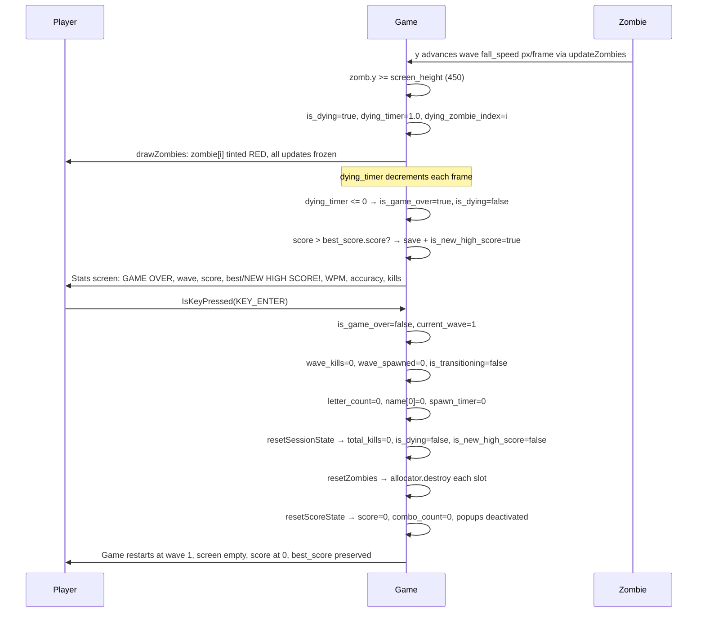
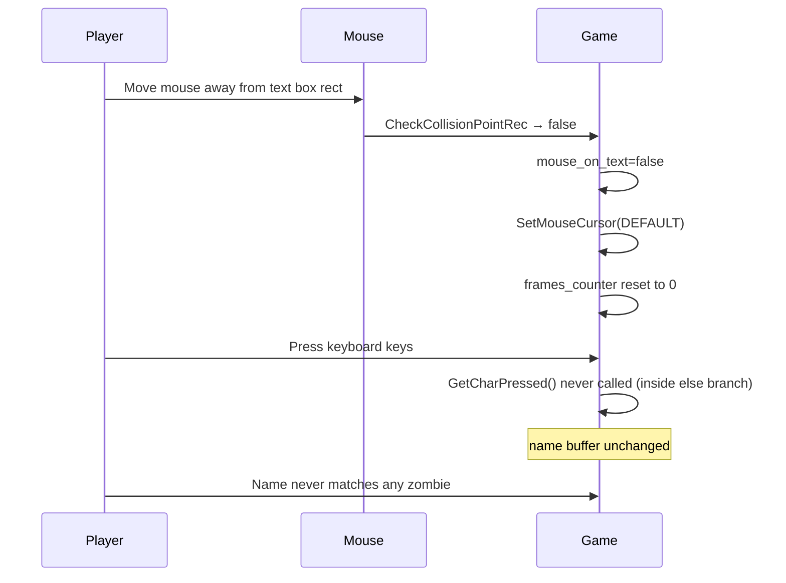
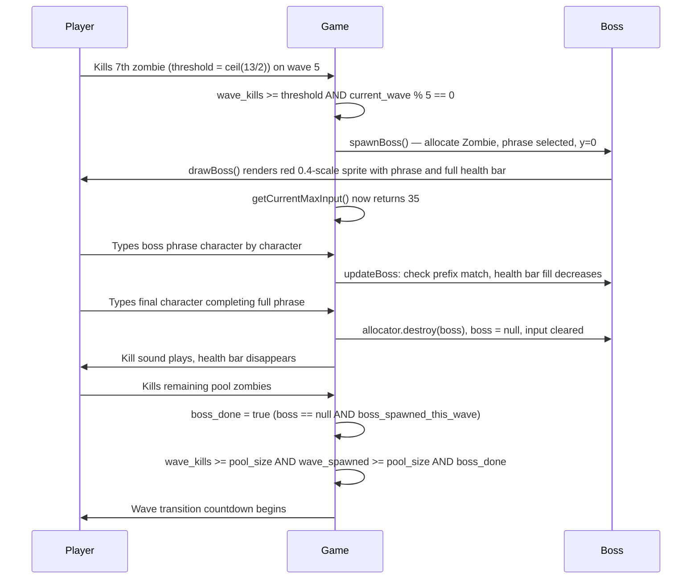
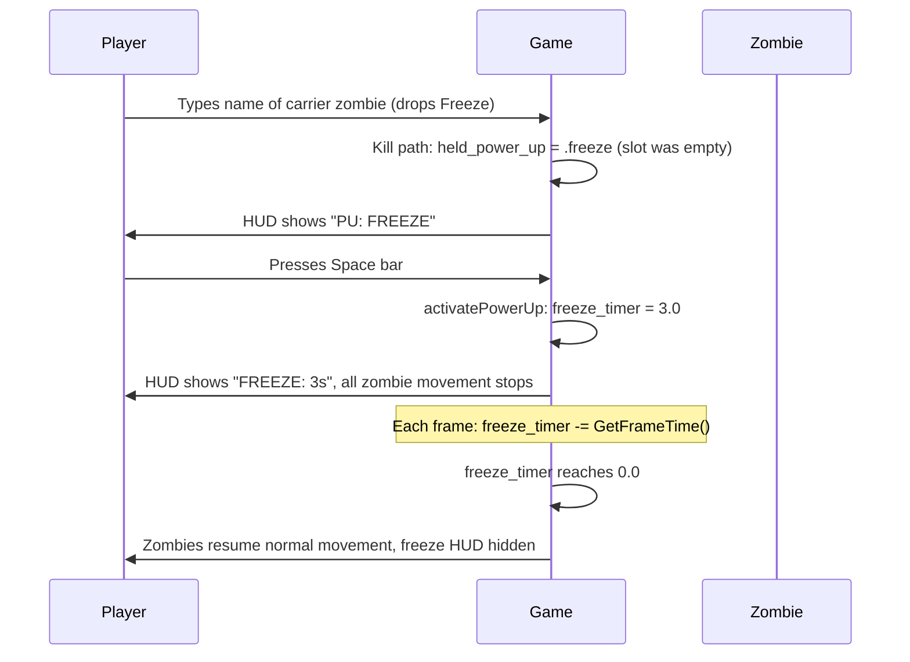
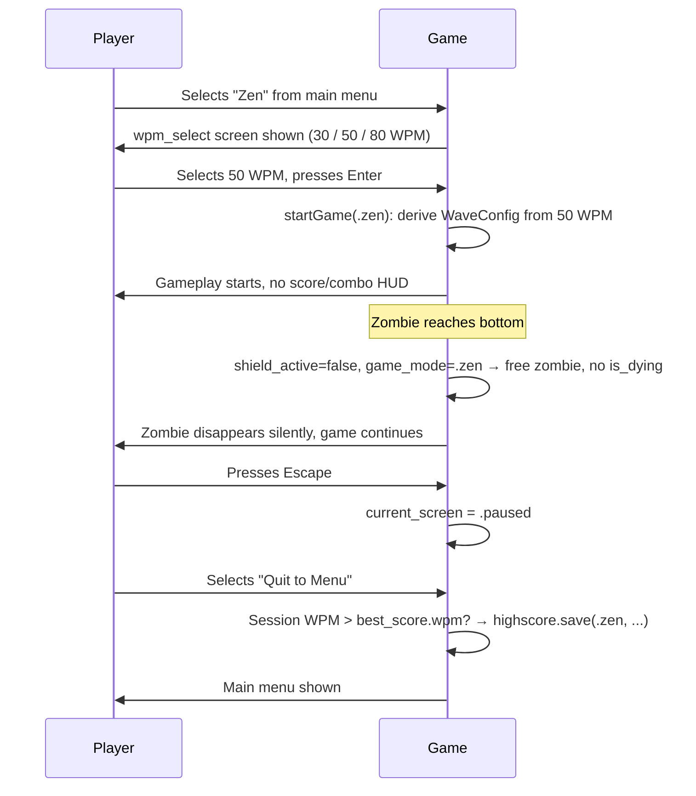
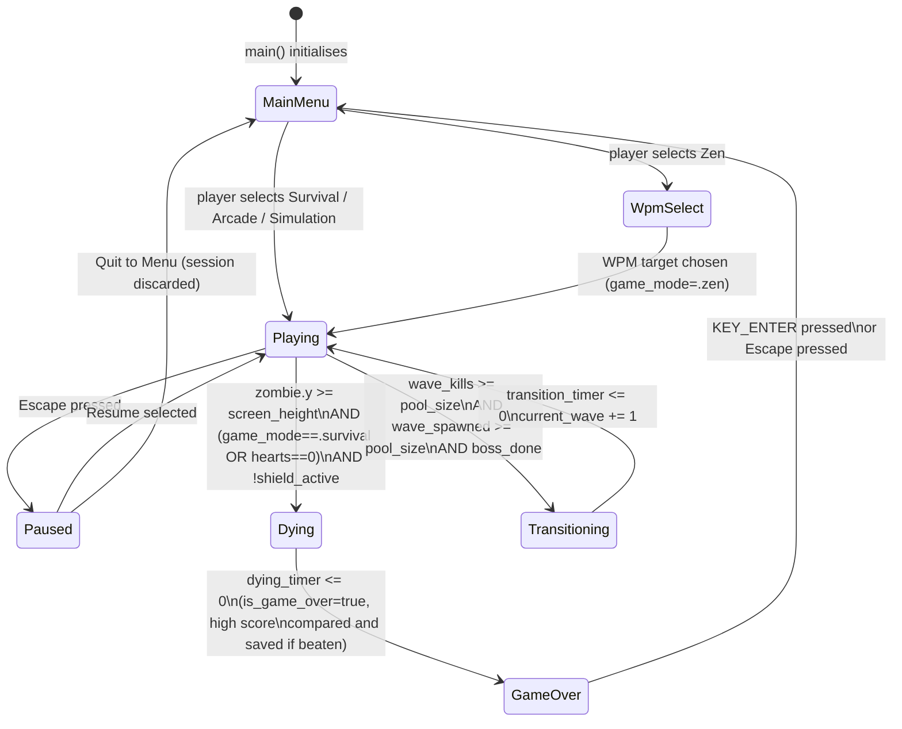
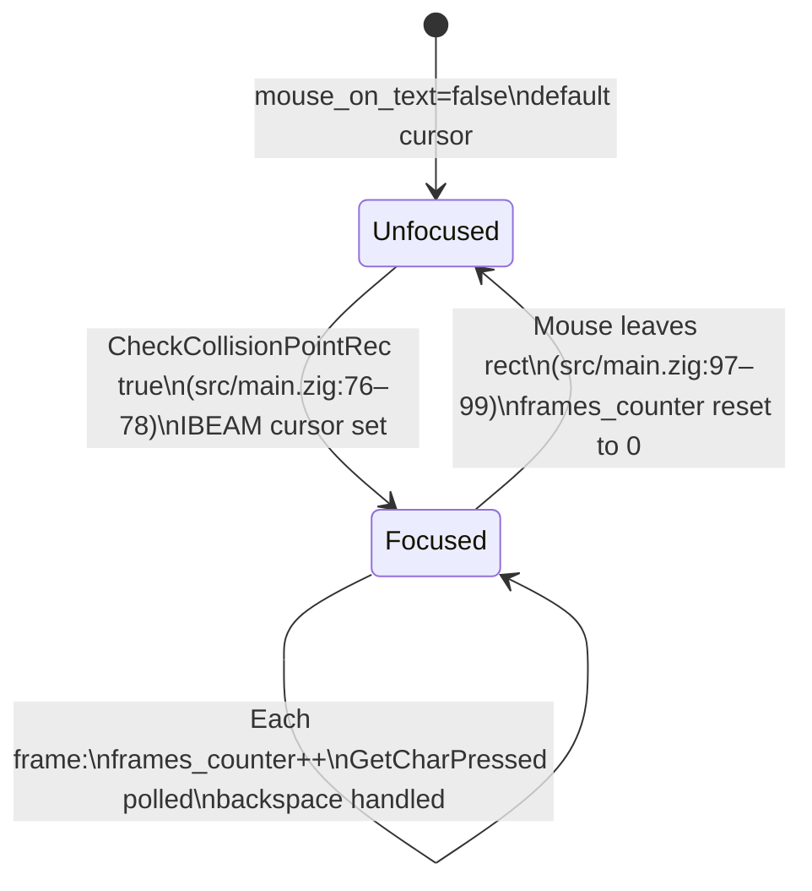

# Features

## Table of Contents

- [Feature Map](#feature-map)
- [Feature Catalog](#feature-catalog)
  - [F-01 Zombie Spawning](#f-01-zombie-spawning)
  - [F-02 Spritesheet Animation](#f-02-spritesheet-animation)
  - [F-03 Name Label Rendering](#f-03-name-label-rendering)
  - [F-04 Falling Motion](#f-04-falling-motion)
  - [F-05 Game Over Detection](#f-05-game-over-detection)
  - [F-06 Restart](#f-06-restart)
  - [F-07 Text Input](#f-07-text-input)
  - [F-08 Input Box Rendering](#f-08-input-box-rendering)
  - [F-09 Blinking Cursor](#f-09-blinking-cursor)
  - [F-10 Kill Mechanic](#f-10-kill-mechanic)
  - [F-11 Game-Over Overlay](#f-11-game-over-overlay)
  - [F-12 Wave HUD](#f-12-wave-hud)
  - [F-13 Wave Transition](#f-13-wave-transition)
  - [F-14 Endless Wave Scaling](#f-14-endless-wave-scaling)
  - [F-15 Boss Zombie Spawn](#f-15-boss-zombie-spawn)
  - [F-16 Boss Typing Mechanic](#f-16-boss-typing-mechanic)
  - [F-17 Boss Priority Over Regular Zombies](#f-17-boss-priority-over-regular-zombies)
  - [F-18 Boss Wave Completion Gate](#f-18-boss-wave-completion-gate)
  - [F-19 Per-Kill Scoring](#f-19-per-kill-scoring)
  - [F-20 Combo Counter](#f-20-combo-counter)
  - [F-21 Score and Combo HUD](#f-21-score-and-combo-hud)
  - [F-22 Floating Score Popup](#f-22-floating-score-popup)
  - [F-23 Score on Game-Over Screen](#f-23-score-on-game-over-screen)
  - [F-24 Live WPM HUD](#f-24-live-wpm-hud)
  - [F-25 Live Accuracy HUD](#f-25-live-accuracy-hud)
  - [F-26 Dying Transition](#f-26-dying-transition)
  - [F-27 High Score Persistence](#f-27-high-score-persistence)
  - [F-28 Zombie Type Differentiation](#f-28-zombie-type-differentiation)
  - [F-29 CRT Overlay](#f-29-crt-overlay)
  - [F-30 Main Menu](#f-30-main-menu)
  - [F-31 Pause System](#f-31-pause-system)
  - [F-32 Zen Mode](#f-32-zen-mode)
  - [F-33 Power-up Carrier Zombies](#f-33-power-up-carrier-zombies)
  - [F-34 Power-up Inventory HUD](#f-34-power-up-inventory-hud)
  - [F-35 Freeze Power-up](#f-35-freeze-power-up)
  - [F-36 Bomb Power-up](#f-36-bomb-power-up)
  - [F-37 Shield Power-up](#f-37-shield-power-up)
  - [F-38 Per-Mode High Scores](#f-38-per-mode-high-scores)
  - [F-39 Keystroke Audio Feedback](#f-39-keystroke-audio-feedback)
  - [F-40 Error Audio Feedback](#f-40-error-audio-feedback)
  - [F-41 Background Music](#f-41-background-music)
  - [F-42 Power-Up Activation Sounds](#f-42-power-up-activation-sounds)
  - [F-43 Kill Sound Volume System](#f-43-kill-sound-volume-system)
  - [F-44 Sound Settings Screen](#f-44-sound-settings-screen)
  - [F-45 Simulation Mode](#f-45-simulation-mode)
  - [F-46 Arcade Mode](#f-46-arcade-mode)
  - [F-47 Help Screen](#f-47-help-screen)
- [User Journeys](#user-journeys)
  - [Journey 1: Successful Kill](#journey-1-successful-kill)
  - [Journey 2: Missed Zombie and Restart](#journey-2-missed-zombie-and-restart)
  - [Journey 3: Input Ignored Outside Text Box](#journey-3-input-ignored-outside-text-box)
  - [Journey 4: Buffer Full and Backspace](#journey-4-buffer-full-and-backspace)
  - [Journey 5: Wave Completion and Transition](#journey-5-wave-completion-and-transition)
  - [Journey 6: Boss Wave Encounter and Defeat](#journey-6-boss-wave-encounter-and-defeat)
  - [Journey 7: Power-up Activation](#journey-7-power-up-activation)
  - [Journey 8: Zen Mode Session](#journey-8-zen-mode-session)
- [State Machines](#state-machines)
  - [Game State](#game-state)
  - [Zombie Lifecycle State](#zombie-lifecycle-state)
  - [Input Focus State](#input-focus-state)
- [Business Rules](#business-rules)

---

## Feature Map

```mermaid
graph TB
    subgraph GameModes
        MainMenu["F-30 Main Menu"]
        PauseSystem["F-31 Pause System"]
        ZenMode["F-32 Zen Mode"]
        ArcadeMode["F-46 Arcade Mode"]
        SimulationMode["F-45 Simulation Mode"]
    end

    subgraph Sound
        KeystrokeSound["F-39 Keystroke Audio"]
        ErrorSound["F-40 Error Audio"]
        Music["F-41 Background Music"]
        PowerUpSound["F-42 Power-up Sounds"]
        KillSound["F-43 Kill Sound Volume"]
        SoundMenu["F-44 Sound Settings Screen"]
    end

    subgraph PowerUps
        CarrierZombie["F-33 Carrier Zombies"]
        InventoryHUD["F-34 Inventory HUD"]
        FreezePU["F-35 Freeze"]
        BombPU["F-36 Bomb"]
        ShieldPU["F-37 Shield"]
    end

    subgraph Gameplay
        Spawning["F-01 Zombie Spawning"]
        Falling["F-04 Falling Motion"]
        Killing["F-10 Kill Mechanic"]
        GameOver["F-05 Game Over Detection"]
        DyingTransition["F-26 Dying Transition"]
        Restart["F-06 Restart"]
        WaveSystem["F-14 Wave Progression"]
        WaveTransition["F-13 Wave Transition"]
        BossSpawn["F-15 Boss Zombie Spawn"]
        BossTyping["F-16 Boss Typing Mechanic"]
        BossPriority["F-17 Boss Priority"]
        BossGate["F-18 Boss Wave Completion Gate"]
    end

    subgraph Presentation
        Animation["F-02 Spritesheet Animation"]
        NameLabel["F-03 Name Label"]
        GameOverOverlay["F-11 Game-Over Stats Screen"]
        HUD["F-12 Wave HUD"]
        ScoreHUD["F-21 Score and Combo HUD"]
        ScorePopup["F-22 Score Popup"]
        GameOverScore["F-23 Score on Game-Over Screen"]
        CRTOverlay["F-29 CRT Overlay"]
    end

    subgraph Scoring
        Scoring["F-19 Per-Kill Scoring"]
        Combo["F-20 Combo Counter"]
        WpmHUD["F-24 Live WPM HUD"]
        AccHUD["F-25 Live Accuracy HUD"]
        HighScore["F-27 High Score Persistence"]
    end

    subgraph Interaction
        TextBox["F-08 Input Box Rendering"]
        Keyboard["F-07 Text Input"]
        BlinkingCursor["F-09 Blinking Cursor"]
    end

    Spawning --> Falling
    Falling --> DyingTransition
    BossTyping --> DyingTransition
    DyingTransition --> GameOver
    Keyboard --> Killing
    GameOver --> GameOverOverlay
    Restart --> Spawning
    Restart --> WaveSystem
    Spawning --> Animation
    Spawning --> NameLabel
    TextBox --> Keyboard
    TextBox --> BlinkingCursor
    WaveSystem --> Spawning
    WaveSystem --> HUD
    Killing --> WaveTransition
    WaveTransition --> WaveSystem
    WaveTransition --> Keyboard
    WaveSystem --> BossSpawn
    BossSpawn --> BossTyping
    BossTyping --> Keyboard
    BossTyping --> BossPriority
    BossTyping --> BossGate
    BossGate --> WaveTransition
    Killing --> Scoring
    BossTyping --> Scoring
    Scoring --> Combo
    Scoring --> ScorePopup
    Scoring --> ScoreHUD
    Combo --> ScoreHUD
    WaveTransition --> Combo
    Restart --> Scoring
    GameOverOverlay --> GameOverScore
    GameOver --> HighScore
    MainMenu --> Spawning
    MainMenu --> ZenMode
    PauseSystem --> MainMenu
    Killing --> CarrierZombie
    CarrierZombie --> InventoryHUD
    InventoryHUD --> FreezePU
    InventoryHUD --> BombPU
    InventoryHUD --> ShieldPU
    FreezePU --> Falling
    BombPU --> Killing
    ShieldPU --> GameOver
    GameOver --> MainMenu
    HighScore --> MainMenu
    MainMenu --> SimulationMode
    MainMenu --> ArcadeMode
    SimulationMode --> Spawning
    SimulationMode --> HighScore
    ArcadeMode --> Spawning
    ArcadeMode --> GameOver
    ArcadeMode --> CarrierZombie
    Keyboard --> WpmHUD
    Keyboard --> AccHUD
    Combo --> AccHUD
    Restart --> WpmHUD
    Restart --> AccHUD
    Keyboard --> KeystrokeSound
    Keyboard --> ErrorSound
    Killing --> KillSound
    FreezePU --> PowerUpSound
    BombPU --> PowerUpSound
    ShieldPU --> PowerUpSound
    MainMenu --> SoundMenu
    PauseSystem --> SoundMenu
    SoundMenu --> KeystrokeSound
    SoundMenu --> ErrorSound
    SoundMenu --> Music
    SoundMenu --> PowerUpSound
    SoundMenu --> KillSound
```

---

## Feature Catalog

### F-01 Zombie Spawning

**Description.** The game allocates a new `Zombie` struct on the heap and stores its pointer in the first available `null` slot of the fixed-size `zombies` pool. Spawning follows a **sustained-density model** with two phases. At wave start, a **starter pack** of `wave_cfg.starter_pack` zombies is front-loaded: each starter is placed in its own X zone and stacked at a negative Y offset (above the screen) so they slide into view from the top over the next few seconds — ensuring the screen is dense from t=0 rather than ramping up slowly. After the starter pack, a continuous **drip** spawns one zombie every `wave_cfg.spawn_delay` seconds at y=0 until `wave_spawned` reaches `wave_cfg.pool_size`. Each zombie is initialised with a type-adjusted fall speed and a name from `name_lists.zig`. Killed zombie slots are freed immediately, so slots recycle within the same wave. If no free slot exists or name selection fails, that individual spawn attempt is silently skipped.

**User-facing behavior.** New zombies appear at the top of the window. Wave start drops several zombies at once from above (cascade-in), then individual zombies arrive at a steady cadence. Each wave has a finite pool of zombies. Zombie type variety increases across waves: only standard zombies appear in waves 1–3; runners and tanks are introduced gradually from wave 4 onward.

**System behavior.**
- **Wave start** (`startGame` for wave 1; the wave-transition branch in `frame` for waves 2+): after `resetZombies`, the game calls `spawnStarterPack(allocator, prng.random(), wave_cfg.starter_pack)`. Each starter is placed in its own X zone (`screen_width / count` per zone) with a negative Y offset `y0 = -i × (STARTER_PACK_OFFSET_RANGE / (count - 1))` so the deepest starter slides in last from `y = -STARTER_PACK_OFFSET_RANGE`. Each successful starter spawn increments `wave_spawned`.
- **Drip phase**: `spawn_timer` is pre-loaded to `wave_cfg.spawn_delay` so the first drip fires on the next update tick. Each frame `spawn_timer += raylib.GetFrameTime()`.
- When `spawn_timer >= wave_cfg.spawn_delay` AND `wave_spawned < wave_cfg.pool_size` AND `boss == null`, a single zombie spawns via `spawnZombie(allocator, prng.random())` at `y0 = 0`; `wave_spawned += 1`; `spawn_timer` is reset to `-spawn_delay × jitter` where `jitter ∈ [-SPAWN_DELAY_JITTER, +SPAWN_DELAY_JITTER]` (±30%).
- `spawnZombieInZone(allocator, rng, zone_x_min, zone_x_max, y0)` iterates `zombies[0..MAX_ZOMBIES]` for the first `null` slot; selects zombie type and name; clamps horizontal position so the name label does not overflow the right edge.
- **X collision avoidance**: the candidate X is re-rolled up to `SPAWN_MAX_X_ATTEMPTS` times if `xCollidesAtY(candidate, y0, name_width)` returns `true` — this checks any active zombie within `SPAWN_OVERLAP_GUARD_Y` (80 px) of the candidate Y for an AABB overlap on the name+sprite footprint with `SPAWN_OVERLAP_PADDING` (8 px). On exhaustion the last candidate is kept rather than failing the spawn.
- `selectZombieType(getSpawnWeights(current_wave), rng)` picks a `ZombieType` from `SPAWN_WEIGHT_TABLE` (waves 1–3: 100% standard; waves 4–6: 70/20/10; waves 7–10: 50/30/20; waves 11+: 40/30/30).
- Builds `active_names[]` from all currently active zombies' name pointers (for anti-doublon).
- `name_lists.selectName(wave, zombie_type, active_names, forced_group, rng)` applies `NAME_WEIGHT_TABLE` and type-based length filtering, retrying up to `MAX_SPAWN_RETRIES` (10) on collision.
- If selection category is `.trap` and no cluster is active, sets `trap_cluster_group` and `trap_cluster_remaining` (1–2 extras); decrements remaining on subsequent spawns.
- `allocator.create(Zombie)` allocates heap memory; `errdefer allocator.destroy` prevents leaks on failure.
- Spawn speed: `getWaveConfig(current_wave).fall_speed × getSpeedMultiplier(zombie_type)` (1.0×/1.3×/0.5× for standard/runner/tank).

**Key source references.**
- `src/main.zig` — `MAX_ZOMBIES`, `MAX_SPAWN_RETRIES`, `SPAWN_WEIGHT_TABLE`, `NAME_WEIGHT_TABLE`, `ZOMBIE_SPAWN_X_MIN`, `ZOMBIE_SPAWN_X_MAX`, `trap_cluster_group`, `trap_cluster_remaining`
- `src/main.zig` — `spawnZombie`, `spawnZombieInZone`, `selectZombieType`, `getSpawnWeights`, `getNameWeights`, `getSpeedMultiplier`
- `src/name_lists.zig` — `PrimaryNames`, `CompoundNames`, `TrapGroups`, `selectName`

**Dependencies.** Relies on `name_lists.zig` for name selection (F-03 for rendering), `std.heap.page_allocator`, and the `!is_game_over and !is_transitioning and !is_dying` guard. Zombie type determines visual tint (F-28) and fall speed (F-04).

---

### F-02 Spritesheet Animation

**Description.** Each active zombie is rendered by slicing a single horizontal spritesheet (`assets/z_spritesheet.png`) into 17 equal-width frames. An internal per-zombie timer advances the frame index by one every 0.1 simulated seconds, looping back to frame 0 after frame 16. The sprite is scaled down to 20 % of its source size.

**User-facing behavior.** Each zombie on screen displays a continuously looping walk animation drawn from the shared spritesheet image.

**System behavior.**
- `drawZombies()` is called each frame when `!is_game_over` (`src/main.zig:152`).
- `deltaTime` is hardcoded to `1.0 / 60.0` — not obtained from `raylib.GetFrameTime()` (`src/main.zig:206`).
- `zomb.animationTimer += deltaTime` each call; when `>= 0.1` the frame advances (`src/main.zig:217–225`).
- Frame width is `zombie_texture.width / ZOMBIE_FRAME_COUNT` (integer divide, then `f32` cast) (`src/main.zig:228`).
- Source rect: `x = zomb.frame * frame_width`, `y = 0`, full texture height (`src/main.zig:230–235`).
- Destination rect: `width = frame_width * 0.2`, `height = texture_height * 0.2` (`src/main.zig:237–246`).
- `raylib.DrawTexturePro` renders with zero rotation and `WHITE` tint (`src/main.zig:238–250`).

**Key source references.**
- `src/main.zig:10` — `ZOMBIE_FRAME_COUNT = 17`
- `src/main.zig:60–61` — texture load/unload with `defer`
- `src/main.zig:205–257` — `drawZombies` function

**Dependencies.** Requires `zombie_texture` loaded at startup (F-01 for active zombies to exist).

---

### F-03 Name Label Rendering

**Description.** Each active zombie has its `name` field — a `[*:0]const u8` pointer into `name_lists.zig` arrays — drawn as text 20 pixels above the sprite's origin position, in `CRT_ACCENT` (#f0c8ff, lavender near-white) at font size 20, over an opaque `CRT_BG` background rectangle. Names may be simple first names (e.g. `"Kai"`), compound hyphenated names (e.g. `"Jean-Pierre"`), or trap-group names that closely resemble others on screen.

**User-facing behavior.** The player sees a name floating above each zombie — first names in early waves, with compound hyphenated names appearing from wave 4 onward. Trap-group names in later waves look visually similar to each other, requiring careful reading. Each name is rendered over an opaque background so two zombies whose labels overlap never produce a garbled mix of pixels (one name may fully occlude another, which is acceptable). Names also render above the HUD so they stay readable when a zombie crosses the wave-info / score zones.

**System behavior.**
- Executed inside `drawZombieNames()` (separate from `drawZombies()`, which only draws sprites). `drawZombieNames()` is called **after** `drawPlayingHud()` so labels paint over the HUD.
- For each active zombie: `text_x = zomb.x`, `text_y = zomb.y - 20.0`; `text_w = measureText(zomb.name, ZOMBIE_NAME_SIZE)` with `ZOMBIE_NAME_SIZE = 20`.
- A filled rectangle of color `CRT_BG` is drawn first at `(text_x - ZOMBIE_NAME_BG_PAD_X, text_y - ZOMBIE_NAME_BG_PAD_Y)` with size `(text_w + 2·ZOMBIE_NAME_BG_PAD_X, ZOMBIE_NAME_SIZE + 2·ZOMBIE_NAME_BG_PAD_Y)`. Padding constants: `ZOMBIE_NAME_BG_PAD_X = 4`, `ZOMBIE_NAME_BG_PAD_Y = 2`.
- `drawText(zomb.name, text_x, text_y, ZOMBIE_NAME_SIZE, CRT_ACCENT)` — a wrapper around `raylib.DrawTextEx(game_font, …)` with `FONT_SPACING = 1.0`.
- The name pointer is passed directly; no copy is made because `[*:0]const u8` is compatible with raylib's C string parameter.
- The hyphen character in compound names is rendered natively by the game font.

**Key source references.**
- `src/main.zig` — `name: [*:0]const u8` field in `Zombie` struct
- `src/main.zig` — `drawZombieNames()` function and its post-HUD call site in the frame function
- `src/name_lists.zig` — `PrimaryNames`, `CompoundNames`, `TrapGroups` source arrays

**Dependencies.** F-01 (spawn sets the name pointer), F-02 (sprites drawn first by `drawZombies()`).

---

### F-04 Falling Motion

**Description.** Every frame during the update phase, each active zombie's `y` coordinate is incremented by its `speed` value. Speed is set at spawn time as `getWaveConfig(current_wave).fall_speed × getSpeedMultiplier(zombie_type)` and is never mutated after spawn. Standard zombies use the wave's base `fall_speed`; runners move at 1.3× the base speed; tanks move at 0.5× the base speed.

**User-facing behavior.** Zombies descend at a constant per-wave speed, falling faster in higher waves.

**System behavior.**
- `updateZombies()` is called each frame when `!is_game_over and !is_transitioning` (`src/main.zig:138`).
- Per-zombie: `zomb.y += zomb.speed` (`src/main.zig:302`).
- `speed` is set once at spawn from `getWaveConfig(current_wave).fall_speed` (`src/main.zig:402`) and never mutated.
- If a zombie is `!is_active` the loop skips it (`src/main.zig:301`).

**Key source references.**
- `src/main.zig:298–332` — `updateZombies` function
- `src/main.zig:302` — position increment
- `src/main.zig:402` — speed set from wave config at spawn

**Dependencies.** F-01 (zombies must be spawned and active), F-05 (falling eventually triggers game over), F-14 (wave config determines fall_speed).

---

### F-05 Game Over Detection

**Description.** During each frame's update pass, if any active zombie's `y` position meets or exceeds `screen_height` (1000), the outcome depends on the active game mode. In **Survival** mode (and non-shield Arcade mode with hearts remaining), the zombie costs a life or ends the game. In **Arcade** mode the zombie crossing the bottom costs one heart; game-over only triggers when `hearts` reaches 0. The boss crossing the bottom follows the same arcade/survival split. After a game-ending event, the 1-second dying pause expires and `is_game_over` is set to `true` — the high score comparison runs and the stats overlay is rendered.

**User-facing behavior.** In Survival mode, any zombie or boss reaching the bottom pauses the game for 1 second (the responsible regular zombie glows red), then the stats overlay appears. In Arcade mode, a zombie reaching the bottom costs one heart and gameplay continues; only the final heart triggers the dying state.

**System behavior.**
- Inside `updateZombies`, after `zomb.y += zomb.speed`: if shield absorbed → free zombie, increment counters, continue. Else if `game_mode == .arcade`: `hearts -= 1; heart_flash_timer = HEART_LOSS_FLASH_DURATION; playErrorSound()`; free zombie; if `hearts == 0` → `is_dying = true; dying_timer = DYING_DURATION; dying_zombie_index = null; break;`; else continue. Else (Survival/Zen): `is_dying = true; dying_timer = DYING_DURATION; dying_zombie_index = i; return;`.
- Inside `updateBoss`, after `b.y += b.speed`: if `game_mode == .arcade and hearts > 0` → same heart-decrement path; if `hearts == 0` → `is_dying = true; dying_zombie_index = null`. Else → `is_dying = true; dying_timer = DYING_DURATION; dying_zombie_index = null; return;`.
- `is_dying` and `is_game_over` guards in the update phase prevent further movement, spawning, and input during both states.
- Draw phase still runs during `is_dying`; regular zombie draw applies a red tint to the zombie at `dying_zombie_index` (which is `null` in the arcade-hearts and boss-triggered cases).

**Key source references.**
- `src/main.zig` — `is_dying`, `dying_timer`, `dying_zombie_index` declarations
- `src/main.zig` — `DYING_DURATION = 1.0` constant
- `src/main.zig` — detection in `updateZombies` and `updateBoss`

**Dependencies.** F-04 (falling populates `y`), F-26 (dying transition state), F-11 (overlay rendered when `is_game_over` true), F-06 (cleared on restart).

---

### F-06 Restart

**Description.** While the game-over screen is displayed, pressing `KEY_ENTER` resets all mutable game state: the input buffer is cleared, `spawn_timer` is zeroed, wave state is returned to wave 1, `is_game_over` is set to `false`, `resetZombies` frees and nulls every heap-allocated zombie in the pool, and `resetBoss` frees any live boss allocation and resets boss state.

**User-facing behavior.** The player presses Enter on the game-over screen and the game immediately restarts from wave 1 with a clean state, no zombies on screen, and no active boss.

**System behavior.**
- `raylib.IsKeyPressed(raylib.KEY_ENTER)` checked only when `is_game_over` is `true`.
- `is_game_over = false` re-enables the update phase.
- `letter_count = 0; name[letter_count] = '\x00'` clears the input buffer.
- `spawn_timer = 0.0` resets the spawn countdown.
- Wave state reset: `current_wave = 1`, `wave_kills = 0`, `wave_spawned = 0`, `is_transitioning = false`, `transition_timer = 0.0`.
- `resetSessionState()` clears `total_kills = 0`, `is_dying = false`, `dying_timer = 0.0`, `dying_zombie_index = null`, `is_new_high_score = false`.
- `resetScoreState()` clears `score`, `combo_count`, `popup_next`, and deactivates all popup entries.
- `resetMetricsState()` zeroes WPM/accuracy tracking state.
- `resetZombies(ctx.allocator)` iterates all slots: `allocator.destroy(z); zombie.* = null` for every non-null entry.
- `resetBoss(ctx.allocator)` frees the boss allocation if non-null, sets `boss = null`, `boss_spawned_this_wave = false`, `boss_phrase_len = 0`.
- `best_score` is **not** reset — the persisted best score is carried across sessions for the lifetime of the process.

**Key source references.**
- `src/main.zig` — restart branch inside game-over block
- `src/main.zig` — `resetSessionState`, `resetZombies`, `resetBoss` functions

**Dependencies.** F-05 (restart is only reachable when game is over), F-11 (stats overlay must be visible for Enter to be processed here), F-27 (best_score preserved).

---

### F-07 Text Input

**Description.** Each frame the game reads characters from raylib's key-press queue and appends printable ASCII characters (codepoints 32–125) to the `name` buffer. The maximum buffer length is dynamic: 20 characters during normal play (up from 9; accommodates compound names up to 20 chars) and 35 characters while a boss is active (F-16). The hyphen character (codepoint 45) falls within the accepted range and is required for compound zombie names. Backspace removes the last character. Input is accepted regardless of mouse position; the mouse-over state only controls the cursor icon and the blinking-underscore overlay (F-09). Input is entirely disabled during wave transitions and the dying pause.

**User-facing behavior.** The player types and characters appear in the text box, including hyphens for compound names. Backspace deletes the last character; OS key-repeat applies (hold to keep deleting), and holding Ctrl, Alt/Option, or Cmd while pressing Backspace deletes a whole word (trailing spaces then characters up to the previous space). Pressing `?` while playing opens the help screen instead of inserting the character. During the 3-second wave-transition countdown or the 1-second dying pause, typing is ignored. While a boss is active the buffer accepts up to 35 characters to accommodate boss phrases.

**System behavior.**
- Mouse position checked each frame with `raylib.CheckCollisionPointRec`.
- `mouse_on_text = true` and `MOUSE_CURSOR_IBEAM` set on hover; otherwise `false` and `MOUSE_CURSOR_DEFAULT`.
- Input processing gated by `if (!is_game_over and !is_transitioning and !is_dying)`.
- `raylib.GetCharPressed()` polled in a `while (key > 0)` loop to drain the frame's key queue.
- Guard: `(key >= 32) and (key <= 125) and (letter_count < getCurrentMaxInput())`.
- `getCurrentMaxInput()` returns `MAX_BOSS_INPUT_CHARS` (35) when `boss != null`, else `MAX_INPUT_CHARS` (20).
- `name[letter_count] = @intCast(key)` appends the byte; `name[letter_count + 1] = '\x00'` maintains null termination.
- `?` interception: inside the char loop, `if (key == '?')` sets `help_return_screen = .playing; current_screen = .help`, pauses music, and returns from `frame()` before the draw phase so the help screen appears on the next frame. Intercepted at the character layer (codepoint 63) rather than via `IsKeyPressed(KEY_SLASH)` to stay independent of keyboard layout, and safe because `?` never appears in any zombie name or boss phrase.
- Backspace: fires on `IsKeyPressed(KEY_BACKSPACE) or IsKeyPressedRepeat(KEY_BACKSPACE)` (so the OS auto-repeat applies). When a Ctrl/Alt/Cmd modifier is held, word-delete runs (strip trailing spaces, then characters up to the previous space); otherwise a single character is removed. Trailing null terminator is restored.

**Key source references.**
- `src/main.zig` — `MAX_INPUT_CHARS = 20`
- `src/main.zig` — `name` buffer and `letter_count`
- `src/main.zig` — full input handling block (gated by `!is_game_over and !is_transitioning and !is_dying`)

**Dependencies.** F-08 (text box rect defined there), F-09 (cursor blink uses `frames_counter` incremented here), F-10 (buffer content drives kill check), F-13 (transition disables input).

---

### F-08 Input Box Rendering

**Description.** A rectangle centered near the bottom of the screen (width 500, x = `screen_width/2 - 250`, y = 400, height 50) is filled with `LIGHTGRAY` and outlined in `RED` when focused or `DARKGRAY` when not. The currently typed text is drawn inside the box at font size 40 in `MAROON`. While a boss is active the box widens to 700 pixels and recenters to accommodate the 35-character boss phrase limit.

**User-facing behavior.** The player sees a rectangular input area centered near the bottom of the screen. The border turns amber (`CRT_WARN`) to indicate focus and violet (`CRT_FG`) when unfocused. The typed characters are displayed inside in lavender (`CRT_ACCENT`), with enough width for compound names up to 20 characters. During boss encounters the box expands further.

**System behavior.**
- Default: `text_box.width = 500.0`, `text_box.x = screen_width / 2.0 - 250.0` (i.e. `x = 150`).
- Boss mode: `text_box.width = 700.0`, `text_box.x = (screen_width - 700.0) / 2.0` (i.e. `x = 50`). Switched each frame based on `boss != null`.
- `raylib.DrawRectangleRec(text_box, CRT_DIM)` fills the box.
- Conditional border: `CRT_WARN` when `mouse_on_text`, `CRT_FG` otherwise.
- `raylib.DrawText(&name, text_box.x + 5, text_box.y + 8, 40, CRT_ACCENT)` renders typed text.

**Key source references.**
- `src/main.zig` — `text_box` rectangle, boss-mode width switching in `frame()`
- `src/main.zig` — box and text draw calls

**Dependencies.** F-07 (focus state and buffer content), F-09 (blinking cursor overlaid on this box).

---

### F-09 Blinking Cursor

**Description.** When the mouse is over the text box and the buffer has not yet reached its current character limit, a `"_"` character is drawn immediately after the typed text. Its visibility toggles on and off every 20 frames by evaluating `(frames_counter / 20) % 2 == 0`. When the buffer is full (at 20 normally or 35 during a boss encounter), the blinking cursor is suppressed and a `"Press BACKSPACE to delete chars..."` hint is shown instead.

**User-facing behavior.** An underscore blinks at the insertion point while the player is focused on the text box. At the current maximum capacity the blink stops and a backspace reminder appears.

**System behavior.**
- `frames_counter` incremented by 1 each frame while `mouse_on_text` is true; reset to 0 when focus is lost.
- Cursor drawn when `mouse_on_text and letter_count < getCurrentMaxInput() and ((frames_counter / 20) % 2) == 0`.
- X position: `text_box.x + 8 + raylib.MeasureText(&name, 40)` — appended after the last typed character.
- Full-buffer hint drawn when `mouse_on_text and letter_count >= getCurrentMaxInput()` at fixed position (230, 300).

**Key source references.**
- `src/main.zig:65` — `frames_counter` declaration
- `src/main.zig:102–106` — counter increment/reset
- `src/main.zig:155–161` — cursor and hint draw conditions

**Dependencies.** F-07 (hover state and `letter_count`), F-08 (box position used for cursor placement).

---

### F-10 Kill Mechanic

**Description.** During the update phase, after each active zombie's position is advanced, the typed buffer is compared byte-for-byte against that zombie's name. A match causes the zombie's heap memory to be freed immediately, the slot set to `null`, the input buffer to be cleared, and the kill sound to be played. The freed slot is immediately available for a new spawn in the same wave.

**User-facing behavior.** When the player correctly types an on-screen zombie name in full, the zombie disappears, a sound effect plays, and the text box is cleared. Compound hyphenated names (e.g. `"Jean-Pierre"`) require the hyphen to be typed as part of the name.

**System behavior.**
- `typed_name = name[0..letter_count]` creates a slice of the buffer.
- Zombie name length computed by scanning for `'\x00'` sentinel.
- `std.mem.eql(u8, typed_name, zomb_name_slice)` performs the exact byte comparison.
- On match: `allocator.destroy(zomb)`, `slot.* = null` (slot immediately freed for reuse), `letter_count = 0; name[0] = '\x00'`, `wave_kills += 1`, `total_kills += 1`, `raylib.PlaySound(zombie_kill_sound)`.
- Score and combo are updated, and a floating popup is spawned at the kill position (F-19, F-22).

**Key source references.**
- `src/main.zig:57–58` — sound load/unload with `defer`
- `src/main.zig:181–199` — match and kill block in `updateZombies`

**Dependencies.** F-07 (input buffer provides `typed_name`), F-01 (zombies must exist), F-06 (memory freed only on restart).

---

### F-11 Game-Over Stats Screen

**Description.** When `is_game_over` is `true`, the normal zombie draw pass is replaced by an arcade-style stats overlay: a large glow-shadowed `GAME OVER` title, an optional `NEW HIGH SCORE` badge, a 3×2 stats grid (label + large value per cell), and a centered retry prompt. The overlay is displayed after the 1-second dying transition (F-26) completes.

**User-facing behavior.** After the dying pause, the player sees a large pink-red "GAME OVER" with a soft drop-shadow, a "NEW HIGH SCORE" badge if applicable, then a clean 3×2 grid of stats — top row `SCORE` (zero-padded to 6 digits) / `WAVE REACHED` / `ENEMIES SLAIN`, bottom row `MAX COMBO` (prefixed `x`) / `WPM` / `ACCURACY` (suffixed `%`) — and a `> PRESS [ENTER] TO RETRY <` prompt near the bottom.

**System behavior.**
- `drawZombies()` is not called when `is_game_over` is `true`; the stats overlay replaces the normal draw pass.
- `"GAME OVER"` drawn via `drawCenteredTextShadow` (a cheap drop-shadow glow) at `y = STATS_TITLE_Y` (80), font size `STATS_TITLE_SIZE` (56), color `CRT_ERR`.
- If `is_new_high_score`: `"- NEW HIGH SCORE -"` drawn centered at `y = STATS_BADGE_Y` (165), font size `STATS_BADGE_SIZE` (22), color `CRT_WARN`.
- Three columns centered at `STATS_COL1_CX` (135), `STATS_COL2_CX` (400), `STATS_COL3_CX` (665). For each cell the label is drawn in `STATS_GRID_LABEL_SIZE` (14) `CRT_ACCENT` and the value in `STATS_GRID_VALUE_SIZE` (32) `CRT_FG`, via `drawStatCell(label, value, cx, label_y, value_y)`.
  - **Row 1** (`STATS_GRID_ROW1_LABEL_Y` 280 / `STATS_GRID_ROW1_VALUE_Y` 310):
    - `SCORE` → `score` formatted as `{d:0>6}` (zero-padded to 6 digits, grows naturally beyond).
    - `WAVE REACHED` → `current_wave`.
    - `ENEMIES SLAIN` → `total_kills` (regular + boss).
  - **Row 2** (`STATS_GRID_ROW2_LABEL_Y` 420 / `STATS_GRID_ROW2_VALUE_Y` 450):
    - `MAX COMBO` → `"x{d}"` formatted from `max_combo`.
    - `WPM` → `calculateAverageWpm()` (per-wave WPM, since metrics reset on every wave transition).
    - `ACCURACY` → `"{d}%"` formatted from `calculateStatsAccuracy()`.
- `"> PRESS [ENTER] TO RETRY <"` drawn centered at `y = STATS_RESTART_HINT_Y` (880), font size `STATS_RESTART_HINT_SIZE` (18), color `CRT_FG`.

**Key source references.**
- `src/main.zig` — game-over draw block (3×2 grid construction).
- `src/main.zig` — `drawCenteredTextShadow`, `drawColumnCenteredText`, `drawStatCell` helpers.
- `src/main.zig` — `calculateAverageWpm`, `calculateStatsAccuracy` functions.
- `src/main.zig` — `STATS_TITLE_Y`, `STATS_BADGE_Y`, `STATS_GRID_*`, `STATS_COL*_CX`, `STATS_RESTART_HINT_Y` constants.

**Dependencies.** F-05 (sets `is_game_over = true` after dying timer), F-06 (KEY_ENTER check inside this block), F-20 (`max_combo` populated by combo tracking), F-26 (dying transition feeds into this state), F-27 (best score loaded and shown here).

---

### F-12 Wave HUD

**Description.** A single line of text is rendered centered at the top of the screen every frame while the game is not in the game-over state. It shows the current wave number, the wave's target WPM, and the player's kill count against the wave's pool size.

**User-facing behavior.** The player always sees a status line such as `"WAVE 5 — 30 WPM — 7 / 13"` near the top of the screen, updating in real time as they kill zombies.

**System behavior.**
- Rendered inside the draw phase when `!is_game_over` (`src/main.zig:167`).
- `getWaveConfig(current_wave)` is called to retrieve `target_wpm` and `pool_size` (`src/main.zig:168`).
- Text is formatted via `std.fmt.bufPrintZ` into a 64-byte stack buffer (`src/main.zig:170`): `"WAVE {d} — {d} WPM — {d} / {d}"`.
- Rendered centered at `y = 10`, font size 20, color `CRT_DIM` via `drawCenteredText` (`src/main.zig:171`).
- `wave_kills` is the live kill counter, incremented in `updateZombies` on each kill (`src/main.zig:327`).

**Key source references.**
- `src/main.zig:167–172` — HUD draw block
- `src/main.zig:414–417` — `drawCenteredText` helper

**Dependencies.** F-10 (kill increments `wave_kills`), F-14 (wave config provides WPM and pool size).

---

### F-13 Wave Transition

**Description.** When a wave is complete, the game enters a 3-second transition state. Completion requires all zombies spawned and killed; on boss waves (multiples of 5) it additionally requires the boss to be defeated. During this state no zombies spawn, existing zombies do not move, input is ignored, and a centered countdown message is displayed. When the timer expires the next wave begins automatically.

**User-facing behavior.** After clearing all zombies — and the boss on boss waves — the player sees a message like `"WAVE 2 — 18 WPM challenge — 3..."` that counts down from 3 to 1, then the next wave begins.

**System behavior.**
- Wave completion detected when:
  ```
  const boss_done = if (current_wave % 5 == 0) boss == null and boss_spawned_this_wave else true;
  wave_kills >= wave_cfg.pool_size and wave_spawned >= wave_cfg.pool_size and boss_done
  ```
- On completion: `is_transitioning = true`, `transition_timer = WAVE_TRANSITION_DURATION` (3.0 s).
- Each frame while `is_transitioning`: `transition_timer -= raylib.GetFrameTime()`.
- When `transition_timer <= 0`: `current_wave += 1`, `wave_kills = 0`, `wave_spawned = 0`, `spawn_timer = 0.0`, `is_transitioning = false`, `resetMetricsState()` called (per-wave WPM segment — see F-?? WPM tracking), `resetZombies` called, `resetBoss` called. `combo_count` is **not** reset — combos persist across waves.
- Transition screen text: `"WAVE {next} — {wpm} WPM challenge — {ceil(timer)}..."` drawn centered at `y = screen_height / 2 - 15`, font size 30, `CRT_FG`.
- Input guard `!is_transitioning` prevents keystroke processing during the countdown.

**Key source references.**
- `src/main.zig:141–144` — wave completion detection and transition start
- `src/main.zig:148–158` — transition countdown and wave advance
- `src/main.zig:212–219` — transition screen draw

**Dependencies.** F-01 (spawn halted during transition), F-07 (input gated by `!is_transitioning`), F-12 (HUD hidden during game-over but shown during transition), F-14 (wave config for next wave WPM).

---

### F-14 Wave Difficulty Scaling

**Description.** Each wave is governed by a **sustained-density model** with three independent decay curves: `spawn_delay`, `time_on_screen`, and `starter_pack`. Pool size stays WPM-linked so the announced `target_wpm` matches the wave-1 survival floor exactly (a 20-wpm typist clears wave 1's 10 zombies without any landing). The model is purely formula-driven — no compile-time table — and every wave from 1 to ∞ is computable.

**User-facing behavior.** Wave 1 (`target_wpm = 20`) opens with 6 zombies cascading from above the screen and a continuous drip of 4 more over ~6 s; zombies fall slowly enough (30 s on-screen) that a 20-wpm typist can clear the whole pool of 10. Each subsequent wave tightens the cadence and shortens the fall window, while the pool and starter pack both grow. Around wave 29 the `spawn_delay` reaches its 0.4 s floor; around wave 30 the fall time hits its 4 s floor; `starter_pack` caps at 18 around wave 49. From there only `target_wpm` and `pool_size` continue scaling until `target_wpm = 250` at wave 47.

**System behavior.**
- `getWaveConfig(wave: u32) WaveConfig` computes every field from `wave`:
  - `target_wpm = min(WAVE_MAX_WPM (250), WAVE_BASE_WPM (20) + WAVE_WPM_INCREMENT (5) × (wave - 1))`.
  - `spawn_delay = max(SPAWN_DELAY_MIN (0.4), SPAWN_DELAY_BASE (1.5) - SPAWN_DELAY_DECAY_PER_WAVE (0.04) × (wave - 1))`.
  - `time_on_screen = max(TIME_ON_SCREEN_MIN (4.0), TIME_ON_SCREEN_BASE (30.0) - TIME_ON_SCREEN_DECAY_PER_WAVE (0.9) × (wave - 1))`.
  - `fall_speed = screen_height / (time_on_screen × FRAMES_PER_SECOND (60.0))`.
  - `pool_size = round(WAVE_DURATION_TARGET_S (36) × target_wpm / TIME_TO_TYPE_NUMERATOR (72))`.
  - `starter_pack = min(pool_size, round(min(STARTER_PACK_CAP (18), STARTER_PACK_BASE (6) + STARTER_PACK_INCREMENT_PER_WAVE (0.25) × (wave - 1))))`.
- Per-type multipliers (`runner ×1.3`, `tank ×0.5`) and per-type name-length filters (runners ≤5 chars, tanks ≥8 chars) layer on top of the derived `fall_speed`.
- Zen mode uses `deriveWaveTiming(target_wpm)` instead: `spawn_delay = TIME_TO_TYPE_NUMERATOR / target_wpm` (WPM-locked since the player picks the WPM tier) and `time_on_screen = max(TIME_ON_SCREEN_MIN, ZEN_DENSITY (8) × spawn_delay)`.

**Key source references.**
- `src/main.zig` — `getWaveConfig` function; `WAVE_BASE_WPM`, `WAVE_WPM_INCREMENT`, `WAVE_MAX_WPM`, `WAVE_DURATION_TARGET_S` constants.
- `src/main.zig` — `SPAWN_DELAY_BASE/MIN/DECAY_PER_WAVE`, `TIME_ON_SCREEN_BASE/MIN/DECAY_PER_WAVE`, `STARTER_PACK_BASE/CAP/INCREMENT_PER_WAVE/OFFSET_RANGE`, `ZEN_DENSITY`, `FRAMES_PER_SECOND` constants.
- `src/main.zig` — `deriveWaveTiming` function (Zen).

**Dependencies.** F-01 (spawn uses `spawn_delay`, `pool_size`, and `starter_pack`), F-04 (fall speed from `fall_speed`), F-12 (HUD reads `target_wpm`), F-13 (transition shows next wave WPM).

---

### F-15 Boss Zombie Spawn

**Description.** On every wave that is a multiple of 5 (waves 5, 10, 15, 20, …), a single boss zombie is spawned when the number of pool kills reaches `ceil(pool_size / 2)` — implemented as `(pool_size + 1) / 2`. The boss occupies a dedicated `?*Zombie` pointer (`boss`) outside the regular zombie pool. Only one boss can be active at a time per wave. **While a boss is alive, regular zombie spawns are paused** so the boss phrase gets the player's undivided attention.

**User-facing behavior.** After killing roughly half the zombies on a 5th-multiple wave, a visually distinct boss appears at the top-center of the screen and begins falling. It displays a multi-word phrase the player must type. No new regular zombies appear until the boss is defeated.

**System behavior.**
- Each frame, after `updateZombies` and before the wave-completion check, if `current_wave % 5 == 0 and !boss_spawned_this_wave and boss == null`:
  - Compute `threshold = (wave_cfg.pool_size + 1) / 2`.
  - If `wave_kills >= threshold`, call `spawnBoss(ctx.allocator) catch {}`.
- The regular spawn gate adds `and boss == null` — `spawn_timer` continues to accumulate but no spawn happens while the boss is alive.
- `spawnBoss` allocates a `Zombie` via `allocator.create(Zombie)` with `errdefer allocator.destroy`, sets `x = screen_width / 2.0 - 30.0`, `y = 0.0`, `speed = getWaveConfig(current_wave).fall_speed * BOSS_SPEED_MULTIPLIER` (0.5×), and selects a random phrase from `BossPhrases`.
- On boss kill (`updateBoss` phrase-match branch), `spawn_timer = 0.0` so the player gets a full `spawn_delay` of breathing room before regular zombies resume.
- `boss_spawned_this_wave = true`; `boss_phrase_len` is precomputed by scanning to null terminator.
- `resetBoss(allocator)` frees the boss pointer if non-null and resets `boss_spawned_this_wave` and `boss_phrase_len` — called on wave transition and game restart.

**Key source references.**
- `src/main.zig` — `BOSS_SPEED_MULTIPLIER = 0.5`, `boss`, `boss_spawned_this_wave`, `boss_phrase_len` globals
- `src/main.zig` — `spawnBoss`, `resetBoss` functions
- `src/boss_phrases.zig:1` — `BossPhrases` array (10 entries)

**Dependencies.** F-14 (wave number and pool_size from `getWaveConfig`), F-16 (boss must exist to be killed), F-18 (wave gate depends on boss state).

---

### F-16 Boss Typing Mechanic

**Description.** While a boss is active, the input buffer's effective character limit extends from 20 to 35 to accommodate multi-word boss phrases. The player types the boss phrase character by character; a health bar above the boss reflects typing progress. Typing the complete phrase destroys the boss, clears the input, and reverts the limit to 20.

**User-facing behavior.** The boss displays a multi-word phrase in dark red above its sprite. A health bar below the phrase shrinks as the player types correctly. Completing the phrase destroys the boss with the kill sound. Backspace undoes the last character and expands the health bar.

**System behavior.**
- `getCurrentMaxInput()` returns `MAX_BOSS_INPUT_CHARS` (35) when `boss != null`, else `MAX_INPUT_CHARS` (20). The character-append guard and cursor/hint thresholds use this helper.
- `updateBoss` (called each frame when `!is_game_over and !is_transitioning`): advances `b.y += b.speed`; if `b.y >= screen_height` sets `is_game_over = true` (F-05). Checks if `name[0..letter_count]` is a valid prefix of the boss phrase; if `letter_count == boss_phrase_len` and the phrase matches: calls `allocator.destroy(b)`, sets `boss = null`, clears input, plays `zombie_kill_sound`. Does not increment `wave_kills`.
- `drawBoss`: renders the boss sprite at `BOSS_SCALE` (0.4) with `RED` tint; draws phrase text at font size 20 in dark red (`r=139, g=0, b=0`); draws a 200 × 8 px health bar (light-gray background, red fill proportional to remaining untyped characters, dark-gray border).

**Key source references.**
- `src/main.zig` — `MAX_BOSS_INPUT_CHARS = 35`, `BOSS_SCALE = 0.4`, `BOSS_HEALTH_BAR_WIDTH = 200`, `BOSS_HEALTH_BAR_HEIGHT = 8`
- `src/main.zig` — `getCurrentMaxInput()`, `updateBoss`, `drawBoss`
- `src/boss_phrases.zig:1` — 10 boss phrases (all lowercase with spaces, ≤ 35 characters)

**Dependencies.** F-15 (boss must be spawned), F-07 (input guard uses `getCurrentMaxInput`), F-09 (cursor/hint guard uses `getCurrentMaxInput`), F-18 (boss kill enables wave completion).

---

### F-17 Boss Priority Over Regular Zombies

**Description.** While a boss is active and the player's typed input is a valid prefix of the boss phrase, the regular zombie kill check is skipped for all regular zombies that frame. This prevents accidentally killing a regular zombie whose name matches the start of the boss phrase.

**User-facing behavior.** While typing a boss phrase, regular zombies with names matching the typed text are not destroyed. The player must complete or backspace past the boss phrase prefix before killing those zombies.

**System behavior.**
- In `updateZombies`, before the `std.mem.eql` kill check for each regular zombie, if `boss != null`: compute `boss_slice = b.name[0..boss_phrase_len]`; if `letter_count <= boss_phrase_len and std.mem.eql(u8, typed_name, boss_slice[0..letter_count])`, skip (`continue`) this zombie.
- When no boss is active the guard is skipped and regular matching proceeds normally.

**Key source references.**
- `src/main.zig` — boss priority guard in `updateZombies`

**Dependencies.** F-10 (regular zombie kill mechanic), F-15 (boss must exist), F-16 (boss phrase reference needed for prefix check).

---

### F-18 Boss Wave Completion Gate

**Description.** On boss waves (multiples of 5), the wave transition does not start until both the full zombie pool is cleared and the boss is defeated. On non-boss waves the completion condition is unchanged.

**User-facing behavior.** After killing all pool zombies on wave 5, 10, 15, etc., the wave does not end until the player also defeats the boss. The wave countdown only begins once both conditions are met.

**System behavior.**
- The wave completion check adds: `const boss_done = if (current_wave % 5 == 0) boss == null and boss_spawned_this_wave else true;` The existing `wave_kills >= pool_size and wave_spawned >= pool_size` condition is ANDed with `boss_done`.
- Before the boss spawns (`!boss_spawned_this_wave`): `boss_done = false`, so premature completion is blocked.
- After boss spawn but before boss kill: `boss != null`, so `boss_done = false`.
- After boss kill: `boss == null and boss_spawned_this_wave = true`, so `boss_done = true`.
- `resetBoss` resets `boss_spawned_this_wave = false` on each wave transition and restart.

**Key source references.**
- `src/main.zig` — `boss_done` computation and wave completion check in `frame()`
- `src/main.zig` — `resetBoss` called in wave transition and restart blocks

**Dependencies.** F-13 (wave transition triggered by this check), F-15 (boss spawn), F-16 (boss kill clears `boss`).

---

### F-19 Per-Kill Scoring

**Description.** Each time the player destroys an enemy — whether a standard zombie or a boss — the system calculates a score for that kill and adds it to a running 64-bit total. The formula is: `round((name_length × 10 + round(100 × y_position / screen_height)) × type_multiplier) × combo_multiplier`. Standard zombies use `type_multiplier = 1.0`; the boss uses `type_multiplier = 3.0`. The combo multiplier is supplied by the current combo tier (F-20). The score is stored as `var score: u64` at module scope and resets to 0 on game restart.

**User-facing behavior.** Each kill increases the player's displayed score. Kills at the bottom of the screen are worth more than kills at the top. Boss kills are worth three times the base score. Higher combo multipliers amplify all of these effects.

**System behavior.**
- At each zombie kill site in `updateZombies` (`src/main.zig:417–420`): name length scanned, `calculateScore(name_len, zomb.y, false, combo_count)` called, result added to `score`, `combo_count` incremented, `spawnPopup` called.
- At the boss kill site in `updateBoss` (`src/main.zig:539–542`): `calculateScore(boss_phrase_len, b.y, true, combo_count)` called with the same pattern.
- `calculateScore(name_len, y_pos, is_boss, combo)` (`src/main.zig:692–697`): computes `type_mult` (3.0 for boss, 1.0 otherwise), `height_score = round(100 × y_pos / screen_height)`, `base = name_len × 10 + height_score`, returns `round(base × type_mult) × getComboMultiplier(combo)`.
- `score` reset to 0 in the `resetScoreState` helper called by the restart handler.

**Key source references.**
- `src/main.zig:32–33` — `BOSS_TYPE_MULTIPLIER = 3.0`, `STANDARD_TYPE_MULTIPLIER = 1.0`
- `src/main.zig:77` — `var score: u64 = 0`
- `src/main.zig:692–697` — `calculateScore` function
- `src/main.zig:686–689` — `resetScoreState` function

**Dependencies.** F-10 (zombie kill triggers score), F-16 (boss kill triggers score), F-20 (combo multiplier input), F-22 (popup spawn), F-23 (final score displayed on game over).

---

### F-20 Combo Counter

**Description.** The combo counter tracks consecutive successful kills across the whole session. It increments by 1 on every kill (standard or boss). It resets to 0 **only** when the player types a character that does not match the beginning of any active enemy's name or phrase (or fills the buffer with a wrong key per FR-001). Combos **persist across wave transitions** — a clean session keeps growing the multiplier. A parallel `max_combo` global records the session peak for the game-over screen.

**User-facing behavior.** Players who chain kills without typing mismatched characters accumulate a multiplier (x1–x5) that amplifies their score. Typing a wrong character instantly breaks the chain. Surviving wave transitions does **not** break the chain — only mistakes do.

**System behavior.**
- `var combo_count: u32 = 0` and `var max_combo: u32 = 0` (top of `src/main.zig`).
- `combo_count` is incremented by 1 at each kill site (regular zombie and boss). Immediately after, `if (combo_count > max_combo) max_combo = combo_count` updates the session peak.
- Mismatch detection runs inside the `while (key > 0)` input loop — once per printable keypress. While the buffer has room, `typedMatchesAnyEnemy()` is called: if it returns `false`, `combo_count = 0` is set immediately and `wrong_chars` is incremented (F-25). If the buffer is already full (`letter_count >= getCurrentMaxInput()`), the additional keypress is also classified as wrong (`combo_count = 0`, `wrong_chars += 1`) per FR-001. `typedMatchesAnyEnemy()` returns `true` if `letter_count == 0` or the typed text is a prefix of any active zombie name or the boss phrase.
- **No wave-transition reset** — the legacy `combo_count = 0` at the transition-start branch has been removed; combos accumulate freely across waves until a mistake.
- Backspace does not trigger the mismatch check; the combo is preserved on backspace.
- `getComboMultiplier(combo)`: 0–4→x1, 5–9→x2, 10–14→x3, 15–19→x4, 20+→x5.
- Both `combo_count` and `max_combo` are reset to 0 in `resetScoreState` on game restart.

**Key source references.**
- `src/main.zig` — `combo_count`, `max_combo` globals.
- `src/main.zig` — mismatch detection in the input loop and `max_combo` updates at the two kill sites.
- `src/main.zig` — `getComboMultiplier`, `typedMatchesAnyEnemy` functions.

**Dependencies.** F-10 (kill increments combo), F-19 (combo feeds score formula), F-21 (combo displayed in HUD), F-11 (`max_combo` displayed on game-over screen).

---

### F-21 Score and Combo HUD

**Description.** Two persistent text lines appear at the top-left of the screen throughout active gameplay. The first shows the running score; the second shows the combo count and active multiplier. The combo line's color changes based on the current combo tier.

**User-facing behavior.** The player always sees their current score (arcade-style, zero-padded to 6 digits like `"Score: 000042"`) and combo tier at a glance. The combo line starts in bright violet (`CRT_FG`) and shifts to amber (`CRT_WARN`) at combo 5, then rose-red (`CRT_ERR`) at combo 15.

**System behavior.**
- Score line rendered at `(SCORE_HUD_X=10, SCORE_HUD_Y=5)`, font size `SCORE_HUD_SIZE=24`, color `CRT_FG`, formatted as `"Score: {d:0>6}"` via `std.fmt.bufPrintZ` — the `0>6` width spec zero-pads to 6 digits and grows naturally beyond.
- Combo line rendered at `(COMBO_HUD_X=10, COMBO_HUD_Y=35)`, font size `COMBO_HUD_SIZE=18`, formatted as `"Combo: {d} x{d}"`, color from `getComboColor(combo_count)`.
- `getComboColor(combo)`: combo ≥ 15 → `CRT_ERR`, combo ≥ 5 → `CRT_WARN`, otherwise `CRT_FG` (bright — the previous baseline was the unreadable `CRT_DIM`).
- Both lines rendered inside the `!is_game_over` draw block, after the wave HUD.

**Key source references.**
- `src/main.zig:25–30` — HUD position and size constants
- `src/main.zig:248–254` — score and combo draw calls
- `src/main.zig:679–684` — `getComboColor` function

**Dependencies.** F-19 (score value), F-20 (combo count and multiplier), F-12 (HUD ordering in draw block).

---

### F-22 Floating Score Popup

**Description.** When any enemy is destroyed, a gold "+{score}" text popup appears at the enemy's screen position. The popup rises upward by 30 pixels and fades from full opacity to invisible over 0.5 seconds with linear interpolation. Popups are managed in a fixed pool of 32 entries; when the pool is full the oldest entry is recycled (circular overwrite).

**User-facing behavior.** Each kill produces a brief floating number at the kill location, giving immediate contextual feedback on the points earned. Multiple popups can be visible at once and each fades independently.

**System behavior.**
- `var popups: [MAX_POPUPS]ScorePopup` (`src/main.zig:79`), all initialised inactive. `var popup_next: usize = 0` (`src/main.zig:80`) is the circular write index.
- `spawnPopup(x, y, points)` (`src/main.zig:699–701`): writes to `popups[popup_next]` with `active=true, timer=POPUP_DURATION`, advances `popup_next = (popup_next + 1) % MAX_POPUPS`.
- Popup timer update in the update phase of `frame()`, outside the `!is_game_over` gate so popups continue fading on the game-over screen: each active popup has `timer -= GetFrameTime()`; when `timer <= 0`, `active = false`.
- `drawPopups()` (`src/main.zig:721–736`): for each active popup, computes `progress = 1 - (timer / POPUP_DURATION)`, `draw_y = y - POPUP_RISE_PX × progress`, `alpha = (timer / POPUP_DURATION) × 255`, formats `"+{d}"` text, draws with `raylib.DrawText` using `CRT_WARN` color with its `a` field set to the fade alpha.

**Key source references.**
- `src/main.zig:22–24` — `MAX_POPUPS=32`, `POPUP_DURATION=0.5`, `POPUP_RISE_PX=30.0`
- `src/main.zig:79–80` — popup pool and write-index declarations
- `src/main.zig:93–98` — `ScorePopup` struct definition
- `src/main.zig:699–701` — `spawnPopup` function
- `src/main.zig:721–736` — `drawPopups` function

**Dependencies.** F-19 (points value from `calculateScore`), F-10 / F-16 (kill events spawn popups).

---

### F-23 Score on Game-Over Screen

**Description.** The accumulated session score is one of the six stat lines displayed on the game-over stats screen (F-11). It appears as the second line, formatted as `"Score: N"`. The score resets to 0 when the player presses Enter to restart.

**User-facing behavior.** After losing, the player sees their final score prominently on the stats screen. Starting a new game always begins at score 0.

**System behavior.**
- Rendered by the `drawCenteredStat("Score: {d}", .{score}, &line_y)` call inside the `is_game_over` draw block.
- Score reset is handled by `resetScoreState` called from the restart handler; sets `score = 0`, `combo_count = 0`, `popup_next = 0`, and deactivates all popup pool entries.

**Key source references.**
- `src/main.zig` — `"Score: {d}"` line in the game-over stats draw block
- `src/main.zig` — `resetScoreState` function (called by restart handler)

**Dependencies.** F-19 (score value), F-11 (score is part of the 8-line stats overlay), F-06 (restart clears score).

---

### F-24 Live WPM HUD

**Description.** The game displays the player's current typing speed in words per minute (WPM) in the top-right corner of the screen. The WPM timer is **per-wave** and **arms only on the first keystroke** of each wave, so idle time before typing doesn't drag the reading down and each wave reads as its own typing-test segment. WPM is computed from a 10-second sliding window of correct-character timestamps stored in a fixed 512-entry circular buffer. For the first 10 seconds of a wave the calculation uses accumulated elapsed time instead of a fixed window. The displayed value interpolates toward the target at 20% of the gap per frame, preventing frame-to-frame jitter.

**User-facing behavior.** At the start of each wave the WPM reads `0` and stays at `0` until the player presses a printable key. From that moment on, the top-right corner shows a `"WPM N"` label that updates smoothly in real time. The number climbs as the player types correctly and declines toward 0 if they stop typing for 10 or more seconds. On wave transitions the WPM resets to 0 again, awaiting the first keystroke of the next wave.

**System behavior.**
- Constants: `WPM_BUFFER_SIZE = 512`, `WPM_WINDOW_SECONDS = 10.0`, `SMOOTHING_FACTOR = 0.2`.
- HUD position: `WPM_HUD_X = screen_width − 100`, `WPM_HUD_Y = 5`, font size `METRICS_HUD_SIZE = 18`, color `CRT_FG`.
- `wpm_buffer: [512]f32` holds timestamps; `wpm_buffer_head` and `wpm_buffer_count` manage the circular write cursor.
- `wpm_timer_started: bool` gates `elapsed_time` ticking. The input loop sets it to `true` on the first printable keypress (`key >= 32 and key <= 125`). It is reset to `false` by `resetMetricsState`, which is called at the end of every wave transition and on game restart.
- `recordCorrectTimestamp(elapsed_time)` is called for each correct keypress: pushes `elapsed_time` into `wpm_buffer[wpm_buffer_head]`, advances head with `% WPM_BUFFER_SIZE`, caps `wpm_buffer_count` at `WPM_BUFFER_SIZE`.
- `countCharsInWindow(current_time)` scans `wpm_buffer[0..wpm_buffer_count]` and counts entries where `timestamp >= current_time − 10.0`.
- `calculateTargetWpm()`: returns `0.0` when `elapsed_time == 0`; for the first 10 s uses `(correct_chars / 5) / (elapsed_time / 60)` (simplified to `correct_chars × 12 / elapsed_time`); after 10 s uses `countCharsInWindow(elapsed_time) × 1.2`.
- `updateMetrics()` is called once per frame (gated by `!is_game_over`): advances `elapsed_time += raylib.GetFrameTime()` **only if `wpm_timer_started`**, computes `target_wpm = calculateTargetWpm()`, applies `displayed_wpm += 0.2 × (target_wpm − displayed_wpm)`.
- HUD draw: `bufPrintZ("WPM {d}", @round(displayed_wpm))` → `DrawText` at `(WPM_HUD_X, WPM_HUD_Y)`.
- On game-over: `updateMetrics` is not called; `displayed_wpm` freezes at its last value.
- On wave transition end and restart: `resetMetricsState()` sets `wpm_buffer` to all-zero, `wpm_buffer_head = 0`, `wpm_buffer_count = 0`, `correct_chars = 0`, `wrong_chars = 0`, `elapsed_time = 0.0`, `wpm_timer_started = false`, `displayed_wpm = 0.0`, `displayed_accuracy = 100.0`.

**Key source references.**
- `src/main.zig:35–42` — WPM/accuracy constants block
- `src/main.zig:94–101` — metrics state variables
- `src/main.zig:766–814` — `recordCorrectTimestamp`, `countCharsInWindow`, `resetMetricsState`, `calculateTargetWpm`, `updateMetrics`
- `src/main.zig:284–287` — WPM HUD draw call

**Dependencies.** F-07 (correct keypresses trigger `recordCorrectTimestamp`), F-06 (restart calls `resetMetricsState`), F-25 (shares `updateMetrics` and smoothing infrastructure).

---

### F-25 Live Accuracy HUD

**Description.** The game displays the player's session-wide accuracy percentage immediately below the WPM label in the top-right corner. Accuracy is the ratio of correct keypresses to total keypresses (correct + incorrect), expressed as a percentage rounded to the nearest integer. Backspace keypresses are ignored for accuracy purposes. When no characters have been typed the display shows 100%. The displayed value is smoothed per-frame with the same 20%-per-frame interpolation used by WPM.

**User-facing behavior.** The top-right corner shows an `"Acc N%"` label below the WPM line. The percentage starts at 100% and decreases whenever the player types a character that does not prefix-match any active enemy. Accuracy is session-wide: it persists across wave transitions and is only reset when the player restarts after game-over.

**System behavior.**
- HUD position: `ACC_HUD_X = screen_width − 100`, `ACC_HUD_Y = 30`, font size `METRICS_HUD_SIZE = 18`, color `DARKGRAY`.
- `correct_chars: u32` and `wrong_chars: u32` are session-wide counters incremented inside the input key loop (per keypress, not per frame).
- Each printable keypress with buffer room calls `typedMatchesAnyEnemy()`: if `true`, `correct_chars += 1` and `recordCorrectTimestamp` is called; if `false`, `wrong_chars += 1` and `combo_count = 0`. A printable keypress with the buffer already full is treated as incorrect (`wrong_chars += 1`, `combo_count = 0`) per FR-001.
- Backspace is not processed through the classification path; neither counter changes on backspace.
- `calculateTargetAccuracy()`: returns `100.0` when `correct_chars + wrong_chars == 0`; otherwise `(@as(f32, correct_chars) / @as(f32, correct_chars + wrong_chars)) × 100.0`.
- `updateMetrics()` computes `target_accuracy = calculateTargetAccuracy()`, applies `displayed_accuracy += 0.2 × (target_accuracy − displayed_accuracy)`.
- HUD draw: `bufPrintZ("Acc {d}%", @round(displayed_accuracy))` → `DrawText` at `(ACC_HUD_X, ACC_HUD_Y)`.
- On restart: `resetMetricsState()` sets `correct_chars = 0`, `wrong_chars = 0`, `displayed_accuracy = 100.0`.
- Accuracy does not reset at wave transitions.

**Key source references.**
- `src/main.zig:97–101` — `correct_chars`, `wrong_chars`, `displayed_accuracy` state variables
- `src/main.zig:181–190` — per-keypress classification inside the input loop (correct/incorrect branch)
- `src/main.zig:803–814` — `calculateTargetAccuracy`, `updateMetrics`
- `src/main.zig:289–292` — accuracy HUD draw call

**Dependencies.** F-07 (keypresses drive counter updates), F-20 (incorrect keypress resets combo), F-06 (restart calls `resetMetricsState`), F-24 (shares `updateMetrics` and reset infrastructure).

---

### F-26 Dying Transition

**Description.** When any active zombie or the boss crosses `screen_height`, instead of immediately setting `is_game_over`, the game enters a 1-second dying state. During this state all updates (movement, spawning, input) are blocked, and the regular zombie that triggered the event (if any) is rendered with a `RED` tint instead of `WHITE`. When the countdown expires, `is_game_over` is set, the high score comparison runs, and the stats overlay is displayed.

**User-facing behavior.** On game-over, the player sees the responsible zombie glow in `CRT_ERR` (rose-red) and gameplay freeze for 1 second before the stats screen appears. If the boss caused the game over, no specific entity is highlighted.

**System behavior.**
- On trigger in `updateZombies`: `is_dying = true; dying_timer = DYING_DURATION; dying_zombie_index = i; return;`.
- On trigger in `updateBoss`: `is_dying = true; dying_timer = DYING_DURATION; dying_zombie_index = null; return;`.
- Each frame while `is_dying`: `dying_timer -= raylib.GetFrameTime()`.
- `is_dying` is checked alongside `is_game_over` and `is_transitioning` in all update gates; movement, input, and metrics updates are all blocked.
- `drawZombies()` still runs during `is_dying`; for each zombie, the render tint is `CRT_ERR` if `dying_zombie_index` matches the zombie's slot index, otherwise the type-based tint from `getZombieTint`.
- When `dying_timer <= 0`: `is_game_over = true`, `is_dying = false`; high score comparison and optional save execute immediately before the next draw frame.
- `resetSessionState()` sets `is_dying = false`, `dying_timer = 0.0`, `dying_zombie_index = null` on restart.

**Key source references.**
- `src/main.zig` — `is_dying`, `dying_timer`, `dying_zombie_index` declarations
- `src/main.zig` — `DYING_DURATION = 1.0` constant
- `src/main.zig` — dying trigger in `updateZombies` and `updateBoss`
- `src/main.zig` — dying timer countdown and `is_game_over` transition in `frame()`
- `src/main.zig` — tint logic in `drawZombies`

**Dependencies.** F-05 (detects boundary crossing and triggers dying), F-11 (stats screen shown after dying expires), F-27 (high score saved at dying→game-over transition).

---

### F-27 High Score Persistence

**Description.** The game maintains separate high score records for Survival, Arcade, and Zen modes. Each record holds `score`, `wave`, `wpm`, and `accuracy`. Persistence is handled by `src/highscore.zig`, which provides `load(mode)` and `save(mode, record)` functions with dual backends. On native builds, Survival → `highscore.dat`, Arcade → `highscore-arcade.dat`, Zen → `highscore-zen.dat` (all 17-byte little-endian binary files). On web (Emscripten) builds the keys are `death-note.highscore`, `death-note.highscore.arcade`, and `death-note.highscore.zen` (all JSON). All three records are loaded at startup; saved conditionally when the session score exceeds the stored best.

**User-facing behavior.** After losing in Survival or Arcade mode, the stats screen shows "NEW HIGH SCORE!" if the session score beats the stored mode best. After a Zen session, the best WPM/accuracy record for Zen is updated if improved. High scores for each mode are independent and persist across restarts. Simulation sessions never update any stored record.

**System behavior.**
- Startup: `highscore.load(.survival)`, `highscore.load(.arcade)`, and `highscore.load(.zen)` are called from `startGame()` to populate the three per-mode records.
- Conditional save (Survival/Arcade): at the `is_dying → game_over` transition, if `score > best_score_<mode>.score` and `!bot_tainted` → `highscore.save(game_mode, ...)`.
- Conditional save (Zen): on quit-to-menu, if session WPM or accuracy improved → `highscore.save(.zen, ...)`.
- Native filename: `highscore.filename(mode)` returns the mode-specific `.dat` file.
- Web key: `highscore.webKey(mode)` returns the mode-specific localStorage key.
- Build target selected at compile time via `comptime is_web`.

**Key source references.**
- `src/highscore.zig` — `Record` struct, `load`, `save`, `loadNative`, `saveNative`, `loadWeb`, `saveWeb`, `filename`, `webKey`
- `src/main.zig` — `best_score_survival`, `best_score_arcade`, `is_new_high_score` declarations
- `src/main.zig` — startup loads in `startGame()`, high score comparison and save at dying→game-over transition and Zen quit-to-menu

**Dependencies.** F-05 / F-26 (dying→game-over transition triggers save), F-11 (best score shown on stats screen), F-06 (best_score preserved across restarts), F-38 (per-mode separation), F-46 (Arcade mode separate best).

---

### F-28 Zombie Type Differentiation

**Description.** Regular zombies are categorized into three types — Standard, Runner, and Tank — each with a distinct color tint, speed multiplier, and preferred name length. Type is selected at spawn time using wave-weighted probabilities from `SPAWN_WEIGHT_TABLE`; visual differentiation requires no additional sprite assets.

**User-facing behavior.** Standard zombies appear with a violet tint (`CRT_FG`, #d48aff) and fall at the wave's normal speed. Runner zombies appear with an amber tint (`CRT_WARN`, #ffb13a) and fall 1.3× faster than normal, bearing short names (≤5 characters). Tank zombies appear with a deep violet tint (`CRT_DIM`, #3a1a5a) and fall at 0.5× the normal speed, bearing longer names (≥8 characters). In waves 1–3, all zombies are Standard. Runners appear from wave 4; Tanks from wave 7. During the dying pause, the responsible regular zombie is always tinted `CRT_ERR` (rose-red, #ff5a8a) regardless of its type.

**System behavior.**
- `selectZombieType(getSpawnWeights(wave), rng)` rolls a value in [0, 99] against cumulative weight thresholds from `SPAWN_WEIGHT_TABLE`.
- `getSpeedMultiplier(zombie_type)` returns `1.0` (standard), `1.3` (runner), or `0.5` (tank).
- `getZombieTint(zombie_type)` returns `CRT_FG`, `CRT_WARN`, or `CRT_DIM`.
- `drawZombies` applies the tint via `raylib.DrawTexturePro`; the `CRT_ERR` dying-state override takes priority.
- Spawn weight table (waves 1–3 / 4–6 / 7–10 / 11+): standard 100/70/50/40, runner 0/20/30/30, tank 0/10/20/30.
- Name length preference: Runners draw from names ≤ `RUNNER_MAX_NAME_LEN` (5 chars); Tanks from names ≥ `TANK_MIN_NAME_LEN` (8 chars); falls back to the full eligible list if insufficient filtered names exist.

**Key source references.**
- `src/main.zig` — `ZombieType` enum, `SPAWN_WEIGHT_TABLE`, `RUNNER_SPEED_MULTIPLIER`, `TANK_SPEED_MULTIPLIER`, `RUNNER_MAX_NAME_LEN`, `TANK_MIN_NAME_LEN`
- `src/main.zig` — `selectZombieType`, `getSpeedMultiplier`, `getZombieTint`
- `src/main.zig` — tint logic in `drawZombies`

**Dependencies.** F-01 (type selected at spawn), F-04 (speed multiplied by type), F-03 (name length preference), F-26 (dying `CRT_ERR` tint overrides type tint).

---

### F-29 CRT Overlay

**Description.** `drawCrtOverlay()` composites three post-processing effects over every frame: horizontal scanlines across the full screen, a two-layer corner vignette, and a double bezel border at the screen edge. The function is called unconditionally at the end of `frame()`, after all game elements and popups have been rendered.

**User-facing behavior.** Every frame displays subtle dark horizontal lines at 3-pixel intervals, darkened corner regions with a soft inner falloff, and a narrow dark double border framing the screen. Together these produce a CRT phosphor monitor aesthetic consistent with the violet/magenta color palette.

**System behavior.**
- Scanlines: a 1-px-tall `CRT_SCANLINE` rectangle (black, alpha 30) is drawn at every row index divisible by `CRT_SCANLINE_STEP` (3), spanning the full `screen_width`.
- Vignette outer ring (`CRT_VIGNETTE_OUTER_PX = 20`): four rectangles (top, bottom, left, right edges, each 20 px, `CRT_VIGNETTE_OUTER` alpha 60) darken the screen perimeter.
- Vignette inner ring (`CRT_VIGNETTE_INNER_PX = 10`): four additional 10-px edge rectangles (`CRT_VIGNETTE_INNER` alpha 30) soften the boundary between the lit center and the outer ring.
- Bezel: two `DrawRectangleLines` calls at offsets 0/1 draw using `CRT_BEZEL_OUTER` (#140519), and two more at offsets 2/3 draw using `CRT_BEZEL_INNER` (#230a2d), creating a 4-pixel dark double border.

**Key source references.**
- `src/main.zig` — `CRT_SCANLINE`, `CRT_VIGNETTE_OUTER`, `CRT_VIGNETTE_INNER`, `CRT_BEZEL_OUTER`, `CRT_BEZEL_INNER`, `CRT_SCANLINE_STEP`, `CRT_VIGNETTE_OUTER_PX`, `CRT_VIGNETTE_INNER_PX` constants
- `src/main.zig` — `drawCrtOverlay()` function

**Dependencies.** No feature dependencies; runs as a pure rendering post-pass that overlays all other draw calls.

---

### F-30 Main Menu

**Description.** The game opens to a main menu screen with six options: "SURVIVAL", "ARCADE", "SIMULATION", "ZEN", "HELP", and "SOUND". Navigation uses Up/Down arrow keys to move the highlight and Enter to confirm. Selection wraps circularly. The menu displays the best score for the most recently played mode.

**User-facing behavior.** On launch, the player sees the main menu with the first option highlighted. Pressing Down moves the selection down (wrapping from SOUND back to SURVIVAL). Pressing Enter on "SURVIVAL" starts a new Survival session; on "ARCADE" starts an Arcade session (3 hearts, power-ups); on "SIMULATION" starts a Simulation (auto-play) session; on "ZEN" advances to the WPM target selection screen; on "HELP" opens the Help screen (F-47); on "SOUND" opens the Sound settings screen. There is no "Quit" entry — desktop users close the OS window directly and the web build has no analogue. The best score for the last-played mode is shown at the bottom of the menu (Arcade shows its own separate best; Simulation shows the Survival best label).

**System behavior.**
- `current_screen` starts as `.main_menu`; transitions to `.playing` (SURVIVAL, ARCADE, or SIMULATION), `.wpm_select` (ZEN), `.help` (HELP), or `.sound_settings` (SOUND).
- `menu_selection: u8` tracks the highlighted index (0=SURVIVAL, 1=ARCADE, 2=SIMULATION, 3=ZEN, 4=HELP, 5=SOUND).
- `MENU_ITEMS = [_][]const u8{ "SURVIVAL", "ARCADE", "SIMULATION", "ZEN", "HELP", "SOUND" }`, `MENU_ITEM_COUNT = 6`.
- Up/Down arrows: `menu_selection = (menu_selection ±% 1 +% MENU_ITEM_COUNT) % MENU_ITEM_COUNT`.
- Enter: Case 0 → `startGame(.survival, allocator)`; Case 1 → `startGame(.arcade, allocator)`; Case 2 → `startGame(.simulation, allocator); enableSimulationBot()`; Case 3 → `current_screen = .wpm_select`; Case 4 → `help_return_screen = .main_menu; current_screen = .help`; Case 5 → `sound_menu_return_screen = .main_menu; current_screen = .sound_settings`.
- `last_played_mode` is read at draw time to select which best score to show: `.arcade` → `best_score_arcade`; `.survival`/`.simulation` → `best_score_survival`; `.zen` → `best_score_zen`.
- The menu does not block keyboard input from leaking; the input buffer is cleared on game start.

**Key source references.**
- `src/main.zig` — `GameScreen` enum, `current_screen`, `menu_selection`, `last_played_mode`, `MENU_ITEMS`, `MENU_ITEM_COUNT`
- `src/main.zig` — main menu update/draw branch in `frame()`

**Dependencies.** F-31 (pause shows "Quit to Menu"), F-32 (Zen option leads to WPM select), F-38 (best score shown), F-44 (SOUND entry leads to settings), F-45 (SIMULATION entry starts bot session), F-46 (ARCADE entry starts Arcade session), F-47 (HELP entry opens the help screen).

---

### F-31 Pause System

**Description.** Pressing Escape during active gameplay pauses the game and shows an overlay with five options: "Resume", "Restart", "Help", "Sound", and "Quit to Menu". All timers, zombie movement, input processing, and spawn logic stop while paused. Resuming restores exact game state. Restart replays the current mode from wave 1. Help opens the help screen (returning to the pause overlay on dismiss). Quit to Menu discards the session without saving.

**User-facing behavior.** During gameplay, Escape freezes everything and shows the pause overlay. The player can resume (returning to exactly where they left off), restart the current mode from wave 1, open the help screen, open the sound settings, or quit to the main menu. Pressing Escape on the game-over screen returns to the main menu.

**System behavior.**
- `current_screen = .paused` is set when Escape is pressed during `.playing`; music is paused via `PauseMusicStream`.
- All update guards are keyed on `current_screen == .playing`; in `.paused` state no gameplay updates run.
- `PAUSE_ITEMS = [_][]const u8{ "RESUME", "RESTART", "HELP", "SOUND", "QUIT TO MENU" }`, `PAUSE_ITEM_COUNT = 5`; same Up/Down + Enter navigation as the main menu.
- Case 0 Resume: sets `current_screen = .playing`; resumes music only if `sound_cfg.music_enabled` (otherwise we'd unpause a stream the player just muted from the same overlay).
- Case 1 Restart: `saveZenScoreIfBest()`, then `startGame(game_mode, allocator)`; if `game_mode == .simulation`, also calls `enableSimulationBot()` so the bot is re-armed (the menu wires that step separately).
- Case 2 Help: sets `help_return_screen = .paused; current_screen = .help`; music stays paused, mirrored by the help-screen dismiss path.
- Case 3 Sound: sets `sound_menu_return_screen = .paused; current_screen = .sound_settings`.
- Case 4 Quit to Menu: `saveZenScoreIfBest()`, `resetZombies`, `resetBoss`, `StopMusicStream`, `current_screen = .main_menu`. Non-Zen session scores are NOT saved.
- Freeze timer and shield state are suspended alongside all other timers; they resume naturally because the update block that decrements `freeze_timer` is gated by `current_screen == .playing`.
- Pressing Escape on `.game_over` sets `current_screen = .main_menu`.

**Key source references.**
- `src/main.zig` — `current_screen`, `.paused` handling in `frame()`, `PAUSE_ITEMS`, `PAUSE_ITEM_COUNT`
- `src/main.zig` — `updatePause`, `drawPauseOverlay`

**Dependencies.** F-30 (Quit to Menu returns to main menu), F-35 (freeze timer paused), F-44 (SOUND entry leads to settings), F-47 (HELP entry opens the help screen).

---

### F-32 Zen Mode

**Description.** Zen mode is a no-pressure typing practice mode. The player selects a WPM target (30, 50, or 80 WPM) from a sub-menu; zombies spawn and fall at the corresponding rate. Zombies that reach the bottom disappear without triggering game-over. There are no bosses, no scoring, no combo counter, and no power-ups. Live WPM and accuracy are displayed. Zen high score tracks best session WPM and accuracy.

**User-facing behavior.** After selecting Zen from the main menu, the player chooses 30, 50, or 80 WPM. Gameplay begins immediately. When a zombie crosses the bottom it vanishes — no red flash, no dying pause, no game over. The HUD shows only WPM and accuracy. The player can pause and quit to menu at any time.

**System behavior.**
- `.wpm_select` screen: three options (30/50/80 WPM), Up/Down + Enter to select; calls `startGame(.zen)` with the selected WPM baked into `zen_target_wpm`.
- `startGame(.zen)`: sets `game_mode = .zen`, derives `WaveConfig` from `zen_target_wpm` via `deriveWaveTiming()`, sets `current_screen = .playing`.
- In Zen mode, zombie-at-bottom detection skips the `is_dying = true` branch; the zombie is freed and the slot nulled immediately.
- Boss spawn is skipped: `spawnBoss` is not called in Zen mode.
- Score and combo display are hidden in the draw block when `game_mode == .zen`.
- Power-up carrier assignment is skipped in Zen mode (power-ups only spawn when `game_mode == .arcade`).
- On quit-to-menu from Zen session, if session WPM exceeds `best_score.wpm` → `highscore.save(.zen, ...)`.

**Key source references.**
- `src/main.zig` — `game_mode`, `zen_target_wpm`, `GameMode.zen` handling throughout `frame()`
- `src/zombie_types.zig` — `GameMode` enum
- `src/highscore.zig` — `save(.zen, ...)` call

**Dependencies.** F-30 (Zen accessible from main menu), F-24 / F-25 (WPM/accuracy HUD displayed), F-38 (Zen high score persisted).

---

### F-33 Power-up Carrier Zombies

**Description.** In Arcade mode, each spawned zombie has a 10% chance to carry a randomly selected power-up (Freeze, Bomb, or Shield, each equally likely). A carrier zombie displays a small colored text indicator above its name label. The carried power-up is transferred to the player's inventory slot on kill (if the slot is empty). If the player already has a power-up, the drop is lost. If a carrier reaches the bottom, the power-up is lost. Power-ups do not drop in Survival, Simulation, or Zen modes.

**User-facing behavior.** In Arcade mode, carrier zombies appear with a visible label above their name. When killed, the player's inventory slot fills with the corresponding power-up. No special input is needed to pick up; the transfer is automatic on kill.

**System behavior.**
- In `spawnZombie`, when `game_mode == .arcade`: roll `rng.intRangeAtMost(u8, 0, 99) < POWER_UP_DROP_CHANCE (10)` → select type `rng.intRangeAtMost(u8, 0, 2)` → set `zombie.power_up`.
- At kill site in `updateZombies`: if `zomb.power_up != null and held_power_up == null` → `held_power_up = zomb.power_up`.
- `drawZombies` renders a small color-coded text symbol above the name if `zomb.power_up != null`.
- Carrier indicator uses: Freeze → `CRT_FG` `"[F]"`, Bomb → `CRT_WARN` `"[B]"`, Shield → `CRT_ACCENT` `"[S]"` (text drawn above the name label).

**Key source references.**
- `src/zombie_types.zig` — `PowerUpType`, `POWER_UP_DROP_CHANCE`
- `src/main.zig` — `Zombie.power_up` field, spawn assignment, kill pickup
- `src/main.zig` — `drawZombies` carrier indicator rendering

**Dependencies.** F-01 (carrier set at spawn), F-10 (kill triggers pickup), F-34 (inventory slot receives pickup).

---

### F-34 Power-up Inventory HUD

**Description.** The player has a single power-up inventory slot, displayed in the HUD during Survival gameplay. The slot shows the currently held power-up type (or is blank when empty). Pressing Space activates the held power-up and clears the slot. Space with an empty slot has no effect.

**User-facing behavior.** The HUD shows the held power-up label (e.g. "PU: FREEZE") in the lower portion of the screen. When no power-up is held, the slot label reads "PU: ---". Pressing Space with a power-up activates it immediately.

**System behavior.**
- `held_power_up: ?PowerUpType` (null = empty).
- HUD rendered only when `game_mode == .arcade`: formats `"PU: {s}"` using a name string per type.
- Space bar: `IsKeyPressed(raylib.KEY_SPACE) and held_power_up != null and boss == null` → `activatePowerUp(allocator)` → `held_power_up = null` after activation. The `boss == null` guard prevents the space key from triggering the held power-up while a boss is active — boss phrases contain spaces (F-16) so during a boss fight the space character must be routed to the input buffer instead.
- On restart / quit-to-menu: `held_power_up = null`.

**Key source references.**
- `src/main.zig` — `held_power_up`, `activatePowerUp`, power-up HUD draw block

**Dependencies.** F-33 (carrier kill populates slot), F-35 / F-36 / F-37 (activation behavior per type).

---

### F-35 Freeze Power-up

**Description.** Activating the Freeze power-up stops all on-screen zombie and boss movement for `FREEZE_DURATION` (3 seconds). During the freeze, `y` positions and animation timers of all entities do not advance. A countdown timer is displayed in the HUD. The boss is affected by Freeze (unlike Bomb).

**User-facing behavior.** Pressing Space with Freeze equipped causes all zombies and the boss to stop falling for 3 seconds. A "FREEZE: Ns" countdown appears in the HUD. After the timer expires, movement resumes at normal speed.

**System behavior.**
- `activatePowerUp`: sets `freeze_timer = FREEZE_DURATION (3.0)`.
- `updateZombies` and `updateBoss` skip `y` advancement when `freeze_timer > 0`.
- `freeze_timer` decrements each frame via `freeze_timer -= GetFrameTime()` (in the `.playing` update path; paused while `current_screen == .paused`).
- HUD: when `freeze_timer > 0` and `game_mode == .arcade`, renders `"FREEZE: {d}s"` with `CRT_FG` color.
- On restart / quit-to-menu: `freeze_timer = 0.0`.

**Key source references.**
- `src/main.zig` — `freeze_timer`, `FREEZE_DURATION`, freeze check in `updateZombies`/`updateBoss`

**Dependencies.** F-34 (activated from inventory), F-04 (y advancement skipped when frozen).

---

### F-36 Bomb Power-up

**Description.** Activating the Bomb power-up instantly destroys all active standard zombies on screen. Score is awarded for each destroyed zombie. The boss is NOT affected by Bomb; it remains at its current position and health.

**User-facing behavior.** Pressing Space with Bomb equipped causes all visible zombies to vanish simultaneously, each triggering the kill sound and a score popup. The boss (if present) is unaffected.

**System behavior.**
- `activatePowerUp`: iterates `zombies[0..MAX_ZOMBIES]`; for each non-null slot, calls the kill path: `calculateScore`, `spawnPopup`, increments `score` and `combo_count`, calls `allocator.destroy`, sets slot to `null`.
- Boss pointer is not touched.
- `wave_kills` is NOT incremented for bomb kills (power-up kills are not counted toward wave completion — only typed kills are).
- Kill sound is played once per bomb activation (not once per zombie).

**Key source references.**
- `src/main.zig` — `activatePowerUp` bomb branch, kill loop

**Dependencies.** F-34 (activated from inventory), F-19 (score calculated per bomb kill), F-22 (popup spawned per kill).

---

### F-37 Shield Power-up

**Description.** Activating the Shield power-up arms a passive protective effect. While armed, every zombie that crosses `screen_height` during the same frame is intercepted — each is destroyed (no game-over, no dying state). The shield then disarms at the end of that frame. The shield does not stack and does not interact with the boss.

**User-facing behavior.** Pressing Space with Shield equipped shows a "SHIELD: ACTIVE" indicator in the HUD. Any zombies reaching the bottom during the next danger moment vanish instead of triggering game over (e.g. when freeze expires and a tight cluster crosses together, the shield absorbs the entire batch). The HUD indicator disappears after the shield absorbs that batch.

**System behavior.**
- `activatePowerUp`: sets `shield_active = true`.
- In `updateZombies`, zombie-at-bottom detection: if `shield_active` → free zombie (`allocator.destroy`, slot = `null`), mark `shield_absorbed_any = true`, and increment both `wave_kills` and `total_kills`; continue iteration so additional same-frame crossings are also absorbed. After the loop, `shield_active = false` if `shield_absorbed_any`. Absorbed zombies count toward wave completion — without the `wave_kills` increment the wave would stall forever once a zombie was shielded, because `wave_spawned` would have advanced but `wave_kills` never would. They also count toward `total_kills` for stat-screen accuracy, but they do NOT award `score`, `combo_count`, or score popups (the shield is a defensive consumable, not a kill reward).
- Shield does not block boss crossing the bottom (boss-crossing path is in `updateBoss`, which does not check `shield_active`).
- HUD: when `shield_active` and `game_mode == .arcade`, renders `"SHIELD ARMED"` with `CRT_WARN` color (on its own row when `freeze_timer > 0` so it does not overlap the FREEZE countdown).
- On restart / quit-to-menu: `shield_active = false`.

**Key source references.**
- `src/main.zig` — `shield_active`, shield check in `updateZombies`, shield HUD draw

**Dependencies.** F-34 (activated from inventory), F-05 (game-over prevented by shield).

---

### F-38 Per-Mode High Scores

**Description.** Survival, Arcade, and Zen modes each maintain independent high score records. All records use the same `highscore.Record` struct (`score`, `wave`, `wpm`, `accuracy`). Persistence is handled by `src/highscore.zig`, which selects the correct file or localStorage key based on `GameMode`. Simulation mode never saves a high score (`bot_tainted` guard). Existing Survival high scores are preserved in `highscore.dat`.

**User-facing behavior.** Each mode's best performance is remembered across sessions. The main menu shows the high score for the most recently played mode. Survival, Arcade, and Zen scores never overwrite each other. Simulation sessions never update any stored best.

**System behavior.**
- `highscore.load(.survival)` → reads `highscore.dat` (native) or `death-note.highscore` (web).
- `highscore.load(.arcade)` → reads `highscore-arcade.dat` (native) or `death-note.highscore.arcade` (web).
- `highscore.load(.zen)` → reads `highscore-zen.dat` (native) or `death-note.highscore.zen` (web).
- `highscore.save(mode, record)` dispatches to the correct backend and file; guarded by `!bot_tainted` so Simulation sessions never reach this call.
- `last_played_mode` is updated to `game_mode` at session start; read by the main menu draw to select which record to display.
- Backward compatibility: `highscore.dat` path is unchanged, so existing Survival records are preserved.

**Key source references.**
- `src/highscore.zig` — `filename`, `webKey`, `load`, `save`, `loadNative`, `saveNative`, `loadWeb`, `saveWeb`
- `src/zombie_types.zig` — `GameMode` enum (`survival`, `arcade`, `simulation`, `zen`)
- `src/main.zig` — `best_score_survival`, `best_score_arcade`, `last_played_mode`, calls to `highscore.load`/`save`

**Dependencies.** F-27 (per-mode replaces single-record persistence), F-30 (main menu shows mode-specific best), F-32 (Zen best saved on session end), F-46 (Arcade best saved on game-over).

---

### F-39 Keystroke Audio Feedback

**Description.** Each time the player types a letter that extends a valid prefix on at least one active zombie, a sound sample from the selected typing pack plays immediately. Samples are cycled in round-robin order to avoid repetitive playback. Three packs are available: `click` (3 samples), `typewriter` (6 samples), and `hitmarker` (3 samples). Typing can be toggled off globally via `keystrokes_enabled`.

**User-facing behavior.** Every correct keystroke produces an audible click, typewriter clack, or hitmarker tick — whichever pack the player has selected. Rapid typing produces a rhythmic sequence of sounds cycling through the pack's samples. Toggling keystrokes off in Sound settings produces silence for all typing events.

**System behavior.**
- `playTypingSound()` is called after `correct_chars += 1` in the keystroke input loop.
- Checks `sound_cfg.keystrokes_enabled`; returns immediately if `false`.
- Selects the sound array for `sound_cfg.typing_pack` via `getTypingSounds()` and sample count via `getTypingSampleCount()`.
- Calls `raylib.SetSoundVolume(sample, @as(f32, @floatFromInt(sound_cfg.typing_volume)) * 0.05)`.
- Calls `raylib.PlaySound(sample)` on `typing_round_robin % count`.
- Advances `typing_round_robin = (typing_round_robin + 1) % count`.

**Key source references.**
- `src/main.zig` — `playTypingSound`, `getTypingSounds`, `getTypingSampleCount`, `typing_round_robin`
- `src/sound_config.zig` — `TypingPack`, `SoundConfig.keystrokes_enabled`, `SoundConfig.typing_volume`

**Dependencies.** F-07 (keystroke detection feeds this feature), F-44 (Sound settings controls pack selection and toggle).

---

### F-40 Error Audio Feedback

**Description.** Each time the player types a letter that does not extend a valid prefix on any active zombie, a sound sample from the selected error pack plays immediately. Three packs are available: `damage` (1 sample), `square` (1 sample), and `missed_punch` (2 samples). Error sound volume is controlled by the typing volume slider. Error sounds can be toggled off independently of keystroke sounds.

**User-facing behavior.** Mistyped letters produce a distinct error sound (thud, square wave, or missed-punch), immediately distinguishable from the correct-keystroke sound. Toggling errors off in Sound settings produces silence on mistype while correct-keystroke sounds continue.

**System behavior.**
- `playErrorSound()` is called after `wrong_chars += 1` in the keystroke input loop.
- Checks `sound_cfg.errors_enabled`; returns immediately if `false`.
- Selects the sound array for `sound_cfg.error_pack` via `getErrorSounds()` and sample count via `getErrorSampleCount()`.
- Volume set to `sound_cfg.typing_volume * 0.05` (shares the typing volume slider).
- Advances `error_round_robin` with modular wrap.

**Key source references.**
- `src/main.zig` — `playErrorSound`, `getErrorSounds`, `getErrorSampleCount`, `error_round_robin`
- `src/sound_config.zig` — `ErrorPack`, `SoundConfig.errors_enabled`

**Dependencies.** F-07 (mistype detection feeds this feature), F-44 (Sound settings controls pack and toggle).

---

### F-41 Background Music

**Description.** A 88-second dark synthwave track (`assets/music/nightmare-pulse.wav`) plays in a seamless loop during active gameplay. Music starts when a new game begins, pauses when the game is paused (Escape), resumes on unpause, and stops on game-over or quit-to-menu. Music does not play on the main menu, during wave transitions, or in the dying state. The music volume is independently controllable and can be toggled off.

**User-facing behavior.** The player hears atmospheric music from the moment gameplay begins. The loop is seamless — no gap, click, or volume dip at the loop point. Pressing Escape pauses the music; resuming continues from the exact pause point. When the game ends the music stops. With the music toggle off, gameplay is silent apart from sound effects.

**System behavior.**
- `startGame()` calls `SetMusicVolume`, `StopMusicStream` (reset), `PlayMusicStream` when `sound_cfg.music_enabled`.
- `raylib.UpdateMusicStream(music)` is called every frame in the `.playing` update path to feed the audio buffer and enable seamless looping (`music.looping = true`).
- On Escape (transition to `.paused`): `raylib.PauseMusicStream(music)`.
- On resume from pause: `raylib.ResumeMusicStream(music)`.
- On `dying_timer` expiry (game-over) and on quit-to-menu: `raylib.StopMusicStream(music)`.
- On new game start after game-over: `StopMusicStream` then `PlayMusicStream` restarts from the beginning.

**Key source references.**
- `src/main.zig` — `startGame`, `.playing` update phase, `updatePause` resume/quit branches, dying timer block
- `src/sound_config.zig` — `SoundConfig.music_enabled`, `SoundConfig.music_volume`

**Dependencies.** F-31 (pause/resume hooks), F-44 (Sound settings controls toggle and volume).

---

### F-42 Power-Up Activation Sounds

**Description.** Each power-up type (Freeze, Bomb, Shield) plays a distinct activation sound when the player presses the activation key. The Bomb plays an explosion sound, Freeze plays an ice/frost sound, and Shield plays a deflection/barrier sound. Power-up sounds share the effects volume slider and can be toggled off independently.

**User-facing behavior.** Activating a power-up produces an immediately recognizable sound distinct from typing feedback and the kill sound. Toggling power-up sounds off in settings silences activation sounds while all other sounds remain active.

**System behavior.**
- `playPowerUpSound(pu_type: PowerUpType)` is called at the top of `activatePowerUp()` before the type-specific branch.
- Checks `sound_cfg.power_ups_enabled`; returns if `false`.
- Volume: `SetSoundVolume(sound, sound_cfg.effects_volume * 0.05)`.
- Type dispatch: `.freeze` → `freeze_sound`, `.bomb` → `bomb_sound`, `.shield` → `shield_sound`.

**Key source references.**
- `src/main.zig` — `playPowerUpSound`, `activatePowerUp`
- `src/sound_config.zig` — `SoundConfig.power_ups_enabled`, `SoundConfig.effects_volume`

**Dependencies.** F-34 (activation entry point), F-35/F-36/F-37 (one sound per type), F-44 (Sound settings controls toggle and volume).

---

### F-43 Kill Sound Volume System

**Description.** The existing kill sound (`assets/zombie-hit.wav`) is routed through the sound settings system. It respects the `kills_enabled` toggle and the effects volume slider. The kill sound plays once on zombie kill (by typing or bomb) and once on boss kill.

**User-facing behavior.** The kill sound volume can be independently adjusted via the effects slider. Toggling kill sounds off silences zombie and boss kills while all other sounds (typing, music) remain active. The Bomb power-up still plays one kill sound for the entire bomb activation, not one per zombie.

**System behavior.**
- `playKillSound()` wraps all `raylib.PlaySound(zombie_kill_sound)` call sites.
- Checks `sound_cfg.kills_enabled`; returns if `false`.
- `SetSoundVolume(zombie_kill_sound, sound_cfg.effects_volume * 0.05)` before play.
- Called from: `updateZombies` (regular zombie kill), `updateBoss` (boss kill), `activatePowerUp` bomb branch (once for all bomb kills).

**Key source references.**
- `src/main.zig` — `playKillSound`, kill sites in `updateZombies`/`updateBoss`/`activatePowerUp`
- `src/sound_config.zig` — `SoundConfig.kills_enabled`, `SoundConfig.effects_volume`

**Dependencies.** F-10 (kill mechanic triggers sound), F-36 (bomb triggers once), F-44 (Sound settings controls toggle and volume).

---

### F-44 Sound Settings Screen

**Description.** A dedicated Sound settings screen is accessible from both the main menu ("SOUND" item) and the pause menu ("SOUND" item). The screen presents 10 keyboard-navigable items: five on/off category toggles (keystrokes, errors, kills, power-ups, music), two pack selectors (typing pack, error pack), and three volume sliders (typing, effects, music). All settings take effect immediately on change and are persisted to `soundconfig.dat` / localStorage when the screen is exited via Escape.

**User-facing behavior.** The player navigates the 10-item list with Up/Down arrows and activates each item with Enter (toggles) or Left/Right (pack cycling and volume adjustment). Pack selectors display `< pack-name >` with arrow keys cycling through the available packs, playing a preview sample on focus change. Volume sliders display as a filled/empty progress bar with a percentage label. Pressing Escape exits and saves — all changes are immediately effective upon return to gameplay.

**System behavior.**
- `GameScreen.sound_settings` is a new top-level screen state; `sound_menu_return_screen` records the originating screen (`.main_menu` or `.paused`).
- `SOUND_MENU_ITEM_COUNT = 10`; items: [0] keystroke toggle, [1] typing pack selector, [2] typing volume slider, [3] error toggle, [4] error pack selector, [5] kill toggle, [6] power-up toggle, [7] effects volume slider, [8] music toggle, [9] music volume slider.
- `updateSoundSettings()`: Up/Down navigate `sound_menu_selection` (0–9, wrapping); Enter toggles items 0, 3, 5, 6, 8; Left/Right cycle items 1, 4 (enums) and adjust items 2, 7, 9 (±1, clamped 0–20); Escape calls `sound_config.save(sound_cfg)` and sets `current_screen = sound_menu_return_screen`.
- On pack change: reset corresponding round-robin index to 0; play preview sample at 50% of typing volume (minimum 30% volume if slider is at 0).
- On slider adjustment completion (key released): play a representative sound at the new volume.
- `drawSoundSettings()`: title `"SOUND SETTINGS"` in `CRT_FG`; item rows use `CRT_ACCENT` (selected) / `CRT_DIM` (unselected) following the existing `drawMenu` pattern; toggles show `[ON]` / `[OFF]`; sliders render as `[████░░░░░░░░░░░░░░░░] 70%` using `CRT_ACCENT` fill / `CRT_DIM` empty; footer `"ESC: BACK"` in `CRT_DIM`.
- Main menu has 6 items: SURVIVAL, ARCADE, SIMULATION, ZEN, HELP, SOUND.
- Pause menu has 5 items: RESUME, RESTART, HELP, SOUND, QUIT TO MENU.

**Key source references.**
- `src/main.zig` — `GameScreen.sound_settings`, `updateSoundSettings`, `drawSoundSettings`, `SOUND_MENU_ITEM_COUNT`, `sound_menu_selection`, `sound_menu_return_screen`, `MENU_ITEMS`, `PAUSE_ITEMS`
- `src/sound_config.zig` — `sound_config.save`

**Dependencies.** F-30 (main menu entry point), F-31 (pause menu entry point), F-39–F-43 (settings control each sound category).

---

### F-45 Simulation Mode

**Description.** An AI bot that plays autonomously by typing zombie names at the wave's announced WPM cadence. Simulation mode is the renamed successor of "Bot mode" — all auto-play behavior is preserved exactly. The mode serves as an auto-pilot demo and can be toggled on/off mid-game via F2. A session-level "bot-tainted" flag permanently disables high-score persistence whenever Simulation has been active during that session.

**User-facing behavior.**
- Selecting "SIMULATION" from the main menu starts a Simulation session; a "SIMULATION" badge (in `CRT_WARN` amber) appears on the HUD.
- Pressing F2 during an active Simulation session toggles auto-play on or off instantly. The badge appears on activation and disappears on deactivation.
- While active, the bot types zombie names at `target_wpm / 12` characters per second, targeting the zombie closest to the bottom of the screen.
- The bot prioritizes the boss zombie when one is present, typing the full phrase including spaces.
- Power-ups are picked up by killing carrier zombies but are never activated by the bot.
- Once Simulation is activated at any point in a session, no high-score record is updated at game-over, even if the player deactivates it and plays manually for the remainder.
- The word "Bot" does not appear anywhere in the game UI; all labels, badges, and overlays use "Simulation".

**System behavior.**
- `bot_active: bool` — when `true`, the bot drives the shared `name` input buffer; player keyboard input (`GetCharPressed`, backspace, Space power-up activation) is suppressed.
- `bot_tainted: bool` — set to `true` the first time `bot_active` is set to `true` in a session; never cleared until `startGame()` is called (new session). Guards `highscore.save()` calls: `if (!bot_tainted) highscore.save(...)`.
- `bot_target_index: ?usize` — index into `zombies[]` of the current target, or `null` when no target is locked.
- `bot_targeting_boss: bool` — `true` when the bot is typing the active boss phrase instead of a regular zombie name.
- `bot_char_index: usize` — position within the target's name/phrase the bot has typed so far.
- `bot_type_timer: f32` — accumulated time since the last character injection; fires when `>= 1.0 / (target_wpm / 12.0)`.
- `bot_reaction_timer: f32` — countdown (initialised to `BOT_REACTION_DELAY = 0.2 s`) before the bot selects a new target; applied on activation, after each kill, and at wave start.
- `updateBot()` runs inside the `.playing` screen case; gated by `bot_active and !is_transitioning and !is_dying`.
- `selectBotTarget()` scans `zombies[]` for the highest-Y active zombie; tie-breaks first by shortest name, then by lowest X position (leftmost). When `boss != null`, `bot_targeting_boss = true` takes priority.
- `resetBotState()` is called from `startGame()` to clear all bot variables; `bot_tainted` is also cleared there (new session).
- F2 toggle is a no-op if `current_screen != .playing`, `is_dying`, or `game_mode != .simulation`.

**Key source references.**
- `src/main.zig` — `bot_active`, `bot_tainted`, `bot_target_index`, `bot_targeting_boss`, `bot_char_index`, `bot_type_timer`, `bot_reaction_timer`, `BOT_REACTION_DELAY`
- `src/main.zig` — `updateBot()`, `selectBotTarget()`, `resetBotState()`
- `src/main.zig` — F2 toggle in `.playing` screen case; `drawCenteredText("SIMULATION", ...)` in `drawPlayingHud()`

**Dependencies.** F-30 (SIMULATION menu entry), F-14 (wave WPM drives bot cadence), F-15/F-16 (boss handling by bot), F-27 (high-score gating via bot-tainted flag).

---

### F-46 Arcade Mode

**Description.** Arcade mode uses the same wave configuration as Survival but adds a 3-heart lives system and power-up carrier zombies. A zombie or boss crossing the bottom costs one heart instead of ending the game immediately. Defeating a boss restores one heart (up to the 3-heart cap). Game over triggers only when all hearts are depleted. Power-up carrier zombies spawn in Arcade mode with the same 10% probability and behavior as they previously had in Survival mode. High scores are stored independently from Survival and Zen.

**User-facing behavior.** The player starts each Arcade session with 3 heart icons displayed in the top-right corner of the screen, below the WPM/accuracy readout. When a zombie reaches the bottom, one heart icon dims and the screen briefly flashes; gameplay continues. Defeating a boss lights up an additional heart icon (up to 3) with a different flash color. Only the 3rd lost heart triggers the dying pause and game-over sequence. Power-up carriers appear, are picked up automatically on kill, and are activated with Space. The game-over screen shows the Arcade-specific best score.

**System behavior.**
- `startGame(.arcade, allocator)` sets `hearts = MAX_HEARTS` (3), `heart_flash_timer = 0.0`, `heart_flash_is_loss = false`.
- `drawHeartsHud()` renders `MAX_HEARTS` heart icons in the top-right of the screen at `HEART_HUD_Y` (60), spaced by `HEART_SPACING` (22), with right margin `HEART_HUD_RIGHT_MARGIN` (12). Each heart is drawn by `drawHeart()` as a vector shape (two filled circles for the lobes + one filled triangle for the point) at radius `HEART_RADIUS` (6.0), avoiding the bitmap-font `"<3"` look. Active hearts use `CRT_ERR` normally; during a restore flash (`!heart_flash_is_loss`), active hearts use `CRT_ACCENT`. Empty hearts use `CRT_DIM_TEXT` normally; during a loss flash (`heart_flash_is_loss`), empty hearts use `CRT_ERR`. The function early-returns when `game_mode != .arcade`.
- `heart_flash_timer` decrements each frame via `heart_flash_timer -= GetFrameTime()`; clamped to 0 when it would go below.
- When a regular zombie crosses `screen_height` in Arcade mode: `hearts -= 1; heart_flash_timer = HEART_LOSS_FLASH_DURATION (0.2); heart_flash_is_loss = true; playErrorSound()`; zombie freed immediately; `wave_kills += 1`; `total_kills += 1`; if `hearts == 0` → `is_dying = true; dying_timer = DYING_DURATION; dying_zombie_index = null; break;`; else `continue`.
- When the boss crosses `screen_height` in Arcade mode with hearts remaining: same heart-decrement path; if `hearts == 0` → `is_dying = true; dying_zombie_index = null`; boss freed.
- When the boss is defeated in Arcade mode: if `hearts < MAX_HEARTS` → `hearts += 1; heart_flash_timer = HEART_RESTORE_FLASH_DURATION (0.3); heart_flash_is_loss = false; playPowerUpSound(.shield)`.
- Shield absorption (F-37) runs before the arcade heart-loss check: a shielded zombie does not consume a heart.
- High score save: at game-over transition, if `score > best_score_arcade.score` → `best_score_arcade = ...; highscore.save(.arcade, ...)`.
- Power-up carrier gating: `game_mode == .arcade` checked in `spawnZombieInZone`; same 10% drop rate (`POWER_UP_DROP_CHANCE`), same inventory slot, same activation mechanics as the pre-existing system.

**Key source references.**
- `src/main.zig` — `hearts`, `heart_flash_timer`, `heart_flash_is_loss`, `MAX_HEARTS`, `HEART_LOSS_FLASH_DURATION`, `HEART_RESTORE_FLASH_DURATION`, `HEART_HUD_Y`, `HEART_HUD_RIGHT_MARGIN`, `HEART_RADIUS`, `HEART_SPACING`
- `src/main.zig` — `drawHeart()` (vector heart primitive) and `drawHeartsHud()` (top-right layout) functions
- `src/main.zig` — arcade heart-loss branch in `updateZombies` and `updateBoss`
- `src/main.zig` — boss-kill heart-restore branch in `updateBoss`
- `src/main.zig` — `best_score_arcade` declaration and save call at dying→game-over transition
- `src/highscore.zig` — `.arcade` branch in `filename` and `webKey`

**Dependencies.** F-05 (zombie/boss crossing screen_height; arcade path), F-30 (ARCADE menu entry), F-33 (power-up carriers active in arcade), F-34–F-37 (power-up inventory and activation mechanics), F-38 (separate arcade high score), F-26 (dying transition triggered at 0 hearts).

---

### F-47 Help Screen

**Description.** A dedicated Help screen documents the player-facing controls, modes, and core mechanics. It is reachable from the main menu ("HELP" entry, between ZEN and SOUND), from the pause overlay ("HELP" entry), and from active gameplay via the `?` shortcut. Pressing Escape or Enter dismisses the screen and returns to the originating context.

**User-facing behavior.** The player opens Help from any of three entry points and reads a single-screen reference covering: typing keys (letters, Backspace, Ctrl/Alt/Cmd+Backspace word-delete, Space power-up trigger, Esc, `?`, F2 bot toggle, Up/Down + Enter for menu nav); the four modes (Survival, Arcade, Simulation, Zen); and three mechanics (boss phrases, Arcade hearts, Arcade shield). Pressing Escape or Enter returns to where Help was opened from — main menu, pause overlay, or directly back to gameplay (with music resumed if music is enabled).

**System behavior.**
- `GameScreen.help` is a top-level screen state.
- `help_return_screen: GameScreen` records the originating screen, set by the caller before transitioning into `.help`. Three values are observed: `.main_menu`, `.paused`, `.playing`.
- `updateHelp()`: `if (IsKeyPressed(KEY_ESCAPE) or IsKeyPressed(KEY_ENTER))` → `current_screen = help_return_screen`; if `help_return_screen == .playing` and `sound_cfg.music_enabled` and `audio_ready`, also call `ResumeMusicStream(music)` (mirroring the pause→playing music rule).
- `drawHelp()`: full-screen pause-style dim overlay (`CRT_PAUSE_OVERLAY`); centered title `"HELP"` in `CRT_FG`; three left-aligned sections — KEYS, MODES, MECHANICS — with section headings in `CRT_ACCENT` and body lines in `CRT_FG`; footer `"ESC / ENTER: BACK"` in `CRT_DIM_TEXT`.
- In-game `?` shortcut: handled inside the `.playing` `GetCharPressed` loop — `if (key == '?')` sets `help_return_screen = .playing; current_screen = .help`, pauses music, and returns from `frame()` (so the playing branch's remaining update and draw are skipped this frame; next frame routes to the `.help` branch).
- Music coordination: opening Help from `.playing` calls `PauseMusicStream`; opening it from `.paused` is a no-op (music already paused). Dismissal calls `ResumeMusicStream` only when returning to `.playing` and `sound_cfg.music_enabled`.

**Key source references.**
- `src/main.zig` — `GameScreen.help`, `help_return_screen`, `updateHelp`, `drawHelp`
- `src/main.zig` — main-menu HELP case (case 4), pause-menu HELP case (case 2), in-game `?` interception in `.playing` char loop

**Dependencies.** F-30 (main menu HELP entry), F-31 (pause overlay HELP entry), F-07 (in-game `?` shortcut intercepted in the typing-input path), F-41 (background music pause/resume coordination).

---

## User Journeys

### Journey 1: Successful Kill

```mermaid
sequenceDiagram
    participant Player
    participant Window
    participant Game
    participant Zombie

    Player->>Window: Launch executable
    Window->>Game: InitWindow + InitAudioDevice
    Game->>Game: Load texture + sound
    Note over Game: 3.0 s spawn_timer elapses
    Game->>Zombie: spawnZombie() → heap alloc, x random, y=0
    Zombie->>Window: Rendered by drawZombies() with name label
    Player->>Window: Move mouse over text box
    Game->>Game: mouse_on_text=true, IBEAM cursor
    Player->>Window: Type zombie name character by character
    Game->>Game: Append to name buffer (letter_count++)
    Game->>Game: updateZombies: std.mem.eql match found
    Game->>Zombie: is_active=false, buffer cleared
    Game->>Game: calculateScore → score += points; combo_count += 1
    Game->>Game: spawnPopup → "+{score}" popup at kill position
    Game->>Window: PlaySound(zombie_kill_sound)
    Window->>Player: Zombie disappears, kill sound plays, popup rises and fades
```

### Journey 2: Missed Zombie and Restart



### Journey 3: Input Ignored Outside Text Box



### Journey 5: Wave Completion and Transition

```mermaid
sequenceDiagram
    participant Player
    participant Game

    Player->>Game: Types and matches last zombie name in wave N
    Game->>Game: wave_kills += 1 (now equals pool_size)
    Game->>Game: wave_kills >= pool_size AND wave_spawned >= pool_size
    Game->>Game: is_transitioning=true, transition_timer=3.0
    Game->>Player: HUD hidden; show "WAVE N+1 — WPM challenge — 3..."
    Note over Game: Each frame: transition_timer -= GetFrameTime()
    Game->>Player: Countdown updates: "...2...", "...1..."
    Game->>Game: transition_timer <= 0
    Game->>Game: current_wave += 1, wave_kills=0, wave_spawned=0
    Game->>Game: spawn_timer=0, is_transitioning=false, resetZombies
    Game->>Player: New wave begins, HUD shows "WAVE N+1 — WPM — 0 / pool"
```

### Journey 6: Boss Wave Encounter and Defeat



### Journey 7: Power-up Activation



### Journey 8: Zen Mode Session



### Journey 4: Buffer Full and Backspace


---

## State Machines

### Game State



### Zombie Lifecycle State

```mermaid
stateDiagram-v2
    [*] --> PoolSlotEmpty : zombies[] initialised undefined;\nnull slots = available
    PoolSlotEmpty --> Spawned : spawnZombie() allocates\nand sets is_active=true\n(src/main.zig:264–279)
    Spawned --> Killed : std.mem.eql match\nis_active=false\n(src/main.zig:193–194)
    Spawned --> ReachedBottom : zomb.y >= screen_height\n(is_dying=true, dying_timer=1.0)
    ReachedBottom --> GameOverState : dying_timer <= 0\nis_game_over=true
    Killed --> Freed : resetZombies on restart\n(src/main.zig:285–292)
    Freed --> PoolSlotEmpty : zombie.*=null
    GameOverState --> Freed : KEY_ENTER → resetZombies
```



### Input Focus State



---

## Business Rules

The following rules reflect non-obvious constraints directly evidenced in `src/main.zig`.

**BR-01 — Input accepted regardless of mouse position.**
`GetCharPressed` and `IsKeyPressed(KEY_BACKSPACE)` are called every frame while `!is_game_over`, independent of the mouse-over hit test. The mouse-over state only controls the cursor icon (F-07) and the blinking-underscore overlay (F-09).

**BR-02 — Only printable ASCII accepted.**
The guard `(key >= 32) and (key <= 125)` filters out control characters, extended Unicode codepoints, and all non-printable values (`src/main.zig:84`).

**BR-03 — Dynamic character cap: 20 normally, 35 while boss is active.**
`getCurrentMaxInput()` returns `MAX_BOSS_INPUT_CHARS` (35) when `boss != null`, else `MAX_INPUT_CHARS` (20). The cap was raised from 9 to 20 to accommodate compound zombie names up to 20 characters. When the boss is killed, the limit immediately reverts to 20 and the input buffer is cleared simultaneously.

**BR-04 — Match is byte-exact.**
`std.mem.eql(u8, typed_name, zomb_name_slice)` performs a case-sensitive, length-sensitive comparison with no normalisation (`src/main.zig:193`). One wrong character or extra space prevents a kill.

**BR-05 — Zombie name length computed at match time.**
There is no pre-computed length field; `updateZombies` scans for `'\x00'` on every frame for every active zombie (`src/main.zig:184–187`).

**BR-06 — Killed zombies are freed immediately on kill.**
When a zombie's name is matched, `allocator.destroy(zomb)` is called and `zombies[i] = null` immediately. The slot is freed for a new spawn within the same wave. `resetZombies` reclaims any remaining non-null slots (zombies still falling) on wave transition and restart.

**BR-07 — Spawn is gated by both pool capacity and wave quota.**
`spawnZombie` is only called when `spawn_timer >= wave_cfg.spawn_delay AND wave_spawned < wave_cfg.pool_size` (`src/main.zig:129`). Once the wave's full quota has been spawned, no further spawns occur regardless of the timer. Within the quota, if no free slot exists in `zombies[]`, the function returns `false` and the timer stays hot so the next freed slot is filled immediately.

**BR-08 — Spawn x is bounded to [10, 750), not [0, 800).**
`rng.random().intRangeLessThan(u32, 10, 750)` is used rather than the full screen width, leaving a 10-pixel margin at the left edge and a 50-pixel margin at the right (`src/main.zig:267`).

**BR-09 — Animation uses hardcoded deltaTime, not actual frame time.**
`drawZombies` sets `const delta_time = 1.0 / 60.0` (`src/main.zig:335`) rather than calling `raylib.GetFrameTime()`. At frame rates other than 60 FPS the animation speed will be incorrect (too fast above 60 FPS, too slow below).

**BR-10 — Game-over short-circuits remaining zombie updates.**
`updateZombies` calls `return` immediately after setting `is_game_over = true` (`src/main.zig:306–307`). Zombies later in the pool array are not advanced or kill-checked on the triggering frame.

**BR-11 — Wave kill counter increments on kill, never on spawn.**
`wave_kills` is incremented only when a zombie's name matches the typed input (`src/main.zig:327`). It does not track how many zombies have spawned — that is `wave_spawned`. Both counters must reach `pool_size` for a wave to be considered complete.

**BR-12 — Input is fully disabled during wave transitions.**
The `!is_transitioning` guard at `src/main.zig:103` prevents `GetCharPressed` and `IsKeyPressed(KEY_BACKSPACE)` from being called during the 3-second countdown. Characters typed during a transition are silently discarded.

**BR-13 — Wave transition clears all live zombies and boss.**
`resetZombies` and `resetBoss` are both called at the end of each transition countdown, freeing and nulling all heap-allocated zombies and the boss if present. Any entities remaining on screen when the transition begins are cleaned up before the next wave starts.

**BR-14 — Boss kill does not count toward wave_kills.**
When the boss is killed via `updateBoss`, `wave_kills` is not incremented. The boss is tracked separately via `boss == null and boss_spawned_this_wave` in the `boss_done` gate. This keeps the wave HUD kill counter aligned with pool zombies only.

**BR-15 — Boss phrase prefix suppresses regular zombie kills.**
While `boss != null` and the typed input is a non-empty valid prefix of the boss phrase, `updateZombies` skips the kill check for all regular zombies. This is a per-frame check; if the player backspaces to a string that is no longer a valid prefix, regular zombie matching resumes immediately on the next frame.

**BR-16 — Boss input buffer reverts to 20 on boss kill.**
When `updateBoss` destroys the boss and sets `boss = null`, `getCurrentMaxInput()` returns 20 on the very next frame. The input buffer content is simultaneously cleared (`letter_count = 0`), so there is no state where the buffer holds more than 20 characters after boss death.

**BR-17 — Per-kill score formula uses vertical position.**
`calculateScore(name_len, y_pos, is_boss, combo)` returns `round(base × type_mult) × combo_mult`, where `base = name_len × 10 + round(100 × y_pos / screen_height)`. A zombie killed at `y = 0` (top) earns the minimum height bonus (0); one killed at `y = 450` (bottom) earns the maximum (100). Boss kills use `type_mult = 3.0`; standard zombie kills use `type_mult = 1.0`.

**BR-18 — Combo resets on mismatch, not on backspace.**
The combo resets to 0 only when a non-backspace character is typed that does not prefix-match any active enemy (including the boss phrase). Backspace does not set the mismatch flag and therefore never resets the combo. The combo also resets to 0 when a wave transition begins (`is_transitioning` set to `true`). The combo does not reset between waves while the player is still typing — only the explicit wave-transition event resets it.

**BR-19 — Popup pool recycles oldest entry on overflow.**
The 32-slot popup pool uses a circular write index (`popup_next`). When all 32 slots are active and a 33rd kill occurs, slot 0 (the oldest) is overwritten. A partially-faded popup may be abruptly replaced; this is acceptable and documented behavior.

**BR-20 — Score accumulates across waves; resets only on restart.**
`score` is never zeroed between waves. A wave transition does not reset the score — only the combo resets. Score is zeroed exclusively by `resetScoreState`, which is called from the game-restart handler (KEY_ENTER on the game-over screen).

**BR-21 — WPM uses a 10-second sliding window after the first 10 seconds.**
`calculateTargetWpm()` counts correct-character timestamps in `wpm_buffer` that fall within the last `WPM_WINDOW_SECONDS` (10.0 s) and computes `count × 1.2` (where 1 word = 5 chars). During the first 10 seconds of a session, elapsed time is used instead: `correct_chars × 12 / elapsed_time`. At `elapsed_time == 0`, WPM returns 0.0 to avoid a division-by-zero.

**BR-22 — Backspace is ignored for WPM and accuracy calculations.**
Backspace keypresses are not processed through the correct/incorrect keypress classification path. `correct_chars`, `wrong_chars`, and `wpm_buffer` are unchanged on backspace. Only printable ASCII characters (codepoints 32–125) trigger classification.

**BR-23 — Multiple enemies accepting the same typed character count as one correct character.**
When a keypress matches the prefix of several simultaneously active enemies, `typedMatchesAnyEnemy()` returns `true` once. `correct_chars` is incremented by exactly 1 and `recordCorrectTimestamp` is called exactly once, regardless of how many enemies the character matches.

**BR-24 — WPM and accuracy freeze on game-over; reset fully on restart.**
`updateMetrics()` is called only when `!is_game_over`. On game-over, `displayed_wpm` and `displayed_accuracy` hold their last computed values. On restart, `resetMetricsState()` zeroes `wpm_buffer`, `wpm_buffer_head`, `wpm_buffer_count`, `correct_chars`, `wrong_chars`, `elapsed_time`, `displayed_wpm`; and sets `displayed_accuracy = 100.0`.

**BR-25 — Accuracy persists across wave transitions; WPM window continues during transitions.**
`correct_chars` and `wrong_chars` are session-wide and are never reset at wave boundaries. `elapsed_time` continues accumulating during the 3-second transition countdown (no new correct characters are typed during this period, so WPM naturally declines toward 0).

**BR-26 — Dying state blocks all updates, not just movement.**
While `is_dying` is `true`, the input gate (`!is_game_over and !is_transitioning and !is_dying`) prevents keystrokes from being accepted. `updateMetrics()` is also skipped during this state. Only `dying_timer` decrements and the draw phase runs.

**BR-27 — High score is saved only on strict improvement.**
`saveHighScore` / `saveHighScoreWeb` are called only when `score > best_score.score` (strict greater-than). Equal or lower scores do not write to persistence and do not set `is_new_high_score`. If the game is closed before reaching game-over, the current session score is never persisted.

**BR-28 — `total_kills` counts all kills; `wave_kills` counts only regular zombies.**
`total_kills` is incremented at both the regular zombie kill site in `updateZombies` and the boss kill site in `updateBoss`. `wave_kills` is incremented only in `updateZombies`. The stats screen shows `total_kills`; the wave HUD kill counter shows `wave_kills`.

**BR-29 — Stats-screen accuracy differs from HUD accuracy on zero input.**
`calculateStatsAccuracy()` returns `0` when `correct_chars + wrong_chars == 0`. `calculateTargetAccuracy()` (used by the HUD) returns `100.0` in the same case. Both handle zero input, but with different sentinel values appropriate to their display context.
