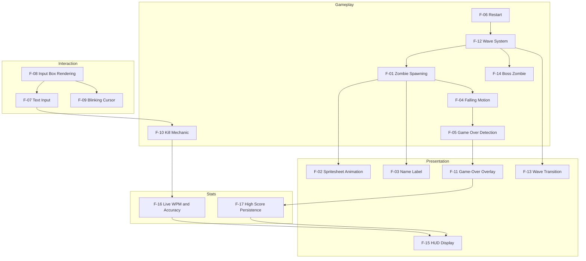
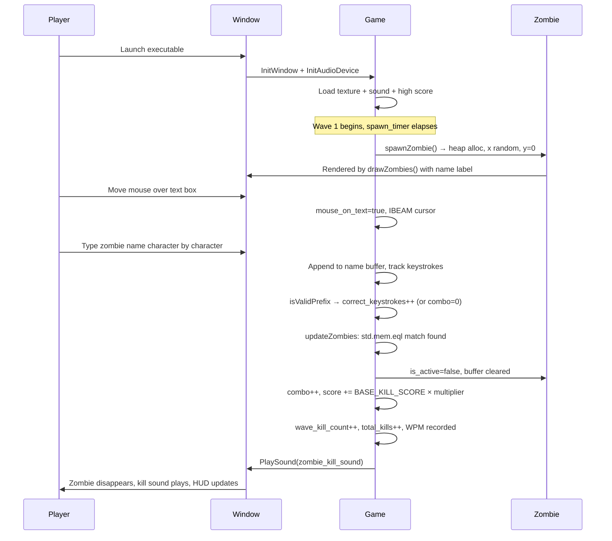
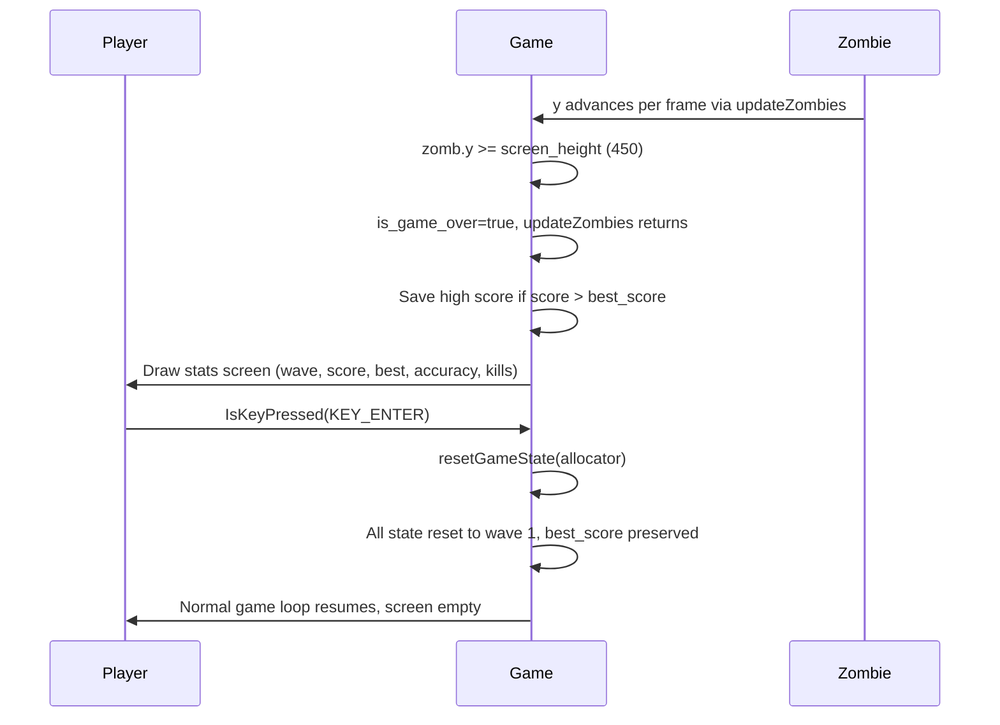
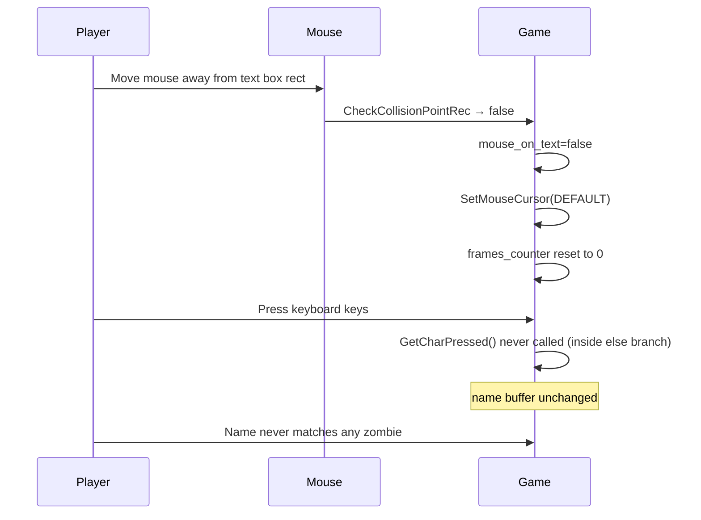
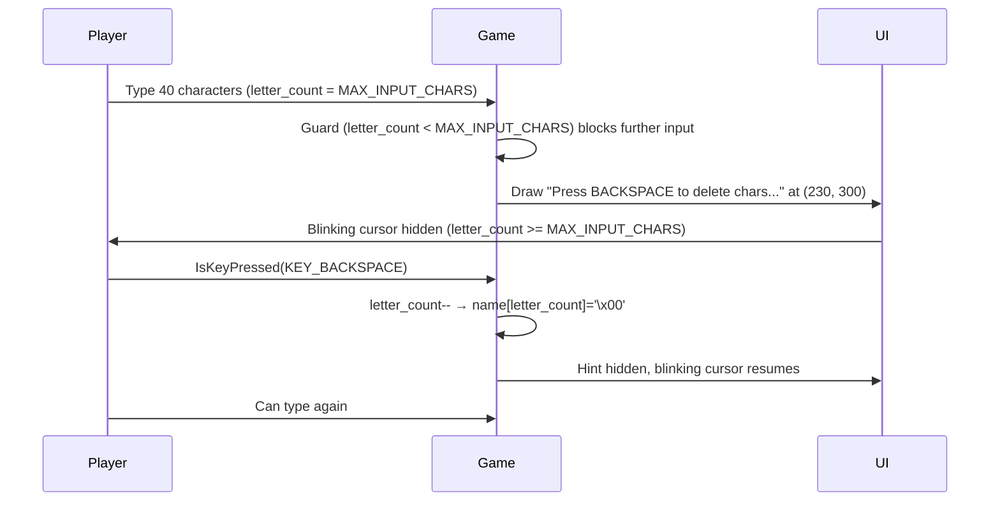
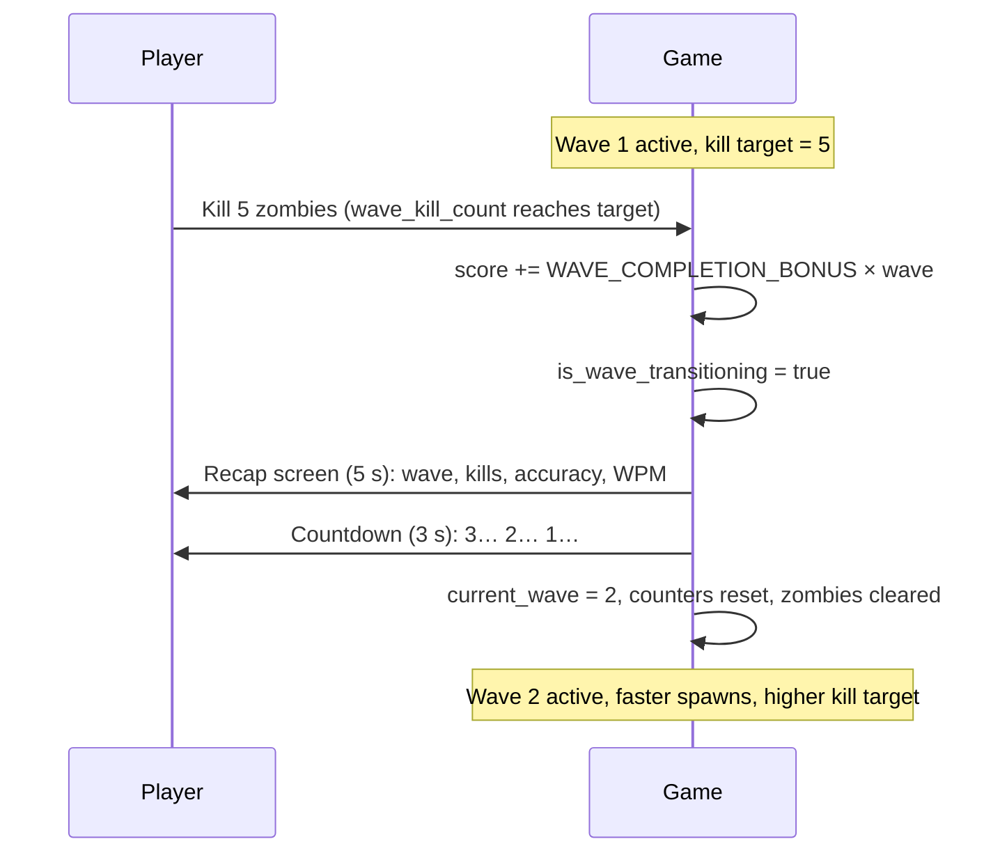
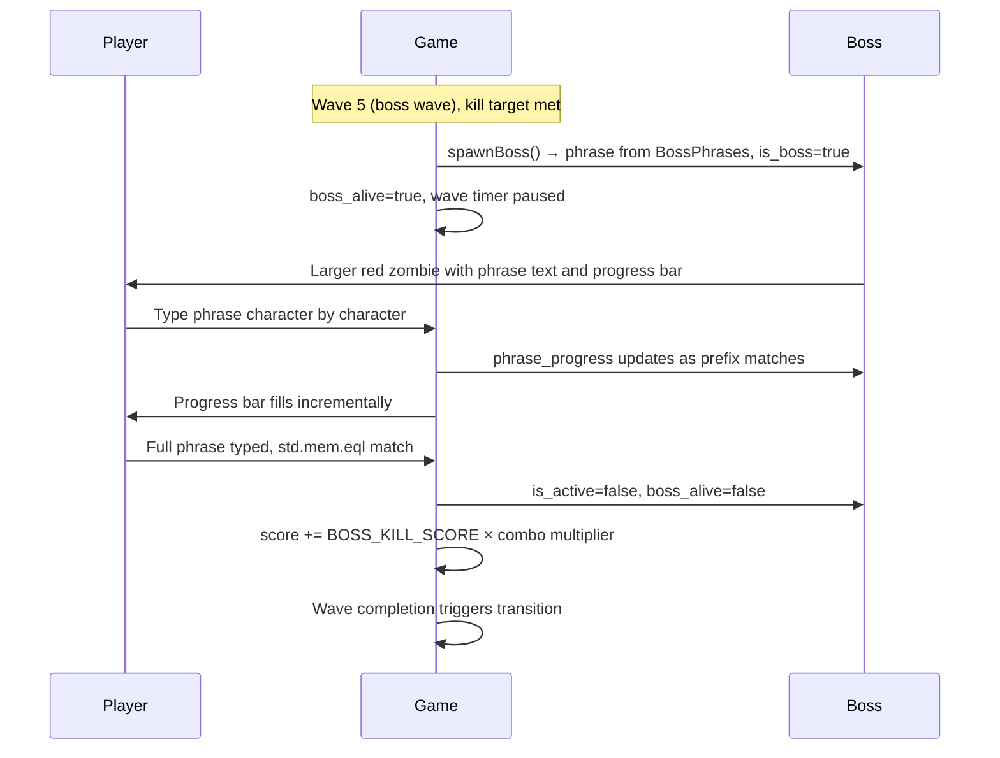
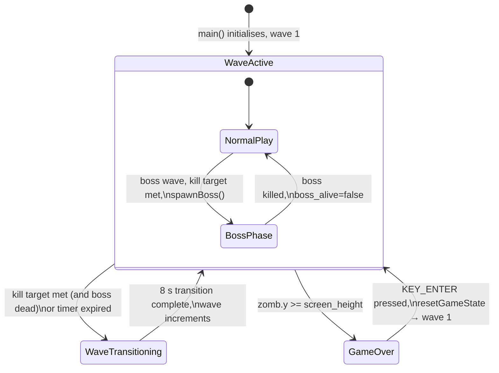
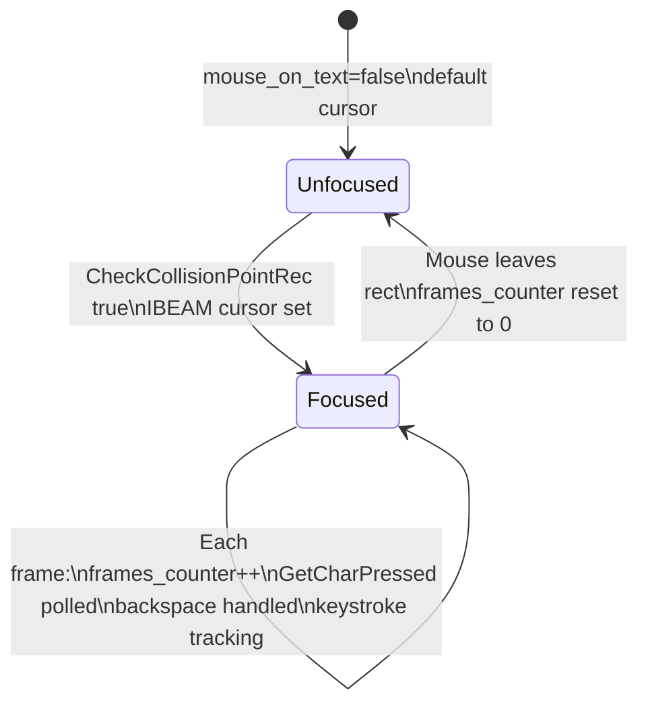

# Features

## Table of Contents

- [Feature Map](#feature-map)
- [Feature Catalog](#feature-catalog)
  - [F-01 Zombie Spawning](#f-01-zombie-spawning)
  - [F-02 Spritesheet Animation](#f-02-spritesheet-animation)
  - [F-03 Name Label Rendering](#f-03-name-label-rendering)
  - [F-04 Falling Motion](#f-04-falling-motion)
  - [F-05 Game Over Detection](#f-05-game-over-detection)
  - [F-06 Restart](#f-06-restart)
  - [F-07 Text Input](#f-07-text-input)
  - [F-08 Input Box Rendering](#f-08-input-box-rendering)
  - [F-09 Blinking Cursor](#f-09-blinking-cursor)
  - [F-10 Kill Mechanic](#f-10-kill-mechanic)
  - [F-11 Game-Over Overlay](#f-11-game-over-overlay)
  - [F-12 Wave System](#f-12-wave-system)
  - [F-13 Wave Transition](#f-13-wave-transition)
  - [F-14 Boss Zombie](#f-14-boss-zombie)
  - [F-15 HUD Display](#f-15-hud-display)
  - [F-16 Live WPM and Accuracy](#f-16-live-wpm-and-accuracy)
  - [F-17 High Score Persistence](#f-17-high-score-persistence)
- [User Journeys](#user-journeys)
  - [Journey 1: Successful Kill](#journey-1-successful-kill)
  - [Journey 2: Missed Zombie and Restart](#journey-2-missed-zombie-and-restart)
  - [Journey 3: Input Ignored Outside Text Box](#journey-3-input-ignored-outside-text-box)
  - [Journey 4: Buffer Full and Backspace](#journey-4-buffer-full-and-backspace)
  - [Journey 5: Wave Progression](#journey-5-wave-progression)
  - [Journey 6: Boss Encounter](#journey-6-boss-encounter)
- [State Machines](#state-machines)
  - [Game State](#game-state)
  - [Zombie Lifecycle State](#zombie-lifecycle-state)
  - [Input Focus State](#input-focus-state)
- [Business Rules](#business-rules)

---

## Feature Map

---

## Feature Catalog

### F-01 Zombie Spawning

**Description.** Zombie spawning is governed by the wave system. Spawn delay decreases exponentially with each wave via `waveSpawnDelay(current_wave)` (starting at 3.0 s, decaying by factor 0.85 per wave, floored at 0.5 s). The number of simultaneously active zombies is capped by `waveMaxActive(current_wave)` (starting at 5, +2 per wave, capped at 30). When the spawn timer fires, `spawnZombie` allocates a new `Zombie` struct on the heap and stores its pointer in the first available `null` slot of the fixed-size `zombies` pool. The zombie is initialised at a random horizontal position within `[ZOMBIE_SPAWN_X_MIN, ZOMBIE_SPAWN_X_MAX]` (10 to 749), at the top of the screen, with a fall speed determined by `waveFallSpeed(current_wave)`, and a randomly-chosen display name drawn from the 49-entry `ZombieNames` array. If no free slot exists or the active cap is reached, the spawn attempt returns `false`.

**User-facing behavior.** Zombies appear at the top of the window at unpredictable horizontal positions, each labelled with a different first name. The spawn rate and maximum number of on-screen zombies increase with each wave.

**System behavior.**
- `spawn_timer` is incremented each frame with `raylib.GetFrameTime()`.
- When `spawn_timer >= waveSpawnDelay(current_wave)`, `spawnZombie` is called.
- `countActiveZombies()` checks the active zombie count against `waveMaxActive(current_wave)` before proceeding; returns `false` if the cap is reached.
- `spawnZombie` iterates `zombies[0..MAX_ZOMBIES]`; the first `null` slot is filled.
- `allocator.create(Zombie)` allocates heap memory; `errdefer allocator.destroy` prevents leaks on failure.
- Horizontal position is `raylib.GetRandomValue(ZOMBIE_SPAWN_X_MIN, ZOMBIE_SPAWN_X_MAX)` cast to `f32`.
- Name index is `raylib.GetRandomValue(0, ZombieNames.len - 1)`.
- Speed is set to `waveFallSpeed(current_wave)` at spawn time.
- `spawn_timer` is reset to `0.0` only when a slot was actually claimed; when the pool is full, the timer stays hot so spawns retry next frame as soon as a slot frees.

**Key source references.**
- `src/main.zig` — `MAX_ZOMBIES = 100`, `ZOMBIE_SPAWN_X_MIN = 10`, `ZOMBIE_SPAWN_X_MAX = 749`
- `src/main.zig` — `spawn_timer` declaration
- `src/main.zig` — spawn timer increment and spawn trigger in `frame()`
- `src/main.zig` — `spawnZombie` function, `countActiveZombies` function
- `src/main.zig` — `waveSpawnDelay`, `waveMaxActive`, `waveFallSpeed` functions
- `src/zombie_names.zig` — `ZombieNames` array (49 entries)

**Dependencies.** Relies on the `ZombieNames` pool (F-03 for rendering), the allocator being available, and the `!is_game_over` and `!is_wave_transitioning` guards in the main loop. Wave parameters come from F-12.

---

### F-02 Spritesheet Animation

**Description.** Each active zombie is rendered by slicing a single horizontal spritesheet (`assets/z_spritesheet.png`) into 17 equal-width frames. An internal per-zombie timer advances the frame index by one every 0.1 simulated seconds, looping back to frame 0 after frame 16. Normal zombies are scaled to 20 % of source size with `WHITE` tint; boss zombies are scaled to 35 % with a red tint (`Color{ .r = 200, .g = 50, .b = 50, .a = 255 }`).

**User-facing behavior.** Each zombie on screen displays a continuously looping walk animation drawn from the shared spritesheet image. Boss zombies appear larger and tinted red.

**System behavior.**
- `drawZombies()` is called each frame during active gameplay (not during game-over or wave transition).
- `deltaTime` is hardcoded to `1.0 / 60.0` — not obtained from `raylib.GetFrameTime()`.
- `zomb.animation_timer += delta_time` each call; when `>= ZOMBIE_ANIMATION_FRAME_DURATION` (0.1) the frame advances.
- Frame width is `zombie_texture.width / ZOMBIE_FRAME_COUNT` (integer divide, then `f32` cast).
- Source rect: `x = zomb.frame * frame_width`, `y = 0`, full texture height.
- Scale is `0.35` for boss zombies, `0.2` for normal zombies.
- Tint is a red `Color` for boss zombies, `WHITE` for normal zombies.
- `raylib.DrawTexturePro` renders with zero rotation.

**Key source references.**
- `src/main.zig` — `ZOMBIE_FRAME_COUNT = 17`, `ZOMBIE_ANIMATION_FRAME_DURATION = 0.1`
- `src/main.zig` — texture load/unload with `defer`
- `src/main.zig` — `drawZombies` function

**Dependencies.** Requires `zombie_texture` loaded at startup (F-01 for active zombies to exist).

---

### F-03 Name Label Rendering

**Description.** Each active zombie has its `name` field — a `[*:0]const u8` pointer — drawn as text 20 pixels above the sprite's origin position. Normal zombies use `DARKGREEN` at font size 20. Boss zombies use `RED` at font size 16. Boss zombies additionally display a progress bar below the sprite (see F-14).

**User-facing behavior.** The player sees a short first name floating above each normal zombie and a longer phrase above each boss zombie, which they must type to destroy it.

**System behavior.**
- Executed inside `drawZombies()` for every active zombie.
- For normal zombies: `raylib.DrawText(zomb.name, …, 20, raylib.DARKGREEN)`.
- For boss zombies: `raylib.DrawText(zomb.name, …, 16, raylib.RED)`.
- The name pointer is passed directly; no copy is made because `[*:0]const u8` is compatible with raylib's C string parameter.

**Key source references.**
- `src/main.zig` — `name: [*:0]const u8` field in `Zombie` struct
- `src/main.zig` — label draw calls in `drawZombies` (normal and boss branches)
- `src/zombie_names.zig` — normal zombie name strings
- `src/boss_phrases.zig` — boss phrase strings

**Dependencies.** F-01 (spawn sets the name pointer), F-02 (same draw loop), F-14 (boss phrase rendering).

---

### F-04 Falling Motion

**Description.** Every frame during the update phase, each active zombie's `y` coordinate is incremented by its `speed` value. Fall speed is determined per-wave via `waveFallSpeed(current_wave)` — starting at 0.5 pixels per frame for wave 1, scaling by ×1.10 per wave, capped at 2.0. Boss zombies fall at half the wave speed (`waveFallSpeed * BOSS_FALL_SPEED_FACTOR`, where `BOSS_FALL_SPEED_FACTOR = 0.5`).

**User-facing behavior.** Zombies descend from the top of the window toward the bottom. They fall faster in later waves. Boss zombies fall noticeably slower than normal zombies.

**System behavior.**
- `updateZombies()` is called each frame when `!is_game_over` and `!is_wave_transitioning`.
- Per-zombie: `zomb.y += zomb.speed`.
- Speed is set at spawn time to `waveFallSpeed(current_wave)` for normal zombies or `waveFallSpeed(current_wave) * BOSS_FALL_SPEED_FACTOR` for bosses, and never mutated after.
- If a zombie is `!is_active` the loop continues without updating it.

**Key source references.**
- `src/main.zig` — `updateZombies` function
- `src/main.zig` — `waveFallSpeed` function, `BASE_FALL_SPEED = 0.5`, `FALL_SPEED_GROWTH = 1.10`, `MAX_FALL_SPEED = 2.0`
- `src/main.zig` — `BOSS_FALL_SPEED_FACTOR = 0.5`

**Dependencies.** F-01 (zombies must be spawned and active), F-05 (falling eventually triggers game over), F-12 (wave determines speed).

---

### F-05 Game Over Detection

**Description.** During each frame's update pass, if any active zombie's `y` position meets or exceeds `screen_height` (450), `is_game_over` is set to `true` and `updateZombies` returns immediately. This applies to both normal and boss zombies. Game over halts the entire update phase for the remainder of that frame and all subsequent frames until the player restarts.

**User-facing behavior.** When any zombie (including a boss) reaches the bottom of the screen the game freezes all zombie movement and displays the game-over stats screen.

**System behavior.**
- Inside `updateZombies`, after `zomb.y += zomb.speed`: `if (zomb.y >= screen_height)` → `is_game_over = true; return;`.
- The `return` means zombies later in the pool array are not updated this frame.
- The main loop's `if (!is_game_over)` guard prevents any further update logic.
- Draw phase still runs; `drawZombies` is skipped in favour of the game-over overlay (F-11).

**Key source references.**
- `src/main.zig` — `is_game_over` declaration, `screen_height = 450`
- `src/main.zig` — detection and early return in `updateZombies`

**Dependencies.** F-04 (falling populates `y`), F-11 (overlay rendered when true), F-06 (cleared on restart).

---

### F-06 Restart

**Description.** While the game-over screen is displayed, pressing `KEY_ENTER` calls `resetGameState(allocator)` which resets all mutable game state: input buffer cleared, spawn timer zeroed, `is_game_over` set to `false`, wave state reset to wave 1, score and combo zeroed, all stat counters cleared, and `resetZombies` frees and nulls every heap-allocated zombie in the pool. `best_score` and `best_score_loaded` are preserved across restarts within the session.

**User-facing behavior.** The player presses Enter on the game-over screen and the game immediately resumes from wave 1 with a clean state, no zombies on screen, and no score. The high score persists.

**System behavior.**
- `raylib.IsKeyPressed(raylib.KEY_ENTER)` checked only when `is_game_over` is `true`.
- `resetGameState(allocator)` performs all resets in a single call:
  - `resetZombies(allocator)` — iterates all slots: `allocator.destroy(z); zombie.* = null` for every non-null entry.
  - `is_game_over = false` re-enables the update phase.
  - `letter_count = 0; name[0] = '\x00'` clears the input buffer.
  - `spawn_timer = 0.0` resets the spawn countdown.
  - `current_wave = 1`, `wave_timer = 0.0`, `wave_kill_count = 0` reset wave state.
  - `is_wave_transitioning = false`, `wave_transition_timer = 0.0` clear transition state.
  - `boss_alive = false`, `boss_spawned_this_wave = false` clear boss state.
  - `score = 0`, `combo = 0` clear scoring.
  - `total_keystrokes = 0`, `correct_keystrokes = 0`, `total_kills = 0` clear stats.
  - `wpm_kill_times` buffer zeroed, `wpm_kill_index = 0`, `wpm_kill_count = 0`.

**Key source references.**
- `src/main.zig` — restart branch in the draw phase (KEY_ENTER check)
- `src/main.zig` — `resetGameState` function
- `src/main.zig` — `resetZombies` function

**Dependencies.** F-05 (restart is only reachable when game is over), F-11 (overlay must be visible for Enter to be processed here), F-17 (high score persists).

---

### F-07 Text Input

**Description.** Each frame the game reads characters from raylib's key-press queue and appends printable ASCII characters (codepoints 32–125) to the `name` buffer, up to a maximum of 40 characters. Backspace removes the last character. Each accepted character increments `total_keystrokes`. If the typed text is a valid prefix of any active zombie's name (checked via `isValidPrefix`), `correct_keystrokes` is also incremented; otherwise `combo` is reset to 0. Input is accepted regardless of mouse position; the mouse-over state only controls the cursor icon and the blinking-underscore overlay (F-09). Input is not processed during wave transitions.

**User-facing behavior.** The player types and characters appear in the text box. Backspace deletes the last character. Typing characters that do not match any zombie name prefix breaks the combo streak. The 40-character limit accommodates boss phrases.

**System behavior.**
- Mouse position checked each frame with `raylib.CheckCollisionPointRec`.
- `mouse_on_text = true` and `MOUSE_CURSOR_IBEAM` set on hover.
- `raylib.GetCharPressed()` polled in a `while (key > 0)` loop to drain the frame's key queue.
- Guard: `(key >= 32) and (key <= 125) and (letter_count < MAX_INPUT_CHARS)`.
- `name[letter_count] = @intCast(key)` appends the byte; `name[letter_count + 1] = '\x00'` maintains null termination.
- `total_keystrokes += 1` on every accepted character.
- `isValidPrefix(name[0..letter_count], &zombies)` checks if the typed text is a prefix of any active zombie name; if true, `correct_keystrokes += 1`; if false, `combo = 0`.
- Backspace: `IsKeyPressed(KEY_BACKSPACE) and letter_count > 0` → decrement and re-null-terminate.
- Outside text box: `mouse_on_text = false`, `MOUSE_CURSOR_DEFAULT`, `frames_counter` reset to 0.

**Key source references.**
- `src/main.zig` — `MAX_INPUT_CHARS = 40`
- `src/main.zig` — `name` buffer (41 bytes) and `letter_count`
- `src/main.zig` — input handling block in `frame()`
- `src/main.zig` — `isValidPrefix` function

**Dependencies.** F-08 (text box rect defined there), F-09 (cursor blink uses `frames_counter` incremented here), F-10 (buffer content drives kill check), F-16 (keystroke tracking feeds accuracy).

---

### F-08 Input Box Rendering

**Description.** A fixed-size rectangle at screen position (300, 400) with dimensions 225 × 50 is filled with `LIGHTGRAY` and outlined in `RED` when the mouse is over it (focused) or `DARKGRAY` when not. The currently typed text is drawn inside the box at font size 40 in `MAROON`.

**User-facing behavior.** The player sees a rectangular input area near the bottom of the screen. The border turns red to indicate focus and the typed characters are displayed inside.

**System behavior.**
- `text_box` declared as `raylib.Rectangle{ .x = screen_width / 2.0 - 100.0, .y = 400.0, .width = 225.0, .height = 50.0 }` — evaluates to `x = 300`.
- `raylib.DrawRectangleRec(text_box, raylib.LIGHTGRAY)` fills the box.
- Conditional border: `RED` when `mouse_on_text`, `DARKGRAY` otherwise.
- `raylib.DrawText(&name, text_box.x + 5, text_box.y + 8, 40, raylib.MAROON)` renders typed text.

**Key source references.**
- `src/main.zig` — `text_box` rectangle declaration in `FrameContext`
- `src/main.zig` — box and text draw calls in `frame()`

**Dependencies.** F-07 (focus state and buffer content), F-09 (blinking cursor overlaid on this box).

---

### F-09 Blinking Cursor

**Description.** When the mouse is over the text box and the buffer has not yet reached its 40-character limit, a `"_"` character is drawn immediately after the typed text. Its visibility toggles on and off every 20 frames by evaluating `(frames_counter / 20) % 2 == 0`. When the buffer is full, the blinking cursor is suppressed and a `"Press BACKSPACE to delete chars..."` hint is shown instead.

**User-facing behavior.** An underscore blinks at the insertion point while the player is focused on the text box. At maximum capacity the blink stops and a backspace reminder appears.

**System behavior.**
- `frames_counter` incremented by 1 each frame while `mouse_on_text` is true; reset to 0 when focus is lost.
- Cursor drawn when `mouse_on_text and letter_count < MAX_INPUT_CHARS and ((frames_counter / 20) % 2) == 0`.
- X position: `text_box.x + 8 + raylib.MeasureText(&name, 40)` — appended after the last typed character.
- Full-buffer hint drawn when `mouse_on_text and letter_count >= MAX_INPUT_CHARS` at fixed position (230, 300).

**Key source references.**
- `src/main.zig` — `frames_counter` field in `FrameContext`
- `src/main.zig` — counter increment/reset in `frame()`
- `src/main.zig` — cursor and hint draw conditions in `frame()`

**Dependencies.** F-07 (hover state and `letter_count`), F-08 (box position used for cursor placement).

---

### F-10 Kill Mechanic

**Description.** During the update phase, after each active zombie's position is advanced, the typed buffer is compared byte-for-byte against that zombie's name. A match causes the zombie to be marked inactive, the input buffer to be cleared, and the kill sound to be played. On kill: `combo` increments by 1, score increases by `BASE_KILL_SCORE * comboMultiplier(combo)` (100 base) for normal zombies or `BOSS_KILL_SCORE * comboMultiplier(combo)` (500 base) for bosses, `wave_kill_count` and `total_kills` increment, and the kill timestamp is recorded in the WPM circular buffer. For boss zombies, `boss_alive` is set to `false`. The zombie's heap allocation is not freed until restart or wave clear; only `is_active` is set to `false`.

**User-facing behavior.** When the player correctly types an on-screen zombie name in full, the zombie disappears, a sound effect plays, the text box is cleared, the combo counter and score increase, and (for bosses) the wave can now complete.

**System behavior.**
- `typed_name = name[0..letter_count]` creates a slice of the buffer.
- Zombie name length computed by `cstrLen(zomb.name)` (scanning for `'\x00'` sentinel).
- For boss zombies: `phrase_progress` is updated if the typed text is a prefix of the boss phrase (via `std.mem.startsWith`).
- `std.mem.eql(u8, typed_name, zomb_name_slice)` performs the exact byte comparison.
- On match: `zomb.is_active = false`, `letter_count = 0; name[0] = '\x00'`, `combo += 1`, score calculated, `wave_kill_count += 1`, `total_kills += 1`, kill time recorded in `wpm_kill_times` circular buffer, `raylib.PlaySound(zombie_kill_sound)`.
- If `zomb.is_boss`: `boss_alive = false`.
- Heap memory for the killed zombie is intentionally not freed here; only `resetZombies` frees all slots.

**Key source references.**
- `src/main.zig` — sound load/unload with `defer`
- `src/main.zig` — match and kill block in `updateZombies`
- `src/main.zig` — `comboMultiplier` function, `BASE_KILL_SCORE = 100`, `BOSS_KILL_SCORE = 500`

**Dependencies.** F-07 (input buffer provides `typed_name`), F-01 (zombies must exist), F-06 (memory freed only on restart), F-12 (wave kill count), F-16 (WPM recording).

---

### F-11 Game-Over Overlay

**Description.** When `is_game_over` is `true`, the normal zombie draw pass and HUD are replaced by a full stats screen. The overlay displays: `"GAME OVER"` in `RED` at font size 40, conditionally `"New High Score!"` in `ORANGE` when the current score meets or exceeds the best score, followed by wave reached, final score, best score, accuracy percentage, and total kills — all in `DARKGRAY` at font size 20. At the bottom, `"Press ENTER to Restart"` is shown in `GRAY` at font size 20. On the first frame of game over, the high score is saved if the current score exceeds `best_score`.

**User-facing behavior.** After losing, the player sees a comprehensive stats screen showing their performance for the session, with a high-score callout when applicable, and an instruction to press Enter to restart.

**System behavior.**
- `drawZombies()` and `drawHud()` are skipped; the game-over branch runs instead.
- High score persistence: if `score > best_score`, `best_score` is updated and `saveHighScore(score)` is called.
- `"New High Score!"` drawn when `score >= best_score and score > 0`.
- Stats drawn using `drawTextFmt()` helper: wave, score, best, accuracy %, kills.
- `"Press ENTER to Restart"` drawn at a fixed position below the stats.
- `IsKeyPressed(KEY_ENTER)` triggers `resetGameState(allocator)`.
- Input box and blinking cursor are still rendered (those draw calls are outside the conditional block).

**Key source references.**
- `src/main.zig` — game-over conditional block in `frame()`
- `src/main.zig` — `drawTextFmt` helper function
- `src/main.zig` — `saveHighScore` call

**Dependencies.** F-05 (sets `is_game_over = true`), F-06 (KEY_ENTER triggers restart), F-17 (high score saved on game over), F-16 (accuracy displayed).

---

### F-12 Wave System

**Description.** The game is organised into sequential waves starting at wave 1. Each wave has a kill target determined by `waveKillTarget(current_wave)` (starting at 5, +2 per wave, capped at 40) and a duration timer determined by `waveDuration(current_wave)` (starting at 30 s, +5 s per wave, capped at 120 s). Difficulty scales per wave: spawn delay decreases (exponential decay from 3.0 s, floor 0.5 s via `waveSpawnDelay`), fall speed increases (starting 0.5, ×1.10 per wave, cap 2.0 via `waveFallSpeed`), and active zombie cap increases (starting 5, +2 per wave, cap 30 via `waveMaxActive`). The wave timer pauses while a boss is alive. A wave ends when the kill target is met (and the boss is dead, if it is a boss wave) or when the timer expires on non-boss waves. Timer expiry clears remaining zombies via `resetZombies`. On wave completion by meeting the kill target, a bonus of `WAVE_COMPLETION_BONUS_PER_WAVE * current_wave` (200 × wave number) is added to the score.

**User-facing behavior.** The game progresses through increasingly difficult waves. Each wave has a countdown timer and a kill target. Completing the kill target awards a wave bonus. If time runs out, remaining zombies are cleared and the next wave begins. Enemies become faster, more numerous, and spawn more frequently as waves increase.

**System behavior.**
- `current_wave` starts at 1, incremented at the end of each wave transition.
- `wave_timer` incremented by `raylib.GetFrameTime()` each frame, paused when `boss_alive` is true.
- `wave_kill_count` incremented in `updateZombies` on each kill.
- Wave completion check: `wave_kill_count >= waveKillTarget(current_wave) and !boss_alive` triggers transition with score bonus.
- Timer expiry check: `wave_timer >= waveDuration(current_wave) and !boss_alive` triggers transition without bonus and clears zombies.
- On boss waves (every 5th wave), when kill target is met, `spawnBoss` is called before checking for wave completion; wave cannot end until boss is defeated.
- Difficulty functions use compile-time constants declared at module level.

**Key source references.**
- `src/main.zig` — wave state variables: `current_wave`, `wave_timer`, `wave_kill_count`, `boss_alive`, `boss_spawned_this_wave`
- `src/main.zig` — `waveKillTarget`, `waveDuration`, `waveSpawnDelay`, `waveFallSpeed`, `waveMaxActive` functions
- `src/main.zig` — wave completion and timer expiry logic in `frame()`
- `src/main.zig` — `WAVE_COMPLETION_BONUS_PER_WAVE = 200`, `BOSS_WAVE_INTERVAL = 5`

**Dependencies.** F-01 (spawning uses wave parameters), F-04 (falling speed from wave), F-10 (kill count drives wave completion), F-13 (transition between waves), F-14 (boss waves).

---

### F-13 Wave Transition

**Description.** An 8-second inter-wave screen separates consecutive waves. The first 5 seconds (`WAVE_TRANSITION_RECAP_DURATION`) display a recap showing the completed wave number, kills achieved, accuracy percentage, and WPM. The last 3 seconds (`WAVE_TRANSITION_COUNTDOWN_DURATION`) display a countdown (3, 2, 1). During the transition: no input is processed, no zombies spawn, and no zombie updates occur. After the transition completes: the wave counter increments, kill count and wave timer reset, boss state clears, and remaining zombies are freed.

**User-facing behavior.** After completing a wave, the player sees a summary of their performance followed by a countdown before the next wave begins.

**System behavior.**
- `is_wave_transitioning` flag gates all update logic; when true, only `wave_transition_timer` advances.
- `wave_transition_timer` incremented by `raylib.GetFrameTime()` each frame.
- `drawWaveTransition()` renders the recap or countdown based on timer position:
  - Timer < 5.0 s: "Wave N Complete!" in `DARKGREEN` at font size 30, kills count, accuracy %, and WPM in `DARKGRAY` at font size 20.
  - Timer >= 5.0 s: countdown number in `RED` at font size 60, computed as `ceil(WAVE_TRANSITION_TOTAL_DURATION - wave_transition_timer)`.
- When timer reaches 8.0 s: `current_wave += 1`, `wave_kill_count = 0`, `wave_timer = 0.0`, `is_wave_transitioning = false`, `boss_spawned_this_wave = false`, `resetZombies(allocator)`.

**Key source references.**
- `src/main.zig` — `WAVE_TRANSITION_RECAP_DURATION = 5.0`, `WAVE_TRANSITION_COUNTDOWN_DURATION = 3.0`, `WAVE_TRANSITION_TOTAL_DURATION = 8.0`
- `src/main.zig` — `is_wave_transitioning`, `wave_transition_timer` state variables
- `src/main.zig` — transition logic in `frame()`
- `src/main.zig` — `drawWaveTransition` function

**Dependencies.** F-12 (wave system triggers transition), F-16 (WPM and accuracy displayed in recap).

---

### F-14 Boss Zombie

**Description.** Every 5th wave (5, 10, 15, ...), after the wave's kill target is met, a boss zombie spawns via `spawnBoss()`. The boss uses a phrase from `BossPhrases` — a compile-time array of 15 curated multi-word phrases in `src/boss_phrases.zig`. The boss falls at half the wave speed (`waveFallSpeed * BOSS_FALL_SPEED_FACTOR`, where the factor is 0.5). It is rendered at 0.35 scale with a red tint. A progress bar is drawn below the boss sprite: a `LIGHTGRAY` background rectangle with a `GREEN` fill proportional to `phrase_progress / phrase_length`. The phrase text is drawn above the sprite in `RED` at font size 16. The wave cannot end until the boss is defeated. Boss typing uses the same input buffer — `phrase_progress` updates when the typed buffer is a prefix of the boss phrase. The wave timer pauses while the boss is alive.

**User-facing behavior.** On every 5th wave, a larger red-tinted boss zombie appears after clearing the normal zombies. The boss displays a multi-word phrase the player must type in full. A progress bar shows how much of the phrase has been typed. The wave timer pauses until the boss is defeated.

**System behavior.**
- Boss wave detection: `current_wave % BOSS_WAVE_INTERVAL == 0`.
- Boss spawns when `target_met and !boss_spawned_this_wave`; `boss_spawned_this_wave` prevents re-spawning.
- `spawnBoss(allocator)` picks a random phrase from `BossPhrases`, sets `is_boss = true`, `boss_alive = true`, speed to `waveFallSpeed(current_wave) * BOSS_FALL_SPEED_FACTOR`.
- In `updateZombies`: for boss zombies, `phrase_progress` is updated to `letter_count` when the typed text is a prefix of the boss phrase (`std.mem.startsWith`).
- In `drawZombies`: boss zombies rendered at scale 0.35 with red tint; progress bar drawn using `DrawRectangle` (background 80×6 px in `LIGHTGRAY`, fill in `GREEN`); phrase drawn above in `RED` at font size 16.
- Wave completion blocked while `boss_alive` is true.
- Wave timer (`wave_timer`) does not advance while `boss_alive`.

**Key source references.**
- `src/main.zig` — `BOSS_WAVE_INTERVAL = 5`, `BOSS_FALL_SPEED_FACTOR = 0.5`, `BOSS_KILL_SCORE = 500`
- `src/main.zig` — `spawnBoss` function
- `src/main.zig` — boss rendering in `drawZombies`
- `src/main.zig` — boss prefix matching and `phrase_progress` update in `updateZombies`
- `src/boss_phrases.zig` — `BossPhrases` array (15 entries)

**Dependencies.** F-12 (boss wave scheduling), F-10 (kill mechanic sets `boss_alive = false`), F-07 (input buffer drives phrase progress).

---

### F-15 HUD Display

**Description.** During active gameplay (not during wave transition or game-over), `drawHud()` renders real-time status information. Top-left: "Wave: {wave}" and "Time: {remaining}s". Top-center: "Score: {score}" and "Best: {best}" (best only shown when loaded and > 0). Top-right: "Combo: {combo} ({mult}x)" (turns `ORANGE` when combo >= 5), "WPM: {wpm}", and "Acc: {accuracy}%". The timer text turns `RED` when less than 10 seconds remain.

**User-facing behavior.** The player sees a heads-up display with the current wave, countdown timer, score, best score, combo multiplier, words per minute, and accuracy — all updating in real time.

**System behavior.**
- `drawHud()` called in the `else` branch of the game-over/transition conditional (active gameplay only).
- Uses `drawTextFmt()` helper for formatted text rendering via `std.fmt.bufPrintZ` into a 64-byte stack buffer.
- Top-left: wave number at (10, 5) font size 18 in `DARKGRAY`; timer at (10, 22) font size 16, color `RED` when remaining < 10 s, otherwise `DARKGRAY`.
- Top-center: score at `(screen_width / 2 - 60, 5)` font size 18 in `DARKGRAY`; best at `(screen_width / 2 + 60, 5)` font size 16 in `GRAY`, conditionally displayed.
- Top-right: combo at `(screen_width - 180, 5)` font size 16, color `ORANGE` when combo >= 5; WPM at `(screen_width - 90, 5)` font size 16 in `DARKGRAY`; accuracy at `(screen_width - 90, 22)` font size 16 in `DARKGRAY`.

**Key source references.**
- `src/main.zig` — `drawHud` function
- `src/main.zig` — `drawTextFmt` helper function
- `src/main.zig` — `comboMultiplier` function

**Dependencies.** F-12 (wave number, timer), F-16 (WPM and accuracy), F-17 (best score), F-10 (combo).

---

### F-16 Live WPM and Accuracy

**Description.** Words per minute (WPM) is calculated via `calculateWpm()`: it counts kill timestamps in the `wpm_kill_times` circular buffer that fall within a 30-second rolling window, then multiplies by 2 (kills per half-minute, projected to full minute). Accuracy is calculated via `accuracyPercent()`: `(correct_keystrokes * 100) / total_keystrokes`, returning 100 if no keystrokes have occurred. Both values update each frame in the HUD (F-15), the wave transition recap (F-13), and the game-over stats screen (F-11).

**User-facing behavior.** The player sees a live WPM counter and accuracy percentage that reflect their recent performance. WPM responds to bursts and lulls in typing. Accuracy tracks how often each keystroke matches a valid zombie name prefix.

**System behavior.**
- `wpm_kill_times` is a circular buffer of `WPM_BUFFER_SIZE` (200) entries storing `f64` timestamps from `raylib.GetTime()`.
- `wpm_kill_index` tracks the next write position; `wpm_kill_count` tracks how many entries have been written (capped at buffer size).
- On each kill in `updateZombies`: current time stored at `wpm_kill_times[wpm_kill_index]`, index wraps with modulo, count incremented.
- `calculateWpm` iterates the valid entries, counts those within `WPM_WINDOW_SECONDS` (30 s) of `current_time`, returns `count * 2`.
- `total_keystrokes` incremented on every accepted character in the input handler.
- `correct_keystrokes` incremented when `isValidPrefix` returns true for the typed text.
- `accuracyPercent` returns `(correct_keystrokes * 100) / total_keystrokes` or 100 when `total_keystrokes == 0`.

**Key source references.**
- `src/main.zig` — `WPM_WINDOW_SECONDS = 30.0`, `WPM_BUFFER_SIZE = 200`
- `src/main.zig` — `wpm_kill_times`, `wpm_kill_index`, `wpm_kill_count` state variables
- `src/main.zig` — `calculateWpm` function
- `src/main.zig` — `accuracyPercent` function
- `src/main.zig` — `isValidPrefix` function
- `src/main.zig` — `total_keystrokes`, `correct_keystrokes` state variables

**Dependencies.** F-07 (keystroke tracking), F-10 (kill timestamps), F-15 (displayed in HUD), F-13 (displayed in recap).

---

### F-17 High Score Persistence

**Description.** The best score persists across game sessions. At startup, `loadHighScore()` reads the saved high score: on native platforms it reads an 8-byte little-endian `u64` from `highscore.dat` via C stdio (`fopen/fread/fclose`); on the web build it reads from `localStorage` via `emscripten_run_script_int`. On game over, when the current score exceeds `best_score`, `saveHighScore(score)` writes the new high score: on native it writes 8 bytes via `fopen/fwrite/fclose`; on the web it writes via `emscripten_run_script` with `localStorage.setItem`. Errors are silently ignored in both directions. `best_score` and `best_score_loaded` persist across restarts within a session.

**User-facing behavior.** The player's highest score is remembered between sessions. On the HUD, the best score is displayed alongside the current score. On the game-over screen, the best score is shown with a "New High Score!" callout when beaten.

**System behavior.**
- `loadHighScore()` called once at startup in `main()`:
  - Native: `fopen(HIGHSCORE_FILE, "rb")`, `fread` 8 bytes, `std.mem.readInt(u64, &buf, .little)`.
  - Web: `emscripten_run_script_int(…)` reads from `localStorage`.
  - If loaded value > 0: `best_score` is set and `best_score_loaded = true`.
- `saveHighScore(score)` called on game-over first frame when `score > best_score`:
  - Native: `fopen(HIGHSCORE_FILE, "wb")`, `fwrite` 8 bytes via `std.mem.toBytes(std.mem.nativeTo(u64, s, .little))`.
  - Web: `emscripten_run_script(…)` calls `localStorage.setItem`.
- `best_score` and `best_score_loaded` are not reset by `resetGameState` — they persist across restarts.
- `HIGHSCORE_FILE = "highscore.dat"` constant for the native file name.

**Key source references.**
- `src/main.zig` — `loadHighScore` function
- `src/main.zig` — `saveHighScore` function
- `src/main.zig` — `HIGHSCORE_FILE = "highscore.dat"`
- `src/main.zig` — `best_score`, `best_score_loaded` state variables
- `src/main.zig` — high score save call in game-over block

**Dependencies.** F-11 (displayed on game-over screen), F-15 (displayed in HUD), F-06 (preserved across restarts).

---

## User Journeys

### Journey 1: Successful Kill

### Journey 2: Missed Zombie and Restart

### Journey 3: Input Ignored Outside Text Box

### Journey 4: Buffer Full and Backspace

### Journey 5: Wave Progression

### Journey 6: Boss Encounter

---

## State Machines

### Game State

### Zombie Lifecycle State

```mermaid
stateDiagram-v2
    [*] --> PoolSlotEmpty : zombies[] initialised undefined;\nnull slots = available
    PoolSlotEmpty --> Spawned : spawnZombie() allocates\nand sets is_active=true
    PoolSlotEmpty --> BossSpawned : spawnBoss() allocates\nis_boss=true, boss_alive=true
    Spawned --> Killed : std.mem.eql match\nis_active=false
    BossSpawned --> Killed : std.mem.eql match\nis_active=false, boss_alive=false
    Spawned --> ReachedBottom : zomb.y >= screen_height
    BossSpawned --> ReachedBottom : zomb.y >= screen_height
    ReachedBottom --> GameOverState : is_game_over=true
    Killed --> Freed : resetZombies on restart\nor wave clear
    Freed --> PoolSlotEmpty : zombie.*=null
    GameOverState --> Freed : KEY_ENTER → resetGameState
```

### Input Focus State

---

## Business Rules

The following rules reflect non-obvious constraints directly evidenced in `src/main.zig`.

**BR-01 — Input accepted regardless of mouse position.**
`GetCharPressed` and `IsKeyPressed(KEY_BACKSPACE)` are called every frame while `!is_game_over` and `!is_wave_transitioning`, independent of the mouse-over hit test. The mouse-over state only controls the cursor icon (F-07) and the blinking-underscore overlay (F-09).

**BR-02 — Only printable ASCII accepted.**
The guard `(key >= 32) and (key <= 125)` filters out control characters, extended Unicode codepoints, and all non-printable values.

**BR-03 — Hard cap of 40 characters.**
`MAX_INPUT_CHARS = 40`. The same guard enforces the cap: once `letter_count == 40` no further characters are appended. The extended limit (from 9) accommodates boss phrases.

**BR-04 — Match is byte-exact.**
`std.mem.eql(u8, typed_name, zomb_name_slice)` performs a case-sensitive, length-sensitive comparison with no normalisation. One wrong character or extra space prevents a kill.

**BR-05 — Zombie name length computed at match time.**
There is no pre-computed length field; `updateZombies` calls `cstrLen` (scanning for `'\x00'`) on every frame for every active zombie.

**BR-06 — Killed zombies are not freed until restart or wave clear (intentional memory hold).**
`zomb.is_active = false` is the only mutation on kill. `allocator.destroy` is never called for a killed zombie during normal play within a wave. Memory is reclaimed by `resetZombies` on restart, wave transition completion, or timer expiry.

**BR-07 — Pool full keeps spawn timer hot.**
`spawnZombie` iterates the pool looking for a `null` slot and returns `true` on claim, `false` when the pool is full or the active cap is reached. The caller only resets `spawn_timer` on a successful spawn, so a full pool retries every frame until a slot frees instead of silently stalling spawns.

**BR-08 — Spawn x is bounded to [10, 749], not [0, 800).**
`raylib.GetRandomValue(ZOMBIE_SPAWN_X_MIN, ZOMBIE_SPAWN_X_MAX)` where `ZOMBIE_SPAWN_X_MIN = 10` and `ZOMBIE_SPAWN_X_MAX = screen_width - 51 = 749`, leaving margins so zombies stay fully on-screen.

**BR-09 — Animation uses hardcoded deltaTime, not actual frame time.**
`drawZombies` sets `const delta_time = 1.0 / 60.0` rather than calling `raylib.GetFrameTime()`. At frame rates other than 60 FPS the animation speed will be incorrect (too fast above 60 FPS, too slow below).

**BR-10 — Game-over short-circuits remaining zombie updates.**
`updateZombies` calls `return` immediately after setting `is_game_over = true`. Zombies later in the pool array are not advanced or kill-checked on the triggering frame.

**BR-11 — Combo resets on invalid prefix.**
When a keystroke is accepted and `isValidPrefix` returns false (the typed buffer is not a prefix of any active zombie's name), `combo` is immediately reset to 0. This penalises mistyped characters by breaking the score multiplier streak.

**BR-12 — Wave timer pauses while boss alive.**
The `wave_timer += dt` call is guarded by `!boss_alive`. While the boss is on screen, the wave duration countdown does not advance, giving the player unlimited time (minus the falling threat) to type the boss phrase.

**BR-13 — Boss immune from wave timer expiry but not from game over.**
When the wave timer expires, remaining non-boss zombies are cleared, but a boss zombie can only be removed by the player typing its full phrase — or by it reaching the bottom of the screen, which triggers game over (F-05). The timer expiry logic is gated by `!boss_alive`.

**BR-14 — Wave cannot complete until boss defeated on boss waves.**
The wave completion check requires `!boss_alive` in addition to the kill target being met. If the kill target is reached on a boss wave, the boss spawns and the wave enters a boss phase that blocks the transition until `boss_alive` becomes false.

**BR-15 — High score is monotonically increasing.**
`saveHighScore` is called only when `score > best_score` (strict greater-than). Equal scores do not trigger a save. `best_score` and `best_score_loaded` survive restarts within a session.

**BR-16 — Active zombie cap checked before spawn.**
`countActiveZombies()` counts every zombie where `is_active == true`. If the count meets or exceeds `waveMaxActive(current_wave)`, `spawnZombie` returns `false` without allocating, even if pool slots are available.
