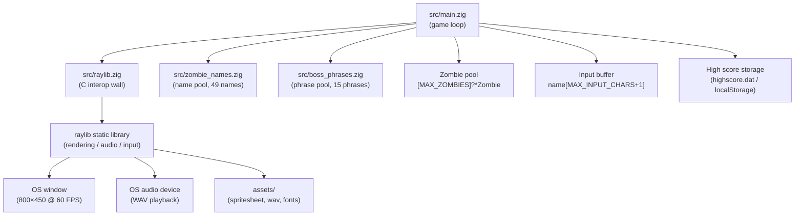
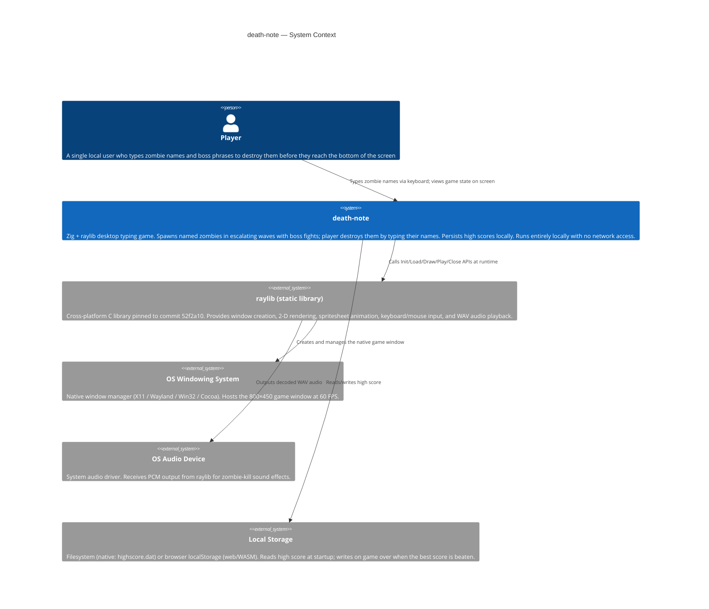

# Table of Contents

- [Project Summary](#project-summary)
- [Tech Stack](#tech-stack)
- [Architecture Overview](#architecture-overview)
- [Directory Structure](#directory-structure)
- [Development Setup](#development-setup)
- [Key Conventions](#key-conventions)
- [System Context Diagram](#system-context-diagram)
- [Component Inventory](#component-inventory)
- [Detailed Specifications](#detailed-specifications)

---

## Project Summary

death-note is a keyboard-driven typing game built with Zig and raylib. Zombies fall from the top of an 800x450 window in successive waves of increasing difficulty; the player destroys each zombie by clicking the input box and typing the zombie's displayed name exactly before it reaches the bottom of the screen. Every fifth wave spawns a boss zombie that requires typing a longer phrase. A missed zombie triggers game over, which displays a stats screen (score, wave, accuracy, kills) and saves the high score to disk; pressing Enter restarts the round.

The game is a single-file-dominant desktop application aimed at anyone who wants a minimalist, fast-compilation typing challenge. High scores persist across sessions via a `highscore.dat` file on native builds and a `localStorage` entry on the web/WASM target. There is no server and no network component: the entire experience runs locally from a single native executable (`death-note`) built with Zig's integrated build system.

Core value comes from simplicity and hackability. The game logic lives in roughly 980 lines of idiomatic Zig (`src/main.zig`), with raylib handling all windowing, rendering, audio, and input. Wave-scaling curves, scoring constants, combo multipliers, and spawn rates can be tuned by editing the compile-time constants at the top of that file, making the project an accessible starting point for Zig and raylib learners.

---

## Tech Stack

| Category | Technology | Version | Role |
|---|---|---|---|
| Language | Zig | Toolchain default (no `.zig-version` pinned) | Primary implementation language; compiles, type-checks, and links the game |
| Build system | Zig built-in (`build.zig`) | Same as language toolchain | Declarative build graph: executable, test step, raylib linkage, install step |
| Package manifest | `build.zig.zon` | Same as language toolchain | Declares and pins the single external dependency (raylib) by URL and content hash |
| Graphics / windowing / input / audio | raylib | Pinned to commit `52f2a10db610d0e9f619fd7c521db08a876547d0` | Window management, 2-D rendering, spritesheet animation, keyboard/mouse input, WAV playback |
| C interop layer | `@cImport` (Zig built-in) | Same as language toolchain | Imports `raylib.h`, `raymath.h`, `rlgl.h`, and (for WASM target) `emscripten/emscripten.h`; walled off in `src/raylib.zig` |
| WebAssembly toolchain | Emscripten SDK | Pinned to `3.1.64` (build-time only; not required for native builds) | Compiles the game to WASM and provides WebGL / audio / input browser glue for the `zig build web` target |
| Allocator | `std.heap.page_allocator` (Zig stdlib) | Same as language toolchain | Allocates individual `Zombie` structs at spawn time; freed on death or reset |
| Random number generation | `std.Random.DefaultPrng` / `Xoshiro256` (Zig stdlib) | Same as language toolchain | Picks zombie spawn X position and name index |
| Font | JetBrains Mono Nerd Font Thin (`assets/JetBrainsMonoNerdFont-Thin.ttf`) | Bundled asset | Available for UI text rendering |
| Audio asset | `assets/zombie-hit.wav` | Bundled asset | Played via raylib when a zombie is killed |
| Sprite asset | `assets/z_spritesheet.png` | Bundled asset | 17-frame horizontal spritesheet for zombie walk animation |

---

## Architecture Overview

death-note follows a classic game-loop architecture: initialize resources, loop over update-then-draw, teardown on exit. There are no layers of abstraction beyond a thin C-interop wall. The entire gameplay surface lives in `src/main.zig`; `src/raylib.zig` re-exports raylib symbols; `src/zombie_names.zig` supplies the regular-zombie name pool; `src/boss_phrases.zig` supplies the boss-zombie phrase pool.



The update phase is multi-state: the `frame()` function branches on `is_game_over` and `is_wave_transitioning` to select among three modes. During an **active wave**, `spawnZombie` fires at a wave-scaled interval (`waveSpawnDelay(current_wave)`) and writes into the first null slot in `zombies`. `updateZombies` advances each active zombie's `y`, checks for a typed-name match via `std.mem.eql`, awards combo-scaled score on kill, and sets `is_game_over = true` if any zombie crosses `screen_height`. Every fifth wave, once the kill target is met, `spawnBoss` places a boss zombie that uses a longer phrase from `BossPhrases` and falls at half speed. When the wave ends (kill target met or timer expired), the game enters **wave transitioning**: a recap screen (5 s) showing kills, accuracy, and WPM, followed by a countdown (3 s) before the next wave starts with reset zombies. On **game over**, the draw phase displays a stats screen (wave, score, best, accuracy, kills), saves the high score if it was beaten, and waits for Enter to call `resetGameState` which frees all allocations and resets every state variable. The HUD during gameplay shows wave number, score, best score, combo multiplier, live WPM, accuracy, and a wave countdown timer.

---

## Directory Structure

```
death-note/
├── build.zig              # Declarative build graph: exe, test step, raylib linkage, web (WASM) step, install
├── build.zig.zon          # Package manifest; pins raylib by URL + SHA content hash (read-only)
├── CLAUDE.md              # Project conventions, commands, architecture reference for contributors and AI agents
├── README.md              # One-line project description + web deployment link
├── .gitignore             # Standard Zig ignores (zig-cache/, zig-out/)
├── .github/
│   └── workflows/
│       └── deploy-web.yml # GitHub Actions: build WASM bundle + publish to GitHub Pages on push to main
├── .ai-board/
│   ├── config.yml         # ai-board harness configuration
│   └── memory/
│       └── constitution.md  # Governance, code patterns, testing standards, security rules
└── src/
│   ├── main.zig           # Entry point, game loop, wave system, boss fights, scoring, HUD, stats, high score persistence, input handling, rendering; FrameContext struct for WASM loop
│   ├── raylib.zig         # Thin @cImport wrapper; sole location for C header imports (includes emscripten.h on web target)
│   ├── zombie_names.zig   # Compile-time array of 49 zero-terminated C-string zombie names
│   ├── boss_phrases.zig   # Compile-time array of 15 zero-terminated C-string boss phrases
│   └── web/
│       └── shell.html     # Emscripten HTML shell: loading spinner, WebGL guard, canvas focus
└── assets/
    ├── z_spritesheet.png           # 17-frame horizontal walk-cycle spritesheet for zombies
    ├── zombie-hit.wav              # Sound effect played on zombie kill
    ├── JetBrainsMonoNerdFont-Thin.ttf  # Bundled font
    ├── alagard.png                 # Bundled image asset
    ├── page.png                    # Bundled image asset
    ├── plume.png                   # Bundled image asset
    └── spritesheet.png             # Bundled spritesheet asset
```

---

## Development Setup

All commands are run from the repository root. The game must be run from the root (or via `zig build run`) so that relative asset paths (`assets/…`) resolve correctly.

| Purpose | Command |
|---|---|
| Build (install to `zig-out/`) | `zig build` |
| Build and run the game | `zig build run` |
| Pass arguments to the game | `zig build run -- <args>` |
| Run unit tests | `zig build test` |
| **Build WebAssembly bundle** (requires Emscripten SDK 3.1.64) | `zig build web` |
| Web release build (recommended for deploy) | `zig build web -Doptimize=ReleaseSmall` |
| Serve web bundle locally | `python3 -m http.server 8000 --directory zig-out/web` |
| Type-check (compile without running) | `zig build --summary all` |
| Format check | `zig fmt --check .` |
| Release build (optimize for speed) | `zig build -Doptimize=ReleaseFast` |
| Release build (raylib separately optimized) | `zig build -Draylib-optimize=ReleaseFast` |
| Strip debug info | `zig build -Dstrip=true` |
| List all build steps | `zig build --help` |

No separate dependency installation step is needed for native builds: `zig build` fetches and compiles the pinned raylib commit automatically via the Zig package manager. For the `web` target, the Emscripten SDK (`emsdk`) must be installed and activated separately — see `specs/DEATHN-1-build-and-deploy/deployment-guide.md` for step-by-step instructions.

---

## Key Conventions

The following conventions are derived from `CLAUDE.md` and `.ai-board/memory/constitution.md` and are enforced across all source changes.

**Resource lifecycle.** Every `Init…` / `Load…` call is immediately followed on the next line by a `defer Close…` / `Unload…`. This guarantees deterministic cleanup without relying on process exit. New resource loads must follow this idiom without exception.

**C interop wall.** `@cImport` appears only in `src/raylib.zig`. All game code imports that wrapper module and uses its re-exported symbols. Do not add `@cImport` anywhere else.

**Named compile-time constants.** Magic numbers are not permitted inline. All tunables are declared at the top of `src/main.zig`. These include original constants (`MAX_ZOMBIES`, `MAX_INPUT_CHARS`, `ZOMBIE_FRAME_COUNT`, `screen_width`, `screen_height`) and wave/scoring/difficulty constants (`BASE_SPAWN_DELAY`, `SPAWN_DELAY_DECAY`, `MIN_SPAWN_DELAY`, `BASE_FALL_SPEED`, `FALL_SPEED_GROWTH`, `MAX_FALL_SPEED`, `BASE_MAX_ACTIVE`, `CAP_MAX_ACTIVE`, `BASE_KILL_TARGET`, `CAP_KILL_TARGET`, `BASE_WAVE_DURATION`, `CAP_WAVE_DURATION`, `BOSS_WAVE_INTERVAL`, `BOSS_FALL_SPEED_FACTOR`, `BASE_KILL_SCORE`, `BOSS_KILL_SCORE`, `WAVE_COMPLETION_BONUS_PER_WAVE`, `WPM_WINDOW_SECONDS`). Spawn delay is no longer a simple constant — it is computed per-wave by `waveSpawnDelay(current_wave)`. New tunables follow the same pattern.

**Naming discipline.**
- Variables and runtime state: `snake_case` (`spawn_timer`, `is_game_over`, `letter_count`).
- Compile-time constants: `SCREAMING_SNAKE_CASE` (`MAX_ZOMBIES`, `ZOMBIE_FRAME_COUNT`).
- Functions: `camelCase` (`spawnZombie`, `spawnBoss`, `updateZombies`, `drawZombies`, `drawHud`, `drawWaveTransition`, `resetZombies`, `resetGameState`, `waveSpawnDelay`, `waveFallSpeed`, `waveMaxActive`, `waveKillTarget`, `waveDuration`, `comboMultiplier`, `calculateWpm`, `accuracyPercent`, `loadHighScore`, `saveHighScore`, `isValidPrefix`).
- Types: `PascalCase` (`Zombie`, `ZombieNames`, `BossPhrases`, `FrameContext`).
- Upstream raylib identifiers: kept in original C casing (`InitWindow`, `DrawTexturePro`).

**Optional pointer unwrapping.** Zombie slots are `?*Zombie` and must be unwrapped with `if (zombie) |zomb| { … }`. Force-unwrapping via `.?` is not used in gameplay code.

**Allocator threading.** Functions that allocate (`spawnZombie`, `spawnBoss`, `resetZombies`, `resetGameState`) accept `allocator: *std.mem.Allocator` as a parameter. Helpers do not reach into `std.heap.page_allocator` directly, enabling allocator substitution (e.g. arena allocator in tests). On the `wasm32-emscripten` target, `std.heap.c_allocator` is used instead of `page_allocator` because Emscripten lacks a `posix.mmap` backend.

**Error handling.** Fallible functions return `!T` and are called with `try`. Allocation success paths use `errdefer allocator.destroy(…)` to prevent leaks on partial failure. `catch unreachable` is not used in gameplay code.

**Fixed-size pools.** Entities live in a compile-time-bounded slot array (`[MAX_ZOMBIES]?*Zombie`) with an `is_active` flag. When adding new entity kinds, apply the same pattern. Capacity changes are made by adjusting the constant, not the data structure.

**Bounded input.** The typing buffer write site checks both character class (`key >= 32 and key <= 125`) and length (`letter_count < MAX_INPUT_CHARS`) before writing. All new text-input surfaces must enforce the same two guards at the write site.

**C-string length.** Zombie names (`[*:0]const u8`) have their length computed by scanning to `'\x00'`. Comparisons use `std.mem.eql(u8, slice_a, slice_b)`, never raw pointer arithmetic.

**Asset paths are literals.** `LoadTexture` and `LoadSound` are called only with constant string literals from `assets/`. Asset paths are never derived from runtime input.

**Dependency pinning.** `build.zig.zon` pins raylib by both commit URL and content hash. Bumps must update both fields together and are subject to review.

**Formatting and compilation gate.** `zig build` (which compiles and type-checks) is the required gate before merge. Run `zig fmt` on files you touch. No separate linter is configured.

---

## System Context Diagram



---

## Component Inventory

| Module | Path | Responsibility | Dependencies | Public Surface Area |
|---|---|---|---|---|
| Game entry point and loop | `src/main.zig` | Seeds PRNG, initializes window and audio device, loads high score, runs the multi-state update-draw loop (active wave / wave transition / game over), manages zombie and boss lifecycle (spawn / update / draw / reset), handles wave progression and difficulty scaling, tracks combo scoring and player stats (WPM, accuracy), persists high scores, handles text input | `src/raylib.zig`, `src/zombie_names.zig`, `src/boss_phrases.zig`, Zig stdlib (`std.Random`, `std.heap`, `std.mem`, `std.time`, `std.math`, `std.fmt`) | `pub fn main() !void` (executable entry point); all other declarations are file-private |
| raylib C interop wrapper | `src/raylib.zig` | Sole location for `@cImport`; re-exports all symbols from `raylib.h`, `raymath.h`, and `rlgl.h` under the `raylib` namespace | raylib static library headers (`raylib.h`, `raymath.h`, `rlgl.h`) | `pub const c = @cImport(…)` — the entire raylib, raymath, and rlgl C API surface |
| Zombie name pool | `src/zombie_names.zig` | Provides a compile-time array of 49 null-terminated C-string first names used as regular zombie display names and kill targets | None | `pub const ZombieNames: [49][*:0]const u8` |
| Boss phrase pool | `src/boss_phrases.zig` | Provides a compile-time array of 15 null-terminated C-string phrases used as boss zombie display text during boss fights every 5 waves | None | `pub const BossPhrases: [15][*:0]const u8` |
| Build graph | `build.zig` | Declares the `death-note` executable, wires raylib as a static dependency, exposes `run`, `test`, and `web` build steps, propagates `optimize`, `raylib-optimize`, and `strip` options | Zig build system stdlib, `build.zig.zon` (raylib dependency) | `pub fn build(b: *std.Build) void` — consumed by `zig build` |
| Web HTML shell | `src/web/shell.html` | Emscripten `--shell-file`; renders a loading spinner until `Module.onRuntimeInitialized`, performs WebGL availability detection, and ensures the canvas captures keyboard focus on click | None (static HTML/CSS/JS — no external dependencies per FR-011) | Consumed by the `web` build step via `emcc --shell-file` |
| CI/CD workflow | `.github/workflows/deploy-web.yml` | GitHub Actions pipeline: installs pinned Zig and Emscripten toolchains, runs `zig build test` as a gate, builds the WASM bundle with `zig build web -Doptimize=ReleaseSmall`, and publishes the output to GitHub Pages | GitHub Actions, `actions/upload-pages-artifact`, `actions/deploy-pages` | Triggered by push to `main` and `workflow_dispatch` |

---

## Detailed Specifications

The sections below link to companion specification documents generated alongside this overview. Each document covers its domain in full; cross-reference them when making targeted changes.

| Document | Path | Covers |
|---|---|---|
| Architecture | [architecture.md](architecture.md) | Component relationships, data-flow diagrams, game-loop sequencing, memory layout, spawn and kill lifecycle state machines |
| Data Model | [data-model.md](data-model.md) | `Zombie` struct fields and invariants, `ZombieNames` pool, input buffer layout, global state variables, allocator contract |
| Endpoints | [endpoints.md](endpoints.md) | Not applicable — death-note has no API, network interface, or IPC surface |
| Workflows | [workflows.md](workflows.md) | Build workflow, run workflow, test workflow, game-over and restart workflow, zombie spawn and kill workflow |
| Features | [features.md](features.md) | 17 features covering falling-zombie mechanic, typed-name matching, animated spritesheet rendering, sound-on-kill, game-over detection, restart on Enter, input box with cursor blink and backspace, wave progression with difficulty scaling, boss fights, combo scoring, HUD overlay, live WPM and accuracy stats, wave transition recap screens, and persistent high scores |
| Testing | [testing.md](testing.md) | Zig built-in test runner setup, test discovery rules (reachability from `src/main.zig`), coverage expectations, PRNG seeding for deterministic tests, manual-test requirements for rendering and audio changes |
