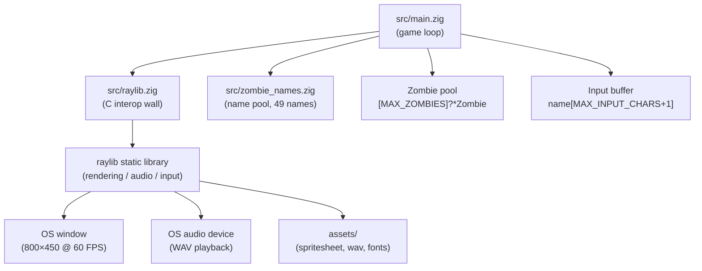
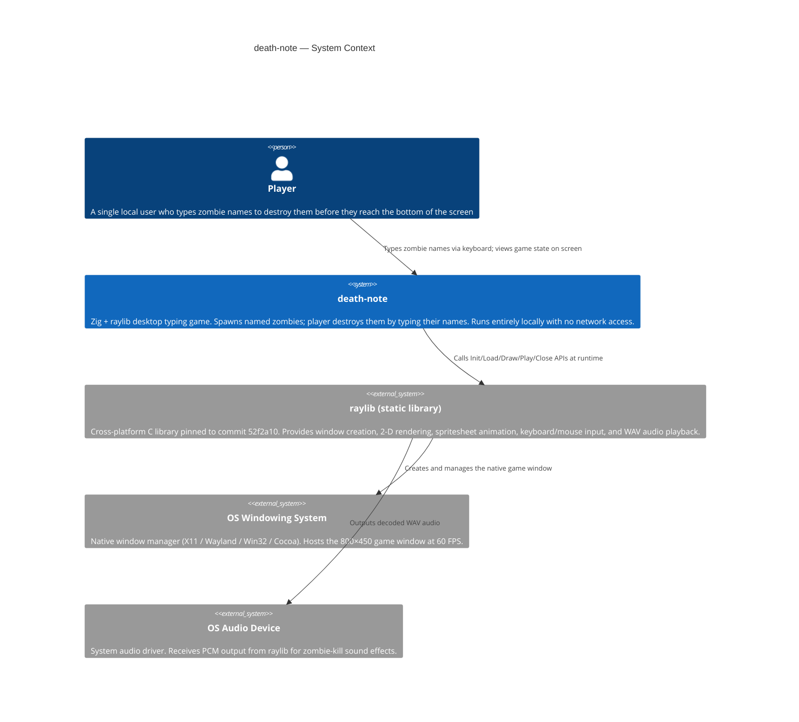

# Table of Contents

- [Project Summary](#project-summary)
- [Tech Stack](#tech-stack)
- [Architecture Overview](#architecture-overview)
- [Directory Structure](#directory-structure)
- [Development Setup](#development-setup)
- [Key Conventions](#key-conventions)
- [System Context Diagram](#system-context-diagram)
- [Component Inventory](#component-inventory)
- [Detailed Specifications](#detailed-specifications)

---

## Project Summary

death-note is a keyboard-driven typing game built with Zig and raylib. Zombies fall from the top of an 800x450 window; the player destroys each zombie by clicking the input box and typing the zombie's displayed name exactly before it reaches the bottom of the screen. A missed zombie triggers game over, and pressing Enter restarts the round.

The game is a single-file-dominant desktop application aimed at anyone who wants a minimalist, fast-compilation typing challenge. There is no server, no persistence, and no network component: the entire experience runs locally from a single native executable (`death-note`) built with Zig's integrated build system.

Core value comes from simplicity and hackability. The entire game logic lives in roughly 300 lines of idiomatic Zig (`src/main.zig`), with raylib handling all windowing, rendering, audio, and input. New zombie names, speed curves, or spawn rates can be tuned by editing a handful of compile-time constants at the top of that file, making the project an accessible starting point for Zig and raylib learners.

---

## Tech Stack

| Category | Technology | Version | Role |
|---|---|---|---|
| Language | Zig | Toolchain default (no `.zig-version` pinned) | Primary implementation language; compiles, type-checks, and links the game |
| Build system | Zig built-in (`build.zig`) | Same as language toolchain | Declarative build graph: executable, test step, raylib linkage, install step |
| Package manifest | `build.zig.zon` | Same as language toolchain | Declares and pins the single external dependency (raylib) by URL and content hash |
| Graphics / windowing / input / audio | raylib | Pinned to commit `52f2a10db610d0e9f619fd7c521db08a876547d0` | Window management, 2-D rendering, spritesheet animation, keyboard/mouse input, WAV playback |
| C interop layer | `@cImport` (Zig built-in) | Same as language toolchain | Imports `raylib.h`, `raymath.h`, and `rlgl.h`; walled off in `src/raylib.zig` |
| Allocator | `std.heap.page_allocator` (Zig stdlib) | Same as language toolchain | Allocates individual `Zombie` structs at spawn time; freed on death or reset |
| Random number generation | `std.Random.DefaultPrng` / `Xoshiro256` (Zig stdlib) | Same as language toolchain | Picks zombie spawn X position and name index |
| Font | JetBrains Mono Nerd Font Thin (`assets/JetBrainsMonoNerdFont-Thin.ttf`) | Bundled asset | Available for UI text rendering |
| Audio asset | `assets/zombie-hit.wav` | Bundled asset | Played via raylib when a zombie is killed |
| Sprite asset | `assets/z_spritesheet.png` | Bundled asset | 17-frame horizontal spritesheet for zombie walk animation |

---

## Architecture Overview

death-note follows a classic game-loop architecture: initialize resources, loop over update-then-draw, teardown on exit. There are no layers of abstraction beyond a thin C-interop wall. The entire gameplay surface lives in `src/main.zig`; `src/raylib.zig` re-exports raylib symbols; `src/zombie_names.zig` supplies the name pool.



The update phase runs only when `is_game_over` is false. `spawnZombie` fires every `spawn_delay` (3.0 s) and writes into the first null slot in `zombies`. `updateZombies` advances each active zombie's `y`, checks for a typed-name match via `std.mem.eql`, and sets `is_game_over = true` if any zombie crosses `screen_height`. `drawZombies` renders the spritesheet frame and name label for every active zombie. On game over, the draw phase shows a restart prompt; pressing Enter calls `resetZombies` to free all allocations and clears the input buffer.

---

## Directory Structure

```
death-note/
├── build.zig              # Declarative build graph: exe, test step, raylib linkage, install
├── build.zig.zon          # Package manifest; pins raylib by URL + SHA content hash
├── CLAUDE.md              # Project conventions, commands, architecture reference for contributors and AI agents
├── README.md              # One-line project description
├── .gitignore             # Standard Zig ignores (zig-cache/, zig-out/)
├── .ai-board/
│   ├── config.yml         # ai-board harness configuration
│   └── memory/
│       └── constitution.md  # Governance, code patterns, testing standards, security rules
└── src/
│   ├── main.zig           # Entry point, game loop, zombie lifecycle, input handling, rendering (~293 lines)
│   ├── raylib.zig         # Thin @cImport wrapper; sole location for C header imports
│   └── zombie_names.zig   # Compile-time array of 49 zero-terminated C-string zombie names
└── assets/
    ├── z_spritesheet.png           # 17-frame horizontal walk-cycle spritesheet for zombies
    ├── zombie-hit.wav              # Sound effect played on zombie kill
    ├── JetBrainsMonoNerdFont-Thin.ttf  # Bundled font
    ├── alagard.png                 # Bundled image asset
    ├── page.png                    # Bundled image asset
    ├── plume.png                   # Bundled image asset
    └── spritesheet.png             # Bundled spritesheet asset
```

---

## Development Setup

All commands are run from the repository root. The game must be run from the root (or via `zig build run`) so that relative asset paths (`assets/…`) resolve correctly.

| Purpose | Command |
|---|---|
| Build (install to `zig-out/`) | `zig build` |
| Build and run the game | `zig build run` |
| Pass arguments to the game | `zig build run -- <args>` |
| Run unit tests | `zig build test` |
| Type-check (compile without running) | `zig build --summary all` |
| Format check | `zig fmt --check .` |
| Release build (optimize for speed) | `zig build -Doptimize=ReleaseFast` |
| Release build (raylib separately optimized) | `zig build -Draylib-optimize=ReleaseFast` |
| Strip debug info | `zig build -Dstrip=true` |
| List all build steps | `zig build --help` |

No separate dependency installation step is needed: `zig build` fetches and compiles the pinned raylib commit automatically via the Zig package manager.

---

## Key Conventions

The following conventions are derived from `CLAUDE.md` and `.ai-board/memory/constitution.md` and are enforced across all source changes.

**Resource lifecycle.** Every `Init…` / `Load…` call is immediately followed on the next line by a `defer Close…` / `Unload…`. This guarantees deterministic cleanup without relying on process exit. New resource loads must follow this idiom without exception.

**C interop wall.** `@cImport` appears only in `src/raylib.zig`. All game code imports that wrapper module and uses its re-exported symbols. Do not add `@cImport` anywhere else.

**Named compile-time constants.** Magic numbers are not permitted inline. All tunables (`MAX_ZOMBIES`, `MAX_INPUT_CHARS`, `ZOMBIE_FRAME_COUNT`, `spawn_delay`, `screen_width`, `screen_height`) are declared at the top of `src/main.zig`. New tunables follow the same pattern.

**Naming discipline.**
- Variables and runtime state: `snake_case` (`spawn_timer`, `is_game_over`, `letter_count`).
- Compile-time constants: `SCREAMING_SNAKE_CASE` (`MAX_ZOMBIES`, `ZOMBIE_FRAME_COUNT`).
- Functions: `camelCase` (`spawnZombie`, `updateZombies`, `drawZombies`, `resetZombies`).
- Types: `PascalCase` (`Zombie`, `ZombieNames`).
- Upstream raylib identifiers: kept in original C casing (`InitWindow`, `DrawTexturePro`).

**Optional pointer unwrapping.** Zombie slots are `?*Zombie` and must be unwrapped with `if (zombie) |zomb| { … }`. Force-unwrapping via `.?` is not used in gameplay code.

**Allocator threading.** Functions that allocate (`spawnZombie`, `resetZombies`) accept `allocator: *std.mem.Allocator` as a parameter. Helpers do not reach into `std.heap.page_allocator` directly, enabling allocator substitution (e.g. arena allocator in tests).

**Error handling.** Fallible functions return `!T` and are called with `try`. Allocation success paths use `errdefer allocator.destroy(…)` to prevent leaks on partial failure. `catch unreachable` is not used in gameplay code.

**Fixed-size pools.** Entities live in a compile-time-bounded slot array (`[MAX_ZOMBIES]?*Zombie`) with an `is_active` flag. When adding new entity kinds, apply the same pattern. Capacity changes are made by adjusting the constant, not the data structure.

**Bounded input.** The typing buffer write site checks both character class (`key >= 32 and key <= 125`) and length (`letter_count < MAX_INPUT_CHARS`) before writing. All new text-input surfaces must enforce the same two guards at the write site.

**C-string length.** Zombie names (`[*:0]const u8`) have their length computed by scanning to `'\x00'`. Comparisons use `std.mem.eql(u8, slice_a, slice_b)`, never raw pointer arithmetic.

**Asset paths are literals.** `LoadTexture` and `LoadSound` are called only with constant string literals from `assets/`. Asset paths are never derived from runtime input.

**Dependency pinning.** `build.zig.zon` pins raylib by both commit URL and content hash. Bumps must update both fields together and are subject to review.

**Formatting and compilation gate.** `zig build` (which compiles and type-checks) is the required gate before merge. Run `zig fmt` on files you touch. No separate linter is configured.

---

## System Context Diagram



---

## Component Inventory

| Module | Path | Responsibility | Dependencies | Public Surface Area |
|---|---|---|---|---|
| Game entry point and loop | `src/main.zig` | Seeds PRNG, initializes window and audio device, runs the update-draw loop, manages zombie lifecycle (spawn / update / draw / reset), handles text input and game-over state | `src/raylib.zig`, `src/zombie_names.zig`, Zig stdlib (`std.Random`, `std.heap`, `std.mem`, `std.time`) | `pub fn main() !void` (executable entry point); all other declarations are file-private |
| raylib C interop wrapper | `src/raylib.zig` | Sole location for `@cImport`; re-exports all symbols from `raylib.h`, `raymath.h`, and `rlgl.h` under the `raylib` namespace | raylib static library headers (`raylib.h`, `raymath.h`, `rlgl.h`) | `pub usingnamespace @cImport(…)` — the entire raylib, raymath, and rlgl C API surface |
| Zombie name pool | `src/zombie_names.zig` | Provides a compile-time array of 49 null-terminated C-string first names used as zombie display names and kill targets | None | `pub const ZombieNames: [49][*:0]const u8` |
| Build graph | `build.zig` | Declares the `death-note` executable, wires raylib as a static dependency, exposes `run` and `test` build steps, propagates `optimize`, `raylib-optimize`, and `strip` options | Zig build system stdlib, `build.zig.zon` (raylib dependency) | `pub fn build(b: *std.Build) void` — consumed by `zig build` |

---

## Detailed Specifications

The sections below link to companion specification documents generated alongside this overview. Each document covers its domain in full; cross-reference them when making targeted changes.

| Document | Path | Covers |
|---|---|---|
| Architecture | [architecture.md](architecture.md) | Component relationships, data-flow diagrams, game-loop sequencing, memory layout, spawn and kill lifecycle state machines |
| Data Model | [data-model.md](data-model.md) | `Zombie` struct fields and invariants, `ZombieNames` pool, input buffer layout, global state variables, allocator contract |
| Endpoints | [endpoints.md](endpoints.md) | Not applicable — death-note has no API, network interface, or IPC surface |
| Workflows | [workflows.md](workflows.md) | Build workflow, run workflow, test workflow, game-over and restart workflow, zombie spawn and kill workflow |
| Features | [features.md](features.md) | Falling-zombie mechanic, typed-name matching, animated spritesheet rendering, sound-on-kill, game-over detection, restart on Enter, input box with cursor blink and backspace |
| Testing | [testing.md](testing.md) | Zig built-in test runner setup, test discovery rules (reachability from `src/main.zig`), coverage expectations, PRNG seeding for deterministic tests, manual-test requirements for rendering and audio changes |
