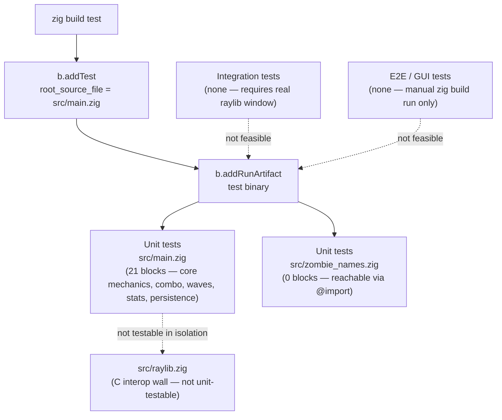

# Testing

## Table of Contents

- [Testing Overview](#testing-overview)
- [Test Architecture](#test-architecture)
- [Test Catalog](#test-catalog)
- [Testing Patterns](#testing-patterns)
- [Coverage](#coverage)
- [Test Commands](#test-commands)
- [Test Coverage Summary](#test-coverage-summary)

---

## Testing Overview

**Framework**: Zig's built-in test runner. Test blocks are declared as top-level `test "name" { ... }` constructs directly inside source files; the compiler discovers and runs them automatically — no third-party framework is needed or used.

**Configuration**: `build.zig` defines the test step at lines 72–84:

```zig
const exe_unit_tests = b.addTest(.{
    .root_source_file = b.path("src/main.zig"),
    .target = target,
    .optimize = optimize,
});

const run_exe_unit_tests = b.addRunArtifact(exe_unit_tests);

const test_step = b.step("test", "Run unit tests");
test_step.dependOn(&run_exe_unit_tests.step);
```

The `test_step` compiles `src/main.zig` (and every module transitively `@import`-ed from it) and executes the resulting test binary.

**Command**: `zig build test`

**Current state**: 21 `test "..." {}` blocks exist in `src/main.zig`, covering the following categories:

- **Core mechanics**: name-match equality, input-buffer bounds, frame-index wrap, cstrLen helper
- **Combo system**: comboMultiplier tier boundaries, score calculation with combo multiplier
- **Wave system**: waveSpawnDelay, waveFallSpeed, waveMaxActive, waveKillTarget, waveDuration, boss wave detection, boss fall speed, wave state resets, wave transition timer progression, wave completion bonus
- **Live stats**: calculateWpm, accuracy calculation (accuracyPercent), WPM drops to zero after window expires
- **Persistence**: high score is monotonic

All 21 are pure-logic tests with no raylib dependencies. Running `zig build test` compiles and executes them successfully.

---

## Test Architecture



All paths through the automated test system flow through `zig build test` → `b.addTest` (root: `src/main.zig`) → `b.addRunArtifact`. Integration and E2E layers are structurally absent: raylib calls require a real windowing and audio device, and there is no GUI automation harness.

---

## Test Catalog

| Test Type | Directory | Framework | Count | Purpose |
|---|---|---|---|---|
| Unit tests | `src/` (inline `test "..." {}` blocks) | zig test | 21 | Pure-logic tests covering core mechanics (name match, input bounds, frame wrap, cstrLen), combo system (multiplier tiers, score calculation), wave system (spawn delay, fall speed, max active, kill target, duration, boss detection, boss speed, state resets, transition timer, completion bonus), live stats (WPM, accuracy, WPM window expiry), and persistence (high score monotonicity) |
| Integration tests | — | — | 0 | Not feasible without a raylib mock; `InitWindow` and `InitAudioDevice` require a real display and audio device |
| E2E / GUI tests | — | — | 0 | Manual `zig build run` only; no automated harness exists or is planned |

---

## Testing Patterns

The following patterns are established by the codebase and its constitution, demonstrated by the 21 existing test blocks.

### Inline test blocks

Zig convention places `test "..." { ... }` blocks directly inside the module under test — not in separate `_test.zig` files. All 21 tests reside in `src/main.zig`; tests for name-array properties go into `src/zombie_names.zig`. No `tests/`, `test/`, `__tests__/`, or `spec/` directory is needed or should be created.

### Reachability from `src/main.zig`

The `test_step` in `build.zig` specifies `src/main.zig` as the sole `root_source_file`. Zig only discovers test blocks in modules that are reachable (directly or transitively) from that root. `src/zombie_names.zig` is already imported from `src/main.zig` via `const ZombieNames = @import("zombie_names.zig").ZombieNames;` (line 5), so test blocks added there are automatically discovered. `src/raylib.zig` is also imported, but its contents are a C-interop wall and not unit-testable.

### Keeping raylib out of testable helpers

Mocking is not idiomatic in Zig. The preferred approach (per the constitution) is to keep raylib calls out of pure-logic helpers and unit-test those helpers in isolation. All 21 tests demonstrate this pattern — they exercise pure helper functions (`comboMultiplier`, `waveSpawnDelay`, `waveFallSpeed`, `waveMaxActive`, `waveKillTarget`, `waveDuration`, `calculateWpm`, `isValidPrefix`, `cstrLen`, `accuracyPercent`) directly, with no raylib dependency. Any function that calls `raylib.*` symbols cannot run in the test binary without a live window and audio device.

### Test data setup

No fixtures, factories, or file-based test data. Tests use compile-time constants and stack-allocated values. For example, a test for name matching would declare a fixed `[*:0]const u8` literal and a fixed `[]const u8` typed-name slice inline in the test block.

### PRNG determinism

Per the constitution (`constitution.md` §Testing Standards, rule 5): when testing code that uses `std.Random`, the PRNG **must** be seeded explicitly rather than relying on `std.time.milliTimestamp()` (the seed used in `main()`). Use a fixed seed such as `std.Random.DefaultPrng.init(0)` so tests are reproducible across runs.

```zig
// Example: deterministic PRNG in a test
test "spawnZombie uses random x in range" {
    var rng = std.Random.DefaultPrng.init(42); // explicit seed, not milliTimestamp
    // ...
}
```

### Allocator in tests

The constitution (`constitution.md` §Code Patterns, rule 6) mandates that allocating helpers accept `allocator: *std.mem.Allocator` by pointer parameter. In test blocks, substitute `std.testing.allocator` (Zig's leak-detecting test allocator) for `std.heap.page_allocator`. This catches allocations that are never freed without requiring any production-code change, because the allocator is already threaded through `spawnZombie` and `resetZombies` as a parameter.

```zig
// Example: leak-detecting allocator in a test
test "resetZombies frees all slots" {
    var alloc = std.testing.allocator;
    // pass &alloc to spawnZombie / resetZombies
}
```

### Authentication and database

Not applicable. The game has no authentication layer and no database; these concerns do not exist in the test surface.

---

## Coverage

No coverage configuration is present anywhere in the repository. Specifically:

- There is no `llvm-cov` invocation in `build.zig`.
- There is no `kcov` wrapper or shell script.
- There is no `--coverage` flag passed to `b.addTest`.
- There is no coverage threshold defined in `.ai-board/config.yml` or anywhere else.

Adding coverage would require a separate tool. The most common approach for Zig projects is to run the compiled test binary under `kcov`:

```sh
kcov --include-path=src/ coverage-out/ ./zig-out/bin/<test-binary>
```

This is not currently set up and is not required by the project constitution. Until it is, coverage is assessed only by code inspection and manual testing.

---

## Test Commands

| Command | Purpose |
|---|---|
| `zig build test` | Compile and run all unit tests (uses `src/main.zig` as the root source file for test discovery) |
| `zig build --summary all` | Type-check the entire codebase without running it; surfaces type errors and unreachable code |
| `zig fmt --check .` | Formatting check across all `.zig` files; serves as a lint surrogate (no separate linter is configured) |
| `zig build` | Full build; also type-checks as a side effect; the primary gate before merging |

All commands are run from the repository root. The `test` and `type_check` commands are also declared in `.ai-board/config.yml` under the `commands` key.

---

## Test Coverage Summary

The 21 test blocks in `src/main.zig` cover the following pure-logic surfaces:

| Category | Tests | Functions / logic under test |
|---|---|---|
| Core mechanics | 4 | Name-match equality via `std.mem.eql`, input-buffer bounds (printable-ASCII gate, 40-char cap), frame-index wrap-around, `cstrLen` null-terminator scan |
| Combo system | 2 | `comboMultiplier` tier boundaries (1×, 2×, 3×, 4×, 5×), score calculation with combo multiplier applied |
| Wave system | 9 | `waveSpawnDelay` decreasing by wave, `waveFallSpeed` increasing by wave, `waveMaxActive` scaling, `waveKillTarget` scaling, `waveDuration` scaling, boss wave detection (every 5th wave), boss fall speed, wave state resets on transition, wave transition timer progression, wave completion bonus |
| Live stats | 3 | `calculateWpm` words-per-minute from keystroke timestamps, `accuracyPercent` from hits/total, WPM drops to zero after the rolling window expires |
| Persistence | 1 | High score value is monotonically non-decreasing (never drops below stored value) |

All tests are pure-logic with no raylib dependency. Any function that calls `raylib.*` symbols cannot run in the test binary without a live window and audio device — keep raylib strictly out of the testable helper surface.
