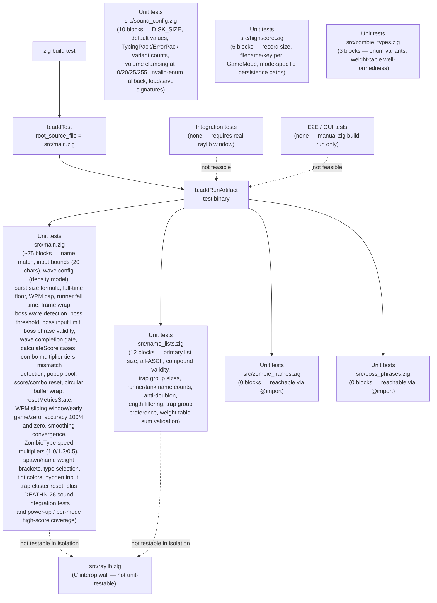

# Testing

## Table of Contents

- [Testing Overview](#testing-overview)
- [Test Architecture](#test-architecture)
- [Test Catalog](#test-catalog)
- [Testing Patterns](#testing-patterns)
- [Coverage](#coverage)
- [Test Commands](#test-commands)
- [Recommended Initial Tests](#recommended-initial-tests)

---

## Testing Overview

**Framework**: Zig's built-in test runner. Test blocks are declared as top-level `test "name" { ... }` constructs directly inside source files; the compiler discovers and runs them automatically — no third-party framework is needed or used.

**Configuration**: `build.zig` defines the test step at lines 72–84:

```zig
const exe_unit_tests = b.addTest(.{
    .root_source_file = b.path("src/main.zig"),
    .target = target,
    .optimize = optimize,
});

const run_exe_unit_tests = b.addRunArtifact(exe_unit_tests);

const test_step = b.step("test", "Run unit tests");
test_step.dependOn(&run_exe_unit_tests.step);
```

The `test_step` compiles `src/main.zig` (and every module transitively `@import`-ed from it) and executes the resulting test binary.

**Command**: `zig build test`

**Current state**: Approximately 106 `test "..." {}` blocks exist, distributed as `src/main.zig` (~75), `src/name_lists.zig` (12), `src/sound_config.zig` (10), `src/highscore.zig` (6), and `src/zombie_types.zig` (3) — all reachable from the `test_step` root because each is either directly inside `src/main.zig` or `@import`-ed transitively. The list below catalogs the historically documented blocks; many newer additions (sound system, per-mode high scores, power-ups, shield wave-kill counting) are not enumerated here but follow the same conventions:
- `test "name match equality"` — exercises the null-terminated name comparison path (`std.mem.eql`)
- `test "input buffer bounds"` — asserts the printable-ASCII gate and 9-char length cap
- `test "getWaveConfig wave 1 density model"` — verifies wave 1 burst size (1), fall speed, spawn delay, and pool size under the two-lever model
- `test "getWaveConfig wave 15 density model"` — verifies wave 15 burst size (4) and derived timing
- `test "wave completes when kills equals pool size"` — asserts wave completion condition logic
- `test "getWaveConfig scales correctly for wave 16+"` — verifies wave 16 target WPM (105), pool growth, and MAX_ZOMBIES cap
- `test "target WPM caps at 250"` — verifies `target_wpm` reaches 250 at wave 45 and stays there
- `test "fall time floor is 2.5s at wave 25+"` — verifies `time_on_screen >= MIN_TIME_ON_SCREEN` for high waves
- `test "burst size equals ceil(wave/4)"` — spot-checks burst size at waves 1, 4, 5, 8, 9, 25
- `test "runner fall time stays above 1.9s at all waves"` — iterates waves 1–100, verifies runner fall time never drops below 1.9 s
- `test "frame index wraps after ZOMBIE_FRAME_COUNT"` — covers animation-frame wrap-around arithmetic
- `test "boss wave detection"` — verifies `wave % 5 == 0` is true for waves 5, 10, 15, 20 and false for waves 1, 4, 6, 14
- `test "boss spawn threshold calculation"` — verifies `(pool_size + 1) / 2` yields correct threshold for waves 5, 10, 20
- `test "getCurrentMaxInput returns correct limits"` — verifies returns `MAX_INPUT_CHARS` when `boss == null` and `MAX_BOSS_INPUT_CHARS` when boss is set
- `test "boss phrase validity"` — verifies all 10 phrases in `BossPhrases` are non-empty, ≤ 35 characters, and contain only lowercase letters and spaces
- `test "input buffer capacity for boss phrases"` — verifies `name.len >= MAX_BOSS_INPUT_CHARS + 1`
- `test "wave completion requires boss kill on boss waves"` — verifies the `boss_done` gate logic for boss waves vs. non-boss waves
- `test "calculateScore reference cases"` — verifies all four FR-013 reference values: `calculateScore(4, 0, false, 0)` → 40, `calculateScore(4, 0, false, 20)` → 200, `calculateScore(4, 440, false, 0)` → 138, `calculateScore(19, 300, true, 10)` → 2313
- `test "getComboMultiplier tier boundaries"` — verifies all five tier thresholds: 0→x1, 4→x1, 5→x2, 9→x2, 10→x3, 14→x3, 15→x4, 19→x4, 20→x5, 100→x5
- `test "typedMatchesAnyEnemy mismatch detection"` — verifies the function returns `true` when `letter_count == 0` and `false` when the typed text does not prefix-match any active zombie name
- `test "popup pool circular recycling"` — calls `spawnPopup` 33 times and verifies slot 0 is overwritten and `popup_next` wraps to 1
- `test "resetScoreState clears score, combo, and popups"` — sets `score`, `combo_count`, and `popup_next` to non-zero values, activates a popup, runs `resetScoreState`, and verifies all values return to zero with all popups deactivated
- `test "circular buffer wraps correctly"` — fills `wpm_buffer` with more than `WPM_BUFFER_SIZE` entries, verifies `wpm_buffer_head` wraps via modulo and `wpm_buffer_count` is capped at `WPM_BUFFER_SIZE`
- `test "resetMetricsState clears all metrics"` — sets all metrics state to non-zero values, calls `resetMetricsState`, verifies `wpm_buffer` is all-zero, `wpm_buffer_head = 0`, `wpm_buffer_count = 0`, `correct_chars = 0`, `wrong_chars = 0`, `elapsed_time = 0.0`, `displayed_wpm = 0.0`, `displayed_accuracy = 100.0`
- `test "WPM sliding window — 60 chars in 10 seconds"` — populates `wpm_buffer` with 60 timestamps all within a 10-second window, calls `calculateTargetWpm()`, asserts result equals `72.0` (60 × 1.2)
- `test "WPM early game — 12 chars in 5 seconds"` — sets `correct_chars = 12`, `elapsed_time = 5.0`, calls `calculateTargetWpm()`, asserts result is approximately `28.8` (12 × 12 / 5)
- `test "WPM zero input"` — with empty buffer and `elapsed_time = 0.0`, calls `calculateTargetWpm()`, asserts result equals `0.0`
- `test "accuracy — 100 correct 4 incorrect"` — sets `correct_chars = 100`, `wrong_chars = 4`, calls `calculateTargetAccuracy()`, asserts result is approximately `96.15`
- `test "accuracy zero input returns 100"` — with `correct_chars = 0` and `wrong_chars = 0`, calls `calculateTargetAccuracy()`, asserts result equals `100.0`
- `test "smoothing convergence toward target WPM"` — sets `displayed_wpm = 0.0`, simulates multiple `updateMetrics`-style interpolation steps with a fixed target of `72.0`, verifies display value increases by 20% of the remaining gap each step

Additional tests added in `src/main.zig` (DEATHN-13):
- `test "ZombieType speed multipliers"` — verifies `getSpeedMultiplier` returns 1.0, 1.3, and 0.5 for standard, runner, tank
- `test "spawn weight table wave brackets"` — verifies `getSpawnWeights` returns correct weights for wave ranges 1–3, 4–6, 7–10, and 11+
- `test "name weight table wave brackets"` — verifies `getNameWeights` returns correct weights for wave ranges 1–3, 4–7, 8–12, and 13+
- `test "selectZombieType distribution"` — seeds PRNG deterministically, verifies type selection follows weight distribution over N iterations
- `test "zombie tint colors"` — verifies `getZombieTint` returns WHITE, GREEN, and BLUE for standard, runner, tank
- `test "input buffer accepts 20 characters"` — verifies `MAX_INPUT_CHARS == 20` and the buffer can hold 20 printable characters
- `test "hyphen accepted in input"` — verifies codepoint 45 (hyphen) passes the `(key >= 32) and (key <= 125)` gate
- `test "trap cluster state reset"` — verifies `resetZombies` clears `trap_cluster_group` and `trap_cluster_remaining`

Tests in `src/name_lists.zig` (discovered via transitive import from `src/main.zig`):
- `test "primary list size"` — `PrimaryNames.len >= 349`
- `test "all names ASCII"` — scans every primary name for bytes in [32, 125]
- `test "compound names valid"` — each compound name is ≤20 chars and contains only [A-Za-z-]
- `test "trap group sizes"` — each trap group has 3–5 entries
- `test "sufficient runner names"` — count of names ≤5 chars ≥ 30
- `test "sufficient tank names"` — count of names ≥8 chars ≥ 30
- `test "selectName anti-doublon"` — passes all primary names as active, verifies `null` returned
- `test "selectName length filtering"` — runner type receives name ≤5 chars; tank type receives name ≥8 chars
- `test "selectName trap group preference"` — forced `trap_group_index` produces a name from that group
- `test "weight tables sum to 100"` — compile-time validation that each `SpawnWeights` and `NameWeights` entry sums to 100

All tests are pure-logic tests with no raylib dependencies. Running `zig build test` compiles and executes them successfully.

---

## Test Architecture



All paths through the automated test system flow through `zig build test` → `b.addTest` (root: `src/main.zig`) → `b.addRunArtifact`. Integration and E2E layers are structurally absent: raylib calls require a real windowing and audio device, and there is no GUI automation harness.

---

## Test Catalog

| Test Type | Directory | Framework | Count | Purpose |
|---|---|---|---|---|
| Unit tests | `src/` (inline `test "..." {}` blocks) | zig test | ~106 | Pure-logic tests distributed across `src/main.zig` (~75), `src/name_lists.zig` (12), `src/sound_config.zig` (10), `src/highscore.zig` (6), and `src/zombie_types.zig` (3). Coverage includes name-match equality, input-buffer bounds (20 chars), wave config (two-lever density model), burst size formula, fall-time floor, WPM cap at 250, runner fall time floor, wave completion, frame wrap-around, boss detection, score/combo/WPM/accuracy, ZombieType speed multipliers (1.0/1.3/0.5), spawn/name weight tables, type selection distribution, tint colors, hyphen input, trap cluster reset, primary list size, ASCII validation, compound name validity, trap group sizes, runner/tank name count minimums, anti-doublon, length filtering, trap group preference, weight sum validation, sound config defaults / clamping / pack-enum cycling / load+save signatures, per-mode high-score filenames and keys, and zombie type weight-table well-formedness. |
| Integration tests | — | — | 0 | Not feasible without a raylib mock; `InitWindow` and `InitAudioDevice` require a real display and audio device |
| E2E / GUI tests | — | — | 0 | Manual `zig build run` only; no automated harness exists or is planned |

---

## Testing Patterns

The following patterns are established by the codebase and its constitution, even though no `test` blocks have been written yet. They represent the agreed-upon approach for when tests are added.

### Inline test blocks (scaffolded but unused)

Zig convention places `test "..." { ... }` blocks directly inside the module under test — not in separate `_test.zig` files. New tests for gameplay logic go into `src/main.zig`; tests for name-array properties go into `src/zombie_names.zig`. No `tests/`, `test/`, `__tests__/`, or `spec/` directory is needed or should be created.

### Reachability from `src/main.zig`

The `test_step` in `build.zig` specifies `src/main.zig` as the sole `root_source_file`. Zig only discovers test blocks in modules that are reachable (directly or transitively) from that root. `src/name_lists.zig` is imported via `const name_lists = @import("name_lists.zig");`, `src/zombie_names.zig` via `const ZombieNames = @import("zombie_names.zig").ZombieNames;`, and `src/boss_phrases.zig` via `const BossPhrases = @import("boss_phrases.zig").BossPhrases;` — test blocks in any of these are automatically discovered. `src/raylib.zig` is also imported, but its contents are a C-interop wall and not unit-testable.

### Keeping raylib out of testable helpers

Mocking is not idiomatic in Zig. The preferred approach (per the constitution) is to keep raylib calls out of pure-logic helpers and unit-test those helpers in isolation. For example, the name-matching logic in `updateZombies` (lines 180–200 of `src/main.zig`) could be extracted into a standalone function that takes only a typed-name slice and a zombie-name pointer — that function would have no raylib dependency and could be tested directly. Any function that calls `raylib.*` symbols cannot run in the test binary without a live window and audio device.

### Test data setup

No fixtures, factories, or file-based test data. Tests use compile-time constants and stack-allocated values. For example, a test for name matching would declare a fixed `[*:0]const u8` literal and a fixed `[]const u8` typed-name slice inline in the test block.

### PRNG determinism

Per the constitution (`constitution.md` §Testing Standards, rule 5): when testing code that uses `std.Random`, the PRNG **must** be seeded explicitly rather than relying on `std.time.milliTimestamp()` (the seed used in `main()`). Use a fixed seed such as `std.Random.DefaultPrng.init(0)` so tests are reproducible across runs.

```zig
// Example: deterministic PRNG in a test
test "spawnZombie uses random x in range" {
    var rng = std.Random.DefaultPrng.init(42); // explicit seed, not milliTimestamp
    // ...
}
```

### Allocator in tests

The constitution (`constitution.md` §Code Patterns, rule 6) mandates that allocating helpers accept `allocator: *std.mem.Allocator` by pointer parameter. In test blocks, substitute `std.testing.allocator` (Zig's leak-detecting test allocator) for `std.heap.page_allocator`. This catches allocations that are never freed without requiring any production-code change, because the allocator is already threaded through `spawnZombie` and `resetZombies` as a parameter.

```zig
// Example: leak-detecting allocator in a test
test "resetZombies frees all slots" {
    var alloc = std.testing.allocator;
    // pass &alloc to spawnZombie / resetZombies
}
```

### Authentication and database

Not applicable. The game has no authentication layer and no database; these concerns do not exist in the test surface.

---

## Coverage

No coverage configuration is present anywhere in the repository. Specifically:

- There is no `llvm-cov` invocation in `build.zig`.
- There is no `kcov` wrapper or shell script.
- There is no `--coverage` flag passed to `b.addTest`.
- There is no coverage threshold defined in `.ai-board/config.yml` or anywhere else.

Adding coverage would require a separate tool. The most common approach for Zig projects is to run the compiled test binary under `kcov`:

```sh
kcov --include-path=src/ coverage-out/ ./zig-out/bin/<test-binary>
```

This is not currently set up and is not required by the project constitution. Until it is, coverage is assessed only by code inspection and manual testing.

---

## Test Commands

| Command | Purpose |
|---|---|
| `zig build test` | Compile and run all 26 unit tests (uses `src/main.zig` as the root source file for test discovery) |
| `zig build --summary all` | Type-check the entire codebase without running it; surfaces type errors and unreachable code |
| `zig fmt --check .` | Formatting check across all `.zig` files; serves as a lint surrogate (no separate linter is configured) |
| `zig build` | Full build; also type-checks as a side effect; the primary gate before merging |

All commands are run from the repository root. The `test` and `type_check` commands are also declared in `.ai-board/config.yml` under the `commands` key.

---

## Recommended Initial Tests

The highest-leverage test blocks to add, given the current codebase:

- **`test "ZombieNames is non-empty and all entries are non-empty"` in `src/zombie_names.zig`**: assert `ZombieNames.len > 0` and that every entry has at least one non-null byte. This is a pure compile-time-array property test with zero dependencies. `src/zombie_names.zig` is already transitively reachable from `src/main.zig`, so no import change is needed. If reachability ever breaks, adding `_ = @import("zombie_names.zig");` to `src/main.zig` restores it.

- **`test "name match accepts byte-exact slice"` in `src/main.zig`**: exercise the `std.mem.eql(u8, typed_name, zomb_name_slice)` path directly by constructing a fixed `[*:0]const u8` zombie name, scanning it to a slice, constructing an identical `[]u8` typed-name buffer, and asserting equality. Then assert a one-character-off input does not match. This tests the core win condition without touching raylib.

- **`test "C-string length scan stops at null terminator"` in `src/main.zig`**: replicate the `while (zomb.name[zomb_name_length] != '\x00')` loop from `updateZombies` as a standalone helper and assert it returns the correct length for known names (e.g. `"Zane"` → 4). This pins the boundary behavior that the match logic depends on.

- **`test "spawnZombie writes into first null slot"` in `src/main.zig`**: initialize a local `[MAX_ZOMBIES]?*Zombie` array to all-null, call `spawnZombie` with `std.testing.allocator` and a deterministically seeded PRNG (`std.Random.DefaultPrng.init(0)`), and assert that exactly one slot is non-null and `is_active = true`. Call `resetZombies` at the end to satisfy the leak detector.

- **`test "resetZombies nulls all slots"` in `src/main.zig`**: after calling `spawnZombie` one or more times with `std.testing.allocator`, call `resetZombies` and assert every slot in the array is `null`. This exercises the paired alloc/free lifecycle and confirms no use-after-free or missed slot.

Note: none of the above tests reference `raylib.*` symbols. Any test block that calls `raylib.InitWindow`, `raylib.LoadSound`, or any other raylib API will fail to run in a headless CI environment because it requires a real window and audio device. Keep raylib strictly out of the testable helper surface.
