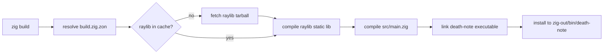
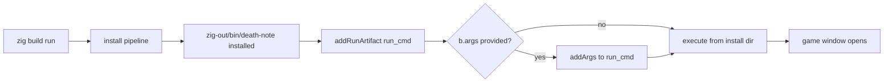
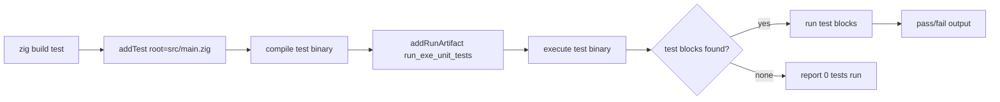
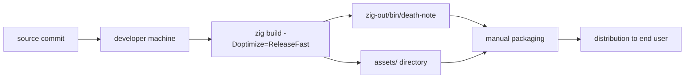

# Workflows & Automation

## Table of Contents

- [Automation Overview](#automation-overview)
- [Workflow Catalog](#workflow-catalog)
  - [install (default)](#install-default)
  - [run](#run)
  - [test](#test)
- [Workflow Diagrams](#workflow-diagrams)
  - [Build Pipeline](#build-pipeline)
  - [Run Pipeline](#run-pipeline)
  - [Test Pipeline](#test-pipeline)
- [Scripts & Commands](#scripts--commands)
- [Infrastructure](#infrastructure)
- [Deployment Pipeline](#deployment-pipeline)
- [Environment Configuration](#environment-configuration)

---

## Automation Overview

**No CI/CD platform is configured in this repository.**

The following locations were checked and confirmed absent:

| Location | Expected artifact | Present? |
|---|---|---|
| `.github/workflows/` | GitHub Actions workflow YAML files | No — `.github/` directory does not exist |
| `.gitlab-ci.yml` | GitLab CI pipeline definition | No |
| `Jenkinsfile` | Jenkins declarative or scripted pipeline | No |
| `.circleci/` | CircleCI pipeline configuration | No |
| `Makefile` | GNU Make-based build automation | No |
| `Dockerfile` / `docker-compose.yml` | Container build and orchestration | No |
| `bin/` or `scripts/` | Shell script automation directories | No |

The sole automation layer is the **Zig build graph** declared in `build.zig`. This file defines three named steps (`install` as default, `run`, and `test`), wires up the raylib dependency fetch and compilation, and exposes build option flags. No external runner, scheduler, or CI agent is involved.

Additionally, the `.ai-board/config.yml` harness file defines four command aliases used by the ai-board tooling:

| Alias | Command |
|---|---|
| `install` | `zig build` |
| `test` | `zig build test` |
| `type_check` | `zig build --summary all` |
| `lint` | `zig fmt --check .` |

These aliases are conventions for the ai-board agent harness and do not represent separate automation steps or scripts — they map directly to `zig` CLI invocations.

---

## Workflow Catalog

### install (default)

- **Trigger**: `zig build` (no step name specified; `install` is the default step)
- **Purpose**: Compile the `death-note` game executable and install it to `zig-out/bin/death-note`. Raylib is fetched from the pinned URL in `build.zig.zon` (if not already cached), compiled as a static library, then linked into the final binary.
- **Key inputs**:
  - `src/main.zig` (root source file, declared as `b.path("src/main.zig")`)
  - `src/raylib.zig`, `src/zombie_names.zig` (imported transitively)
  - raylib dependency fetched from `https://github.com/raysan5/raylib/archive/52f2a10db610d0e9f619fd7c521db08a876547d0.tar.gz`, hash-verified against `122078ad3e79fb83b45b04bd30fb63aaf936c6774db60095bc6987d325cbe5743373`
- **Key outputs**: `zig-out/bin/death-note` (native executable for the host platform)
- **Build options honored**:
  - `-Doptimize=Debug|ReleaseSafe|ReleaseFast|ReleaseSmall` (defaults to `Debug`)
  - `-Draylib-optimize=…` (overrides optimization mode for raylib only; defaults to value of `-Doptimize`)
  - `-Dstrip=true|false` (strip debug symbols from executable; defaults to `false`)
- **Source**: `build.zig` lines 18–47 (`b.addExecutable`, `b.installArtifact`)

### run

- **Trigger**: `zig build run` or `zig build run -- <arg1> <arg2> …`
- **Purpose**: Build the `death-note` executable (same as the install step) and then immediately execute it. The run command depends on the install step (`run_cmd.step.dependOn(b.getInstallStep())`), so the binary is always rebuilt and installed to `zig-out/bin/` before execution. The game launches a native window via raylib.
- **CLI argument forwarding**: Arguments after `--` are captured via `b.args` and appended to the run command (`run_cmd.addArgs(args)`). The current `src/main.zig` does not parse or consume any CLI arguments, so forwarded args are silently ignored by the game at runtime.
- **Working directory**: The run command executes from the install directory (`zig-out/`). Assets are loaded by relative path (`"assets/zombie-hit.wav"`, `"assets/z_spritesheet.png"`, etc.) and are **not** copied to the install directory during the build. This means asset loads will fail unless the game is launched from the repo root. See [Infrastructure](#infrastructure) for details.
- **Source**: `build.zig` lines 52–70 (`b.addRunArtifact`, `b.step("run", …)`)

### test

- **Trigger**: `zig build test`
- **Purpose**: Compile a test binary rooted at `src/main.zig` (using `b.addTest`) and execute it via `b.addRunArtifact`. The test runner discovers all `test "…" { … }` blocks reachable from `src/main.zig` (including transitively imported modules). At present, no `test` blocks exist in the source tree — the step is scaffolded and functional but will report zero tests run.
- **Key inputs**: `src/main.zig` (root source file for test artifact)
- **Key outputs**: Pass/fail report printed to stdout; non-zero exit code on failure
- **Source**: `build.zig` lines 72–84 (`b.addTest`, `b.addRunArtifact`, `b.step("test", …)`)

*No other workflow steps exist in this repository.*

---

## Workflow Diagrams

### Build Pipeline

### Run Pipeline

### Test Pipeline

---

## Scripts & Commands

No shell scripts exist in this repository. All developer commands are `zig` CLI invocations.

| Command | Purpose | Notes |
|---|---|---|
| `zig build` | Build (install) the `death-note` executable | Output: `zig-out/bin/death-note`; default Debug mode |
| `zig build run` | Build then execute the game | Runs from install dir; asset path caveat applies |
| `zig build run -- <args>` | Build then execute with CLI args forwarded | Args passed to process but not consumed by `main.zig` |
| `zig build test` | Run unit tests declared in `src/main.zig` | Currently 0 test blocks; step scaffolded |
| `zig build --summary all` | Build with full summary output (type-check) | Useful for verifying compilation without running |
| `zig fmt --check .` | Check formatting of all `.zig` files | Non-zero exit if any file would be reformatted |
| `zig build -Doptimize=ReleaseFast` | Release build optimized for speed | Applies to both `death-note` and raylib |
| `zig build -Draylib-optimize=ReleaseFast` | Optimize raylib only, keep default for game code | Useful for faster iteration with optimized lib |
| `zig build -Dstrip=true` | Strip debug symbols from the executable | Reduces binary size; combine with `ReleaseFast` for distribution |
| `zig build --help` | List all available build steps and options | Includes `install`, `run`, `test`, all `-D` flags |

---

## Infrastructure

**No infrastructure automation, containers, or cloud configuration exists.**

Specifically:

- **No Docker**: no `Dockerfile`, no `docker-compose.yml`, no `.dockerignore`. The game is not containerized and cannot be meaningfully containerized (it requires a native windowing system via raylib).
- **No container orchestration**: no Kubernetes manifests, no Helm charts, no Compose files.
- **No cloud configuration**: no Terraform, no Pulumi, no AWS/GCP/Azure config files.
- **No remote build services**: no Nix flakes, no Bazel remote cache config, no CI runners.

The game runs as a **single native binary** on the developer's local machine. It requires:

1. The compiled `death-note` executable (`zig-out/bin/death-note` after `zig build`)
2. The `assets/` directory accessible at the relative path `assets/` from the **current working directory at launch time**

The assets loaded at runtime are:
- `assets/zombie-hit.wav` (sound effect)
- `assets/z_spritesheet.png` (zombie sprite sheet)
- `assets/JetBrainsMonoNerdFont-Thin.ttf` (font, based on assets directory contents)
- Additional PNG assets present in `assets/` (`alagard.png`, `page.png`, `plume.png`, `spritesheet.png`)

**Known limitation**: `zig build run` executes the binary from the install directory (`zig-out/`), not the repo root. The `assets/` directory is not copied to `zig-out/` during the build step. Therefore, asset loads via `raylib.LoadSound("assets/…")` and `raylib.LoadTexture("assets/…")` will fail to find the files when the game is launched via `zig build run` unless the working directory is correctly set. The safe approach is to run the binary directly from the repo root: `./zig-out/bin/death-note`. This limitation is noted in `CLAUDE.md`.

---

## Deployment Pipeline

**No deployment automation exists.**

There is no release pipeline, no package registry, no auto-update mechanism, and no installer. Distribution is entirely manual.

The intended distribution model is:

1. Developer runs a release build: `zig build -Doptimize=ReleaseFast`
2. The resulting binary `zig-out/bin/death-note` is taken together with the `assets/` directory
3. Both are packaged and distributed manually (e.g., as a zip archive, shared directly)
4. The recipient places the binary and `assets/` in the same directory and runs the binary from that directory

---

## Environment Configuration

**No environment variables are read or required by this project's code.**

- `src/main.zig` does not call `std.process.getEnvMap`, `std.os.getenv`, or any equivalent. No environment variable is read at runtime.
- `build.zig` does not read any environment variables directly. It uses only the standard `std.Build` API (target options, optimize options, custom `-D` flags).
- There are no secrets, API keys, tokens, or credentials involved anywhere in the build or runtime.
- There is no `.env` file, no `dotenv` loading, and no secret management integration.

The Zig toolchain itself respects certain conventional environment variables that are not declared by this project but may be present on the developer's machine:

| Variable | Toolchain use | Declared by this project? |
|---|---|---|
| `ZIG_GLOBAL_CACHE_DIR` | Override Zig's global package cache location | No |
| `ZIG_LOCAL_CACHE_DIR` | Override the per-project cache directory | No |
| `HOME` | Used by Zig to locate default cache under `~/.cache/zig` | No |
| `PATH` | Must include the `zig` binary for all commands to work | No |

These are Zig toolchain conventions, not declarations or requirements of this project. No configuration is needed beyond having a working `zig` installation on `PATH`.
